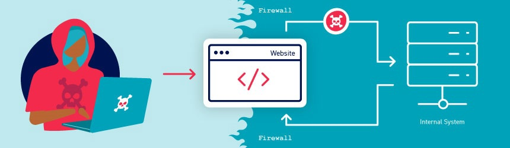

# 07. Server-side parameter pollution

Some systems include **internal APIs** that aren’t directly exposed to the internet.

> Server-side parameter pollution occurs when a website embeds user input into a server-side request to an internal API without proper encoding.
> 

---

### 🎯 **Impact of Server-Side Parameter Pollution**

An attacker may be able to:

- 🧬 **Override existing parameters**
- 🧠 **Modify application behavior**
- 🔓 **Access unauthorized data**

---

## 🧪 **What to Test**

You can test **any user input** for potential parameter pollution, including:

🔹 **Query parameters**

🔹 **Form fields**

🔹 **Headers**

🔹 **URL path parameters**

> 🎯 All of these may be vulnerable and should be tested during recon and fuzzing.
> 

---

## 🧾 **Example: Server-Side Parameter Pollution**

> Suppose an internal API receives user input like this:
> 

```
GET /internal-api/user?role=user
```

If an attacker appends their own parameter:

```
GET /internal-api/user?role=user&role=admin
```

And the server uses the **last parameter** or **concatenates values**, the attacker might **escalate privileges** or bypass access controls. ⚠️



---

## 📛 **Terminology Note**

This vulnerability is **sometimes called**:

> 🧩 HTTP Parameter Pollution (HPP)
> 

⚠️ However, the term **HTTP parameter pollution** is **also used** to describe a **WAF bypass technique**.

To avoid confusion, we refer to this vulnerability only as:

> 🧱 Server-side parameter pollution
> 

---

### ⚠️ Not to Be Confused With:

🧪 **Server-side prototype pollution**

Despite the similar name, this is a **completely different vulnerability class**.