# 01. Lab: Exploiting an API endpoint using documentation

> To solve the lab, find the exposed API documentation and delete user carlos.
> 

🧑‍💻 **You can log in with the following credentials:**

```

Username: wiener
Password: peter

```

---

## 📚 **Required Knowledge**

To solve this lab, you should understand:

🧩 **What API documentation is**

🛠️ **How API documentation may be useful to an attacker**

🔍 **How to discover API documentation**

> ✅ These concepts are covered in our API Testing Academy topic.
> 

---

## 🧪 **Step-by-Step Guide**

### 1️⃣ Log in to the Application

🔓 Use **Burp's browser** and log in with:

```

wiener:peter

```

Update your **email address** after logging in.

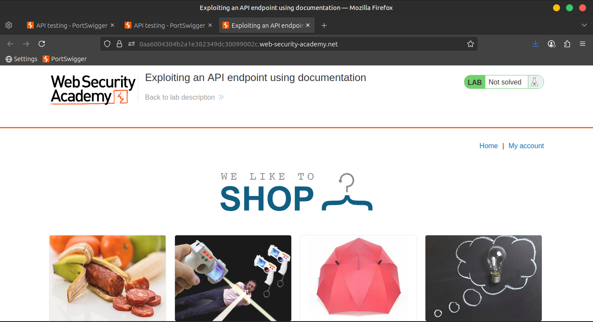

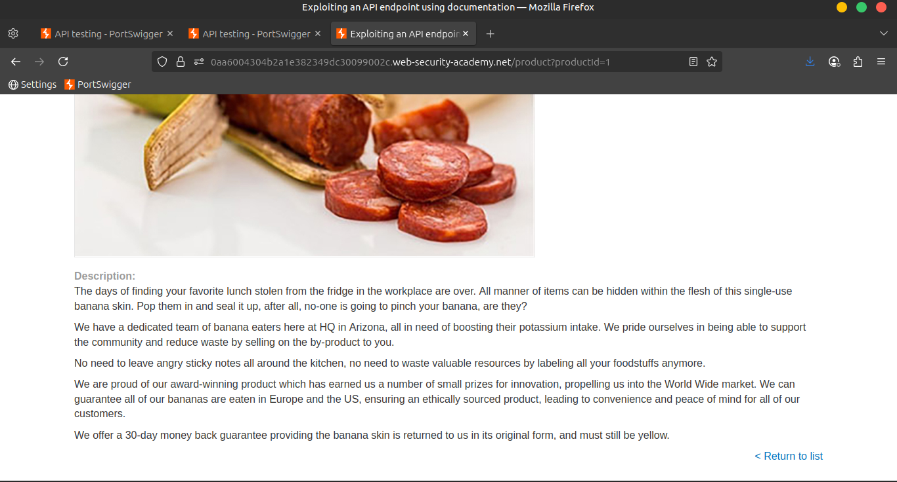

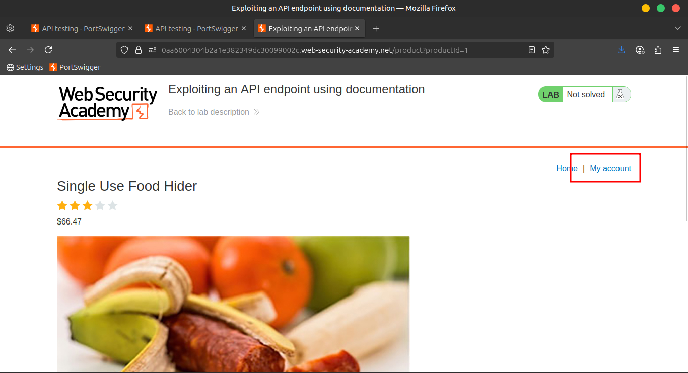

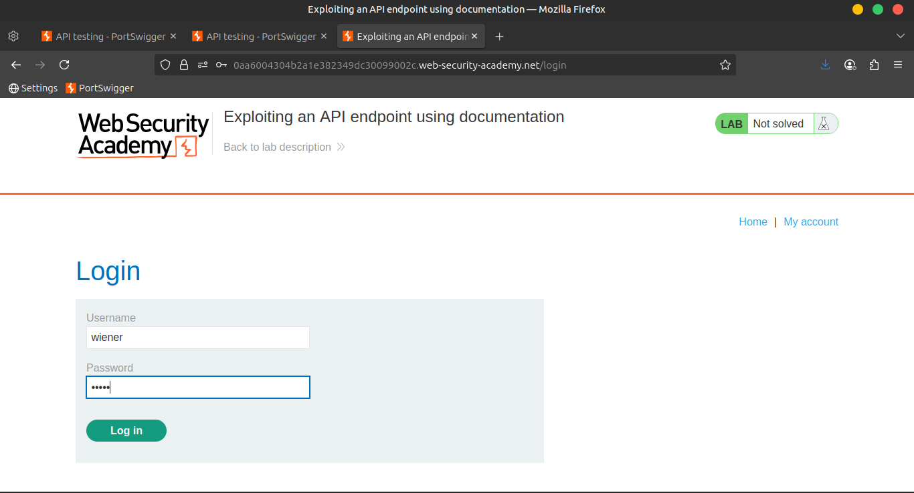

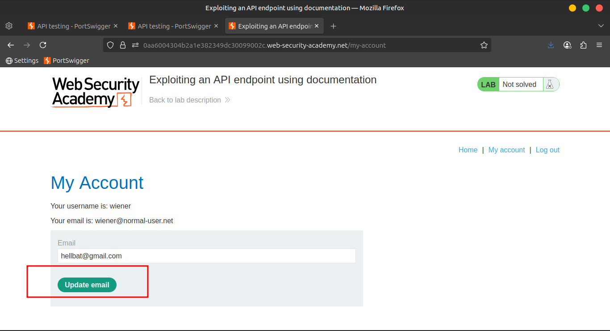

---

### 2️⃣ Capture the PATCH Request

🔁 Go to `Proxy > HTTP history`, right-click the following request:

```

PATCH /api/user/wiener

```

➤ Select **Send to Repeater**

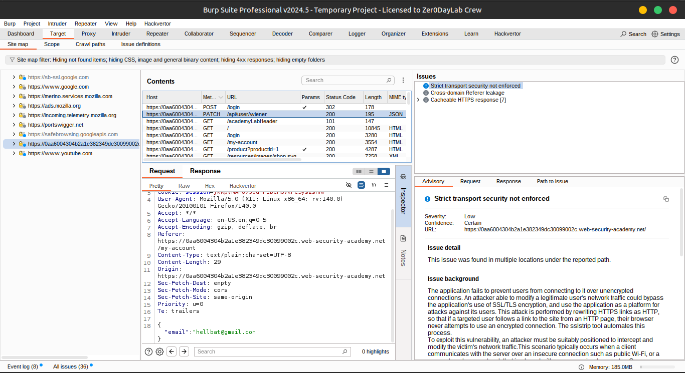

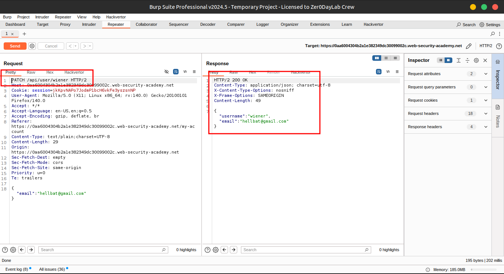

---

### 3️⃣ Test the PATCH Request

🧬 In the **Repeater tab**:

- Send the `PATCH /api/user/wiener` request
- 🔍 Observe: It retrieves **credentials** for the user `wiener`

---

### 4️⃣ Explore the API Path

🧭 Modify the path step-by-step in Repeater:

- Remove `/wiener` → Now the endpoint is:
    
    ```
    
    /api/user
    
    ```
    
    ➤ Send the request
    
    ❌ You’ll get an error because no user identifier is provided
    
- Remove `/user` → Now the endpoint is:
    
    ```
    
    /api
    
    ```
    
    ➤ Send the request
    
    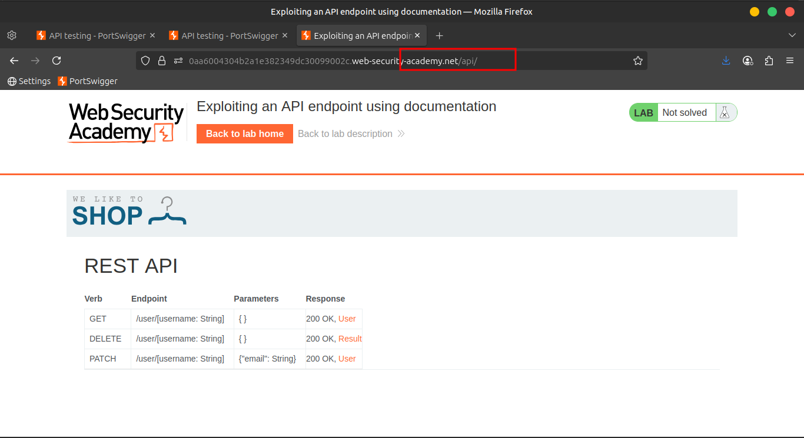
    
    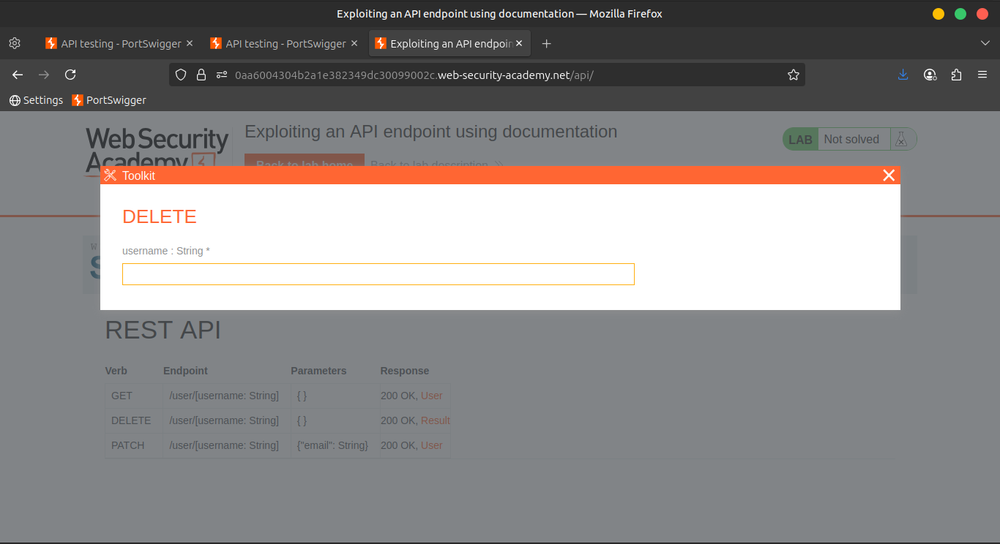
    
    ✅ This reveals the **API documentation**
    

---

### 5️⃣ Open Documentation in Browser

🖱️ Right-click the response and choose:

```

Show response in browser

```

📋 Copy the URL and paste it into **Burp's browser**.

🧭 Now you can access the **interactive documentation**.

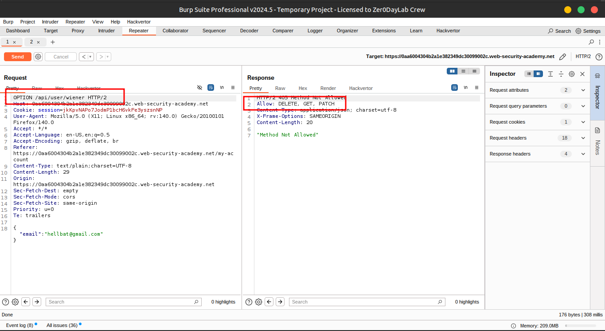

---

### 6️⃣ Delete Carlos

🚨 In the documentation interface:

- Click on the **`DELETE` row**
- Enter the username:
    
    ```
    
    carlos
    
    ```
    
- Click **Send request** 📨
    
    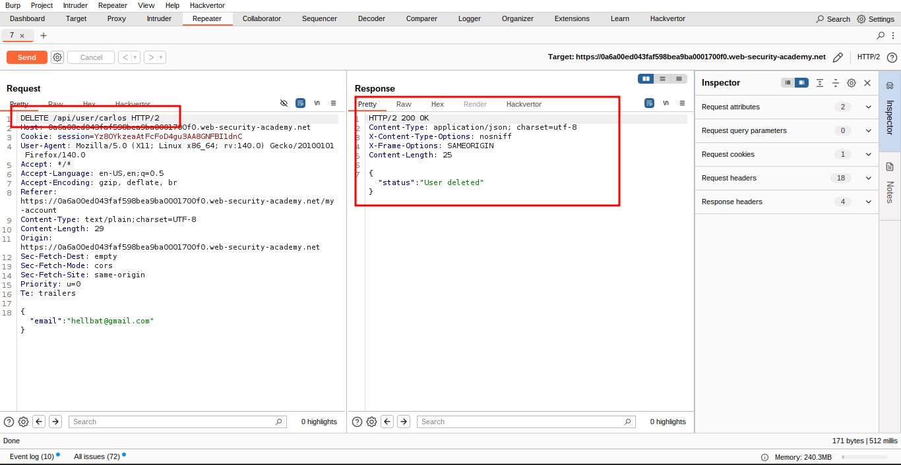
    
    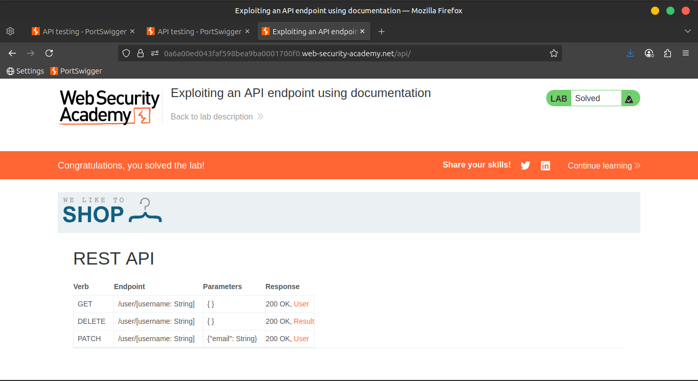
    

🎉 Congratulations! You’ve now **deleted carlos** and **solved the lab** ✅

---

## 🌐 **Community Solutions**

> 📺 [Watch the walkthrough:](https://youtu.be/AxzpOVS23o8)
>