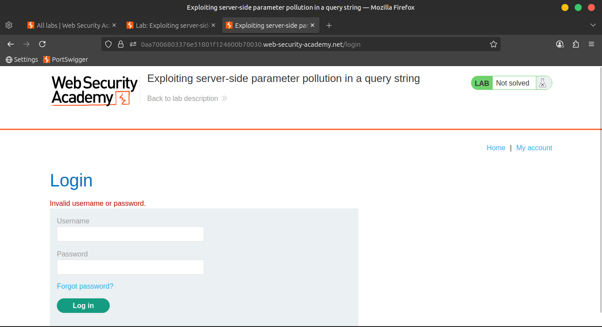

# 04. Lab: Exploiting server-side parameter pollution in a query string

## 🎯 **Lab Objective**

> ✅ Log in as the administrator and delete carlos.
> 

---

## 🧠 **Required Knowledge**

To solve this lab, you'll need to understand:

- 🧩 How to use **URL query syntax** to alter server-side requests
- 🧪 How to analyze **error messages** to understand how the API handles input

📚 These topics are covered in our **API Testing Academy**.

---

## 🧪 **Step-by-Step Solution**

---

### 1️⃣ Trigger Password Reset

🧭 In **Burp’s browser**, trigger a password reset for the `administrator` user.





---

### 2️⃣ Analyze HTTP History

🔍 Go to `Proxy > HTTP history`

- Locate the request: `POST /forgot-password`
- Also note the related JavaScript file:
    
    ```
    /static/js/forgotPassword.js
    ```
    
    
    

---

### 3️⃣ Send to Repeater

🖱️ Right-click `POST /forgot-password` → **Send to Repeater**

In Repeater:

✅ Send the original request to verify consistent response.

---

### 4️⃣ Test With Invalid Username

Change:

```
username=administrator

```

To:

```
username=administratorx

```

📨 Send the request → 🔴 Returns `Invalid username` error


---

### 5️⃣ Inject a Second Parameter

Try injecting a second parameter using a **URL-encoded `&`**:

```
username=administrator%26x=y

```

📨 Send the request → 🔴 `Parameter is not supported`

✔️ Indicates internal API is parsing `&x=y` as a **separate parameter**


---

### 6️⃣ Attempt Query Truncation

Use a **URL-encoded `#`** to truncate:

```
username=administrator%23

```

📨 Send → 🟡 `Field not specified` error

✔️ Suggests that a `field` parameter was **expected but removed**


---

### 7️⃣ Inject Invalid Field Parameter

Try:

```
username=administrator%26field=x%23

```

📨 Send → 🔴 `Invalid field` error

✔️ The **field** parameter is recognized!

---

### 8️⃣ Brute-force the Field Value

🔁 Go to **Intruder**:

- Right-click → `Send to Intruder`
- Add payload markers:
    
    ```
    username=administrator%26field=§x§%23
    
    ```
    
- Use **Payload type:**
    
    🔧 `Add from list` → `Server-side variable names`
    

▶️ Start the attack

📝 Review responses:

- `username` and `email` fields return `200 OK` → Likely valid

---

### 9️⃣ Set Field to Email

Modify to:

```
username=administrator%26field=email%23

```

📨 Send → ✅ Original response returned

✔️ Confirms `email` is a valid field


---

### 🔍 Review JavaScript

In `Proxy > HTTP history`, examine:

```
/static/js/forgotPassword.js

```

Look for the **password reset endpoint**:

```
/forgot-password?reset_token=${resetToken}

```


---

### 🔓 Extract Reset Token

Try:

```
username=administrator%26field=reset_token%23

```

📨 Send the request → ✅ A **reset token** is returned

📝 **Copy the token**


---

### 1️⃣1️⃣ Reset Admin Password

🖥️ In Burp’s browser, navigate to:

```
/forgot-password?reset_token=<your_token>

```

🔐 Set a **new password** for the administrator


---

### 1️⃣2️⃣ Log In & Solve Lab

✅ Log in as **administrator** with the new password

🗑️ Go to **Admin panel** → **Delete carlos**

🎉 Lab Solved!


---

## 📺 **Community Solutions**

> 🔗 [Watch the solution video:](https://youtu.be/cXAlzbNI7fo)
>