# Lab 01: Username enumeration via different responses

🎯 **Objective:**

This lab is vulnerable to **username enumeration** and **password brute-force** attacks. It has an account with a predictable username and password, which can be found in the following wordlists:

- 📂 Candidate **[usernames](https://portswigger.net/web-security/authentication/auth-lab-usernames)**
- 📂 Candidate [passwords](https://portswigger.net/web-security/authentication/auth-lab-passwords)

✅ **To solve the lab**, enumerate a valid username, brute-force this user's password, then **access their account page**.

---

## 🛠️ Solution Steps

### 🔎 Step 1: Investigate the Login Page

1. Open Burp Suite.
2. Submit an invalid username and password through the login form.
3. Go to **Proxy > HTTP history**, locate the `POST /login` request.
4. Highlight the **`username`** value and **send it to Burp Intruder**.
    
    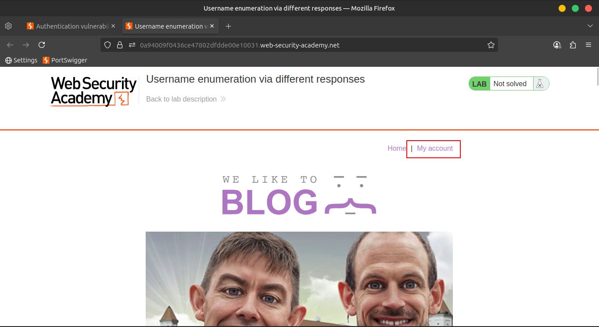
    
    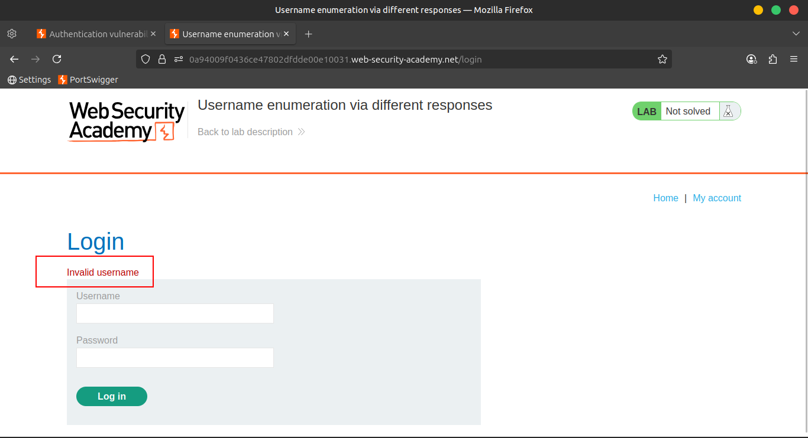
    
    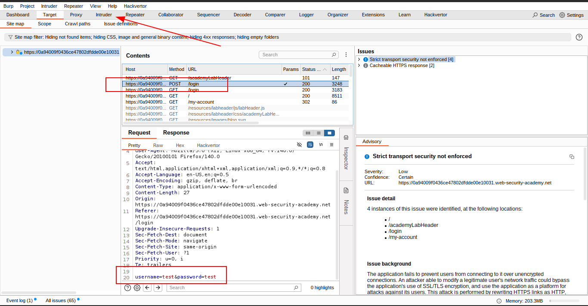
    

---

### 🎯 Step 2: Enumerate Valid Username

1. In Burp **Intruder**, ensure the `username` parameter is wrapped in § symbols:
    
    ```
    username=§invalid-username§
    ```
    
2. Leave the password as any static value for now.
3. Ensure **Sniper** attack type is selected.
4. In the **Payloads** tab:
    - Select `Simple list`
    - Paste in your candidate **usernames**
    - ✅ Click **Start attack**

### 🧠 Analyze the Results

- In the **Length** column, sort the responses.
- Identify one entry that is **longer** or **differs** from the rest.
- Compare responses:
    - 🔴 Most say: `Invalid username`
    - 🟢 One says: `Incorrect password`
- 📝 Note the **valid username** from the Payload column.
    
    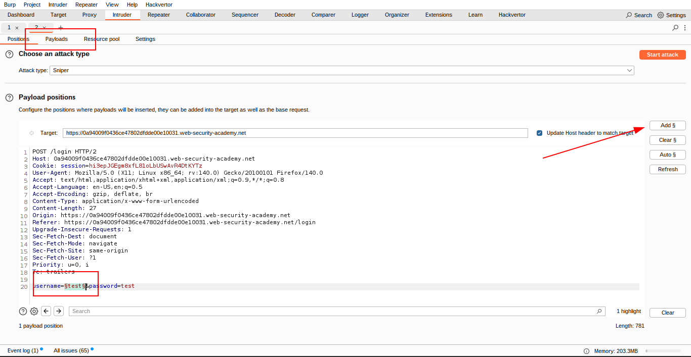
    
    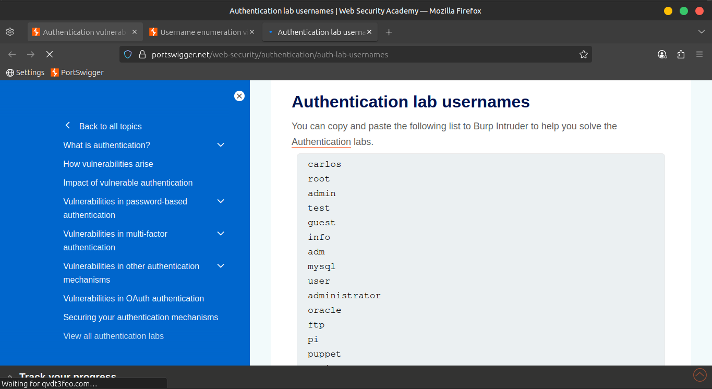
    
    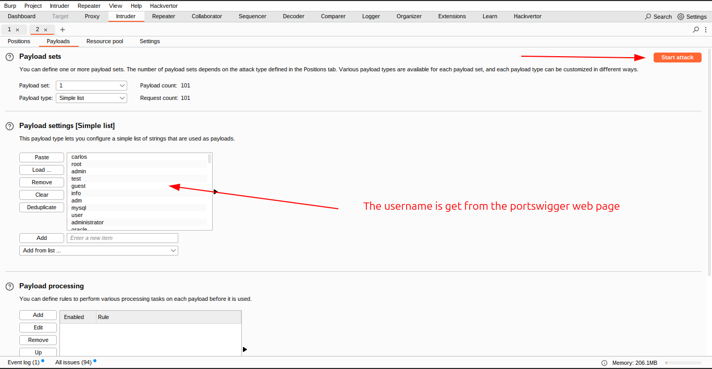
    
    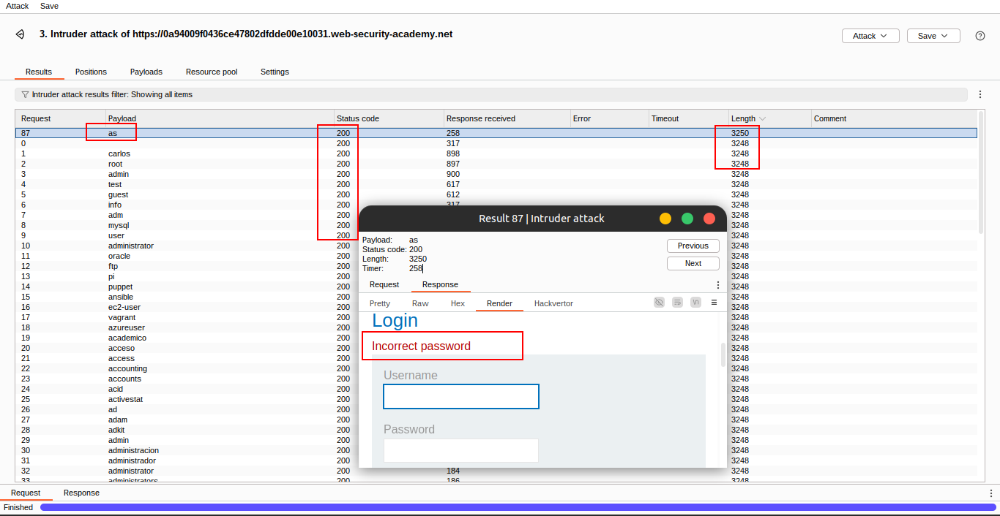
    

---

### 🔓 Step 3: Brute-force the Password

1. Go back to Intruder.
2. Click **Clear §**.
3. Replace with:
    
    ```
    username=valid-username&password=§invalid-password§
    ```
    
4. In the Payloads panel:
    - Clear the username list
    - Paste the list of candidate **passwords**
    - ✅ Click **Start attack**

### 📈 Analyze the Results

- Look at the **Status** column:
    - ✅ All 200 responses = failed attempts
    - ✅ One **302 redirect** = successful login!
- 📝 Note the **password** from the Payload column.
    
    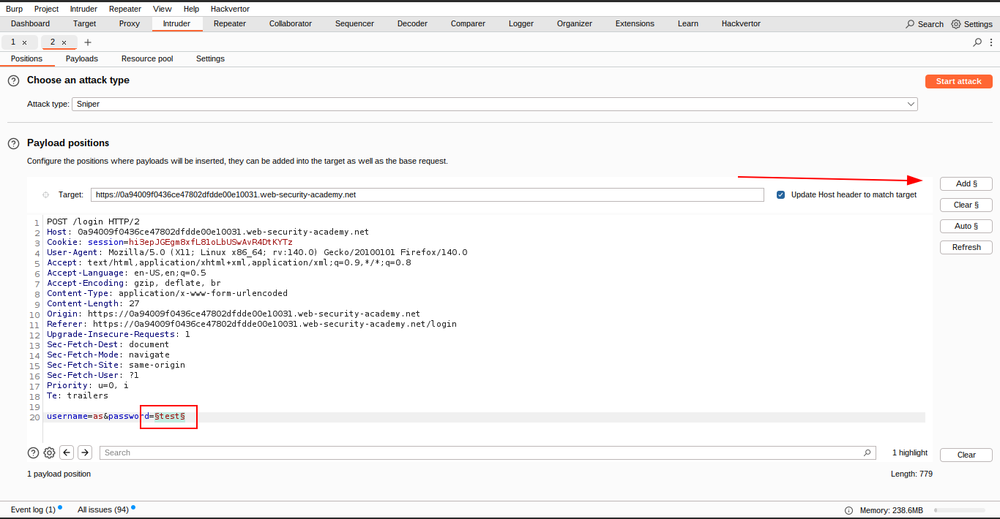
    
    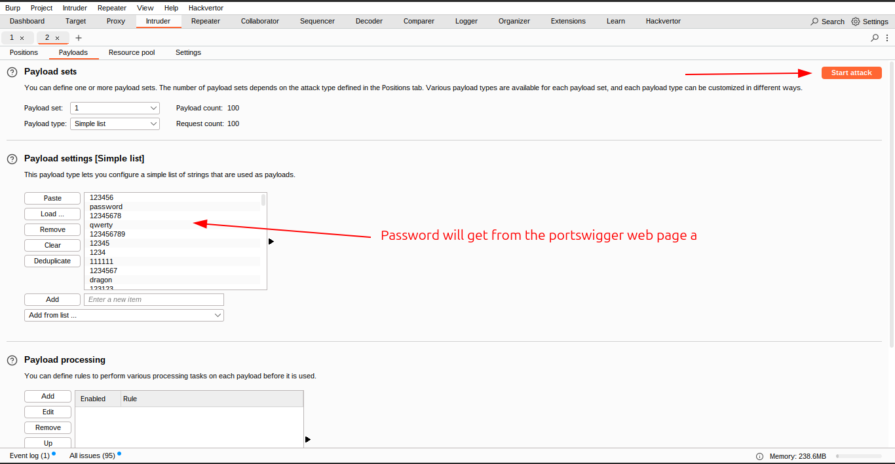
    
    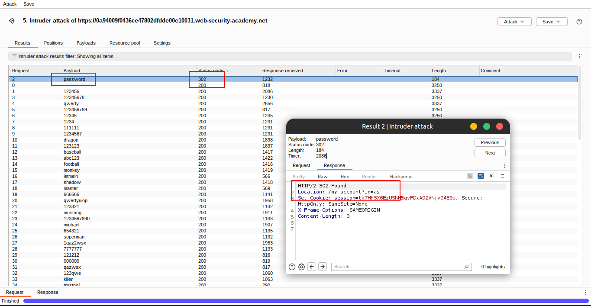
    

---

### 🔐 Step 4: Log In

- Use the valid **username** and **password**
- Log in through the application
- 📂 Access the **user account page** to solve the lab ✅
    
    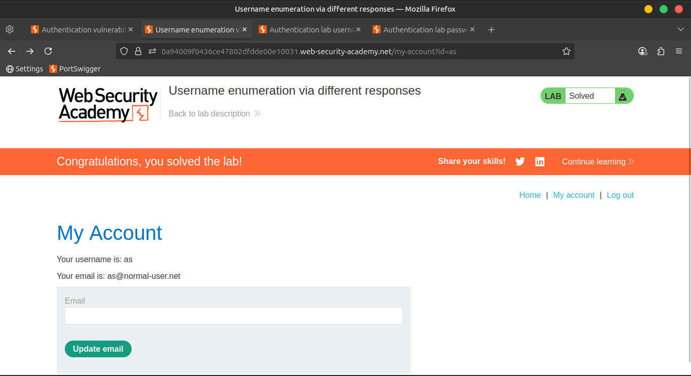
    

> 💡 Note:
> 
> 
> It's also possible to brute-force the login using a single **Cluster Bomb** attack. However, it’s more efficient to enumerate the username **first**, if possible.
> 

---

## 🎥 Community Solutions

📺 [Watch on YouTube](https://youtu.be/DEUCRYGt3TY)