# Lab 02: Username enumeration via subtly different responses

🧪 **Lab Objective:**

This lab is **subtly vulnerable** to username enumeration and brute-force attacks. It contains a user account with a predictable **username** and **password**, both of which can be found in:

- 📁 **Candidate [usernames](https://portswigger.net/web-security/authentication/auth-lab-usernames)**
- 📁 **Candidate [passwords](https://portswigger.net/web-security/authentication/auth-lab-passwords)**

✅ **Goal:** Identify the valid username, brute-force the corresponding password, and access the user’s account page.

---

## 🛠️ Solution Steps

### 🔎 Step 1: Username Enumeration

1. 🧰 With **Burp Suite** running, submit an invalid login:
    
    ```
    Username: invalid
    Password: invalid
    
    ```
    
2. Intercept the **`POST /login`** request in **Proxy > HTTP history**.
3. 🎯 Highlight the `username` parameter → **Send to Intruder**.
4. In **Intruder**:
    - Confirm the `username` is wrapped with `§...§`.
    - Go to the **Payloads** tab.
    - Select **Simple list**.
    - 📋 Paste the list of **candidate usernames**.
        
        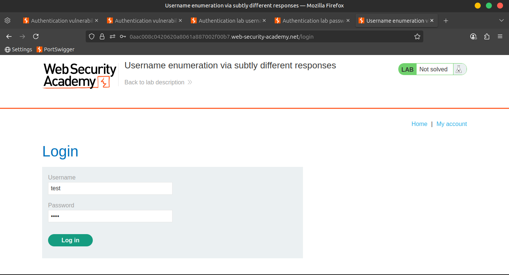
        
        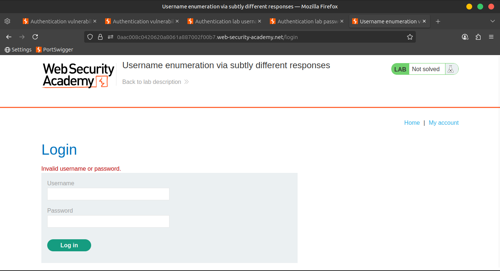
        
        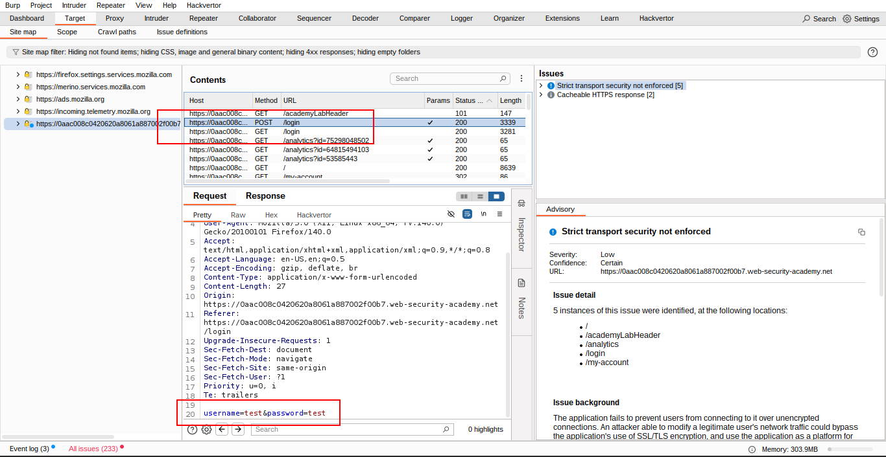
        
        
        
        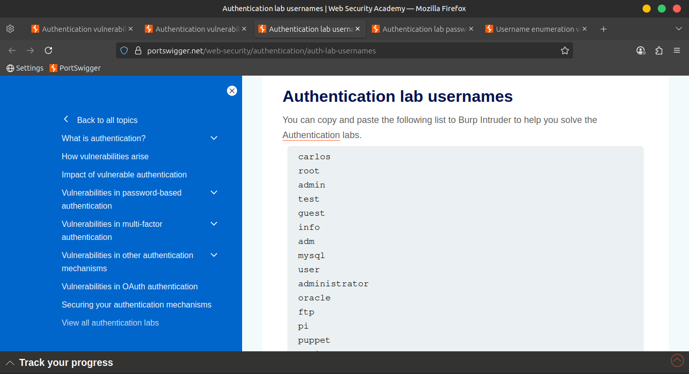
        
        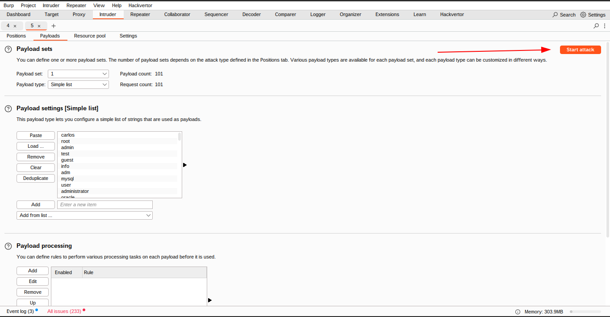
        
        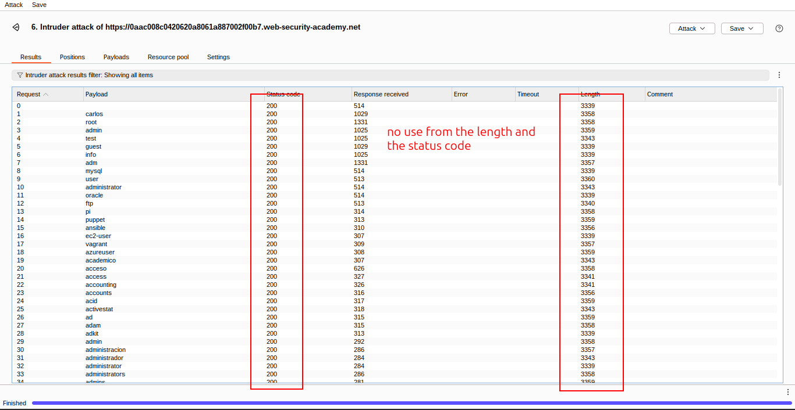
        

---

### 📥 Step 2: Grep - Extract Error Message

1. Switch to the **Settings** tab → Open **Settings side panel**.
2. Scroll to **Grep - Extract** → Click **Add**.
3. In the preview dialog:
    - Scroll through the response until you find:
        
        ```
        Invalid username or password.
        
        ```
        
    - 🖱️ Highlight the **entire message** with your mouse.
    - ✔️ Click **OK** (settings auto-adjust).
        
        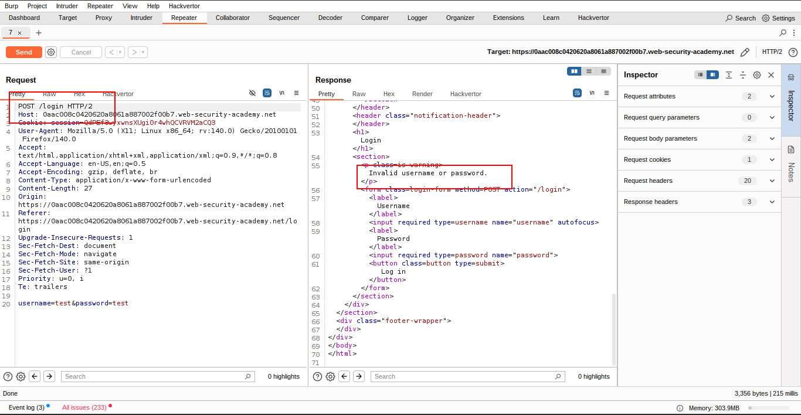
        

---

### 📊 Step 3: Analyze the Attack Results

1. After the attack completes:
    - A new column appears showing extracted error messages.
    - 🔤 Sort the results using that column.
2. Notice one response is **slightly different**.
    - 🧐 Look closely: it says
        
        ```
        Invalid username or password␣
        
        ```
        
        (with a **trailing space** instead of a period).
        
    - 📌 Note down the valid **username** from the Payload column.
        
        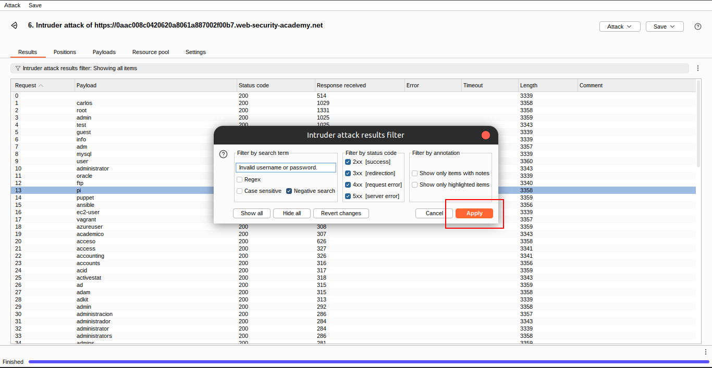
        
        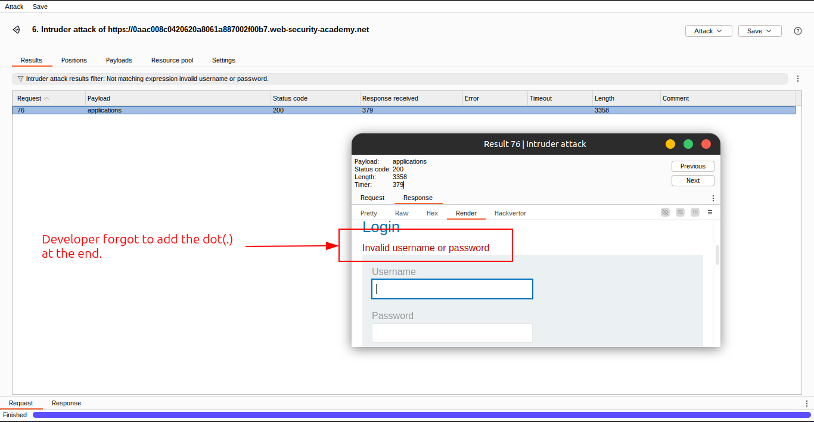
        

---

### 🔐 Step 4: Brute-force the Password

1. In **Intruder**, click **Clear §**.
2. Update the request:
    
    ```
    username=identified-user&password=§invalid-password§
    
    ```
    
3. In the **Payloads** tab:
    - Replace previous list with **candidate passwords**.
    - Start the attack.
4. Look for a request that returned:
    - ✅ **302 Found** status code = login successful.
    - 📌 Note the **valid password**.
        
        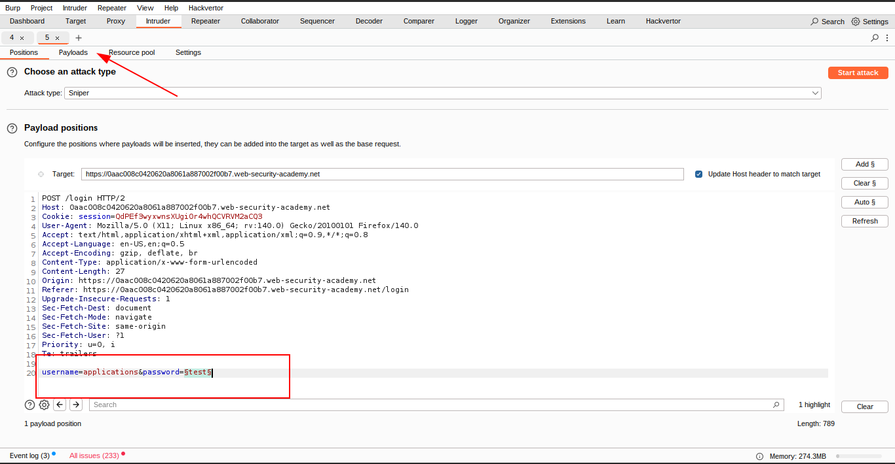
        
        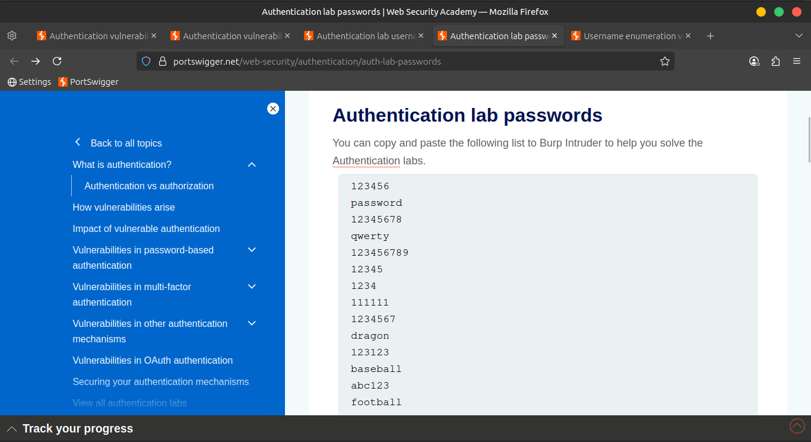
        
        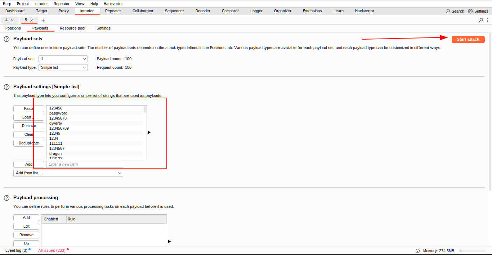
        
        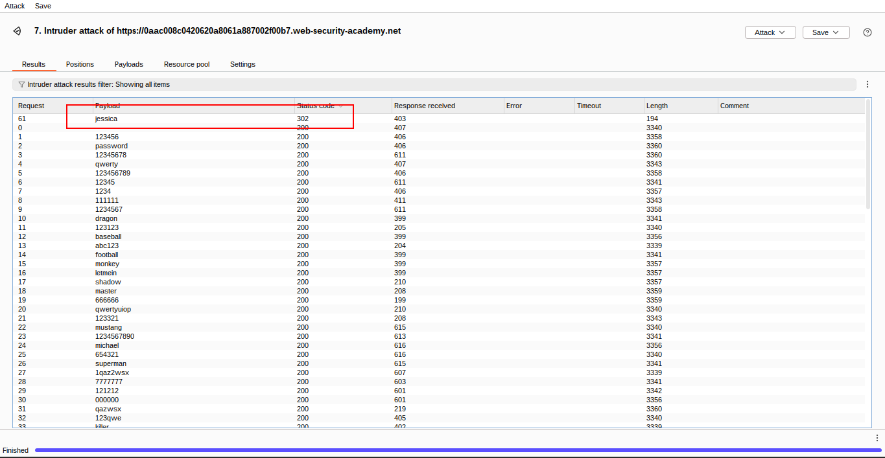
        

---

### 🚪 Step 5: Log In

🔑 Use the discovered **username** and **password** to log in.

📂 Visit the **user account page** to solve the lab. ✅

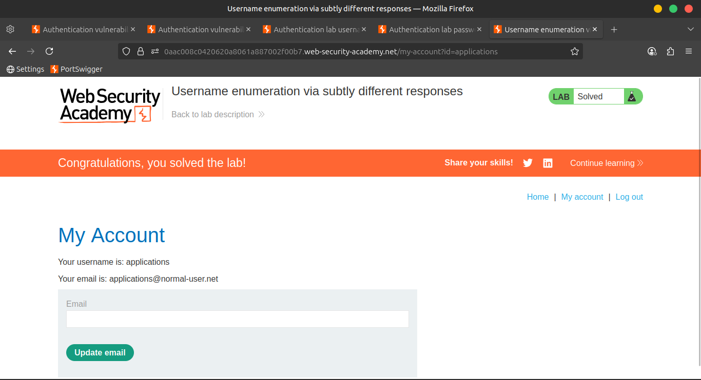

---

> 💡 Note:
> 
> 
> It’s also possible to brute-force the login using a single **Cluster Bomb** attack, but it’s more efficient to **enumerate the valid username first**, if possible.
> 

---

## 🎥 Community Video Solution

▶️ [Watch here on YouTube](https://youtu.be/1pZTGqBgejU)