# Lab 04: Username enumeration via account lock

This lab is vulnerable to **username enumeration**. It uses **account locking**, but due to a **logic flaw**, it can be bypassed. The lab includes:

- 📁 **Candidate [usernames](https://portswigger.net/web-security/authentication/auth-lab-usernames)**
- 📁 **Candidate [passwords](https://portswigger.net/web-security/authentication/auth-lab-passwords)**

### 🎯 Objective

Enumerate a valid username, brute-force their password, and access their account page.

---

## 🛠️ Step-by-Step Solution

### 🔍 Step 1: Initial Investigation

- With **Burp Suite** running, visit the login page.
- Submit an invalid username and password.
- Intercept the `POST /login` request and **send it to Intruder**.
    
    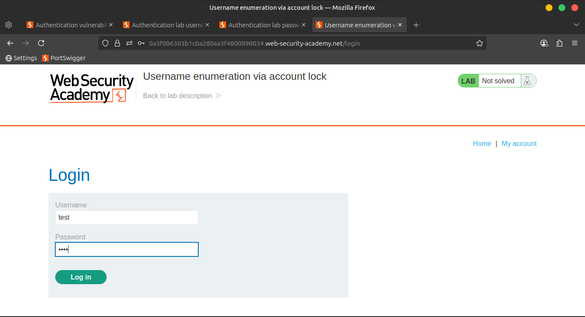
    
    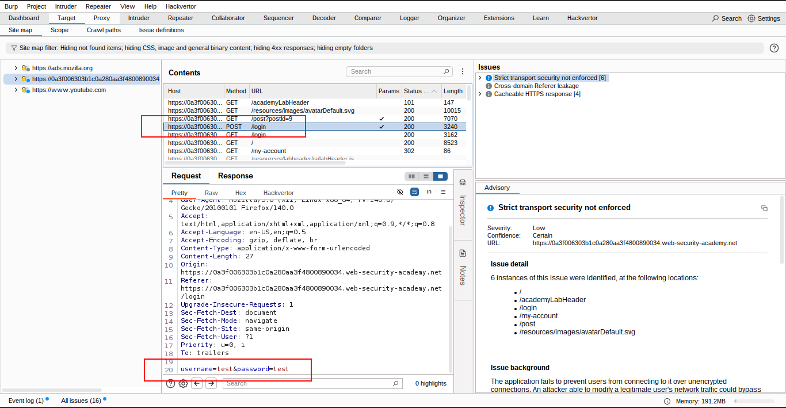
    
    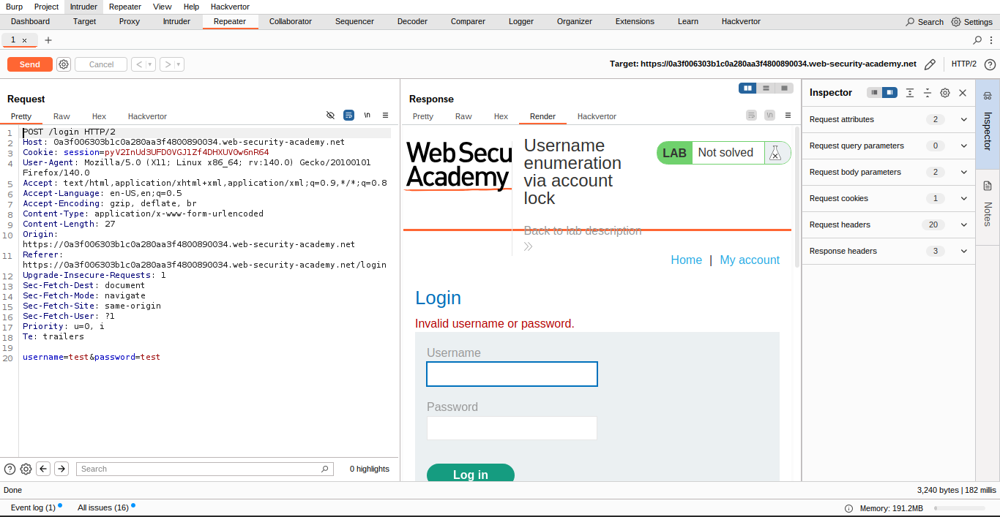
    
    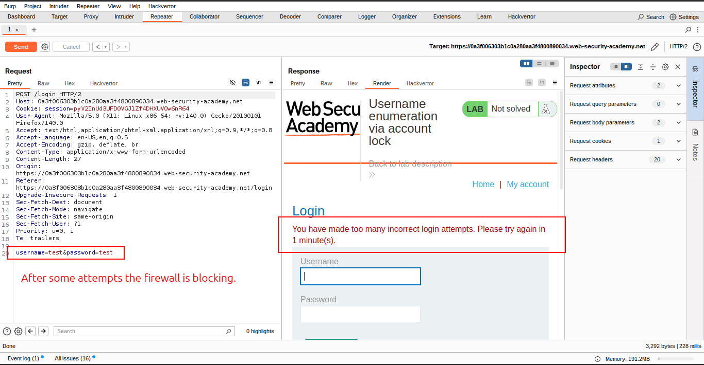
    
    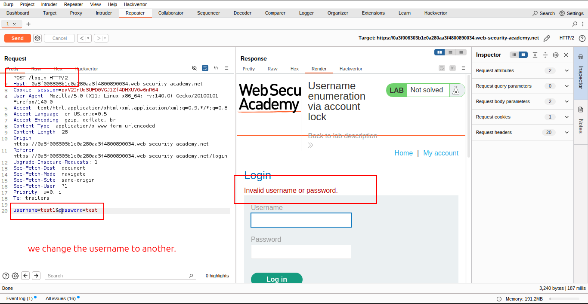
    
    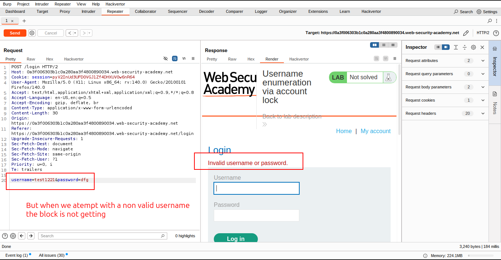
    

---

### 🚀 Step 2: Cluster Bomb Attack for Enumeration

- In Intruder, choose **Cluster bomb** attack.
- Add a payload position to the `username` parameter.
- Insert a blank payload position after the password by clicking `Add §`.

```
username=§invalid-username§&password=example§§

```

- Go to the **Payloads** tab:
    - Set **Payload set 1** to your list of usernames.
    - Set **Payload set 2** to `Null payloads` → generate 5 payloads.

✅ This causes each username to be attempted **five times**, simulating multiple login attempts.

- Click **Start attack**.
    
    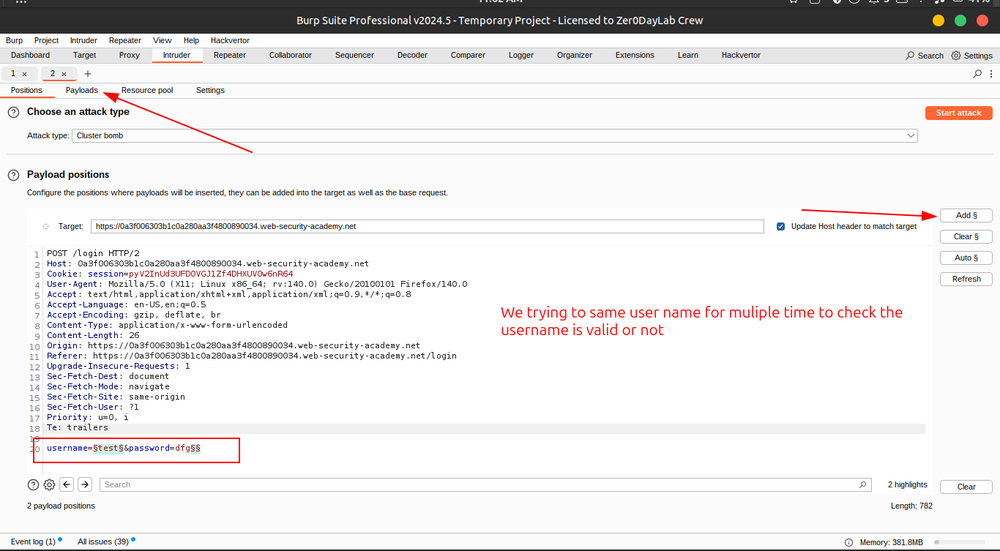
    
    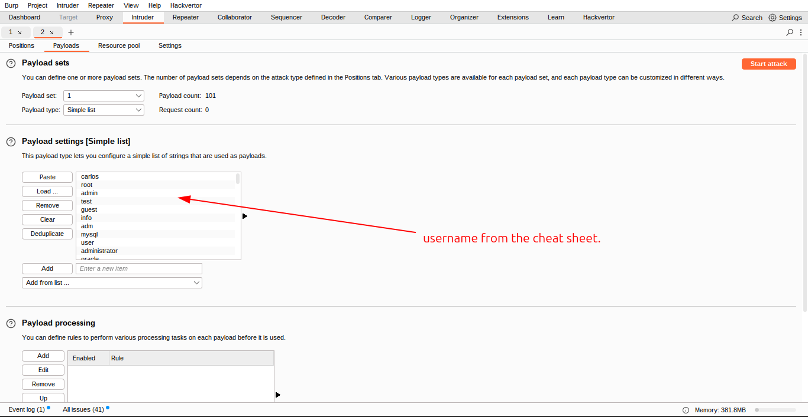
    
    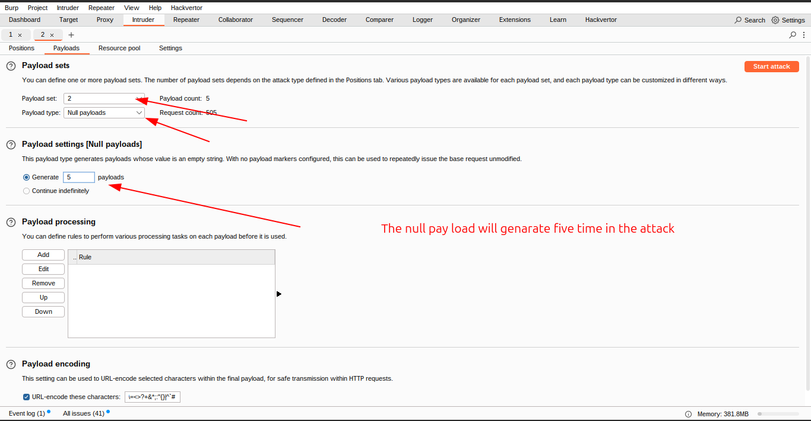
    

---

### 🔎 Step 3: Analyze Results

- In the results:
    - One username will trigger a **longer response**.
    - Its response will show:
        
        ❗ `You have made too many incorrect login attempts.`
        

📝 **Make a note** of this username — it’s **valid**.

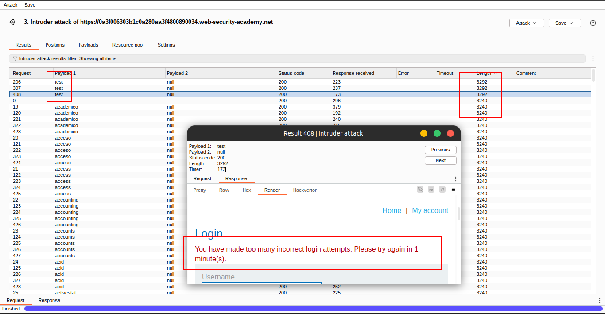

---

### 🧪 Step 4: Brute-force Password (Sniper Attack)

- Create a new Intruder attack on the `POST /login` request.
- Choose **Sniper** attack type.
- Replace the username with the **identified one**.
- Add a payload position to the `password` parameter:
    
    ```
    username=valid-user&password=§password§
    
    ```
    
- Load the list of **candidate passwords**.
- Go to `Grep > Extract` and **add a rule** to highlight error messages.
- Start the attack.
    
    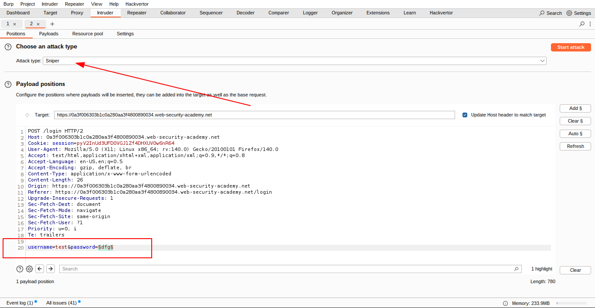
    
    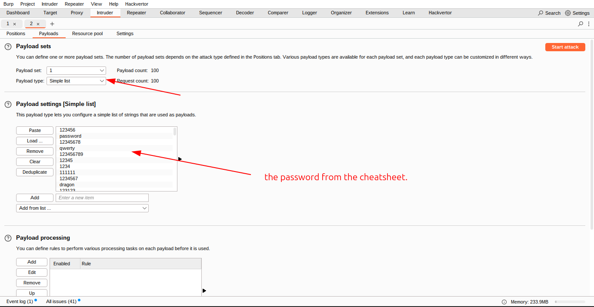
    

---

### 📊 Step 5: Analyze for Successful Login

- In the **Grep extract column**:
    - Most responses will show errors.
    - One response will have **no error message** at all.

✅ This indicates a **successful login** attempt.

📝 Make a note of this **password**.

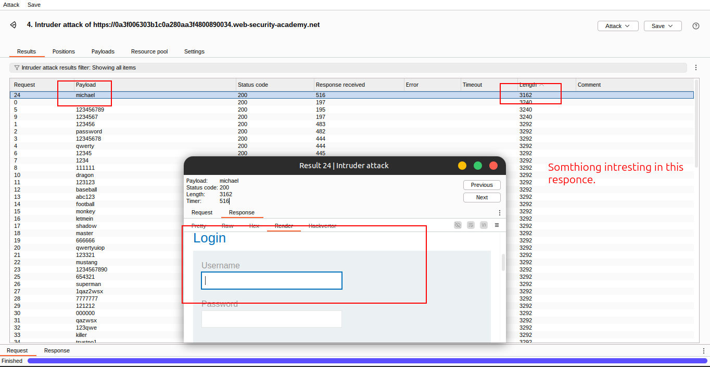

---

### ⏳ Step 6: Wait for Account Lock Reset

Wait **1 minute** for the account lockout to reset.

---

### 🔐 Step 7: Login

Use the identified **username and password** to log in and access the **user account page** to **solve the lab**.

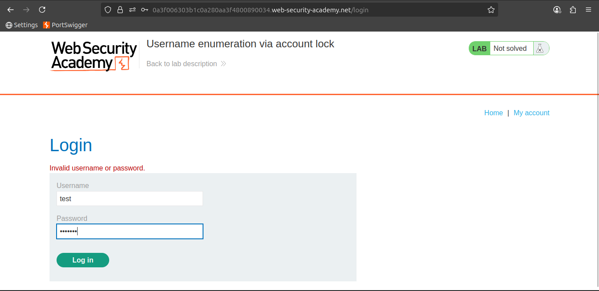

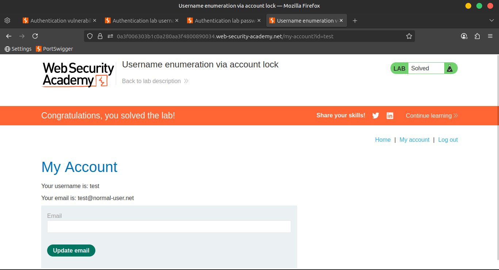

---

### 📽️ Community Solutions

🎥 [Watch walkthrough](https://youtu.be/fT31xo1cUoM)