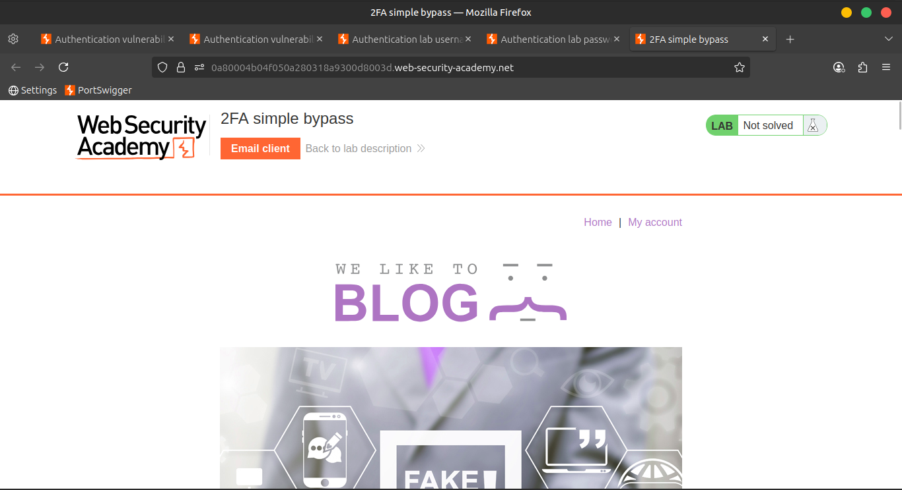
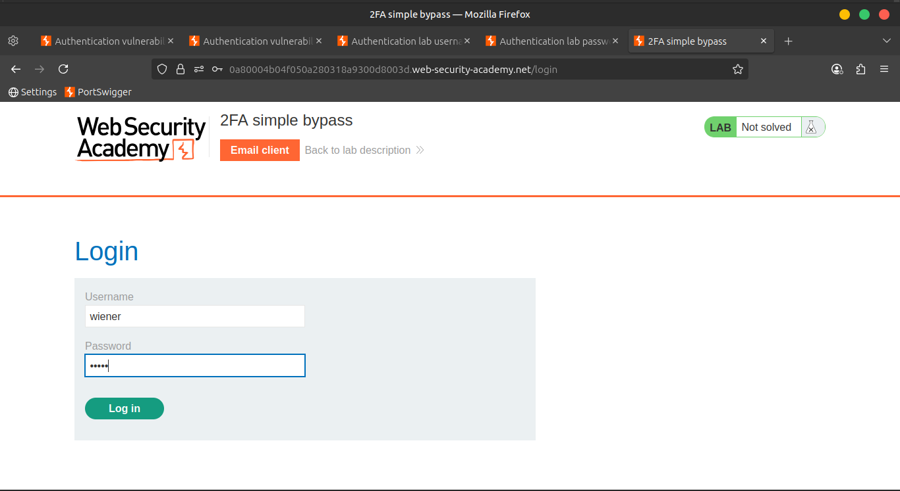
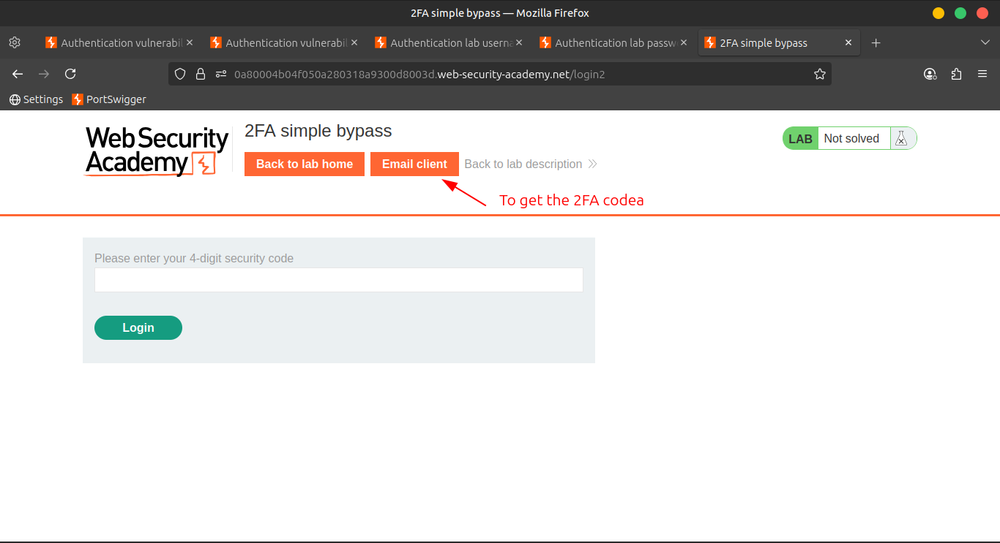
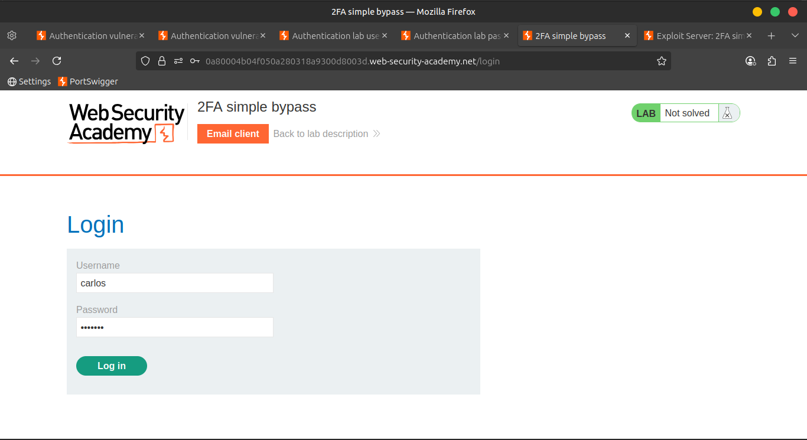
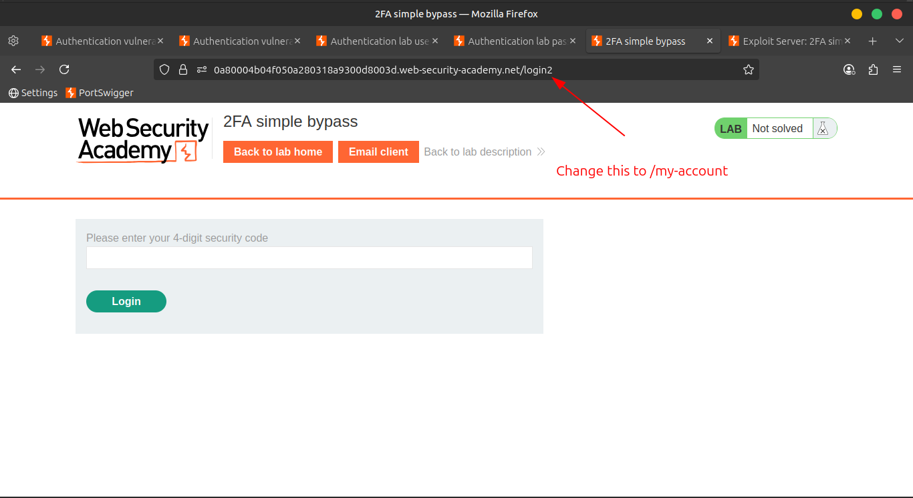
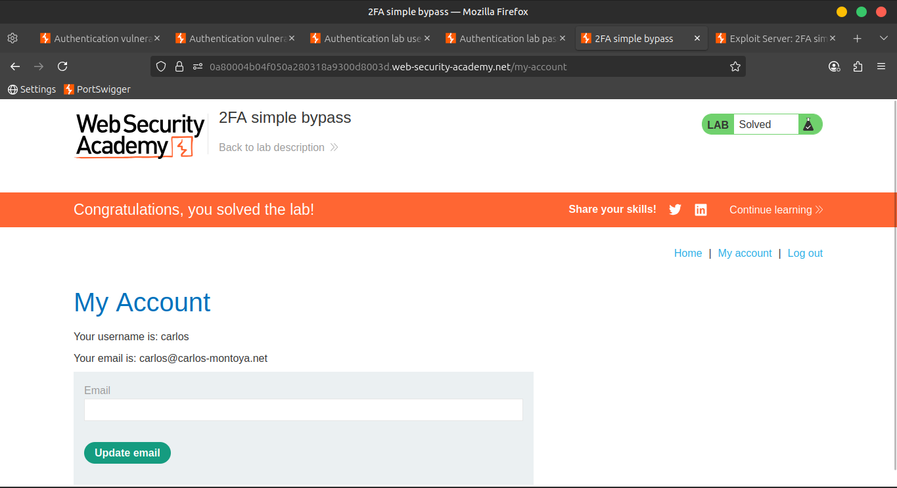

# Lab 05: 2FA simple bypass

> Scenario:
> 
> 
> This lab's **two-factor authentication** can be bypassed.
> 
> You already have a valid **username and password**, but **do not** have access to the user's **2FA verification code**.
> 

🎯 **Goal**: Access Carlos's account page to solve the lab.

---

### 👤 Credentials

- **Your account**: `wiener : peter`
- **Victim’s account**: `carlos : montoya`

---

### 🛠️ Solution Steps

1. ✅ **Log in** to your **own account**.
    - A **2FA verification code** will be sent to you via email.
    - 📧 Click the **Email client** button to check your messages.
        
        
        
        
        
        
        
        
        
2. 🔎 Go to your **account page** and **note the URL**.
    - It will typically be something like:
        
        `/my-account`
        
3. 🔒 **Log out** of your account.
4. 🔑 **Log in using the victim’s credentials**:
    
    `carlos : montoya`
    
    
    
5. 🚫 When prompted for the **verification code**, **do not enter anything**.
6. ✏️ Instead, **manually change the URL** in the browser to navigate directly to:
    
    ```
    /my-account
    ```
    
    
    
7. 🎉 If the page loads, the lab is solved!
    
    
    

---

### 📺 Community Solutions

🔗 [Watch on YouTube](https://youtu.be/2WpBVanEn3M)