# Lab 06: 2FA broken logic

### 🧪 Lab Scenario

> This lab's two-factor authentication is vulnerable due to its flawed logic.
> 
> 
> To solve the lab, access **Carlos's account page**.
> 
- 👤 **Your credentials:** `wiener:peter`
- 🎯 **Victim's username:** `carlos`
- 📬 You also have access to the **email server** to receive your own 2FA verification code.

🧠 **Hint:**

Carlos **will not attempt** to log in to the website himself.

---

### ✅ Solution Steps

---

### 🔍 Step 1: Investigate 2FA Verification

- With **Burp Suite** running, log in to **your own account**.
- Examine the `POST /login2` request.
- 🧾 **Notice:** The `verify` parameter is used to determine **which user's account** is being accessed.
    
    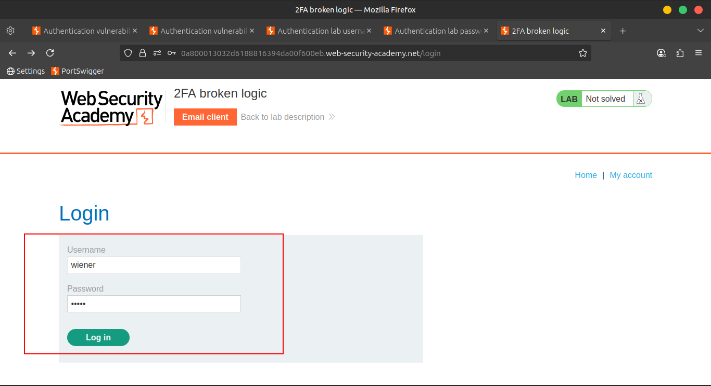
    
    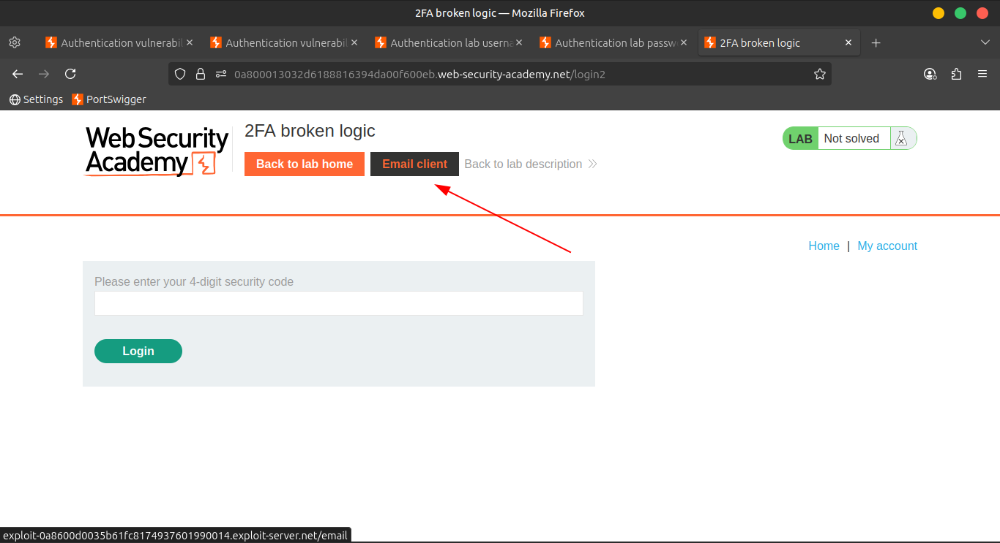
    
    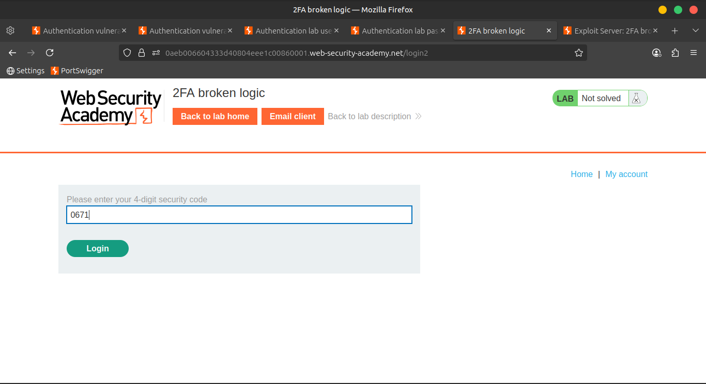
    
    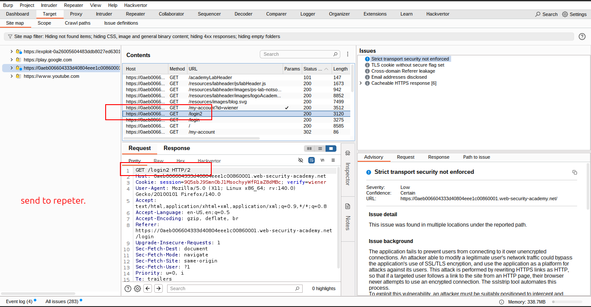
    
    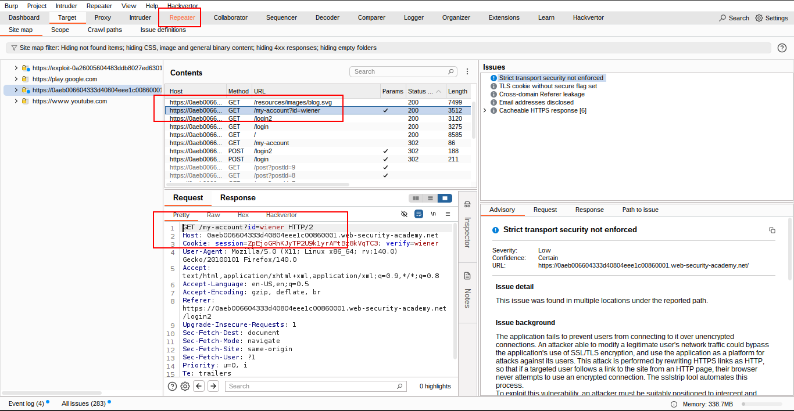
    
    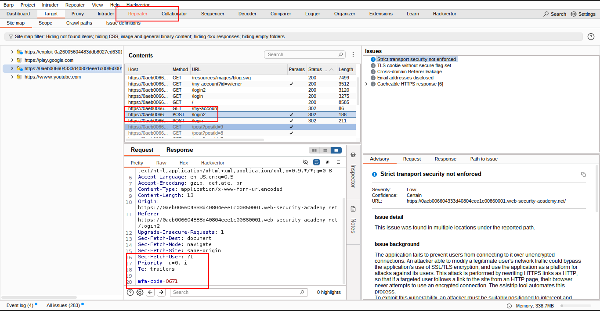
    
    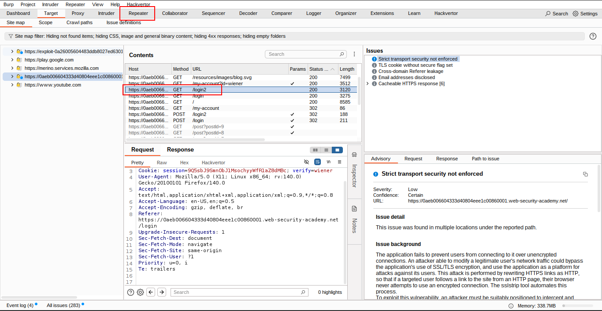
    

---

### 🚪 Step 2: Trigger Carlos's 2FA Code

- Log out of your account.
- In **Burp Repeater**, send a `GET /login2` request.
- 🛠️ **Modify:** Change the value of the `verify` parameter to `carlos`.
- 📩 This ensures that a **temporary 2FA code is generated** for Carlos.
    
    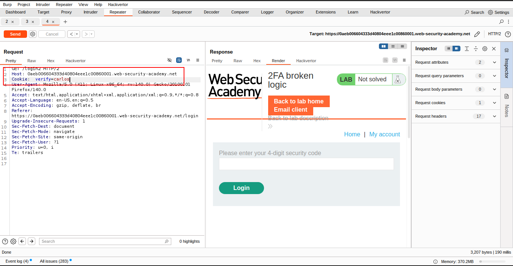
    
    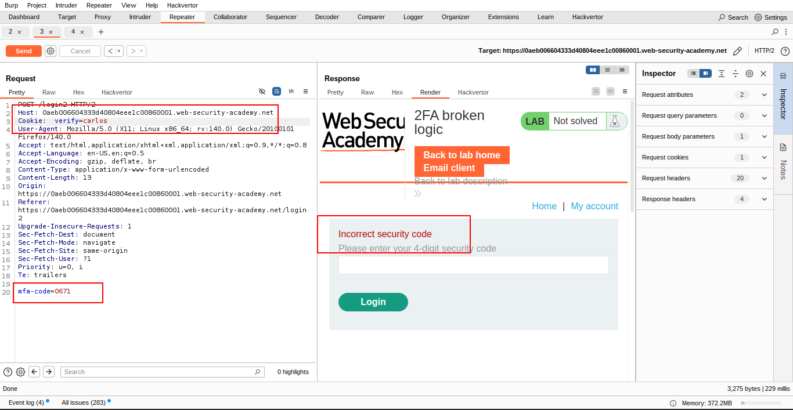
    
    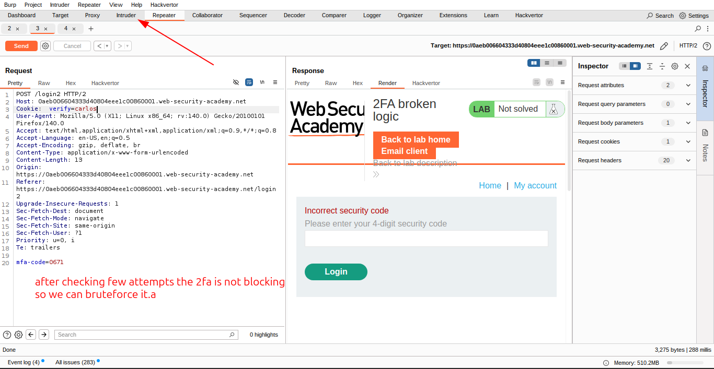
    

---

### 🧑‍💻 Step 3: Prepare to Brute-Force Carlos's 2FA

- Go back to the login page and enter your username and password.
- Submit an **invalid 2FA code**.
- 📡 Send the resulting `POST /login2` request to **Burp Intruder**.

---

### 🧨 Step 4: Brute-Force the 2FA Code

- In **Burp Intruder**:
    - Set the `verify` parameter to `carlos`.
    - Add a **payload position** to the `mfa-code` parameter.
- Start brute-forcing the verification code.
    
    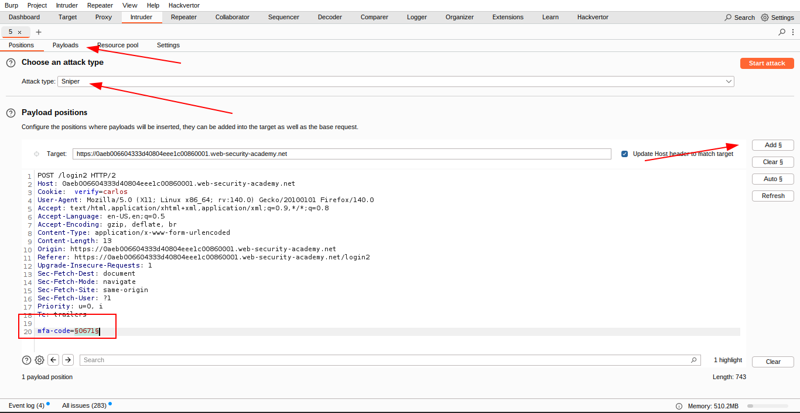
    
    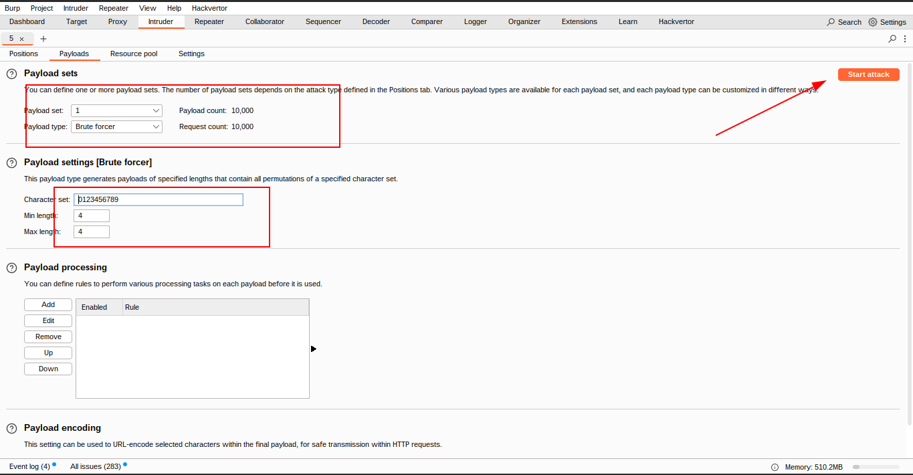
    
    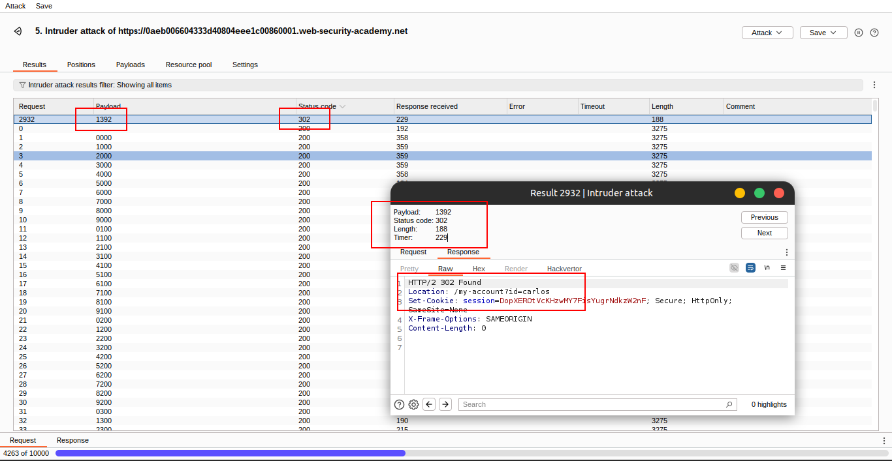
    

---

### 🗝️ Step 5: Access Carlos's Account

- 🧭 Load the **302 redirect** response in the browser.
- 🖱️ Click **My account** to solve the lab!
    
    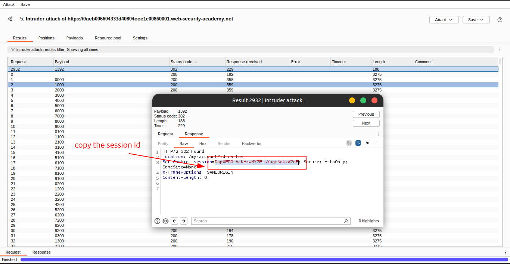
    
    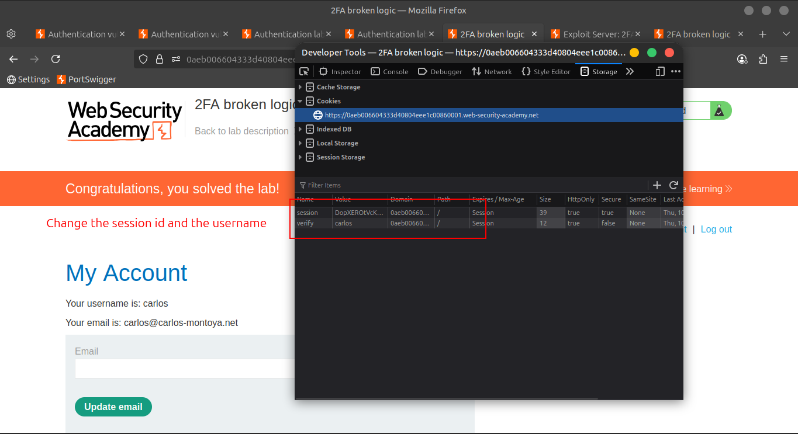
    
    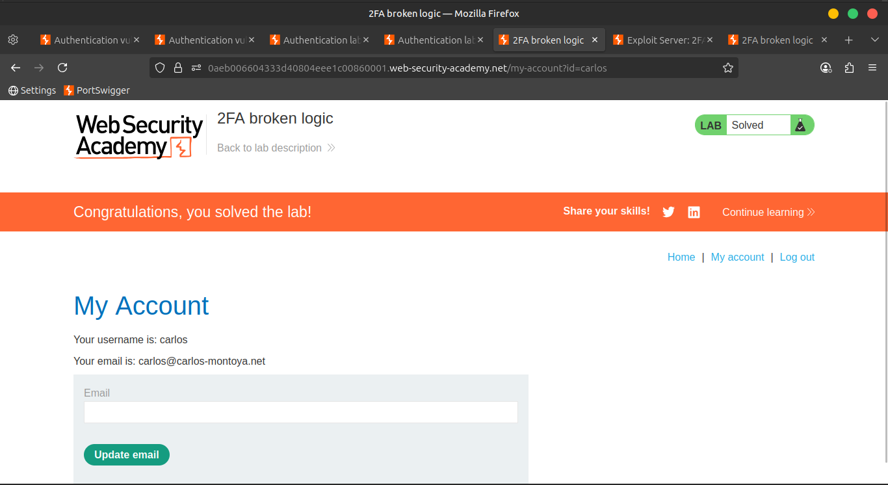
    

---

### 📺 Community Solutions

👉 Watch: [YouTube](https://youtu.be/dpcrsQ2nhBo)