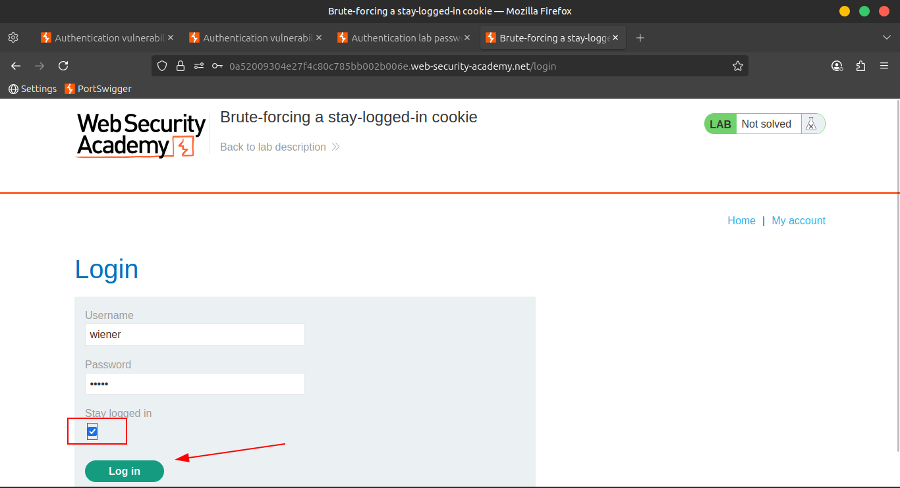
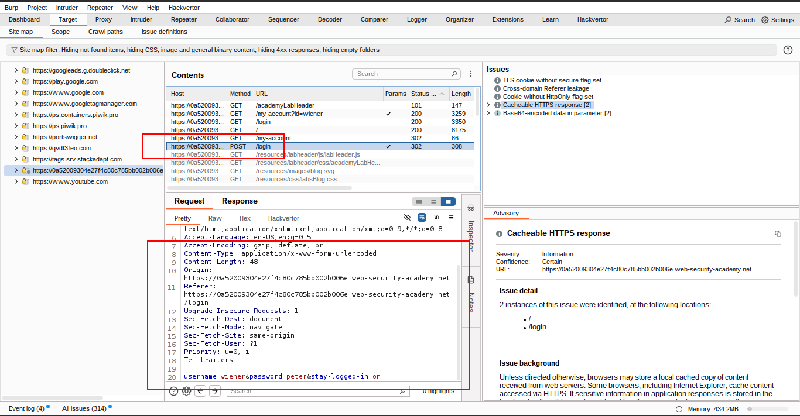
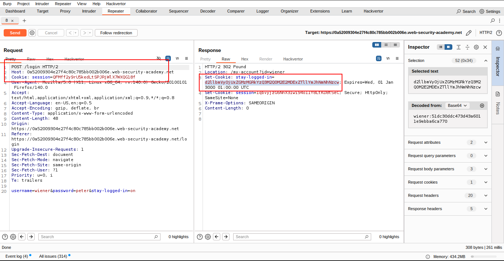
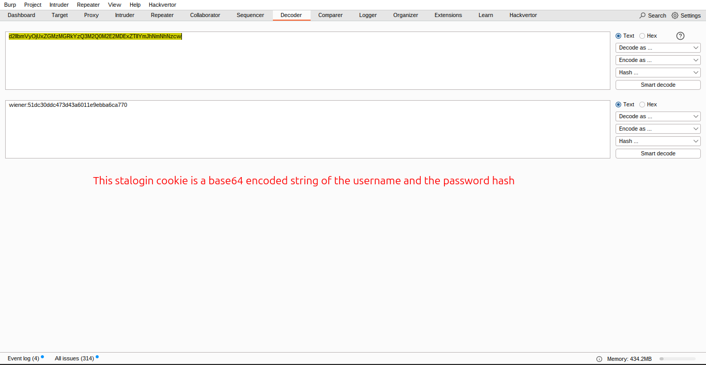
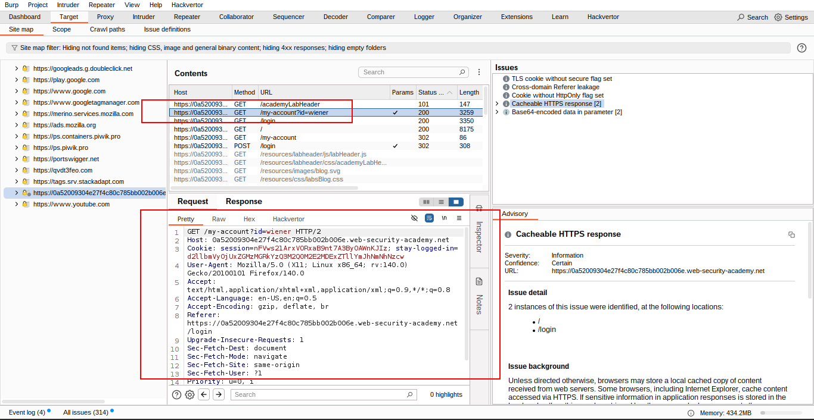
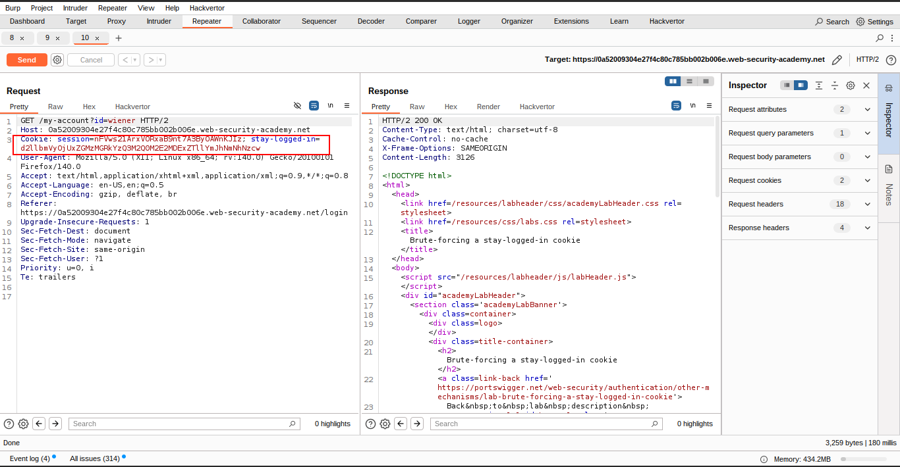
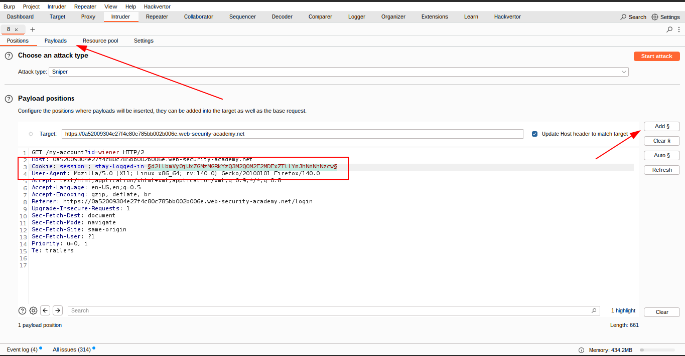
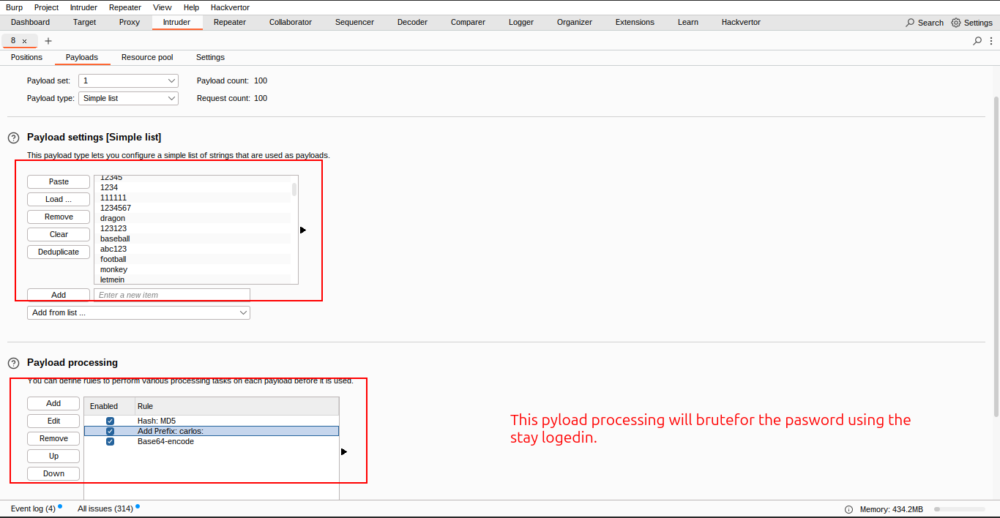
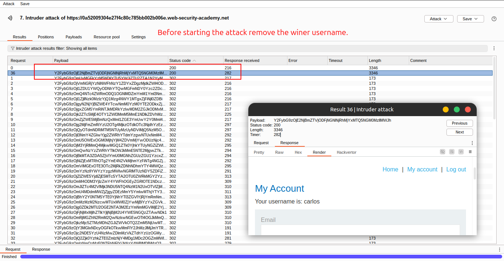
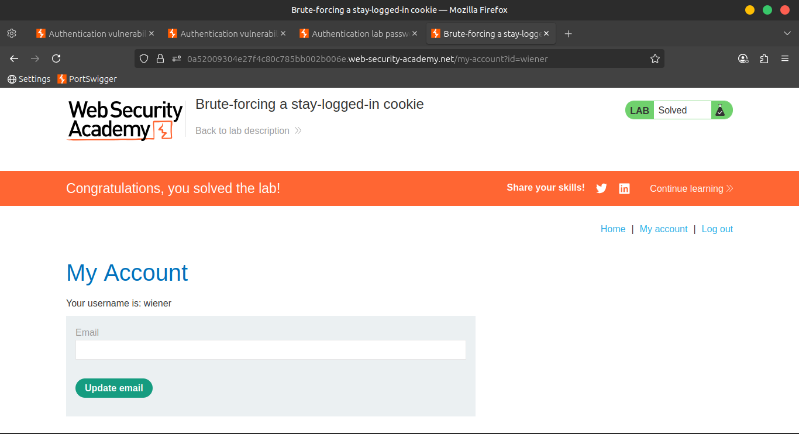

# Lab 07: Brute-forcing a stay-logged-in cookie

> This lab allows users to stay logged in even after they close their browser session.
> 
> 
> The cookie used for this functionality is **vulnerable to brute-forcing**.
> 

🎯 **Goal**: Brute-force **Carlos’s cookie** to access his **My account** page.

---

### 🧾 Lab Credentials

- 👤 **Your credentials**: `wiener:peter`
- 👤 **Victim's username**: `carlos`
- 📄 **Wordlist**: [*Candidate passwords*](https://portswigger.net/web-security/authentication/auth-lab-passwords)

---

## 🛠️ Step-by-Step Solution

1. 🧪 **Login using your own credentials** with the ✅ **Stay logged in** option selected.
    
    🔍 This sets a `stay-logged-in` cookie.
    
2. 🔬 In **Burp Inspector**, decode the cookie:
    
    ```
    wiener:51dc30ddc473d43a6011e9ebba6ca770
    ```
    
    You’ll notice that:
    
    - `51dc30ddc473d43a6011e9ebba6ca770` may be an **MD5 hash**
    - It is likely a hash of your **password**
3. 💡 Confirm by hashing your password (`peter`) using **MD5**:
    
    Result matches → The structure is:
    
    ```
    base64(username + ":" + md5(password))
    ```
    

---

### 🧨 Launching the Attack

1. 🔄 Log out of your account.
    
    In Burp, locate the recent request:
    
    ```
    GET /my-account?id=wiener
    ```
    
    🔖 Highlight the `stay-logged-in` cookie.
    
    
    
    
    
    
    

---

### 🎯 Configure Burp Intruder

1. ✏️ In **Payloads tab**:
    - Add your own password (`peter`) as a **test payload**
2. 🔧 Under **Payload processing**, add rules in order:
    - 🔑 `Hash: MD5`
    - 🧷 `Add prefix: wiener:`
    - 🧬 `Encode: Base64`
3. 🕵️ Under **Settings > Grep Match**, add the string:
    
    ```
    Update email
    ```
    
    ✅ This string appears **only** on a successful login page.
    
4. 🚀 Start the attack → You should see a match!
    
    🎉 Confirm your logic works for generating valid cookies.
    
    
    
    
    
    
    
    
    
    
    
    
    

---

### 🛡️ Brute-force Carlos’s Cookie

1. 🛠 Adjust the Intruder config:
    - 🧾 Replace your password with the list of **candidate passwords**
    - ✍️ Change `id=wiener` to `id=carlos` in the URL
    - 🔁 Modify prefix to `carlos:` instead of `wiener:`
2. 🚀 Restart the attack
    
    
    

---

### ✅ Lab Completion

- Look for the response with:
    
    ```
    Update email
    ```
    
- 🎯 That request **brute-forced** Carlos's `stay-logged-in` cookie!
- 🏁 The lab is now **solved** ✅
    
    
    

---

📹 **Community Solutions**

> 🎥 [Watch on YouTube](https://youtu.be/T4iWTjRALNg)
>