# Lab 09: Password Reset Broken Logic

🚨 This lab’s **password reset functionality is vulnerable**.

**Goal:** Reset **Carlos’s** password, then log in and access his **"My account"** page.

---

### 🛠️ **Your Credentials:**

- Username: `wiener`
- Password: `peter`

### 🎯 **Victim’s Username:**

- `carlos`

---

### 📝 **Solution Steps:**

1️⃣ With **Burp Suite running**, click the **Forgot your password?** link and enter **your own username** (`wiener`).

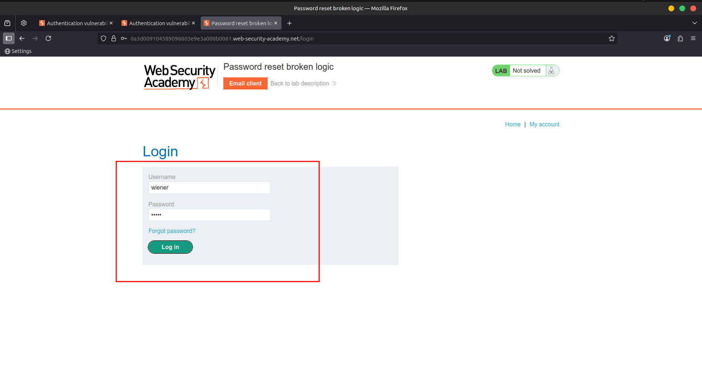

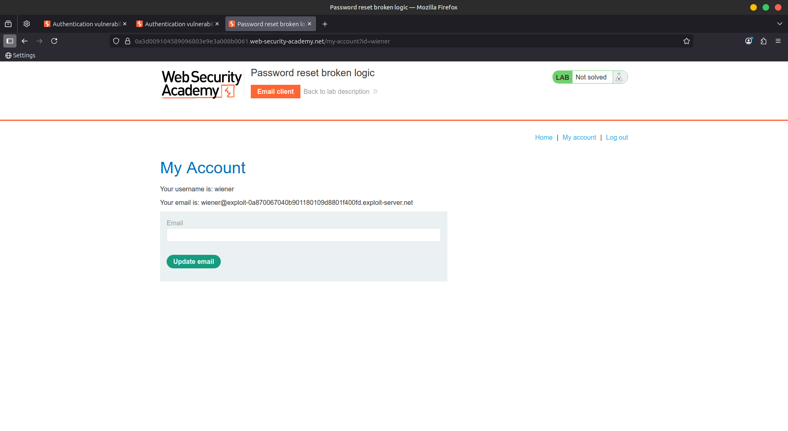

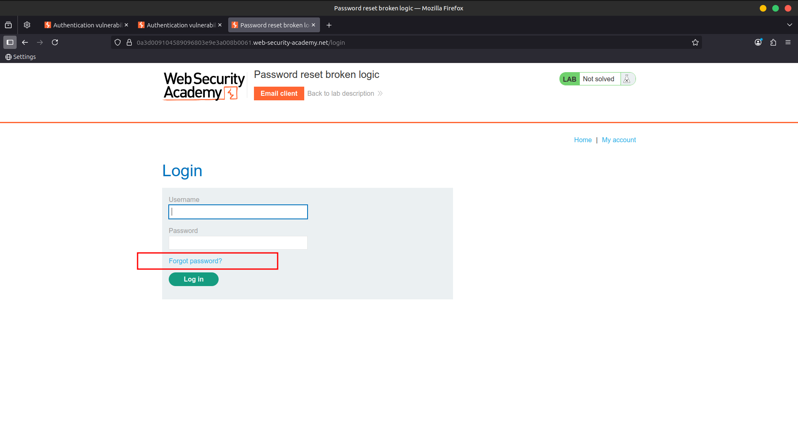

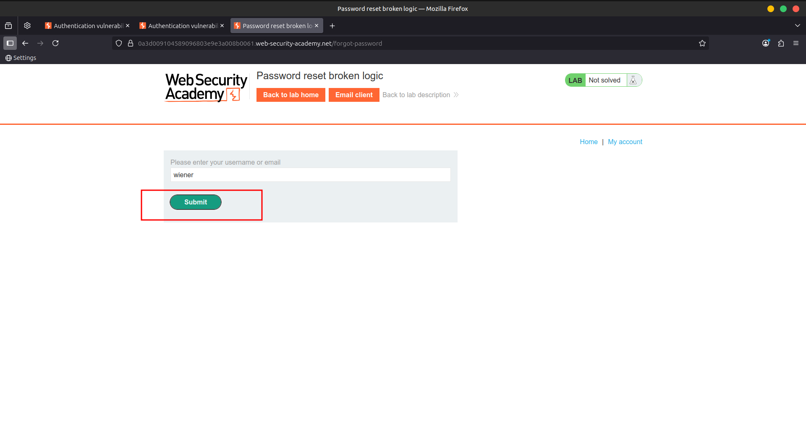

2️⃣ Click the **Email client** button to view the password reset email sent to you.

- Click the **reset link** in the email.
- Reset your password to whatever you want. 🔑

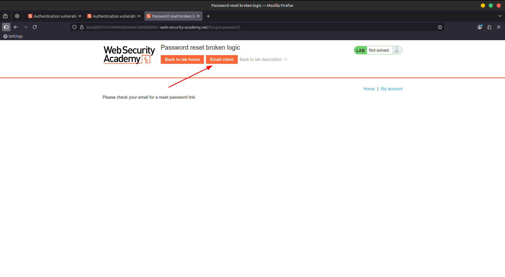

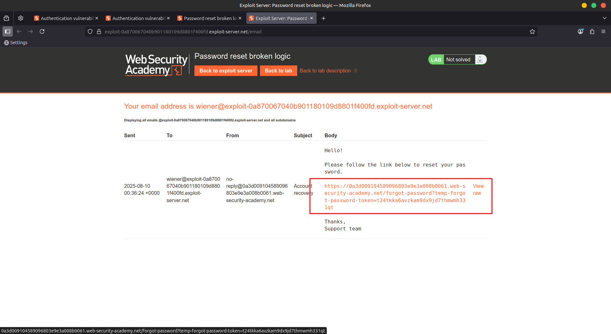

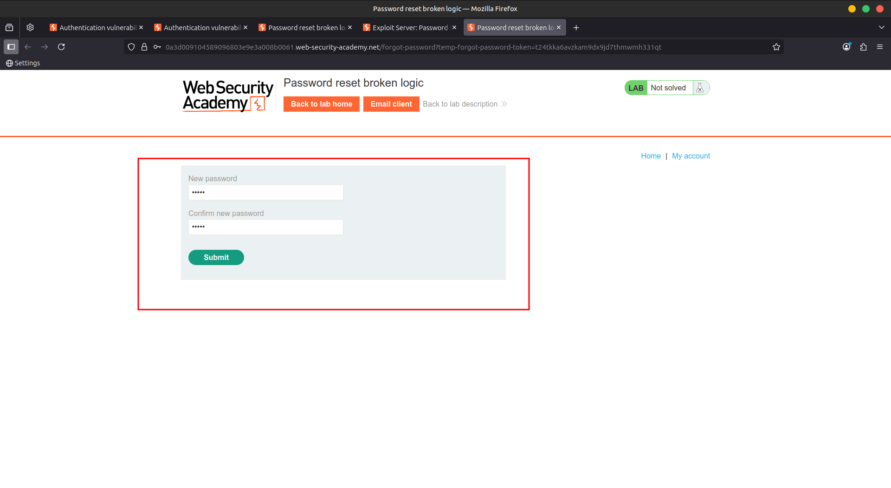

3️⃣ In **Burp**, go to **Proxy > HTTP history** and study the requests/responses for the password reset feature.

- Notice the reset token appears as a **URL query parameter** in the email’s reset link.
- When submitting your new password, the **POST /forgot-password?temp-forgot-password-token** request includes your **username as a hidden input**.
- Send this request to **Burp Repeater**. 🔄

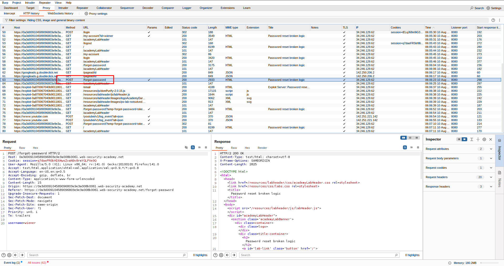

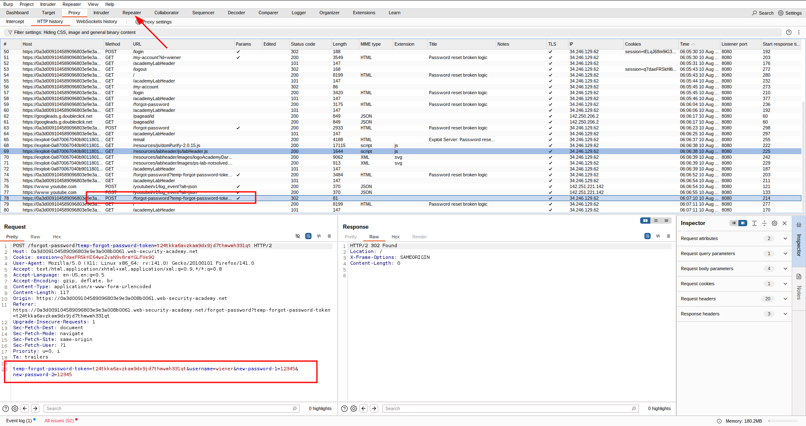

4️⃣ In **Burp Repeater**, observe the password reset still works even if you:

- **Delete the value** of the `temp-forgot-password-token` parameter in the **URL and request body**.
    
    ⚠️ This confirms the token is **not checked on password submission**.
    
    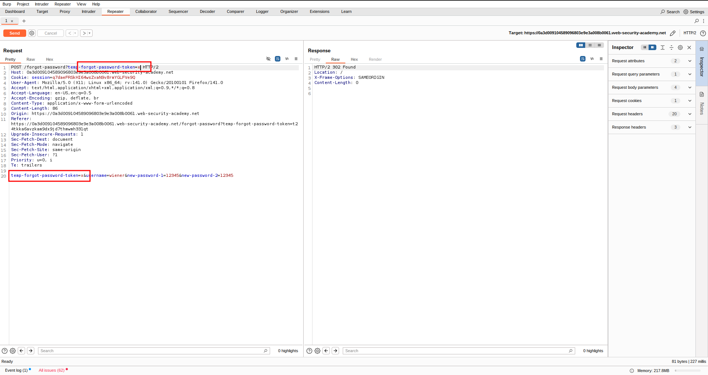
    

5️⃣ In your browser, request a new password reset and change your password again.

6️⃣ Send the new **POST /forgot-password?temp-forgot-password-token** request to **Burp Repeater** again.

7️⃣ In **Burp Repeater**, now:

- **Delete the value** of `temp-forgot-password-token` in the URL and body.
- Change the `username` parameter to **`carlos`**.
- Set the new password to whatever you want.
- Send the request. 🎯

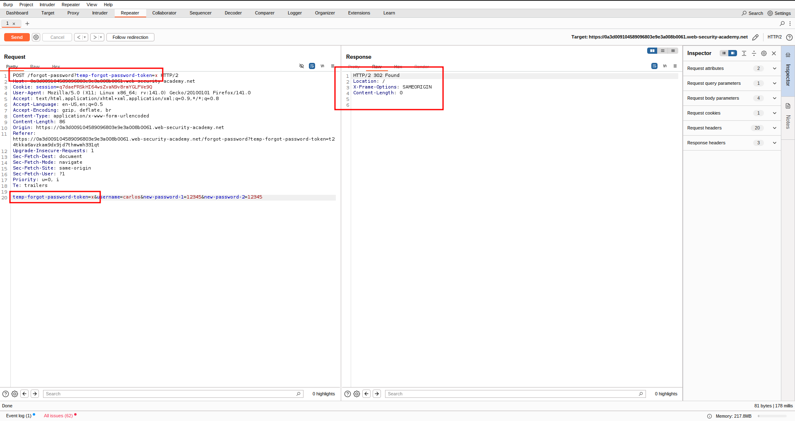

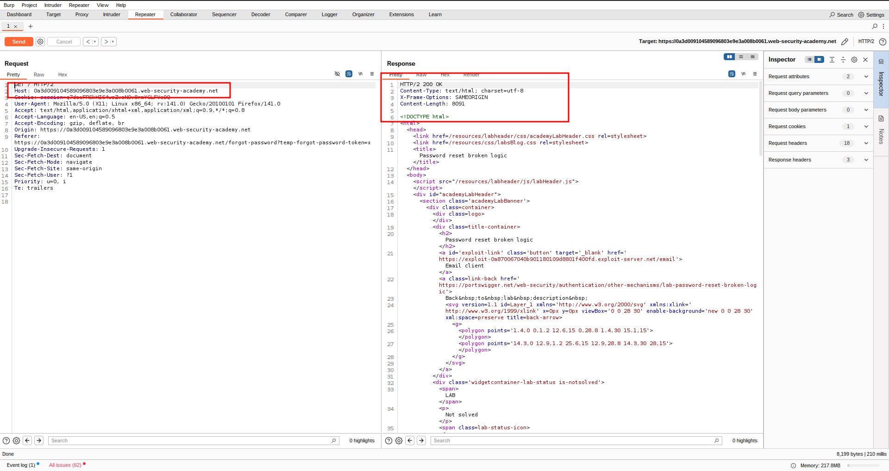

8️⃣ In your browser, **log in to Carlos’s account** using the new password you just set.

9️⃣ Click **My account** to complete the lab challenge. ✅

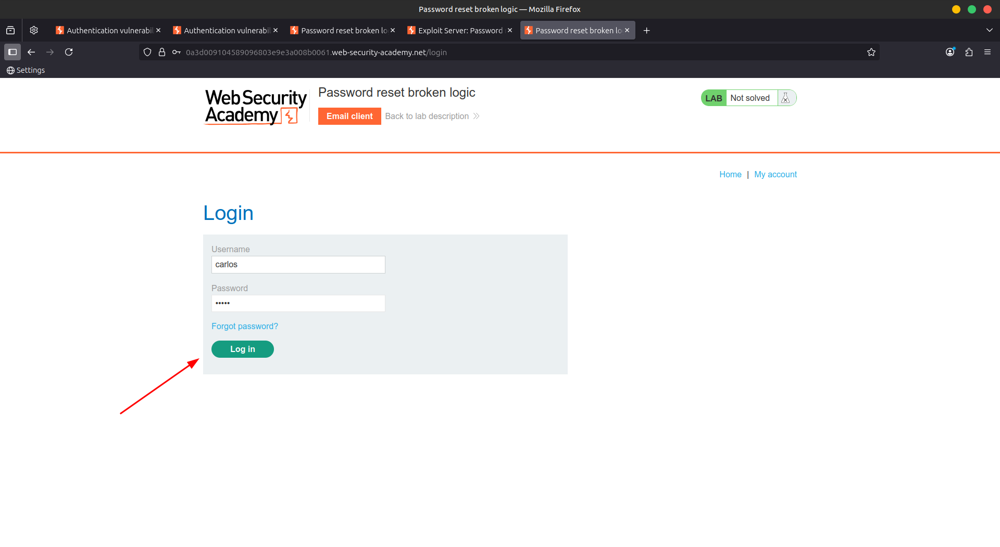

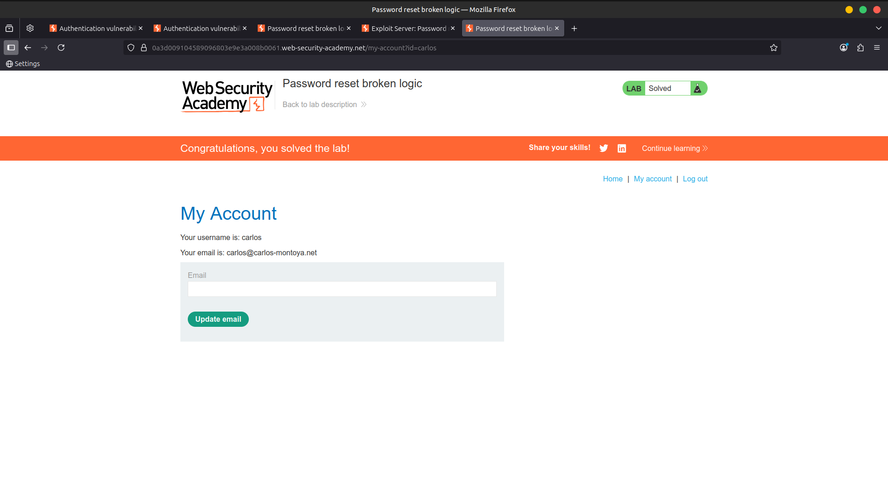

---

### 🎥 **Community Walk-through:**

> [YouTube](https://youtu.be/GtTk78pyLPI)
>