# Lab 11: Password brute-force via password change

🚨 **Vulnerability:** The password change functionality can be exploited to **brute-force the victim’s password**.

🎯 **Goal:** Use the provided list of candidate passwords to brute-force **Carlos’s** account and access his **"My account"** page.

---

### 🛠️ **Your Credentials:**

- Username: `wiener`
- Password: `peter`

👤 **Victim’s Username:** `carlos`

📜 [**Candidate Passwords**](https://portswigger.net/web-security/authentication/auth-lab-passwords)

---

## 📝 **Solution Steps:**

1️⃣ **Start Burp Suite** and log in to your account.

- Experiment with the **password change functionality**.
- Observe that the **username** is sent as **hidden input** in the request form.

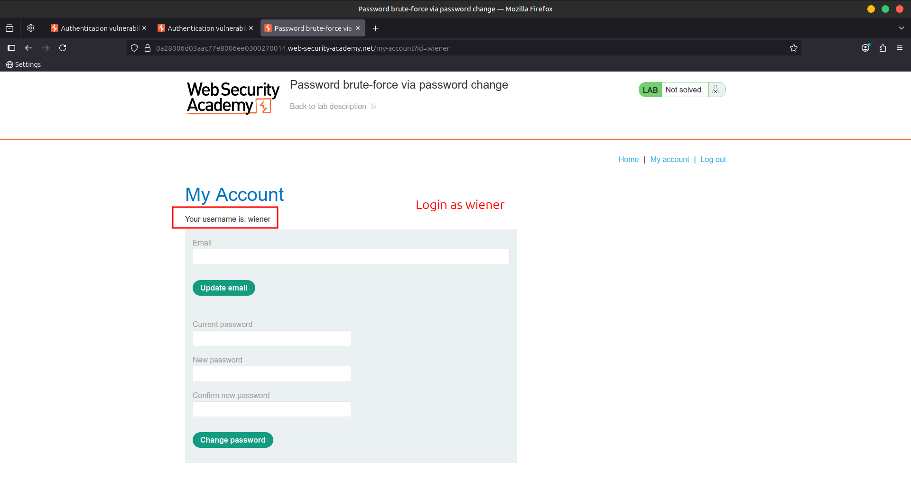

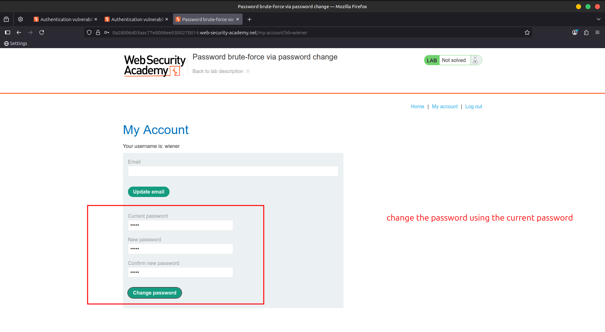

2️⃣ Notice the behavior when entering the **wrong current password**:

- If the **two entries for the new password match** → Account is **locked** 🔒
- If you enter **two different new passwords** → Error: `"Current password is incorrect"`
- If you enter a **valid current password** but two different new passwords → Error: `"New passwords do not match"`

💡 This last message can be used to **enumerate correct passwords** ✅

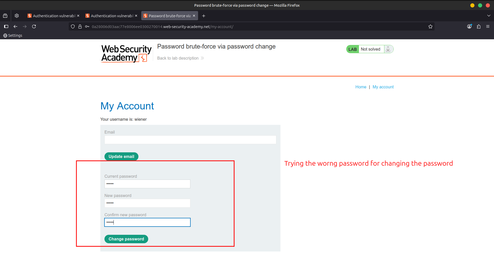

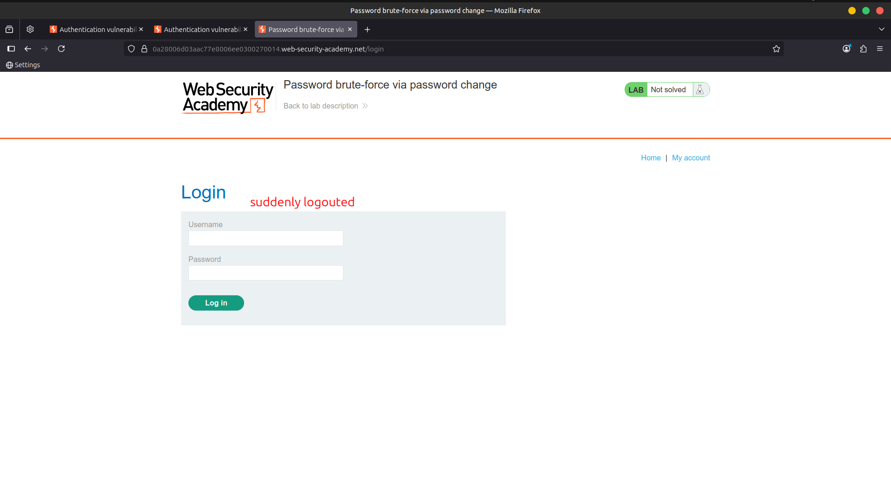

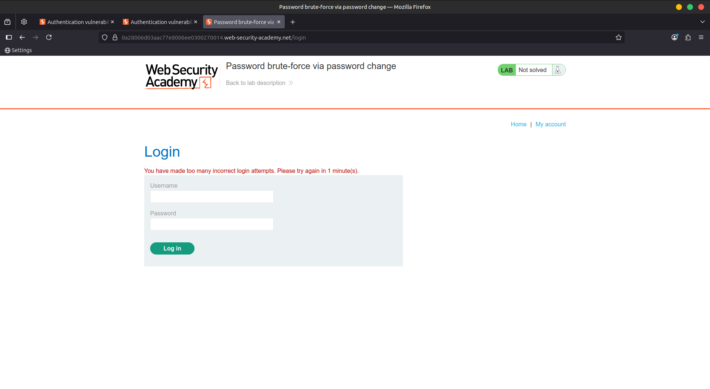

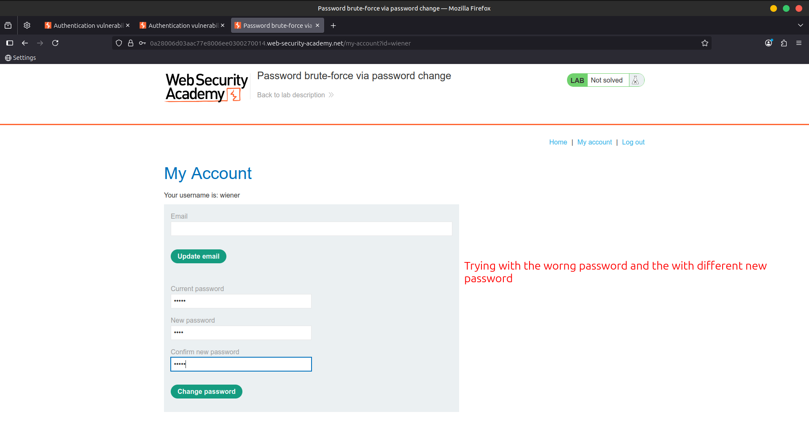

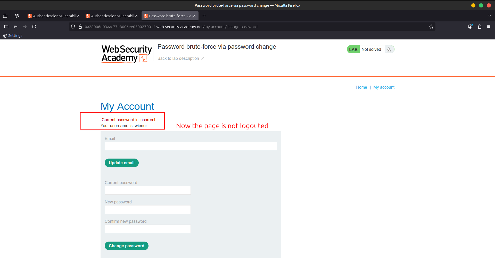

3️⃣ Enter **your correct current password** and **two different new passwords**.

- Send this `POST /my-account/change-password` request to **Burp Intruder**.

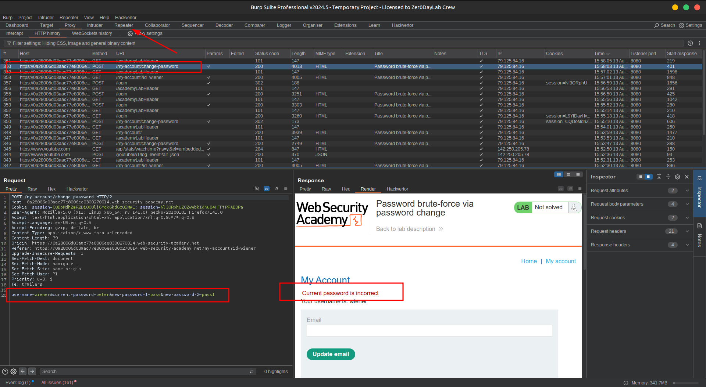

4️⃣ In **Burp Intruder**:

- Change the `username` parameter to `carlos`
- Add a payload position around the `current-password` parameter.
- Ensure the two new password fields are **different**. Example:
    
    ```
    username=carlos&current-password=§incorrect-password§&new-password-1=123&new-password-2=abc
    ```
    

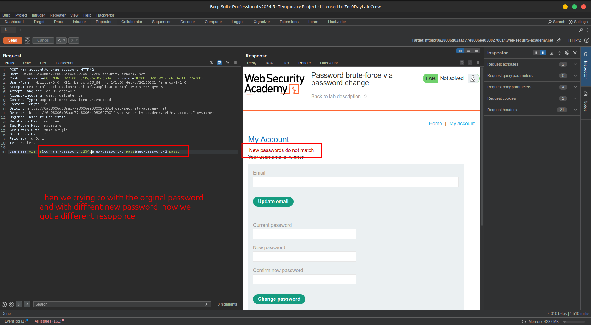

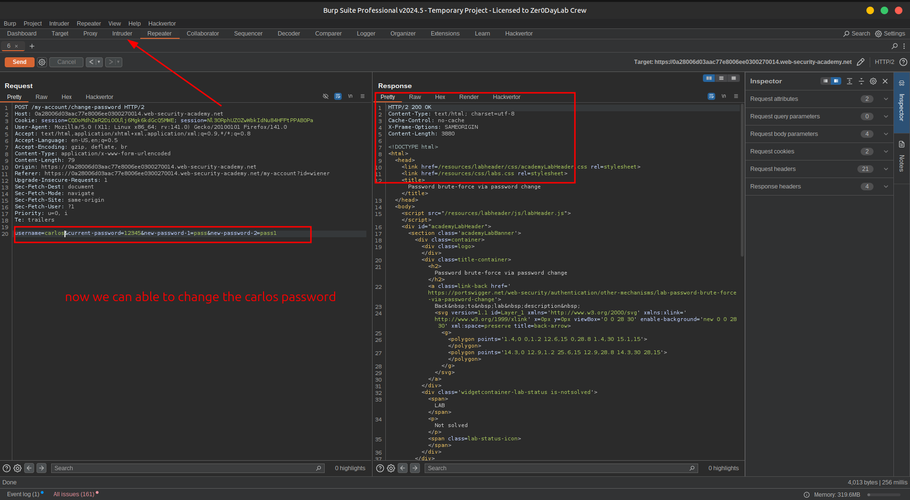

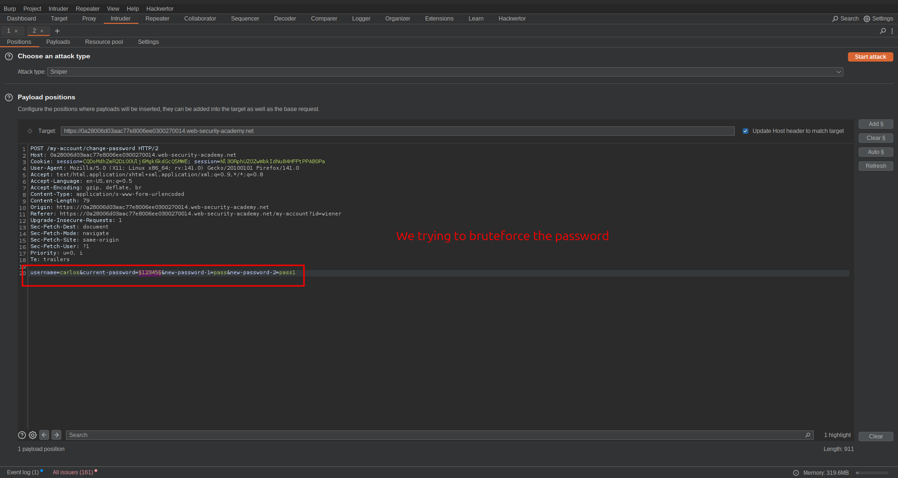

5️⃣ In the **Payloads** panel:

- Enter the list of candidate passwords as the payload set 📋

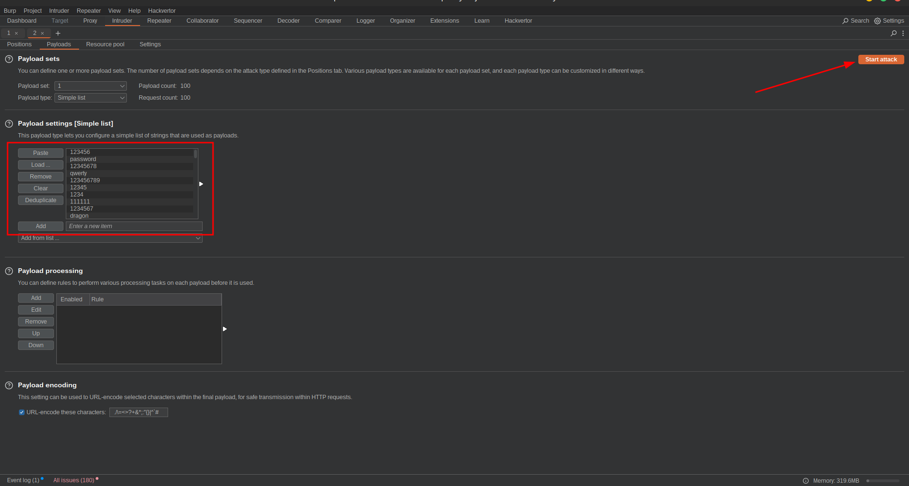

6️⃣ In the **Settings** panel:

- Add a **Grep Match rule** to flag responses containing:
    
    ```
    New passwords do not match
    ```
    
- Start the attack 🚀

7️⃣ When the attack finishes:

- Identify the password that triggered the `"New passwords do not match"` message.
- This is **Carlos’s correct password** 🗝️

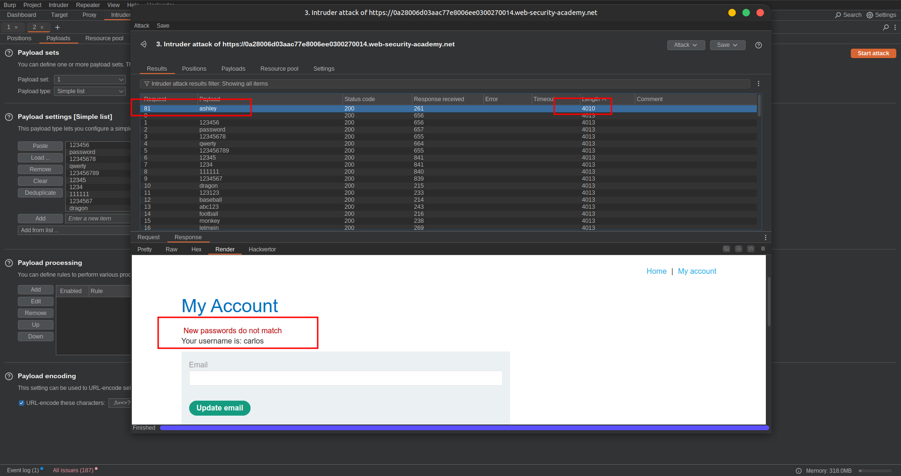

8️⃣ In your browser:

- Log out of your account 🔓
- Log in with:
    - Username: `carlos`
    - Password: *(identified password)*

9️⃣ Click **My account** to solve the lab ✅

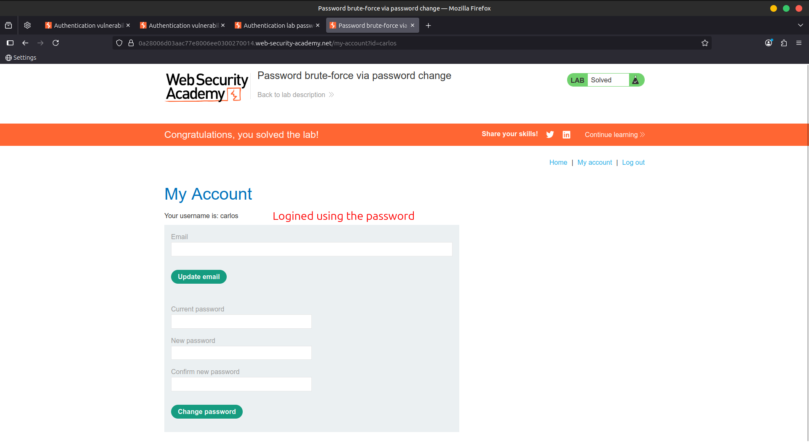

---

### 🎥 **Community Walkthrough:**

> [Watch the solution](https://youtu.be/tiIg6mGiTKI)
>