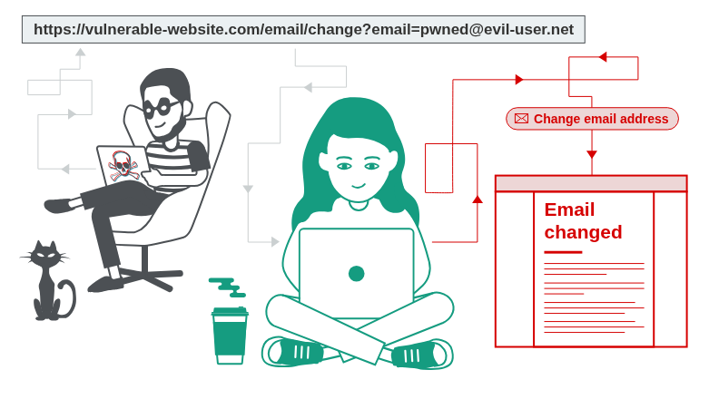

# 1. What is CSRF?

**Cross-site request forgery** (also known as **CSRF**) is a **web security vulnerability** that allows an attacker to **induce users to perform actions that they do not intend to perform**.

It enables an attacker to **partly circumvent the same-origin policy**, which is designed to **prevent different websites from interfering with each other**.

> ⚠️ CSRF exploits the trust that a web application has in the user's browser — not the other way around.
> 

