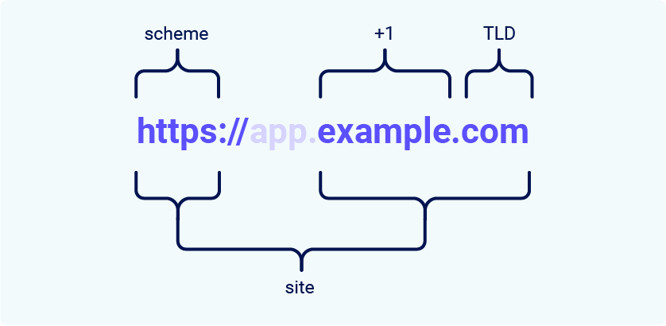

# 15. What is a site in the context of SameSite cookies?

### 📌 **What Is a "Site"?**

In the context of SameSite restrictions, a **site** is defined as:

- The **top-level domain** (TLD), such as `.com` or `.net`
- Plus **one additional label** to the left (often called **TLD+1**)

> Example:
> 
> - `example.com` → Site = `example.com`
> - `app.example.com`, `blog.example.com` → Same site = `example.com`

### 🧩 **What Is an "Effective TLD" (eTLD)?**

An **effective TLD** accounts for common multi-part domain suffixes treated as a single TLD in practice:

- Examples: `.co.uk`, `.gov.in`, `.com.au`
- TLD+1: `example.co.uk`, `mysite.com.au`

This distinction ensures consistency in domain parsing and browser security behavior.

---

### 🌐 **Same-Site vs Same-Origin: Key Differences**

| **Request From** | **Request To** | **Same-Site?** | **Same-Origin?** |
| --- | --- | --- | --- |
| `https://example.com` | `https://example.com` | ✅ Yes | ✅ Yes |
| `https://app.example.com` | `https://intranet.example.com` | ✅ Yes | ❌ No (domain mismatch) |
| `https://example.com` | `https://example.com:8080` | ✅ Yes | ❌ No (port mismatch) |
| `https://example.com` | `https://example.co.uk` | ❌ No (eTLD mismatch) | ❌ No (domain mismatch) |
| `https://example.com` | `http://example.com` | ❌ No (scheme mismatch) | ❌ No (scheme mismatch) |

### 🚨 **Why This Matters**

- **Same-site** comparisons are **broader** than same-origin.
- **Same-origin** = identical **scheme + domain + port**
- A **cross-origin request** can still be **same-site**, but not the other way around.

---

### 🔓 **Security Implication**

> Vulnerabilities allowing arbitrary JavaScript execution (e.g., via XSS) on one subdomain of a site can potentially:
> 
- Exploit cookies and session data shared across other subdomains of the same site
- **Bypass SameSite protections**
- Lead to **privilege escalation or account takeover**

You’ll explore an example of this **attack vector** in one of the upcoming labs.