# Lab 2: CSRF where token validation depends on request method

### 🐞 **Vulnerability Overview**

This lab's **email change functionality** is **vulnerable to CSRF**.

🛡️ It **attempts to block CSRF attacks**, but **only applies defenses to certain types of requests**.

### 🎯 **Objective**

To **solve the lab**, use your **exploit server** to host an **HTML page** that delivers a **CSRF attack** to **change the viewer’s email address**.

### 🔐 **Test Credentials**

You can log in to your **own account** using the following credentials:

👤 **Username:** `wiener`

🔑 **Password:** `peter`

### 💡 **Hint**

> You **cannot register** an email address that is **already taken** by another user. If you change your **own email address while testing** your exploit, make sure to use a **different email address** for the **final exploit** delivered to the **victim**.
> 

---

## **Solution**

## 🔐 Objective

Intercept the page using **Burp Suite**, log in with the given **username and password**, and check for **CSRF vulnerabilities** by manipulating the **"Update email"** request.

## 🔍 Steps Overview

### 1. Intercept and Log In

- Open **Burp's browser** and log in to your account.
- After logging in, navigate to the **email change page**.

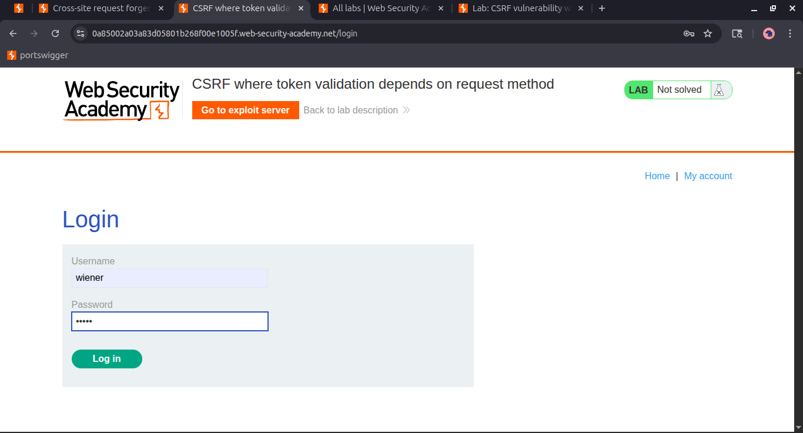

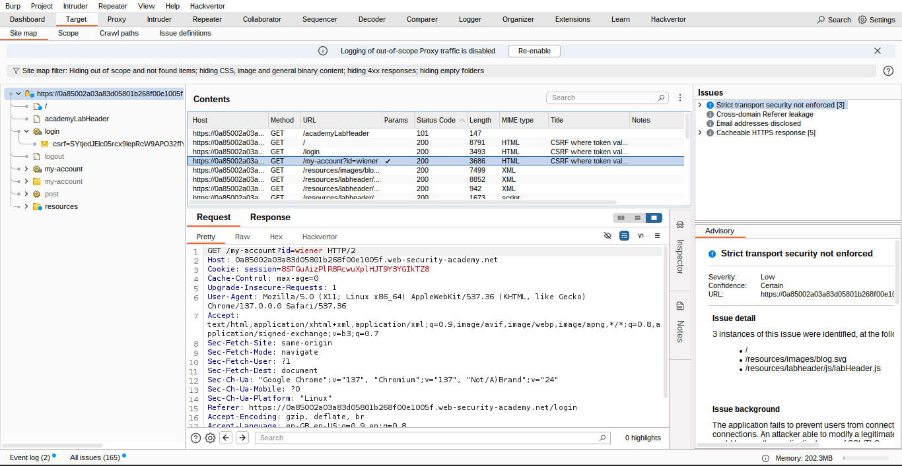

### 2. Submit the "Update email" Form

- Change the email to another email address.
- Then, in **Burp Suite**:
    - Find the resulting request in your **Proxy history**.
    - Send the request to **Burp Repeater**.
    - Modify the `csrf` parameter and observe that the request is **rejected**.
        
        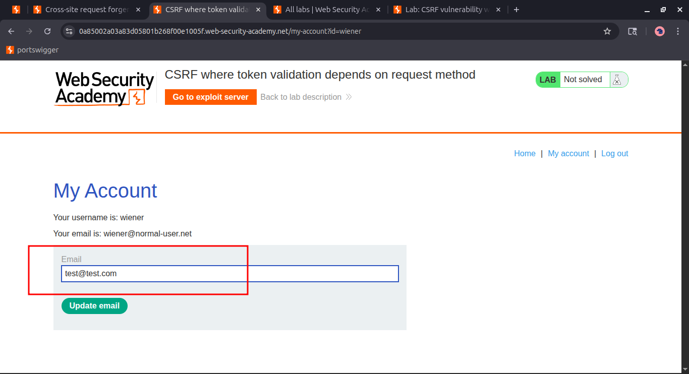
        
        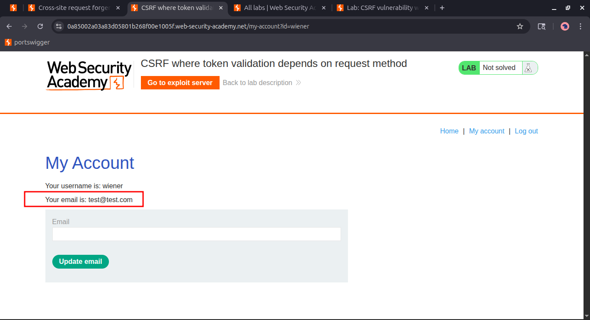
        
        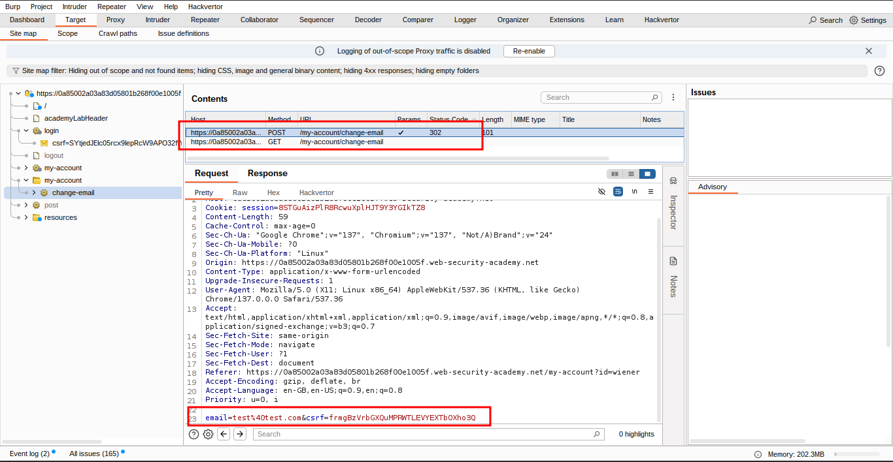
        

## 🔁 Convert the Request Method

### ⚠️ Testing CSRF Token Validation on Request Type

- Right-click the request in **Burp Repeater** and select **"Change request method"** to convert it into a `GET` request.
- **Remove the CSRF token** from the request.
- **Send the modified request**:
    - If you get a `302` response, click **"Follow redirect"** in Burp.
    - A `200 OK` response means the request **succeeded**.
    - **Check the response page** to see if the email was updated.
        - If it was, the target is **vulnerable**.
            
            
            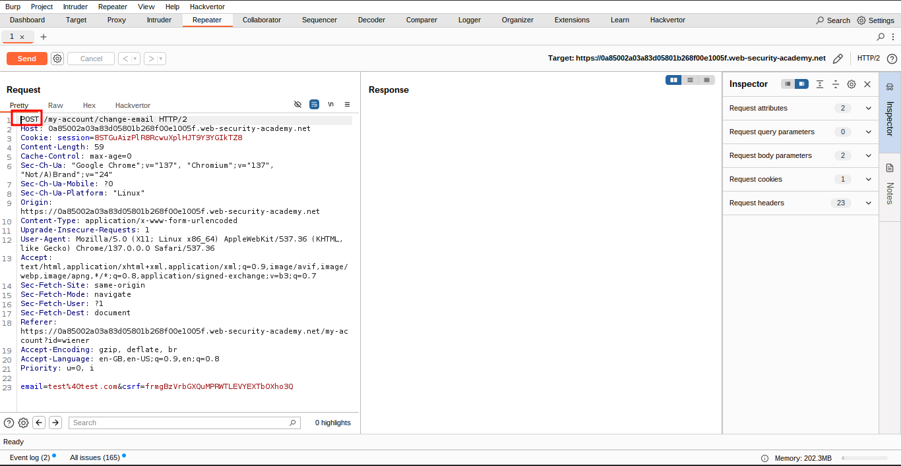
            
            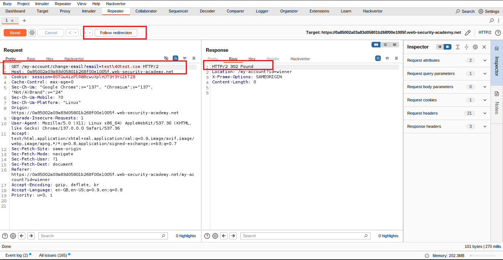
            
            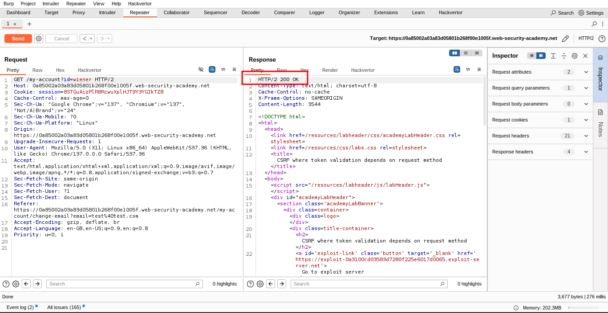
            
            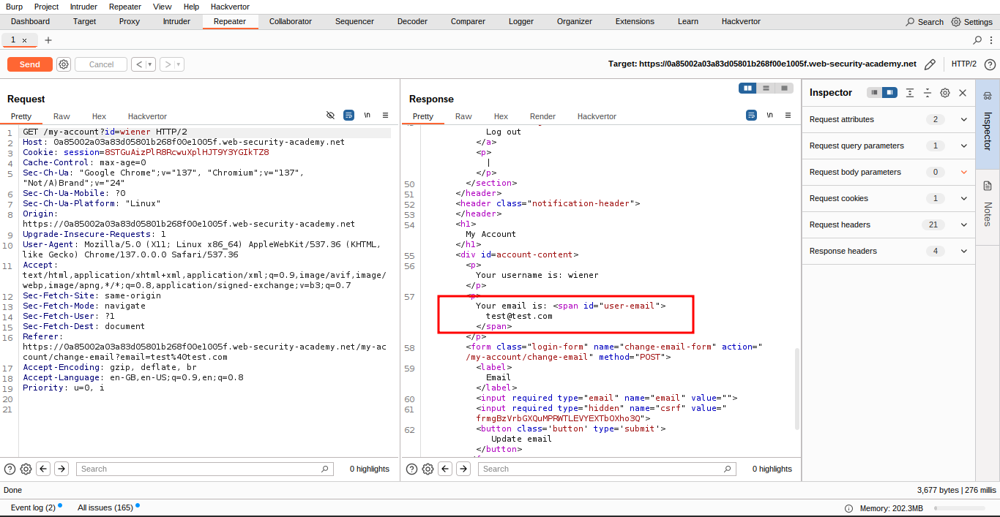
            

> ✅ This confirms that the page is validating the CSRF token for POST requests, but not for GET requests — a critical flaw.
> 

## 🔧 Relevant Details

- **Relevant Action:** Changing a user’s email.
- **Impact:** This is a sensitive action and can cause **dangerous consequences** to the target.
- **Session Handling:** The application uses a **cookie-based session**.
- **Parameters in the Request:**
    - The email address being changed.
    - A CSRF token — which should normally protect the action.

## 🧪 CSRF Proof of Concept (PoC)

### ▶️ Using Burp Suite Professional

- Right-click on the request.
- Select **Engagement tools → Generate CSRF PoC**.
- Enable the **"Include auto-submit script"** checkbox.
- Click **"Regenerate"**.

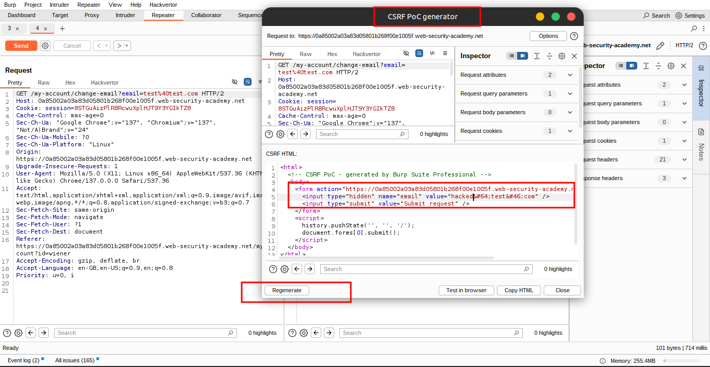

### 🆓 Using Burp Suite Community Edition

Use the following HTML template:

```html
<form action="https://YOUR-LAB-ID.web-security-academy.net/my-account/change-email">
    <input type="hidden" name="email" value="anything%40web-security-academy.net">
</form>
<script>
    document.forms[0].submit();
</script>
```

## 🚀 Deploying the Exploit

- Go to the **exploit server**.

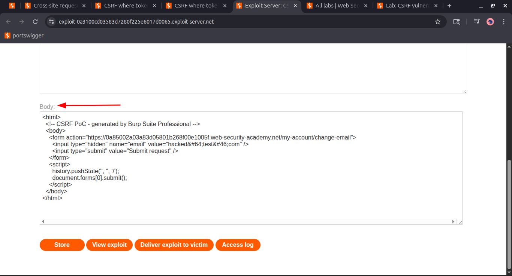

- Paste your exploit HTML into the **"Body"** section and click **"Store"**.
    
    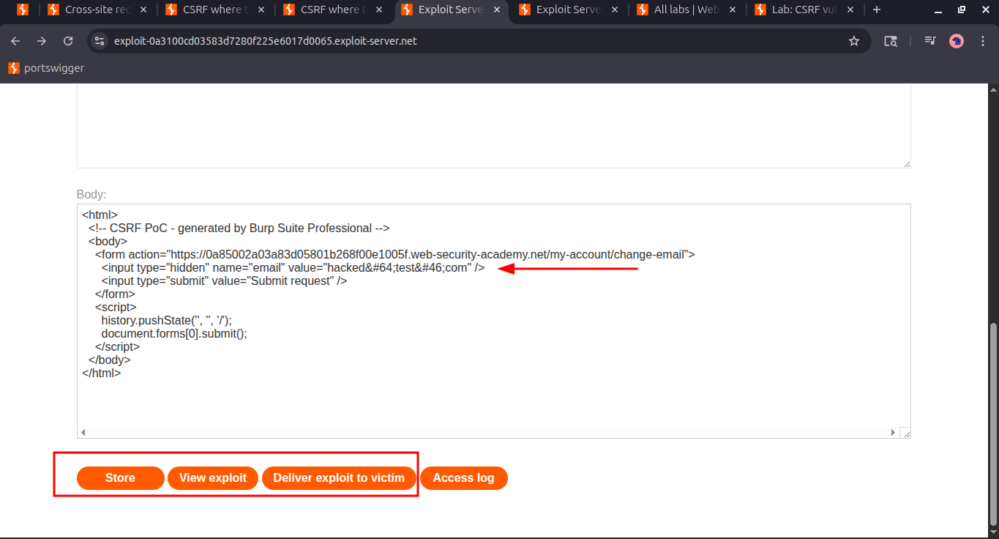
    
- Click **"View exploit"** to test it on yourself.
    - Check the resulting **HTTP request and response**.
- Change the email address in your payload so it’s **not your own**.

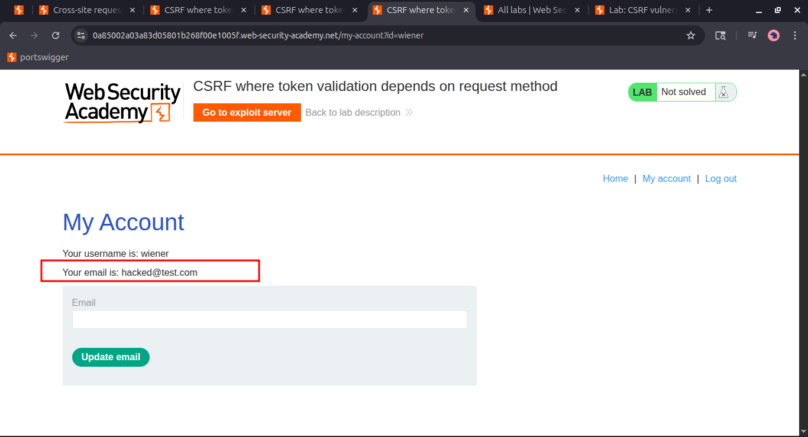

- **Store** the updated exploit.

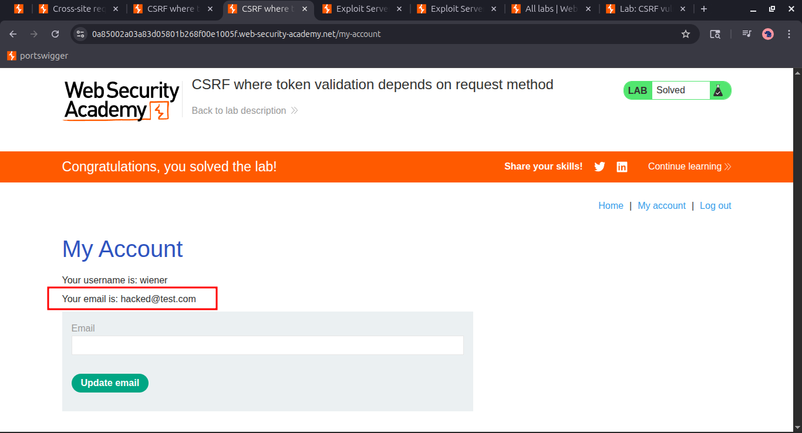

- Click **"Deliver to victim"** to solve the lab.

---

## **🫂 Community solutions**

> [**https://youtu.be/Rmpjoq7_tpE](https://youtu.be/Rmpjoq7_tpE)
[https://youtu.be/TpriFEAMAqI](https://youtu.be/TpriFEAMAqI)**
>