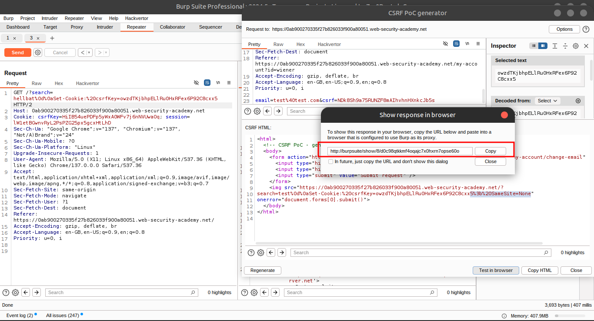

# Lab 5: CSRF where token is tied to non-session cookie

## 📝 Lab Description

This lab's email change functionality is vulnerable to CSRF. It uses tokens to try to prevent CSRF attacks, but they aren't fully integrated into the site's session handling system.

To solve the lab, use your **exploit server** to host an **HTML page** that uses a CSRF attack to **change the viewer's email address**.

---

## 👥 Account Credentials

You have two accounts on the application that you can use to help design your attack. The credentials are as follows:

```
wiener:peter
carlos:montoya
```

> 🔎**Hint**
You cannot register an email address that is already taken by another user.
If you change your own email address while testing your exploit, make sure you use a different email address for the final exploit you deliver to the victim.
> 

---

## 🧪 Step-by-Step Solution

- Open **Burp's browser** and **log in to your account**.
- Submit the **"Update email"** form, and find the resulting request in your **Proxy history**.
    
    
    


- Send the request to **Burp Repeater** and observe:
    - Changing the **session cookie** logs you out.
    - Changing the **csrfKey cookie** results in the CSRF token being rejected.
    - ✅ This suggests that the `csrfKey` cookie may not be strictly tied to the session.
        
        
        
        
        
        
        
- Open a **private/incognito browser window**, log in to your **other account**, and send a **fresh update email request** into Burp Repeater.
    
    
    
    
    
    

- Observe that:
    - If you **swap the csrfKey cookie and csrf parameter** from the first account to the second account, the request is accepted.
    - ✅ This confirms the vulnerability.
        
        
        
        
        
        
        
        
        
    
- Close the **Repeater tab** and **incognito browser**.
- Back in the **original browser**, perform a **search**.
    - Send the resulting request to **Burp Repeater**.
    - Observe that the **search term gets reflected in the `Set-Cookie` header**.
    - ✅ Since the **search function has no CSRF protection**, you can use this to **inject cookies into the victim user's browser**.
        
        
        
        
        
        
        
        
        
        
        

---

## 🧠 Cookie Injection Exploit

- Create a URL that uses this vulnerability to inject your csrfKey cookie into the victim's browser:

```jsx
/?search=test%0d%0aSet-Cookie:%20csrfKey=YOUR-KEY%3b%20SameSite=None
```

## 🛠 Exploit Construction

- Create and host a **Proof of Concept exploit** as described in the solution to the “CSRF vulnerability with no defenses” lab.
- Ensure that you include your **CSRF token** in the payload.
- Remove the **auto-submit `<script>` block**, and instead, add the following code to inject the cookie:

```html

```

- Change the **email address** in your exploit so that it **doesn't match your own**.
    
    
    
    
    
    
    
    

---

## 🚀 Final Steps

- **Store** the exploit on your **exploit server**.
- Click **"Deliver to victim"** to solve the lab.


