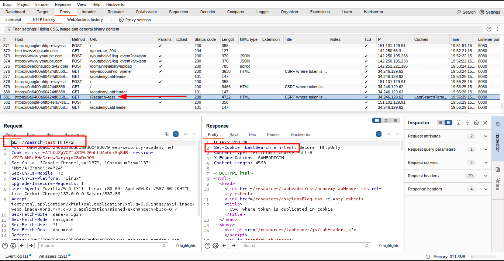

# Lab 6: CSRF where token is duplicated in cookie

### 📝 **Overview**

This lab's email change functionality is **vulnerable to Cross-Site Request Forgery (CSRF)**. It uses the insecure **"double submit"** CSRF prevention technique, which can be bypassed.

### 🎯 **Objective**

Use your **exploit server** to host an HTML page that performs a **CSRF attack** to change the victim’s email address.

### 🔑 **Test Credentials**

You can log in to your own account using:

- **Username**: `wiener`
- **Password**: `peter`

### 💡 **Hint**

- You **cannot register an email address** that is already in use.
- While testing your exploit, change your **own** email address to ensure it works.
- When delivering the **final exploit** to the victim, make sure to use a **new, unique** email address.

### ✅ **Steps to Reproduce and Exploit**

1. **Login and Intercept Request**
    
    Open Burp’s browser and log in using:
    
    - **Username**: `wiener`
    - **Password**: `peter`
        
        Submit the **"Update email"** form and capture the request in **Burp Proxy history**.
        
        
        
2. **Analyze Token Validation**
    - Send the request to **Burp Repeater**.
    - Observe that the `csrf` body parameter is simply validated by comparing it to the `csrf` cookie.
        
        
        
        
        
        
        
        
        
3. **Find Injection Point via Search**
    - Perform a **search** on the site.
    - Send the search request to **Repeater** and inspect the response.
    - Confirm that the **search term** is reflected in the `Set-Cookie` header (indicating a header injection vulnerability).
4. **Craft Cookie Injection URL**
    
    Create a URL to inject a fake CSRF token:
    
    ```html
    
    ```
    
    
    
    
    
    
    
5. **Prepare the Exploit HTML**
    
    Use the **"Change Email"** request structure with CSRF token set to `fake`.
    
6. **Inject Cookie & Auto-Submit Form**
    
    Replace the `<script>` tag with an `` tag that injects the cookie and submits the form:
    
    ```html
    
    ```
    
    
    
    
    
7. **Use a Unique Email Address**
    
    Ensure the `email` in your payload is **not the same** as your own (e.g., `test5@wiener.com`).
    
8. **Deliver the Exploit**
    
    Host the HTML on your **exploit server**, click **"Store"**, and then **"Deliver to victim"** to complete the lab.
    

---

### 🧾 **Final Exploit Code (CSRF PoC)**

```html
<html>
  <body>
    <form action="https://0a6400a60424d83580dd03ad00490079.web-security-academy.net/my-account/change-email" method="POST">
      <input type="hidden" name="email" value="test5@wiener.com" />
      <input type="hidden" name="csrf" value="test" />
    </form>
    
  </body>
</html>
```


