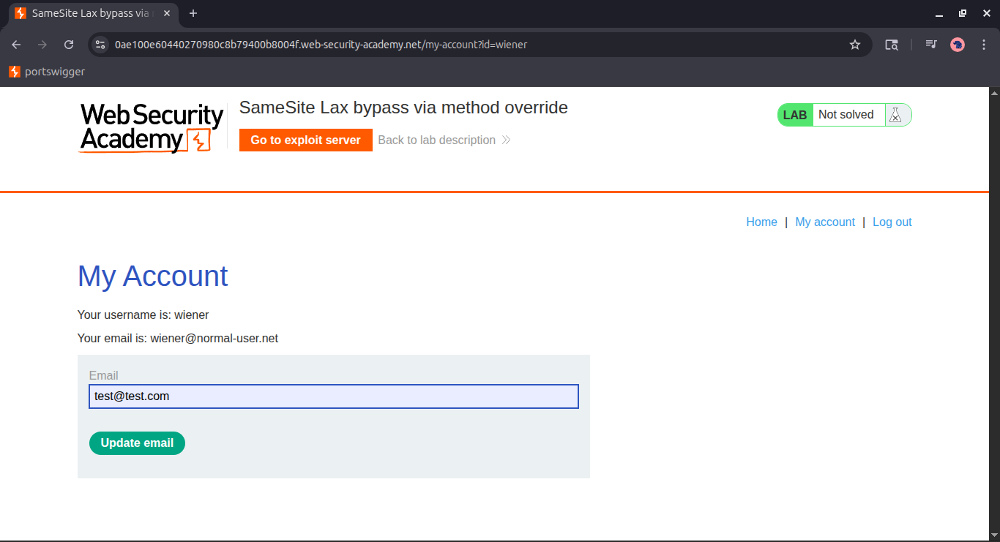
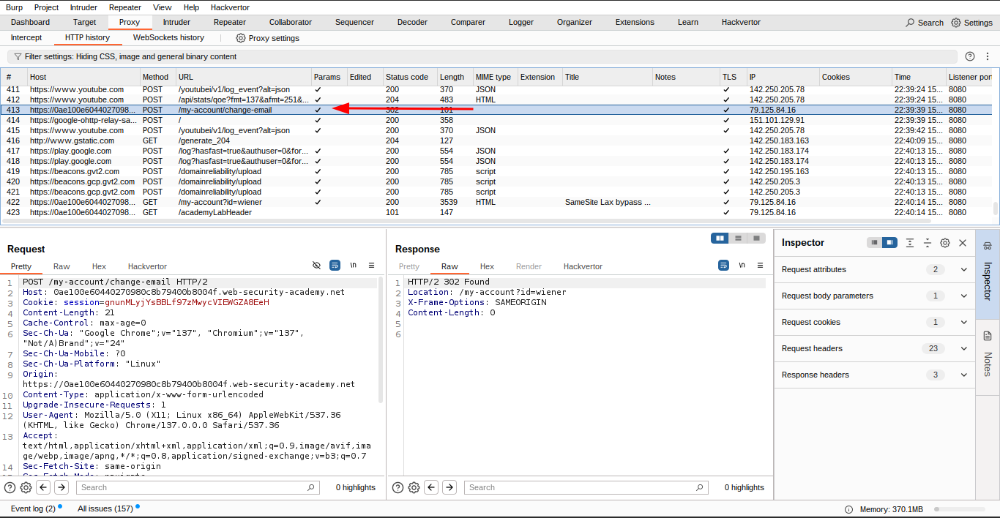
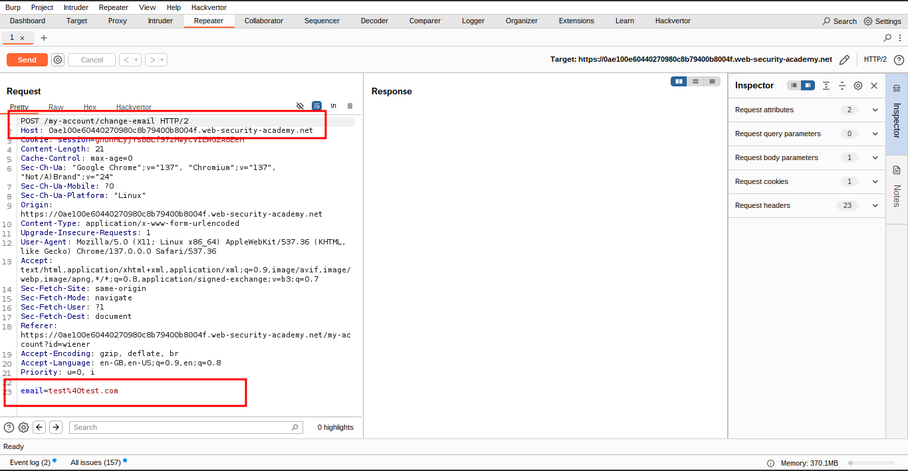
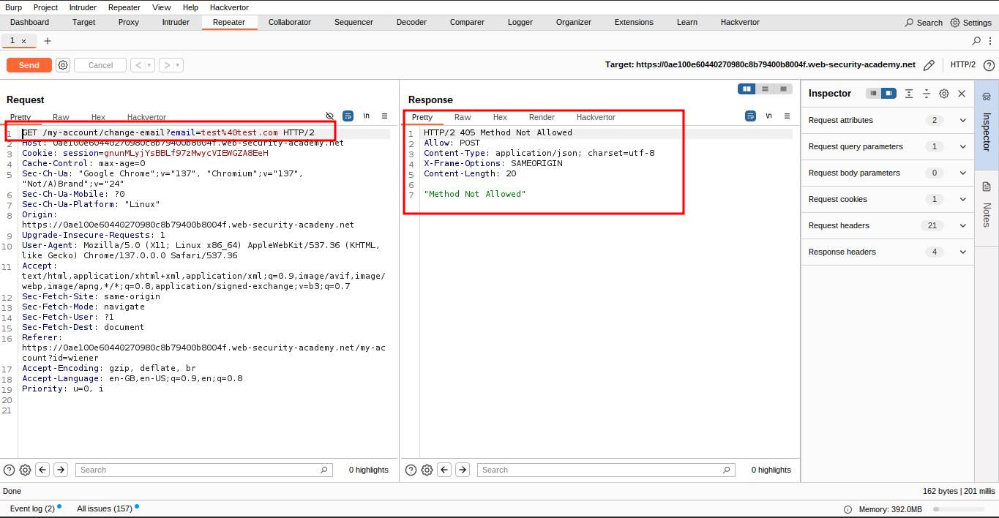
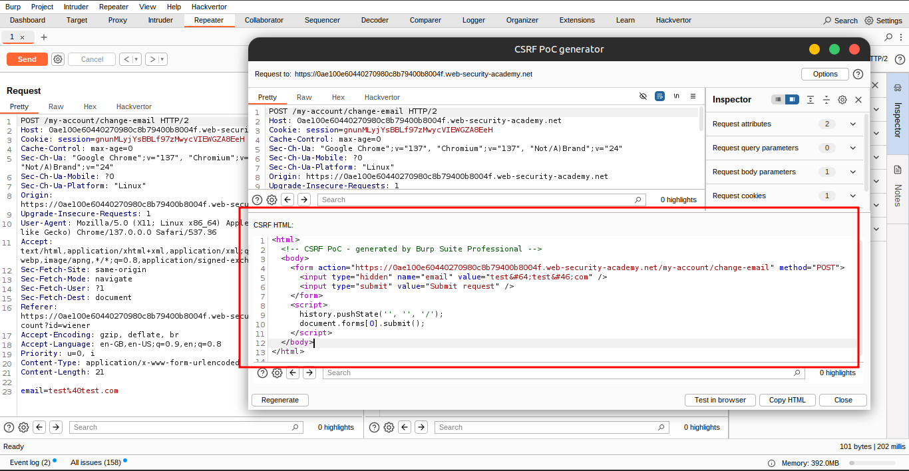
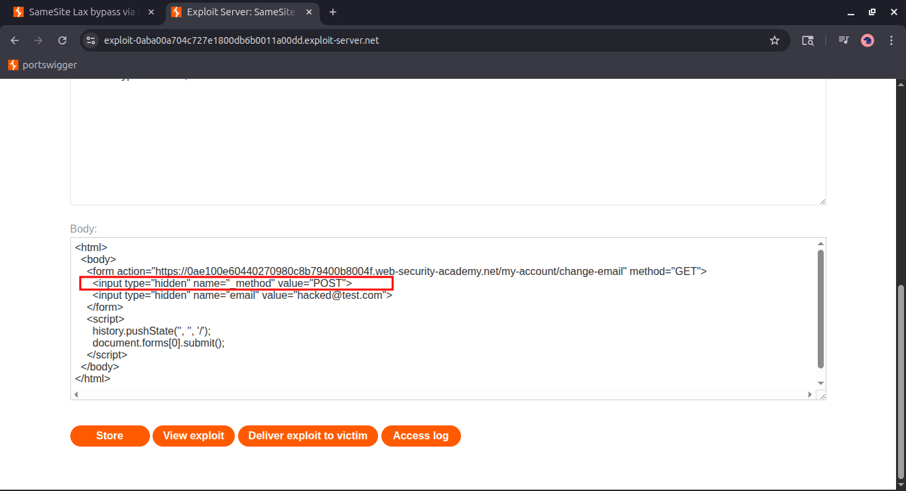
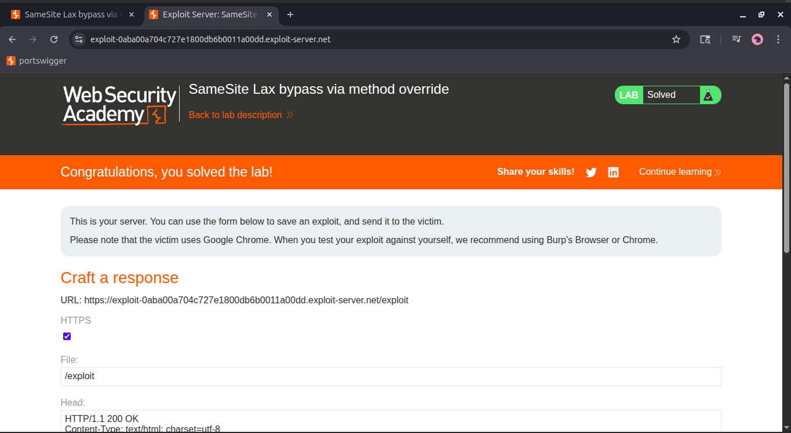

# Lab 7: SameSite Lax bypass via method override

### 🎯 Objective:

Exploit a CSRF vulnerability to change the victim’s email address by delivering a malicious payload via the exploit server.

---

## 📝 Step-by-Step Solution

### 🔍 1. Study the Change Email Function

- **Login to the lab** using credentials:
    
    ```
    Username: wiener
    Password: peter
    
    ```
    
- **Change your email address** via the UI to observe the request pattern.
- **In Burp Suite:**
    - Go to **Proxy > HTTP History**.
    - Locate the `POST /my-account/change-email` request.
    - Observe:
        - The request contains only the `email` parameter.
        - No CSRF token or unpredictable parameter is present.
        - This indicates a potential vulnerability.
    
    
    
    
    
    
    

---

### 🍪 2. Analyze Cookie Behavior (SameSite)

- Examine the `Set-Cookie` header in the **POST /login** response.
- Observe that the **`SameSite` attribute is not explicitly set**, so the browser defaults to `SameSite=Lax`.
- **SameSite=Lax behavior:**
    - Cookies *are* sent with **top-level GET navigations** (i.e., when clicking links or auto-submitting forms).
    - Cookies *are not* sent with **cross-site POST** requests.
- This limitation can be bypassed using **method override**.
    
    
    

---

### 🔁 3. Confirm Method Override Vulnerability

- **Send the original POST request** (`/my-account/change-email`) to **Burp Repeater**.
- **Right-click** the request → **Change request method** → Switch to **GET**.
- Send the GET request as:
    
    ```
    GET /my-account/change-email?email=foo%40web-security-academy.net&_method=POST HTTP/1.1
    ```
    
- **Observe the result:**
    - Server accepts the request.
    - Email is successfully updated.
    - Confirms method override via `_method=POST` is supported.

---

### 🧪 4. Test the Exploit on Yourself

- **Go to the exploit server**.
- Use the following script to trigger the request as a top-level navigation:
    
    ```html
    <script>
        document.location = "https://YOUR-LAB-ID.web-security-academy.net/my-account/change-email?email=pwned@web-security-academy.net&_method=POST";
    </script>
    
    ```
    
- **Click “Store” and then “View exploit”**.
- Check your email in the account page – it should now be updated to `pwned@...`.
- ✅ This confirms the CSRF attack works.

---

### 📤 5. Final Exploit: Auto-submitting Form Payload

Instead of JavaScript redirection, use a form that auto-submits on page load for more realism and reliability:

```html
<html>
  <body>
    <form action="https://YOUR-LAB-ID.web-security-academy.net/my-account/change-email" method="GET">
      <input type="hidden" name="_method" value="POST">
      <input type="hidden" name="email" value="attacker@evil.com">
    </form>
    <script>
      history.pushState('', '', '/');
      document.forms[0].submit();
    </script>
  </body>
</html>

```

Replace `YOUR-LAB-ID` with your actual lab domain.



---

### 💡 Why This Works:

- **SameSite=Lax** allows cookies on **top-level GET navigations** (such as viewing a malicious page).
- Although the request method is GET, the backend honors `_method=POST`, effectively making it a **CSRF-compatible POST**.
- Since **no CSRF token** is present, the site cannot distinguish this from a legitimate user request.

---

### 🧪 6. Deliver the Exploit

- **Update the email** in the payload to something different than your own (e.g., `victim@attacker.net`).
- **Click "Store" and then "Deliver exploit to victim"**.
- If successful, the victim's email will be changed.
- ✅ Lab solved!
    
    
    
    
    

---

## ✅ Conclusion

This lab demonstrates how **SameSite cookie behavior** combined with **HTTP method override** can be exploited in the absence of CSRF protections. By crafting a GET request that’s treated as a POST using `_method=POST`, we successfully changed the victim’s email.

Always ensure applications:

- Use **CSRF tokens**.
- Avoid allowing **method override** in unsafe contexts.
- Set **SameSite=Strict** where feasible.

## **🫂 Community solutions**

> [https://youtu.be/Jv-LXLID3VA](https://youtu.be/Jv-LXLID3VA)
[https://youtu.be/PEpByNZ31Jk](https://youtu.be/PEpByNZ31Jk)
>