# Lab 8: SameSite Strict bypass via client-side redirect

### 🎯 Objective:

Perform a CSRF attack that changes the victim's email address using a redirect gadget to bypass `SameSite=Strict` cookie restrictions.

---

## 🧩 Background Knowledge

- **CSRF (Cross-Site Request Forgery)** allows an attacker to perform unauthorized actions on behalf of an authenticated user.
- **SameSite Cookies** are used to restrict the inclusion of cookies in cross-origin requests.
    - `SameSite=Strict` **blocks cookies completely** in cross-site requests, **even for top-level navigations**.
- In this lab, we **bypass SameSite=Strict** using a **JavaScript-based redirect gadget** that initiates an **internal GET request**, allowing cookies to be sent.

---

## 📝 Step-by-Step Lab Solution

### 1. 🔍 Study the Change Email Function

- **Login to the application** as `wiener:peter`.
- **Navigate to your account** and change your email address.
- **In Burp Suite:**
    - Go to **Proxy > HTTP history**.
    - Locate the `POST /my-account/change-email` request.
    - **Observe**:
        - Request only includes `email=...` and `submit=1`.
        - **No CSRF token** is used.
        - Suggests CSRF is possible **if we can bypass cookie restrictions**.
- Check the **`Set-Cookie`** response in the login:
    - **SameSite=Strict** is explicitly set.
    - This **blocks session cookies** from being included in **any cross-site request**, even top-level GETs.
        
        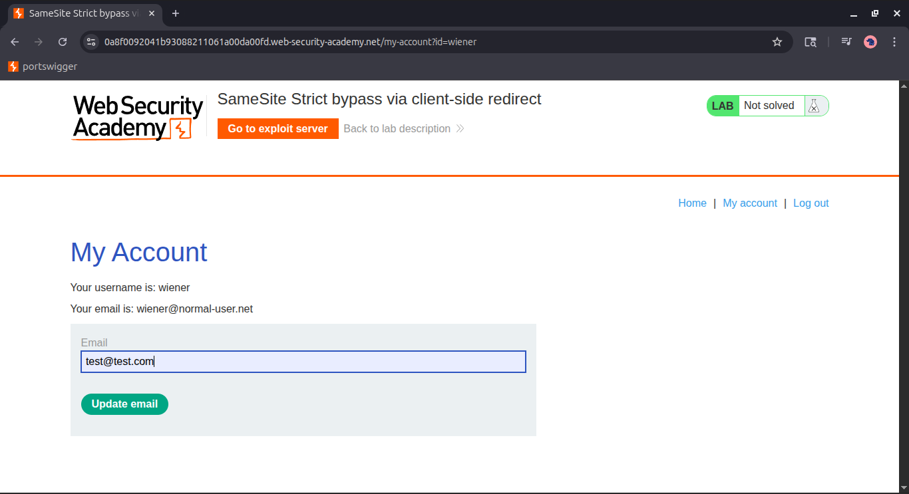
        
        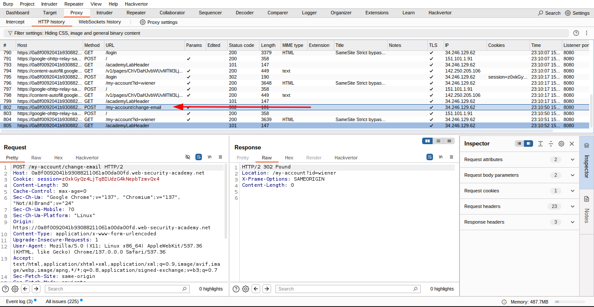
        
        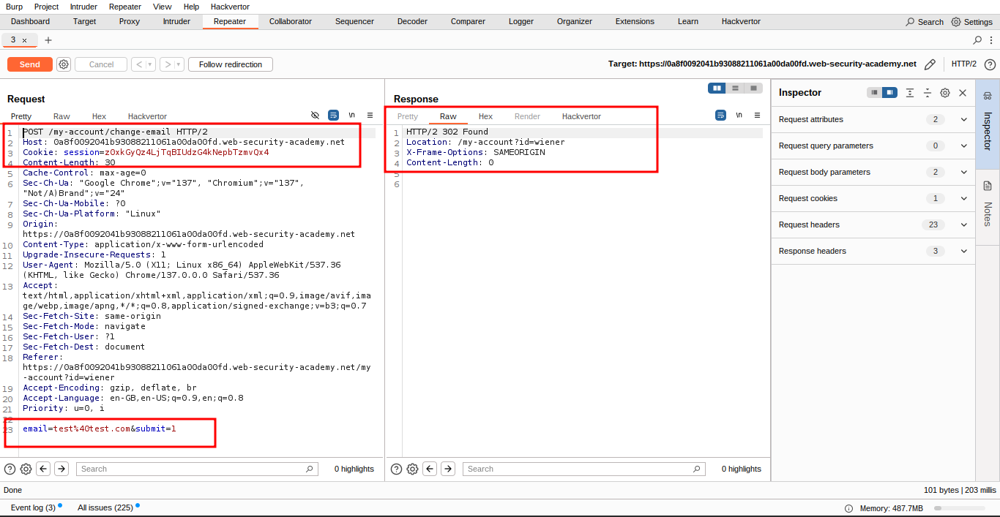
        
        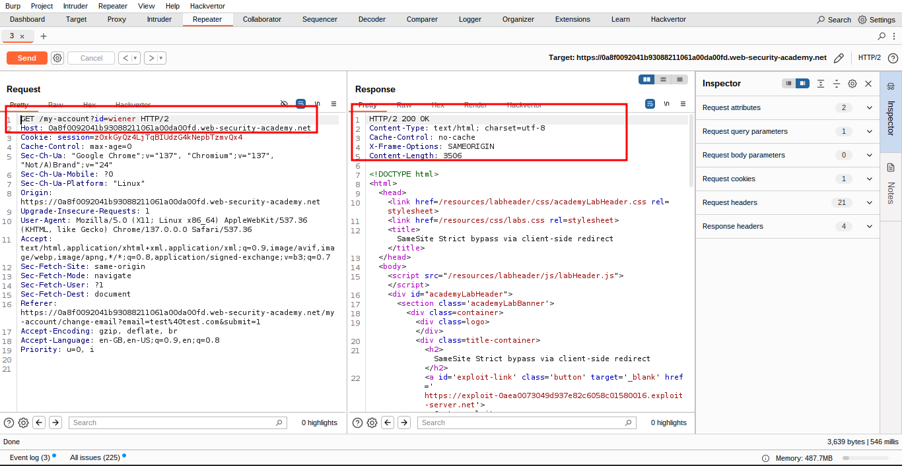
        

---

### 2. 🧩 Identify a Suitable Redirect Gadget

- **Post a comment** on a blog post.
- You are redirected temporarily to:
    
    ```
    /post/comment/confirmation?postId=2
    
    ```
    
- **Client-side JavaScript file** `/resources/js/commentConfirmationRedirect.js` is responsible for redirecting.

### Analyze the behavior:

- JavaScript reads the `postId` parameter and redirects the user:
    
    ```
    /post/comment/confirmation?postId=foo → redirects to /post/foo
    
    ```
    
- **Try path traversal**:
    
    ```
    /post/comment/confirmation?postId=1/../../my-account
    
    ```
    
- **Result**: Browser redirects to `/my-account`.

✅ **Confirmed**: This gadget can be used to trigger **internal navigations** to **any endpoint**, including CSRF targets.

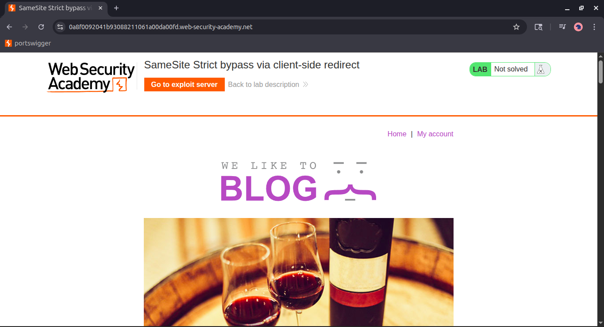

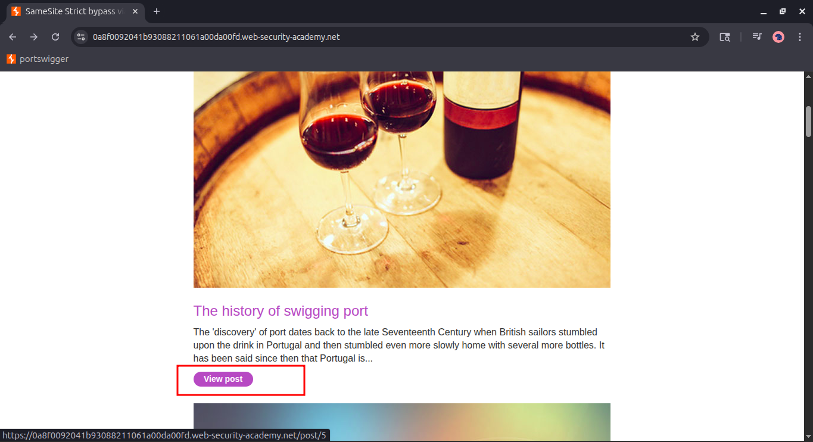

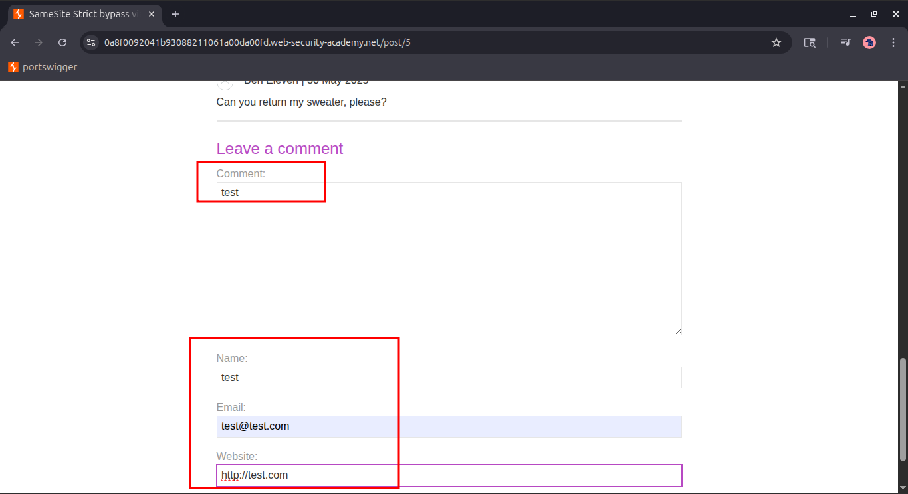

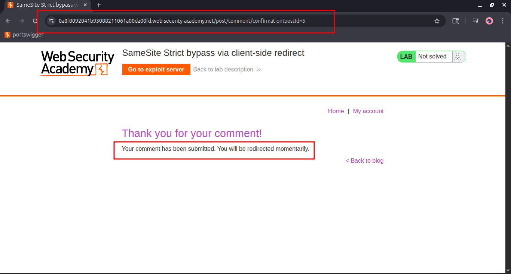

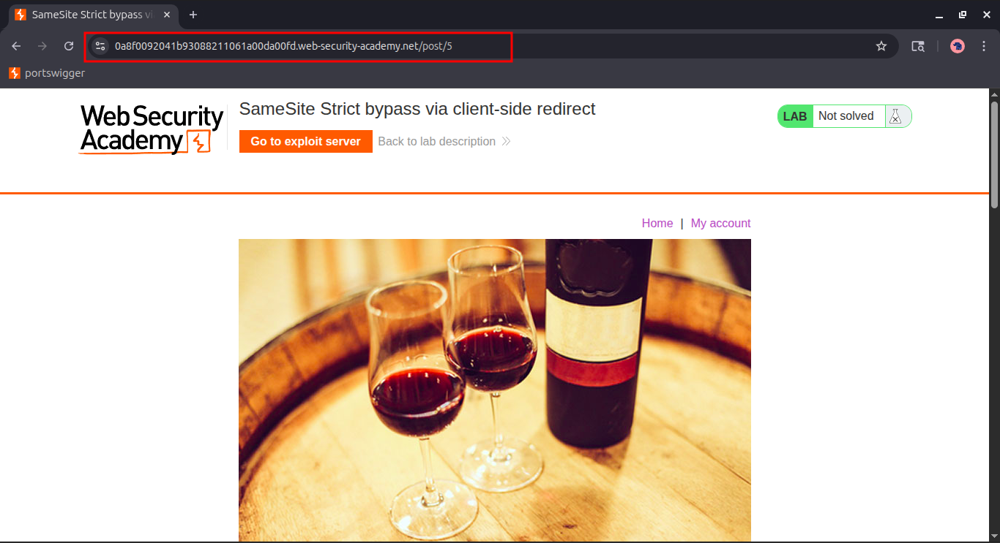

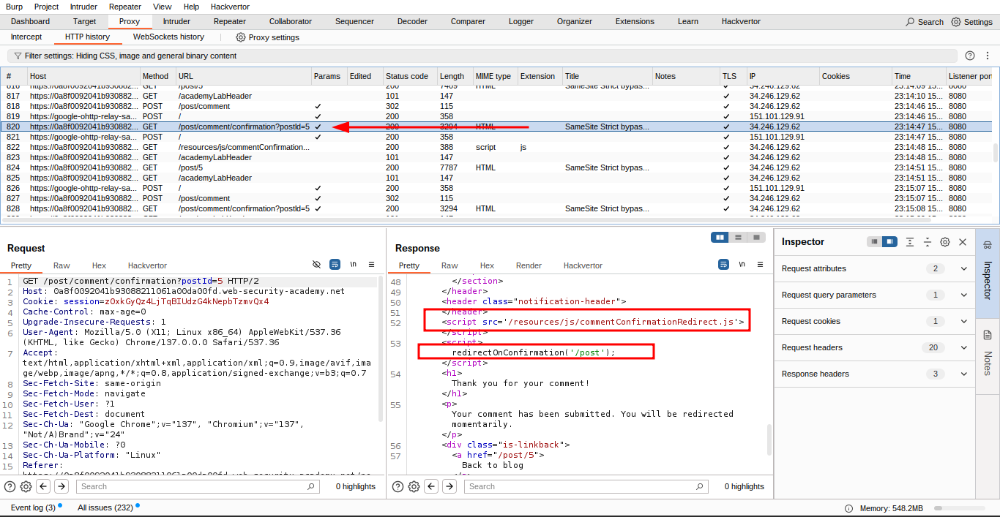

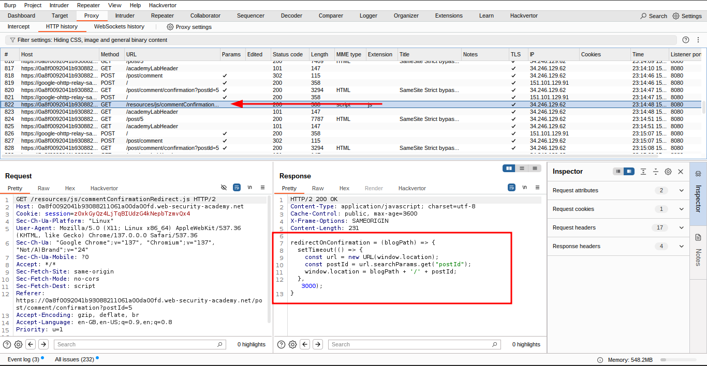

---

### 3. 🎯 Craft the CSRF Exploit

- **Send the `POST /my-account/change-email` request** to Burp Repeater.
- Right-click → **Change request method** to `GET`.
- Burp converts to:
    
    ```
    GET /my-account/change-email?email=your@evil.com&submit=1
    
    ```
    
- **Send it** and confirm the server accepts GET-based email change.
    
    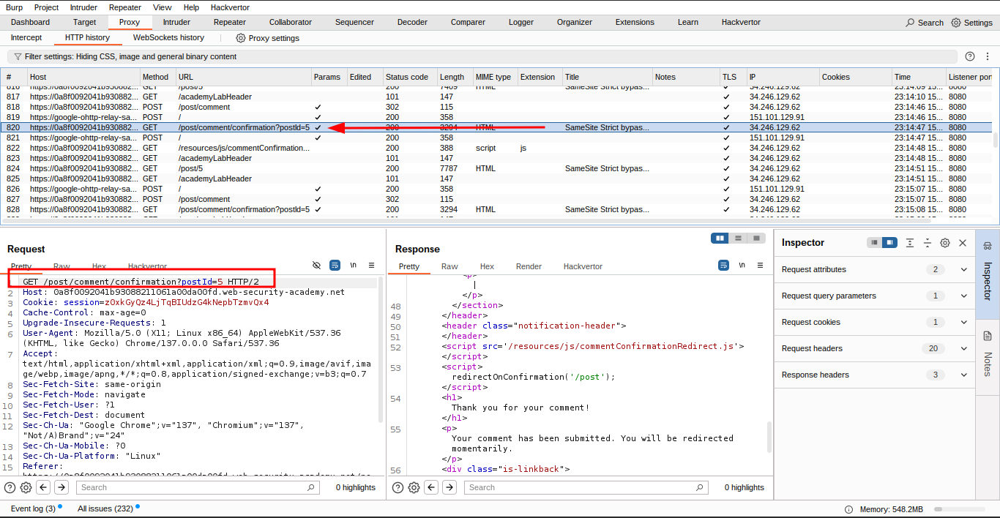
    
    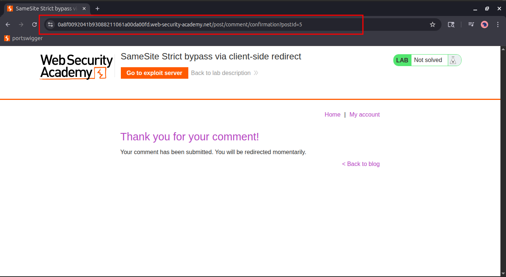
    

---

### 4. 🧨 Build the Final Exploit Payload

Use the redirect gadget to send a forged internal GET request:

```html
<script>
  document.location = "https://YOUR-LAB-ID.web-security-academy.net/post/comment/confirmation?postId=1/../../my-account/change-email?email=pwned%40web-security-academy.net%26submit=1";
</script>

```

### Notes:

- The **email is URL-encoded** (`%40` = `@`).
- The **ampersand (`&`)** is encoded as `%26` to **stay within the `postId` parameter**.

---

### 5. ✅ Test and Deliver the Exploit

- **Test the exploit** by storing it and viewing it from the exploit server.
- Go to your account → verify the email was changed to `pwned@...`.
- **Update the email** to something unique like:
    
    ```
    victim123@attacker.net
    ```
    
- **Store** and **deliver the exploit** to the victim.

🎉 **Lab Solved!**

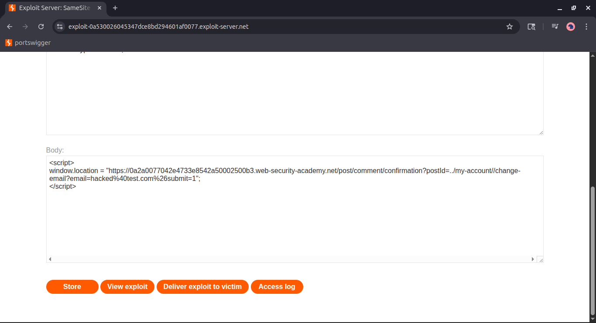

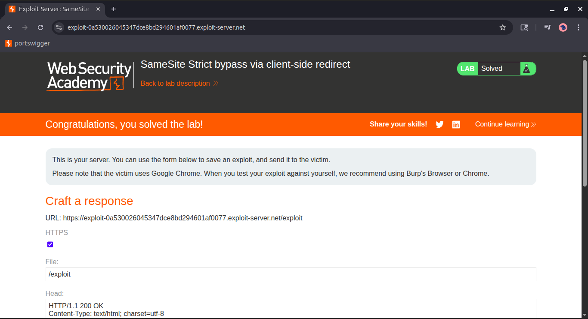

---

## 💡 Why This Works

- `SameSite=Strict` blocks cookies in cross-origin requests.
- The attacker’s site loads the **redirect gadget endpoint**, which then **performs an internal redirect using client-side JavaScript**.
- This **bypasses SameSite restrictions**, as the redirected request is:
    - **Same-origin**
    - **Automatically includes cookies**
- The backend **does not validate CSRF tokens** and **accepts GET for state-changing actions**.

## **💪 Community solutions**

> [https://youtu.be/UvUOrnY_4DQ](https://youtu.be/UvUOrnY_4DQ)
>