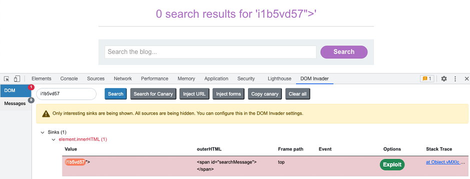

# 15. DOM Invader

### 🔧 What is DOM Invader?

DOM Invader is a **browser-based tool** designed to help security testers identify and exploit **DOM-based Cross-Site Scripting (DOM XSS)** vulnerabilities. It supports a wide range of attack vectors, including:

- Web message vulnerabilities (e.g., `postMessage()` abuse)
- Prototype pollution attack vectors
    
    
    

> ⚠️ Note: DOM Invader is exclusively available within Burp Suite's built-in browser and comes preinstalled as an extension.
> 

---

### 🧰 DOM Invader in Action: DevTools Integration

When enabled, DOM Invader adds a **new tab** to your browser’s Developer Tools, unlocking powerful testing capabilities:

---

### ⭐ Key Features

- **Interactive DOM XSS Testing:**
    - Like reflected XSS testing but enhanced for DOM contexts.
    - The augmented DOM view highlights controllable sinks on the page, clearly showing:
        - The XSS context.
        - How your input is sanitized.
- **Web Message Interception & Replay:**
    - Logs, modifies, and resends web messages sent via `postMessage()`.
    - Enables testing of DOM XSS through web messaging.
    - Can automatically send specially crafted web messages to probe for vulnerabilities.
- **Prototype Pollution Detection:**
    - Automatically detects client-side prototype pollution sources.
    - Scans for controllable gadgets passed to dangerous JavaScript sinks.
- **DOM Clobbering Identification:**
    - Detects DOM clobbering vulnerabilities which may be exploitable for XSS or other attacks.

---

### ⚙️ Configuration & Usage

DOM Invader is **highly configurable**, allowing you to fine-tune it according to different websites and testing scenarios.

- For setup instructions, see **Enabling DOM Invader**.
- For customizing options, see **DOM Invader Settings**.