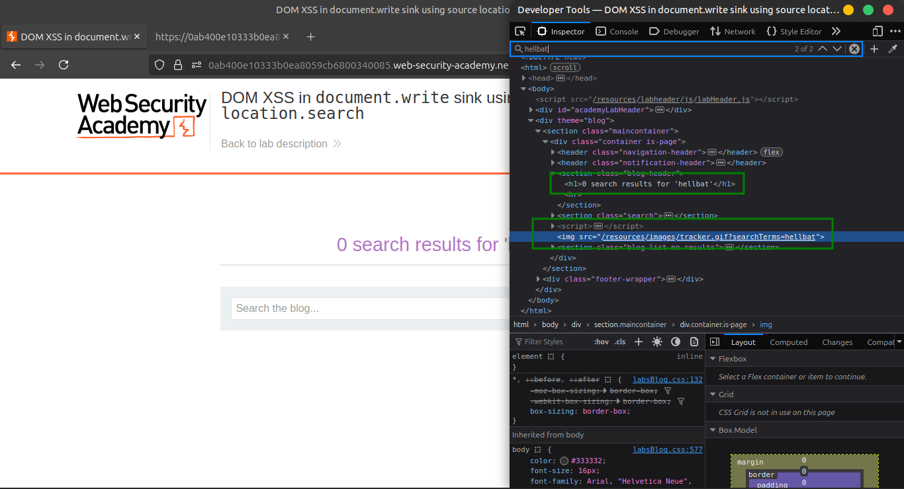
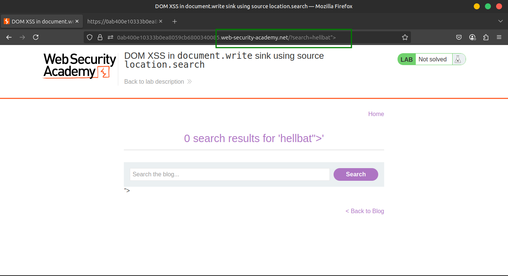
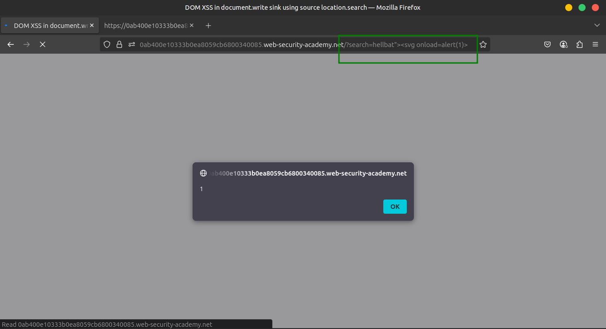
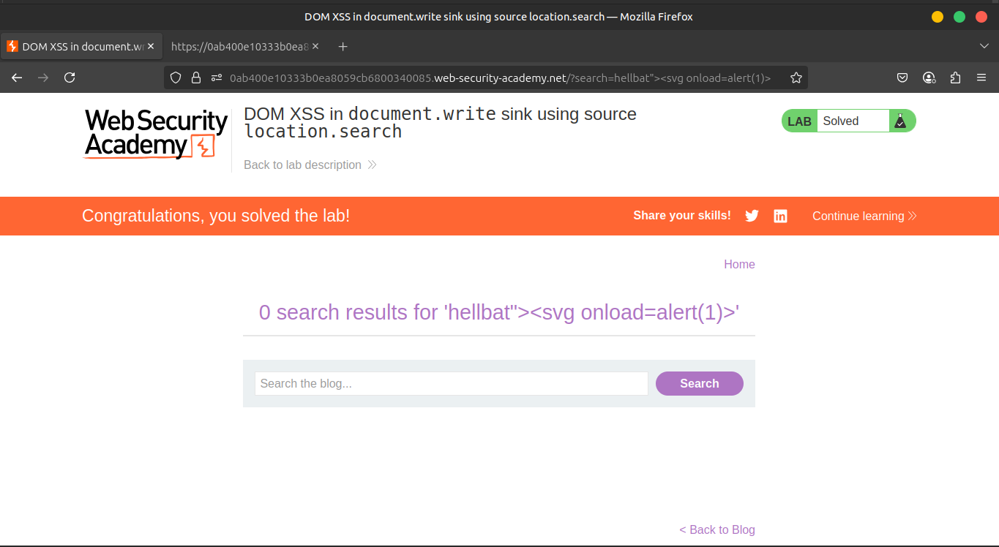

# Lab 1: DOM XSS in document.write sink using source location.search

## 🔍 Scenario

The lab application reflects user-controlled input from the search query (`location.search`) directly into the DOM using `document.write()`. This function is **dangerous** when handling untrusted input, especially when it’s used to construct HTML elements.

---

## 🪜 Steps to Exploit

### 1️⃣ Trigger the Vulnerable Functionality

- Go to the **search box** on the site.
- Enter any **random alphanumeric string**, like:

```
test123
```




### 2️⃣ Inspect the Rendered Output

- Right-click and **inspect** the resulting HTML using Developer Tools.
- You will see something similar to:

```html

```

- Your input is being **reflected inside an `` tag's `src` attribute**, constructed dynamically via `document.write()`.
    
    
    

---

## 💥 Exploiting the XSS

### 🔓 Injection Payload

To break out of the attribute and inject a scriptable HTML tag:

```
"><svg onload=alert(1)>
```





### 🧪 Full Example

Navigate to the lab and use this crafted URL:

```
https://YOUR-LAB-ID.web-security-academy.net/?search="><svg onload=alert(1)>
```

- This closes the `src` attribute in the `img` tag
- Starts a new `<svg>` tag
- Triggers `onload=alert(1)` when the SVG loads

---

## ✅ Expected Result

- You should see a browser alert popup:
    
    ```
    1
    ```
    
- 🎉 **Lab is solved** once the alert is triggered.

---

## 🎥 Community Walkthrough

▶️ [Watch on YouTube](https://youtu.be/JZgqsijAa-s)