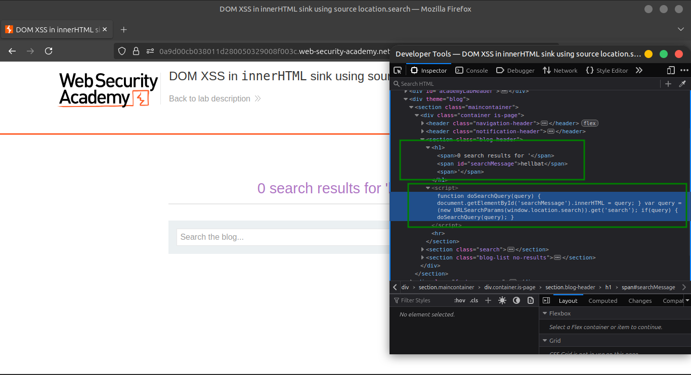
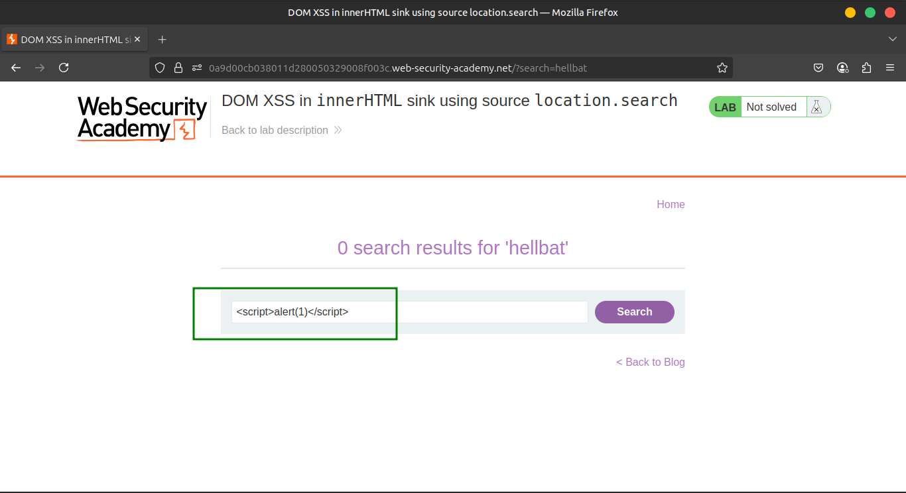
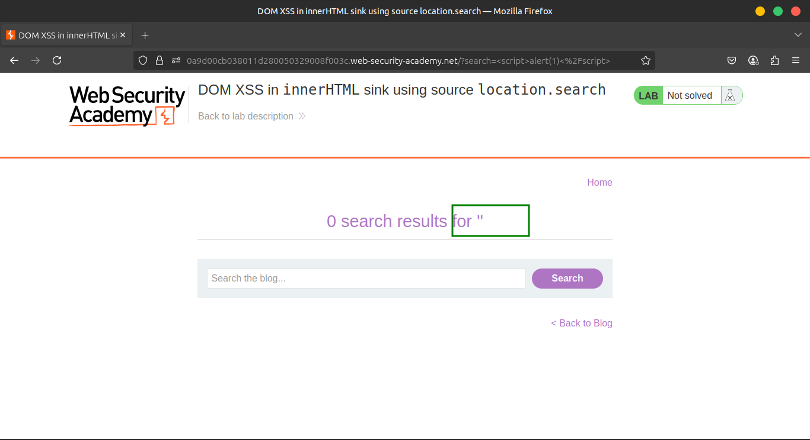
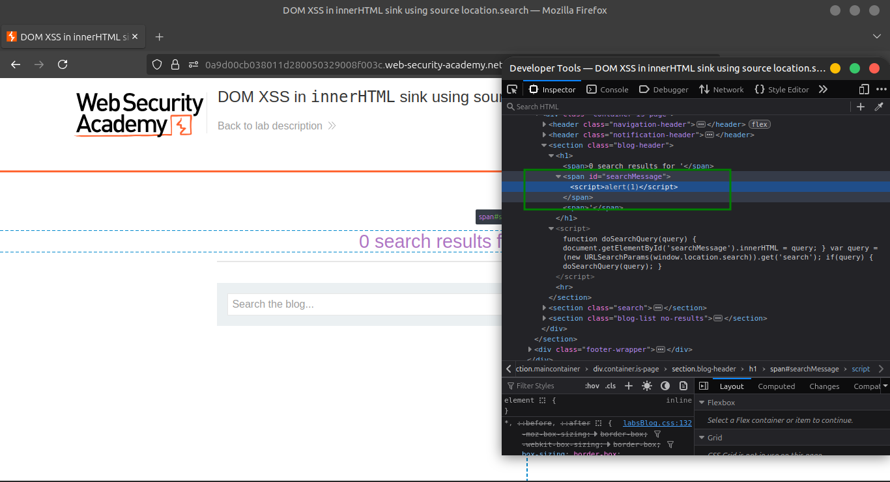
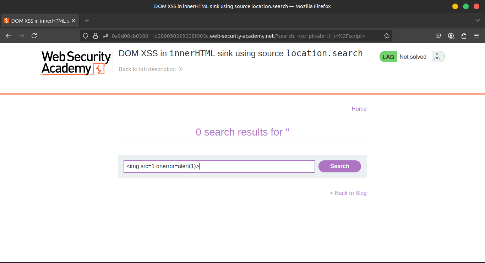
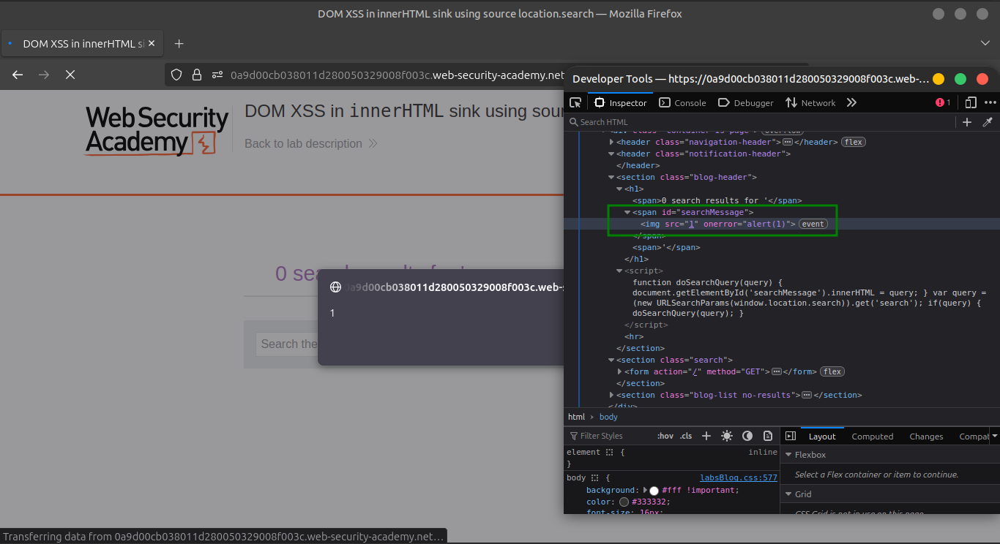

# Lab 3: DOM XSS in innerHTML sink using source location.search

## 🔍 Understanding the Vulnerability

- The application reads the search query from the URL’s query string (`location.search`).
- It then inserts this input **directly into the page’s HTML** using `innerHTML`.
- This allows injection of arbitrary HTML and JavaScript code.
- Because `innerHTML` parses HTML, malicious attributes such as `onerror` can be used to trigger JavaScript execution.

---

## 🪜 Steps to Exploit

### 1️⃣ Inject the Payload

Type the following into the search box:

```html

```










### 2️⃣ Execute the Search

- Click the **Search** button.
- The page attempts to load the invalid image source (`src=1`), which fails.
- The `onerror` event handler is triggered, executing `alert(1)`.





---

## ✅ Expected Behavior

- A popup alert with the number `1` should appear.
- This confirms successful exploitation of the DOM-based XSS vulnerability.


---

## 🎥 Community Solution

- [YouTube Walkthrough](https://youtu.be/Rf9OKtbYkeo)