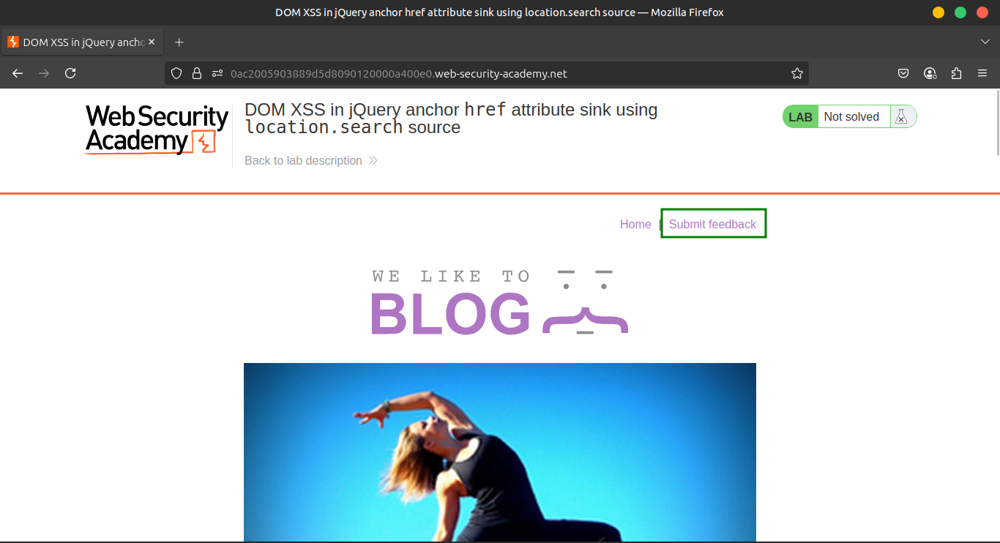
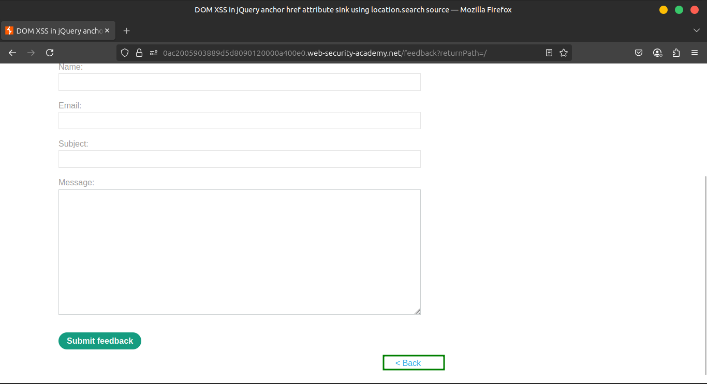
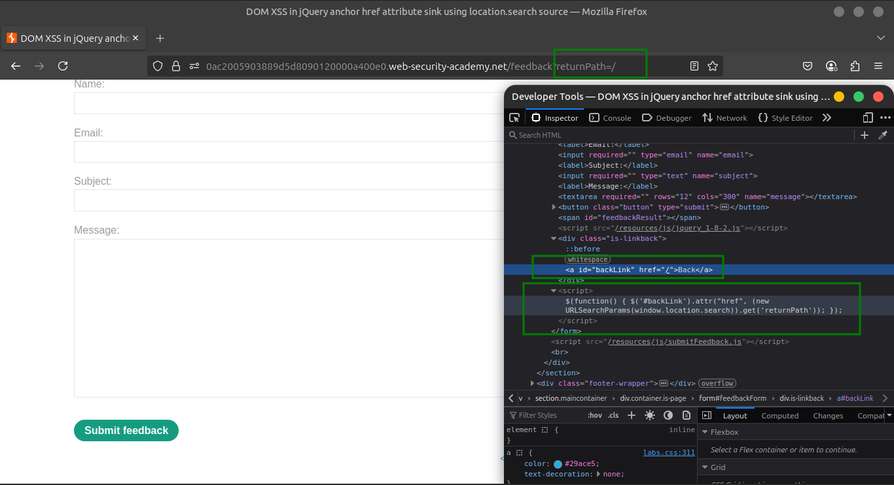
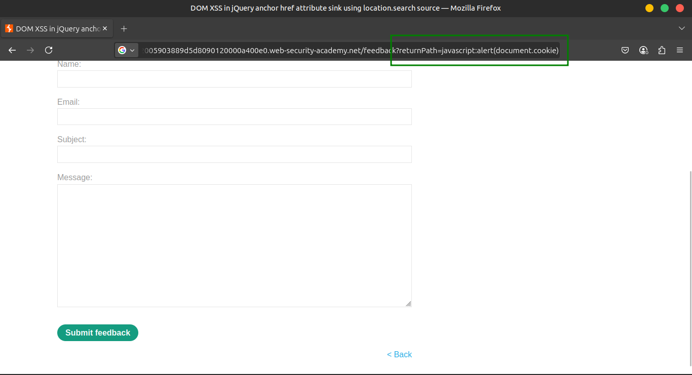
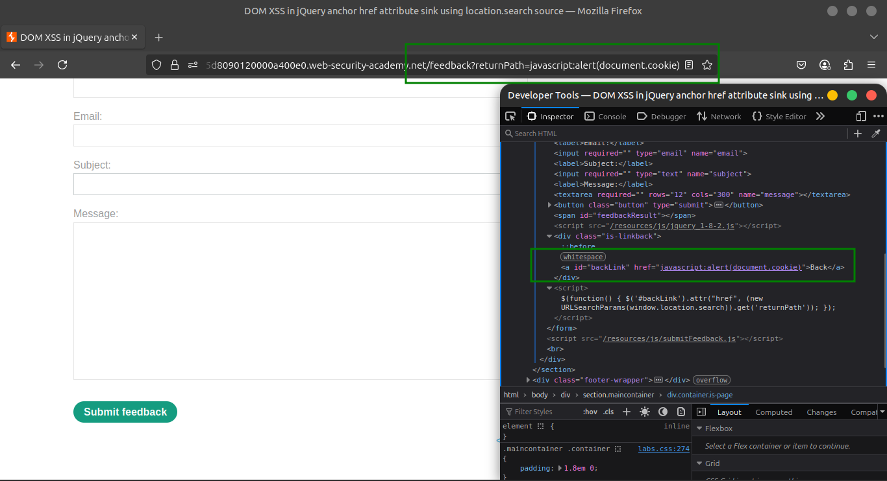
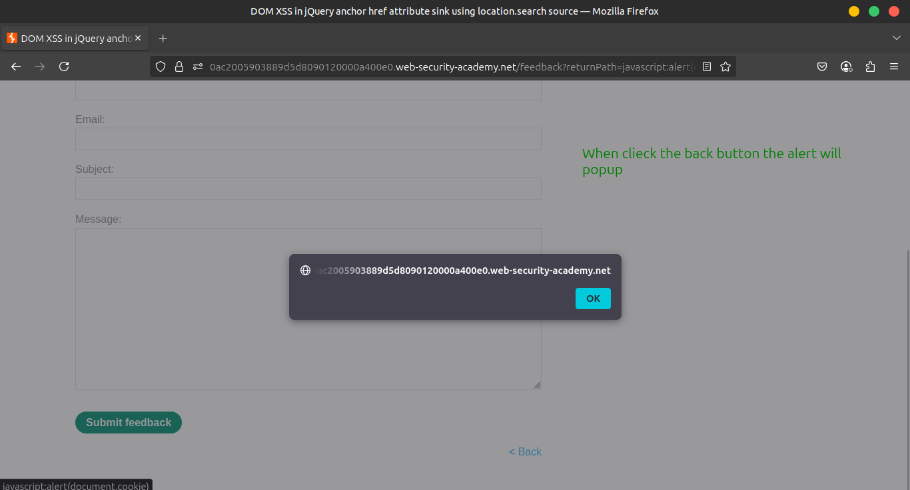
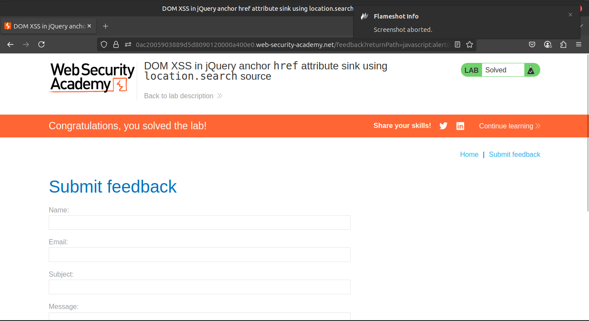

# Lab 4: DOM XSS in jQuery anchor href attribute sink using location.search source

## 🔍 Understanding the Vulnerability

- The Submit Feedback page uses jQuery's `$` selector to locate a **Back** link (`<a>` element).
- The `href` attribute of this link is set dynamically using the value from the URL’s `returnPath` query parameter.
- Since the input is not sanitized, injecting a `javascript:` URL can execute arbitrary JavaScript when the link is clicked.

---

## 🪜 Steps to Exploit

### 1️⃣ Inject a Random String

- Navigate to the Submit Feedback page.
- Append or modify the URL parameter `returnPath` to `/<random_alphanumeric_string>`.
- Right-click on the **Back** link and inspect it.
- Confirm your random string is set as the `href` value.







### 2️⃣ Inject the Malicious Payload

- Change the `returnPath` parameter to:

```
javascript:alert(document.cookie)

```

- Reload or hit enter.





### 3️⃣ Trigger the Payload

- Click the **Back** link.
- The browser executes the JavaScript in the `href`, showing an alert with the current `document.cookie`.



---

## ✅ Expected Result

- The alert box displays the current cookies, confirming successful XSS exploitation via the back link.



---

## 🎥 Community Solutions

- [YouTube Walkthrough](https://youtu.be/7WRZUZ4Pqn0)