# Lab 5: DOM XSS in jQuery selector sink using a hashchange event

## 🔍 Understanding the Vulnerability

- The home page contains JavaScript code that uses jQuery’s `$()` selector to auto-scroll to a post based on the URL fragment (`location.hash`).
- The `location.hash` value is not properly sanitized before being inserted into the DOM.
- This allows injection of malicious HTML/JS that executes in the victim’s browser.

---

## 🪜 Steps to Exploit

### 1️⃣ Review the vulnerable code

- Use Burp Suite or browser DevTools to analyze the home page JavaScript.
- Confirm that the page uses `location.hash` unsafely with jQuery.

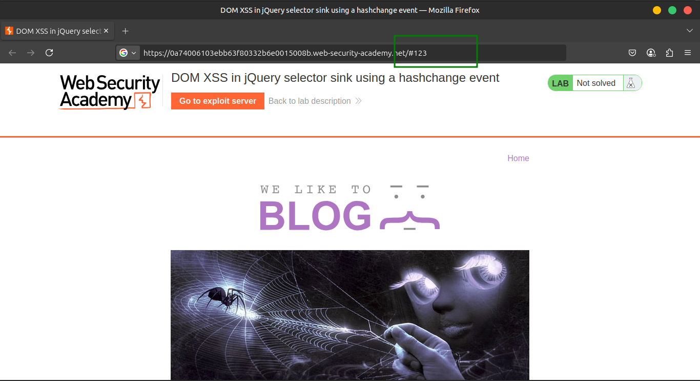

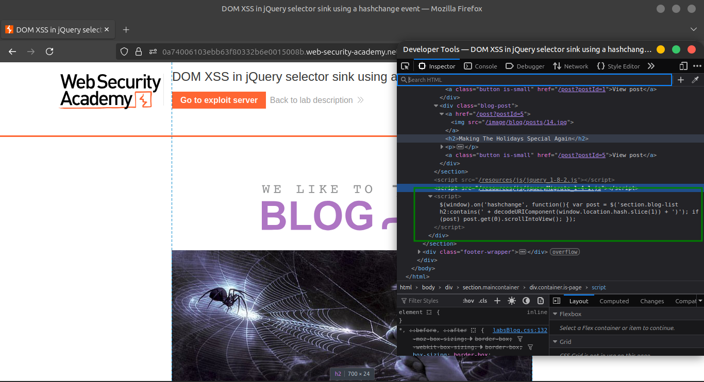

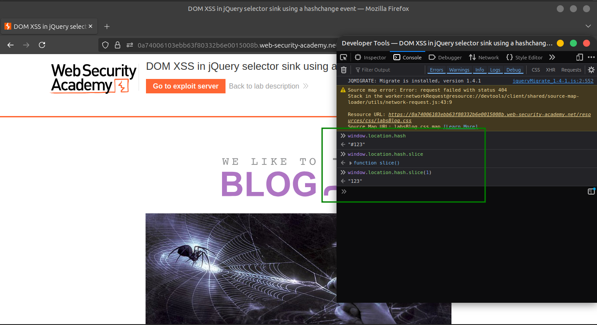

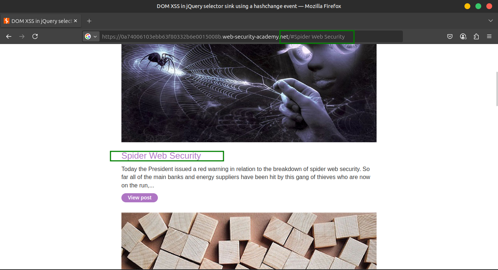

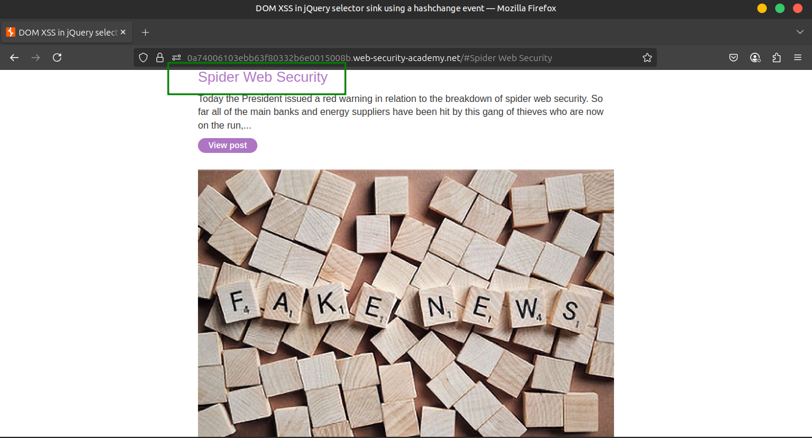

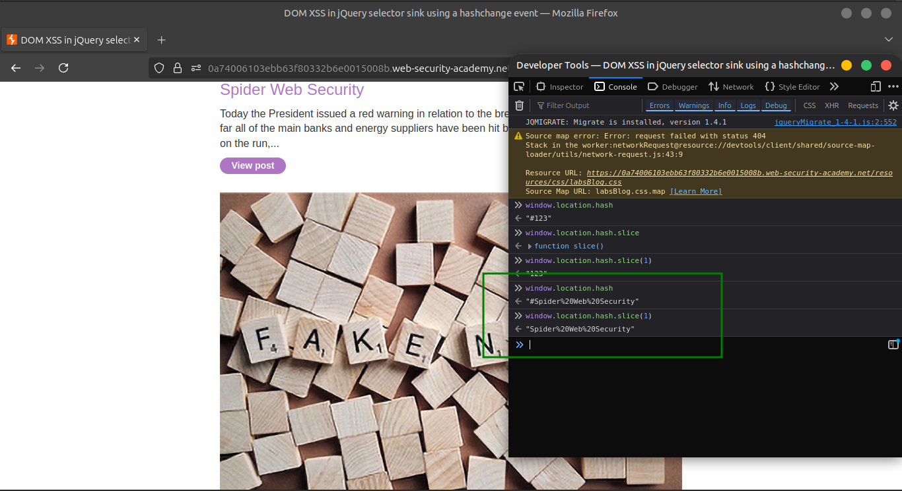

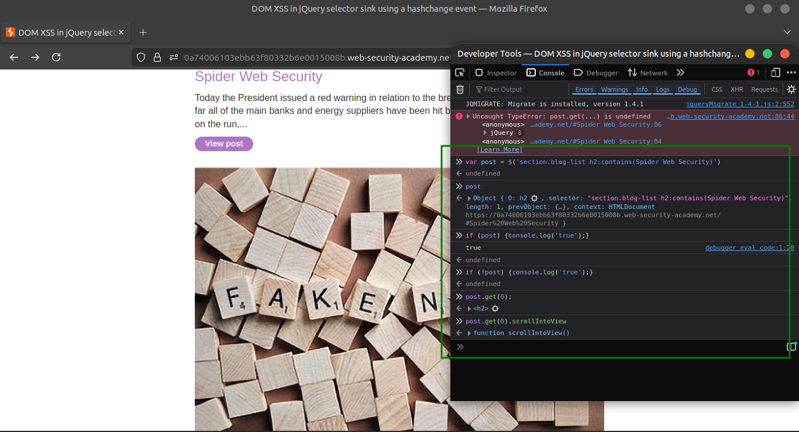

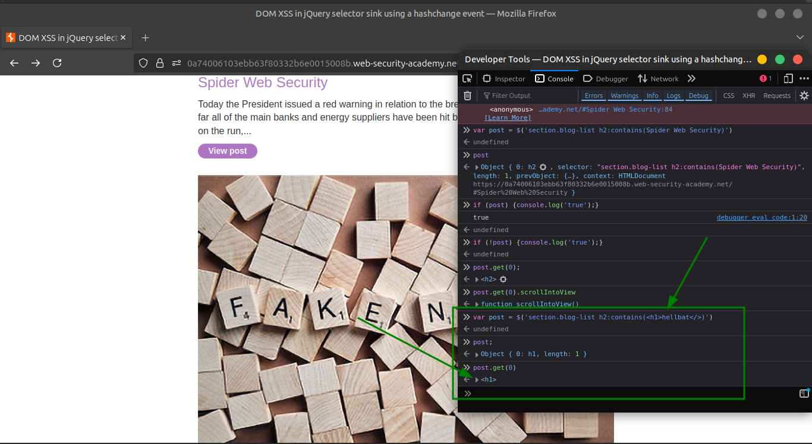

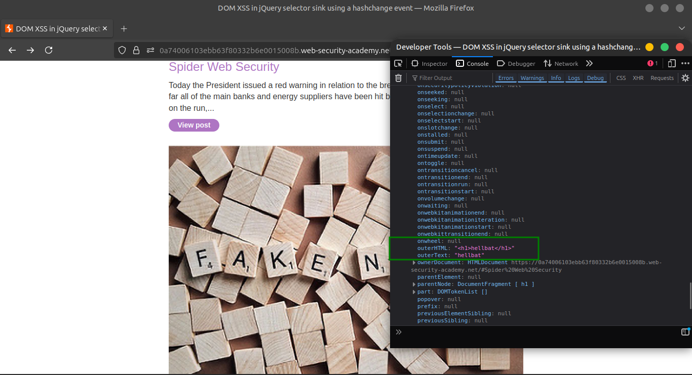

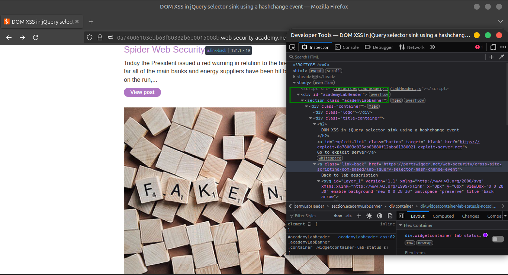

### 2️⃣ Create the malicious payload on the exploit server

- From the lab banner, open the exploit server.
- In the **Body** section, insert this iframe payload (replace `YOUR-LAB-ID` with your lab ID):

```html
<iframe src="https://YOUR-LAB-ID.web-security-academy.net/#" onload="this.src+=''"></iframe>
```

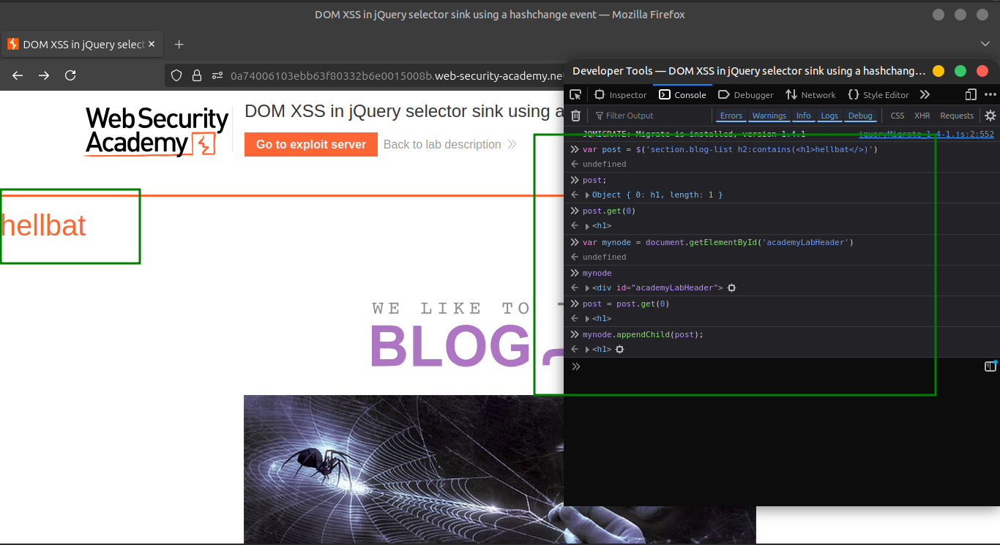

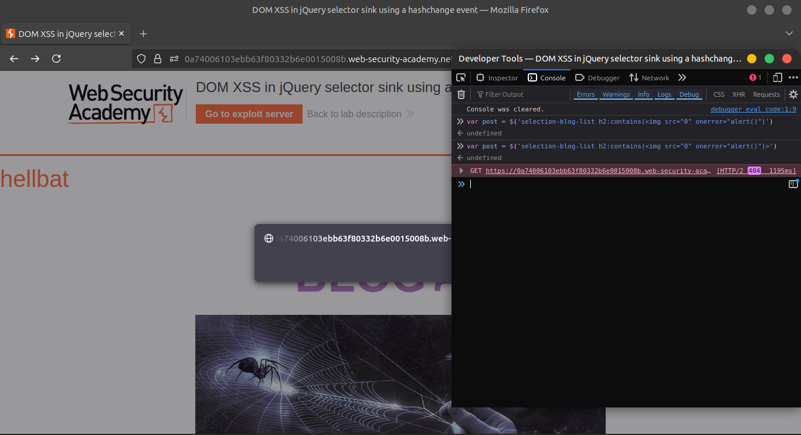

### 3️⃣ Test and deliver the exploit to the victim

- Click **Store** on the exploit server.
- Click **View exploit** to confirm that the `print()` function is called in your browser.
- Return to the exploit server and click **Deliver to victim**.
- When the victim loads the page, the `print()` function executes, solving the lab.

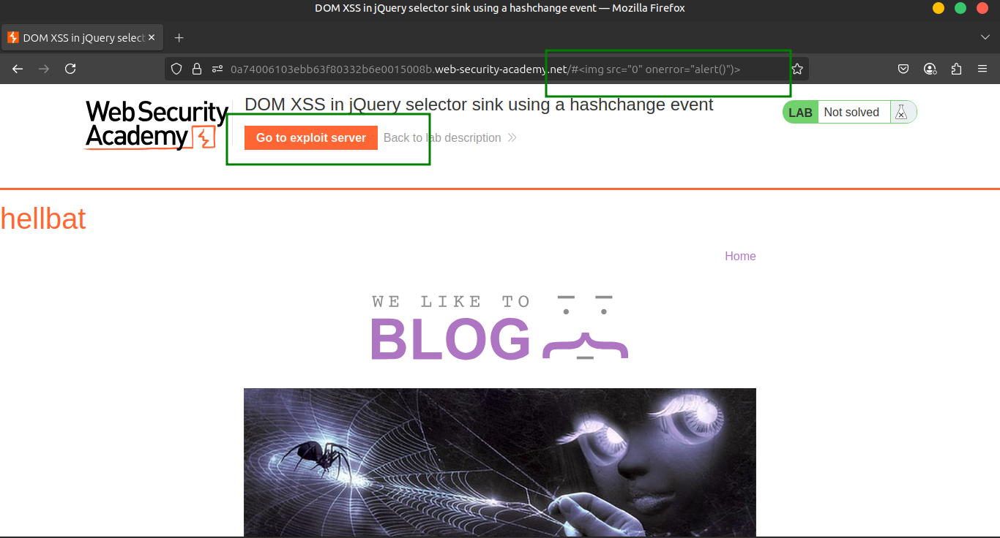

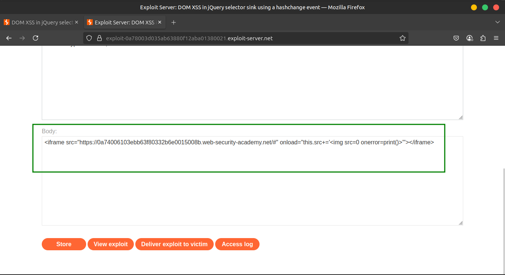

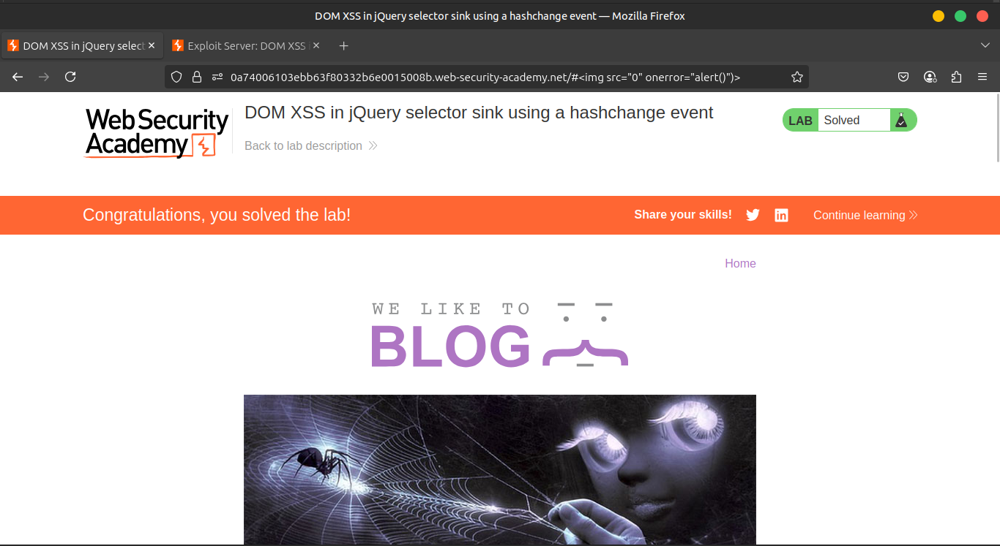

---

## ✅ Expected Result

- The victim’s browser triggers the `print()` dialog automatically, demonstrating successful XSS exploitation via DOM manipulation of `location.hash`.

---

## 🎥 Community Solution Video

- [Watch Exploit Walkthrough](https://youtu.be/5OiWO5Qr-iI)