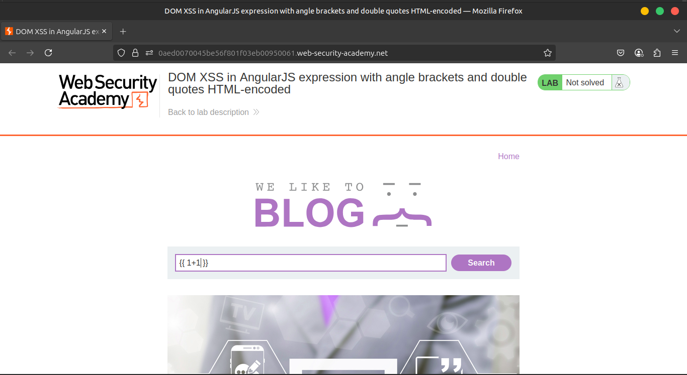
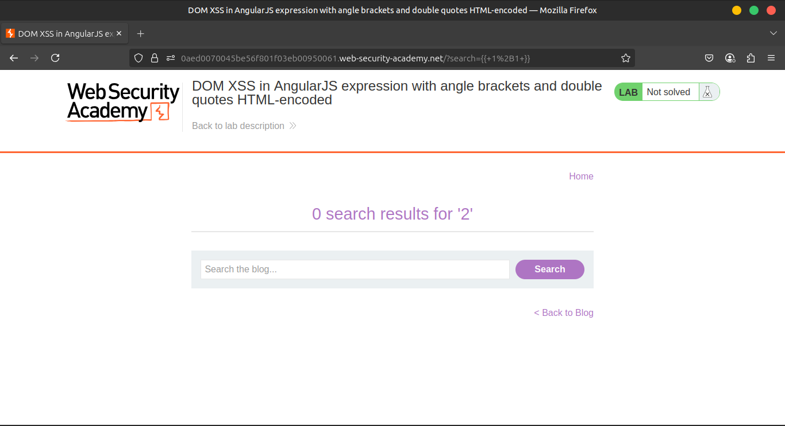
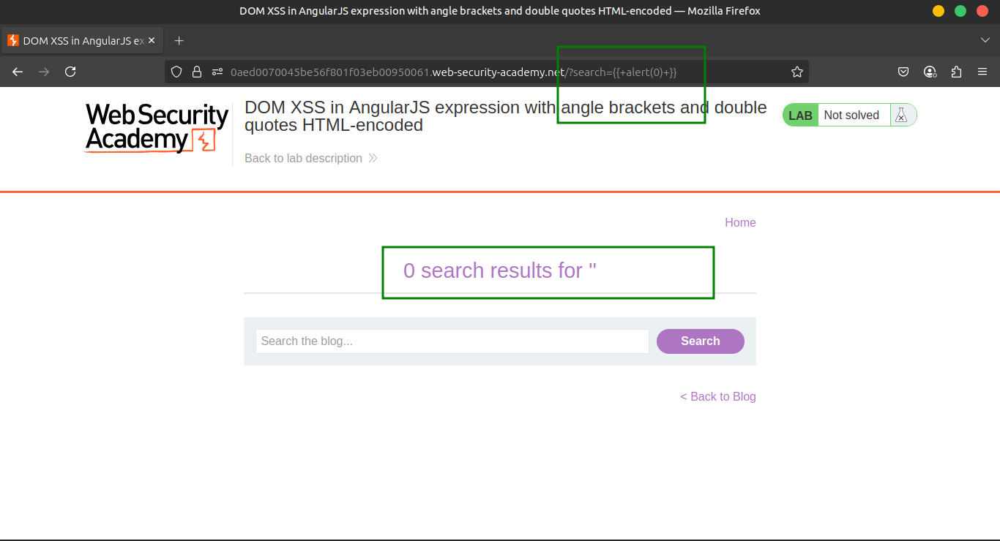
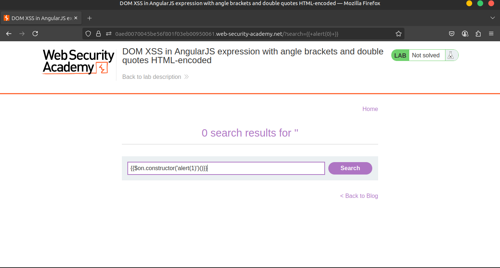
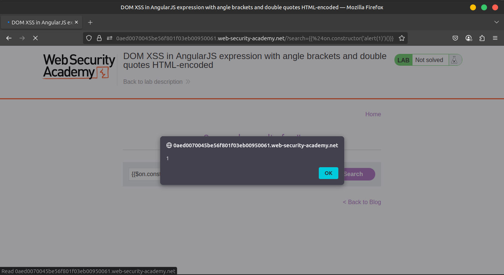
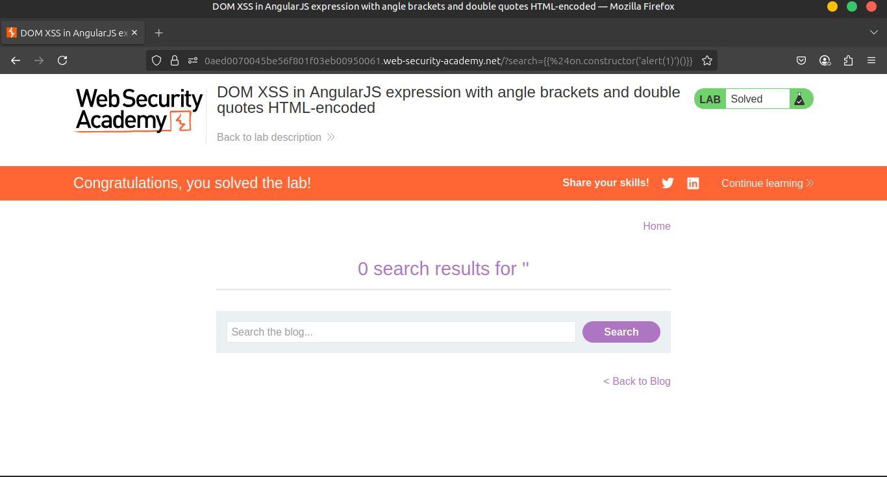

# Lab 6: DOM XSS in AngularJS expression with angle brackets and double quotes HTML-encoded

## 🔍 Understanding the Vulnerability

- The application uses AngularJS, which processes HTML elements with the `ng-app` attribute.
- AngularJS expressions inside double curly braces `{{ }}` are evaluated as JavaScript expressions.
- When user input is placed inside AngularJS expressions without proper sanitization, an attacker can inject malicious code.
- This bypasses typical HTML encoding since angle brackets `< >` are encoded but curly braces `{{ }}` are not.

---

## 🪜 Step-by-Step Solution

### 1️⃣ Initial Test

- Enter a random alphanumeric string into the search box.
- View the page source to confirm that your input is placed inside an AngularJS `ng-app` directive.







### 2️⃣ Inject Malicious AngularJS Expression

- Enter the following payload into the search box to execute JavaScript:

```jsx
{{$on.constructor('alert(1)')()}}
```

- Click **Search**.







## 📌 Overview: What’s happening?

The payload:

```jsx
{{$on.constructor('alert(1)')()}}
```

is an **AngularJS expression** that uses **JavaScript function constructor abuse** to execute arbitrary code — in this case, `alert(1)`.

We’ll unpack this expression using four levels:

1. AngularJS expression evaluation
2. Object property access (`$on`)
3. JavaScript’s `Function` constructor
4. Calling the resulting function

## 🧩 1. AngularJS Expression Evaluation: `{{ ... }}`

AngularJS lets you evaluate expressions inside `{{ ... }}` (called **interpolation**). For example:

```html
<div ng-app>
  {{1 + 1}}
</div>
```

would render as:

```html
2
```

These expressions can reference:

- Variables
- Functions
- AngularJS internals (like `$on`, `$eval`, etc.)

Angular evaluates the expression **within the scope of the application**, meaning it can access objects from the page’s JS context.

## 🧩 2. What is `$on`?

`$on` is a **method** typically available in AngularJS **scopes or controllers**. It’s used to register event listeners.

But that’s not what we care about here.

We use `$on` **only to access its constructor**.

Let’s simplify:

```jsx
$on.constructor
```

This accesses the **Function constructor** because `$on` is a function, and all functions in JavaScript are created using the `Function` constructor.

### 🧠 Important concept:

```jsx
function test() {}         // test is a function
test.constructor === Function  // true
```

So:

```jsx
$on.constructor === Function
```

Now we have access to `Function`, which lets us dynamically create and execute code.

## 🧩 3. Function Constructor: `Function("alert(1)")`

```jsx
Function("alert(1)")
```

This is JavaScript’s way of creating a new function from a string. It’s equivalent to:

```jsx
new Function("alert(1)");
```

This returns a new function:

```jsx
function anonymous() {
  alert(1);
}
```

So:

```jsx
$on.constructor('alert(1)')
```

is like writing:

```jsx
new Function('alert(1)');
```

It creates a new function, but **does not execute it yet**.

## 🧩 4. Executing the Function: `()`

To **execute** the function returned by `Function('alert(1)')`, we add `()` at the end:

```jsx
$on.constructor('alert(1)')()
```

This runs `alert(1)` immediately.

### In AngularJS expression syntax:

Wrapping the whole thing inside:

```jsx
{{ ... }}
```

ensures AngularJS **evaluates and executes it** at runtime.

## ✅ Final Flow Summary

| Step | Code | Explanation |
| --- | --- | --- |
| 1 | `{{$on` | Access a known method (`$on`) on Angular’s `$scope` |
| 2 | `.constructor` | Retrieve its constructor (which is the global `Function` object) |
| 3 | `('alert(1)')` | Use the `Function` constructor to create a new function |
| 4 | `()` | Immediately invoke the created function |
| 5 | Entire expression | `{{$on.constructor('alert(1)')()}}` executes `alert(1)` |

---

## 🔒 Why This Works (The Vulnerability)

- The web app **places user input directly inside `{{ ... }}`** in the DOM.
- AngularJS **evaluates** this expression.
- Malicious input gets interpreted and executed — **not sanitized**.
- You don’t need `<script>` or `onerror=`, just clever use of Angular’s internals.

## 🧠 Extra: Why not just `{{alert(1)}}`?

Because in AngularJS **sandboxing**, direct access to global functions like `alert` might be **blocked or undefined**.

But Angular doesn’t block:

```jsx
$on.constructor(...)
```

Because it doesn’t recognize it as unsafe — it’s just navigating object properties.

This is a form of **sandbox escape** in AngularJS 1.x using internal function access.

## 🛡️ How to Fix This (From Developer’s View)

- Never interpolate **untrusted input** inside `{{ ... }}`.
- Use `ng-bind` or encode user input as plain text.
- Upgrade AngularJS or use a more secure rendering engine.
- Use a **Content Security Policy (CSP)**.

## ✅ Conclusion

This payload:

```jsx
{{$on.constructor('alert(1)')()}}
```

- Exploits AngularJS expression parsing.
- Uses `$on` to get to `Function`.
- Dynamically builds and runs a JS function.
- Triggers a classic **DOM-based XSS**.

Let me know if you want a **visual diagram** or to explore **other AngularJS payloads** or **sandbox bypass tricks**!

---

## 🎥 Community Solutions Video

- [Watch the Exploit Walkthrough](https://youtu.be/QpQp2JLn6JA)