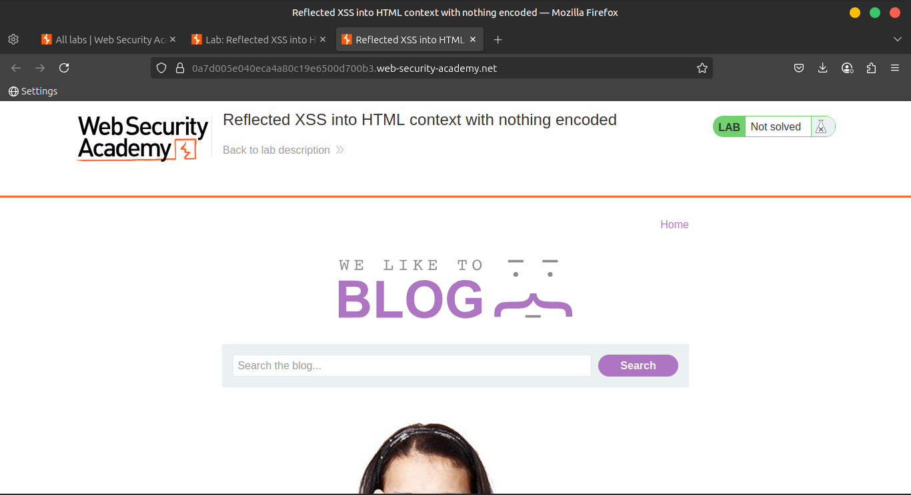
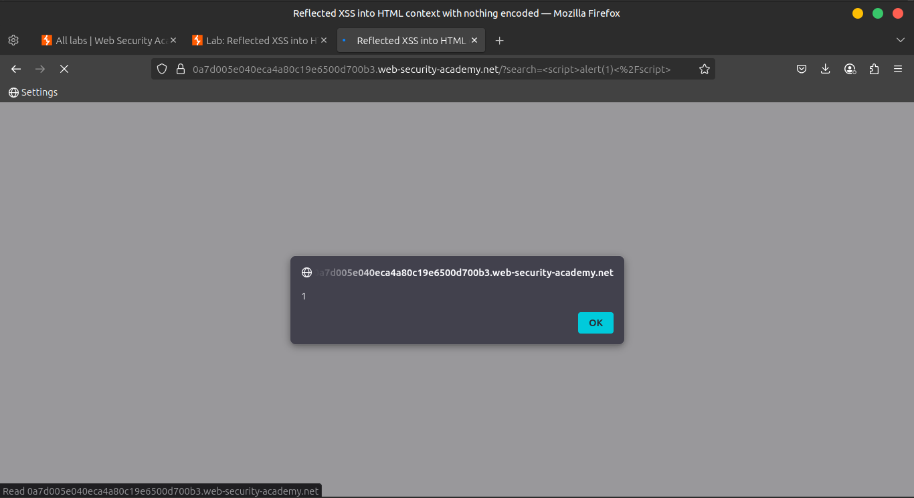
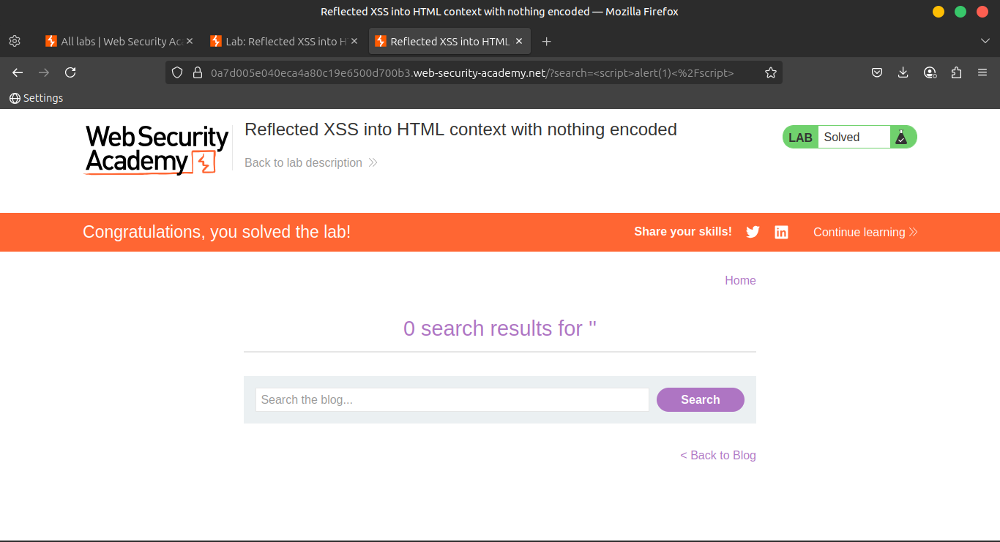

# Lab 1: Reflected XSS into HTML context with nothing encoded

This lab contains a simple **reflected XSS vulnerability** in the search functionality.

> 🎯 Objective:
> 
> 
> Perform a cross-site scripting attack that calls the `alert` function.
> 

---

### ✅ **Solution**

1. In the **search box**, enter the following payload:
    
    ```html
    <script>alert(1)</script>
    ```
    
    
    
2. Click the **"Search"** button.



1. If the lab is vulnerable, an alert box will pop up, confirming execution.



---

### 🌍 **Community Solutions**

> 📺 Watch this walkthrough on YouTube:
[https://youtu.be/P8YOuAYW8es](https://youtu.be/P8YOuAYW8es)
>