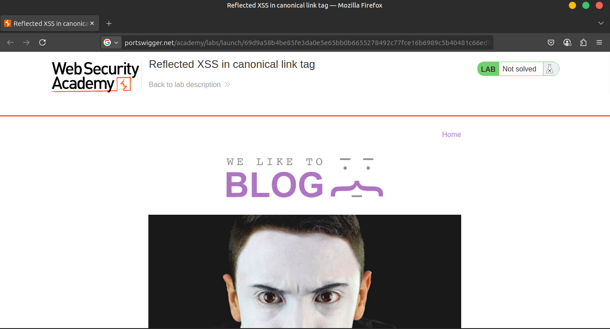
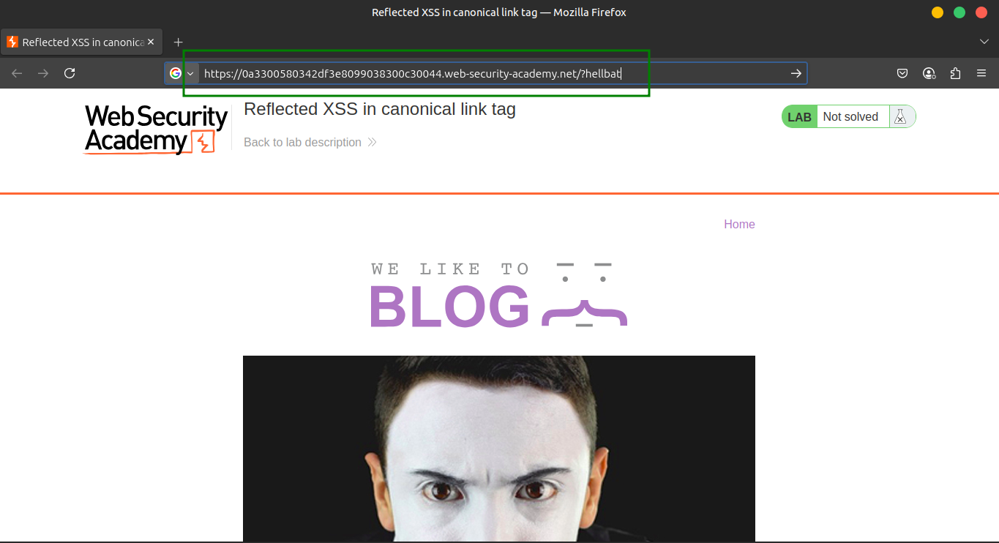
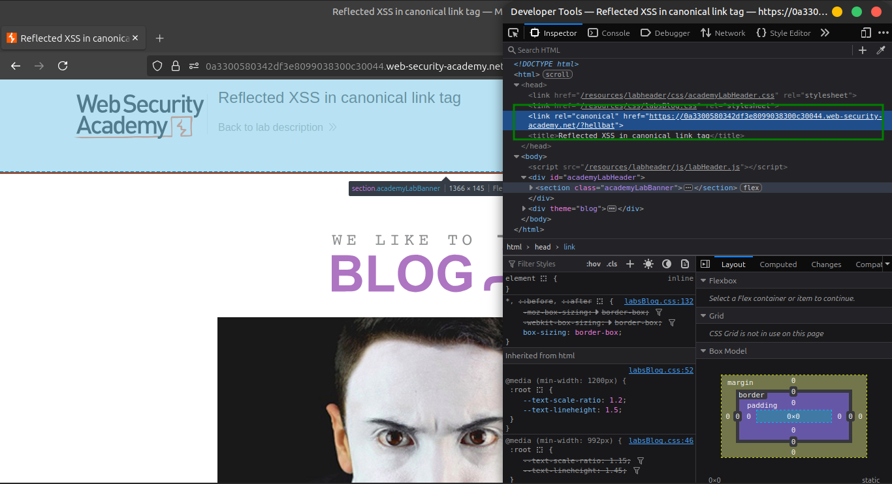
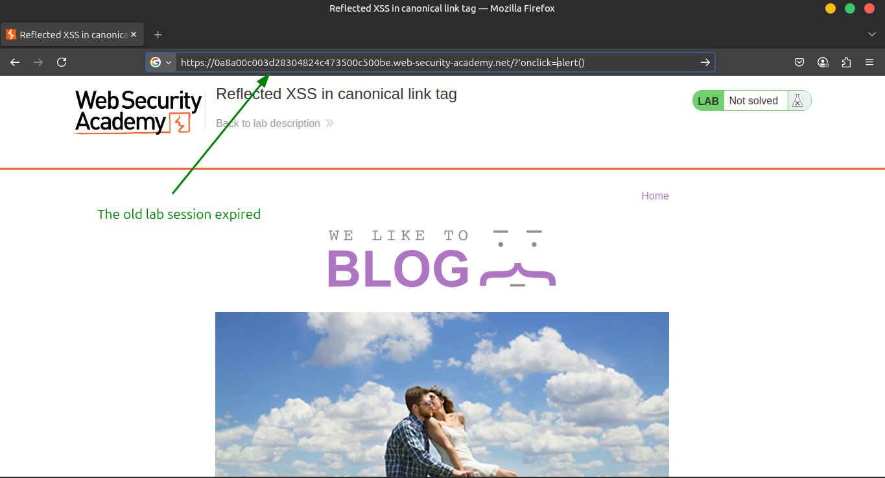
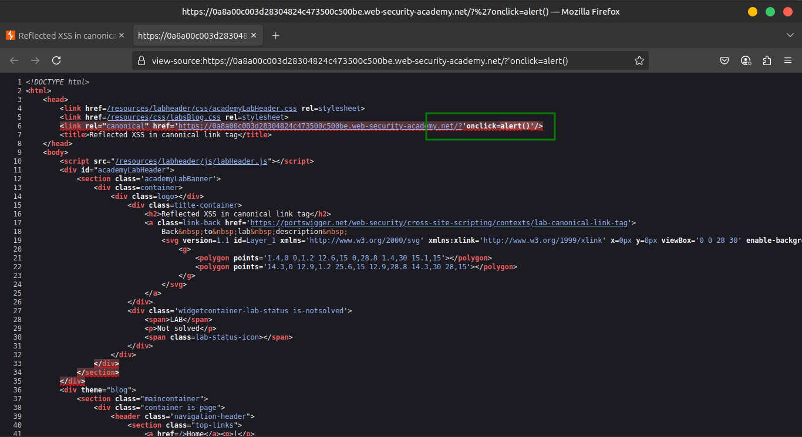
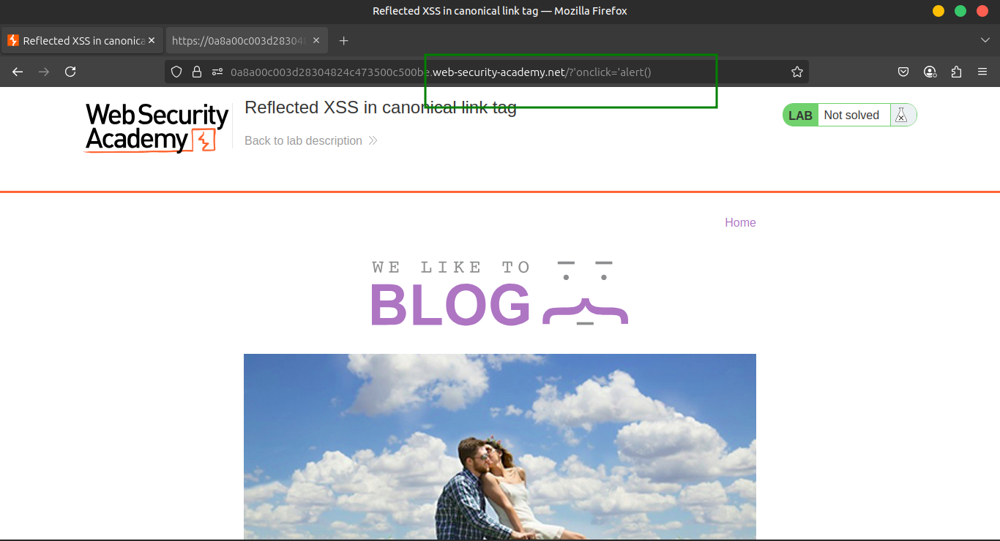
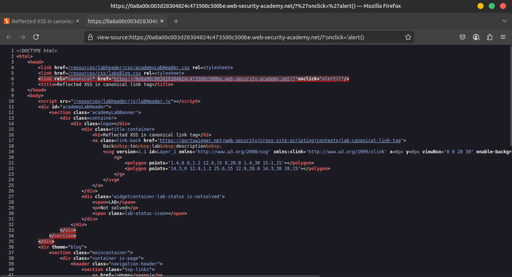
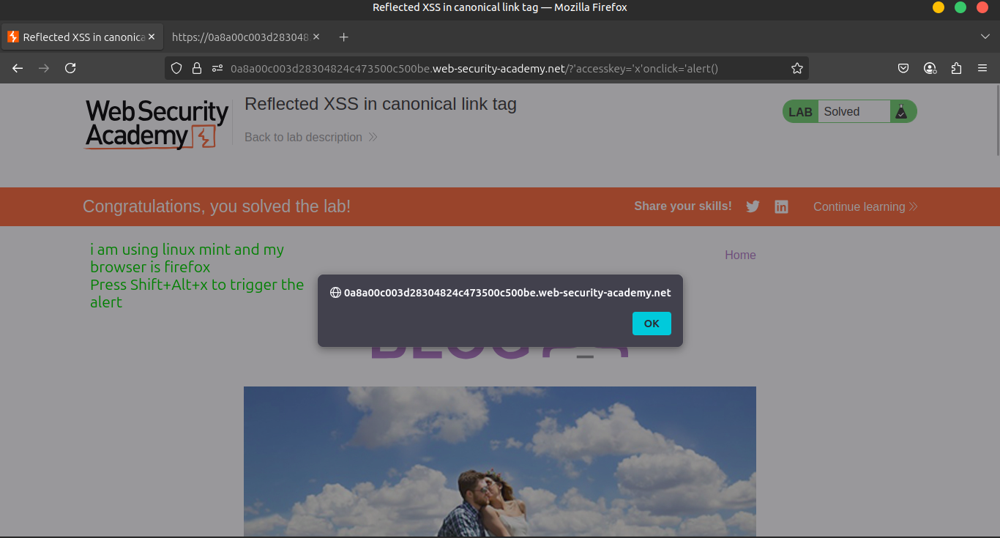

# Lab 10: Reflected XSS in canonical link tag

This lab reflects user input inside a canonical `<link>` tag and escapes angle brackets.

---

### 🎯 **Goal**

Perform a cross-site scripting attack on the home page that injects an attribute which calls the `alert` function.

> Note:
> 
> 
> The intended solution is only possible in **Chrome**.
> 

---

### 🛠️ **Solution**

1️⃣ **Visit the following URL**, replacing `YOUR-LAB-ID` with your lab ID:

```jsx
'accesskey='x'onclick='alert(1)
```

> This sets the X key as an access key for the whole page. When a user presses the access key, the alert function is called.
> 















2️⃣ **To trigger the exploit on yourself, press one of the following key combinations:**

- 🪟 **Windows:** `ALT + SHIFT + X`
- 🍎 **MacOS:** `CTRL + ALT + X`
- 🐧 **Linux:** `Alt + X`




---

### 🎥 **Community solutions**

▶️ [Watch video walkthrough](https://youtu.be/9kwDn7IGkW0)