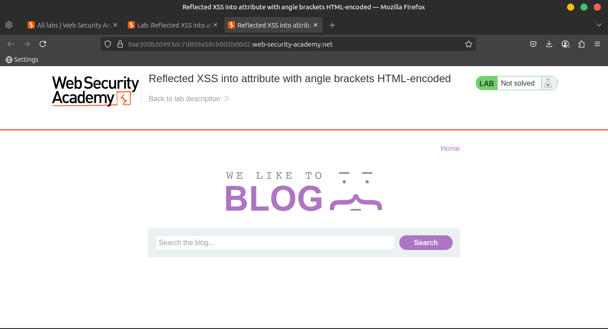
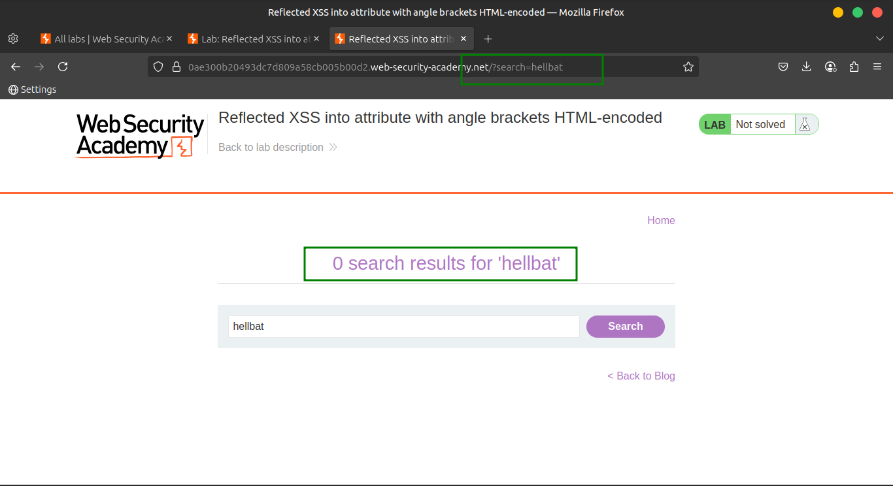
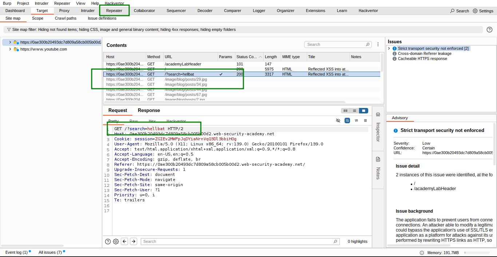
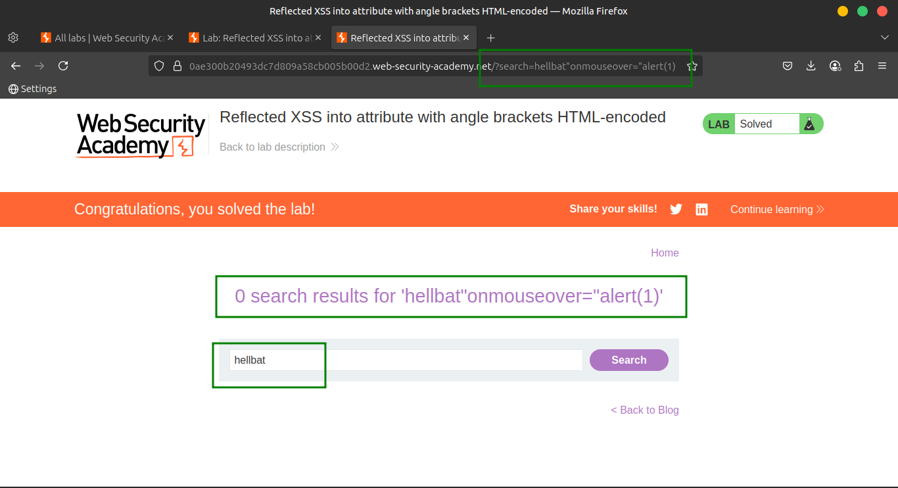

# Lab 2: Reflected XSS into attribute with angle brackets HTML-encoded

This lab contains a **reflected cross-site scripting (XSS)** vulnerability in the **search blog** functionality, where **angle brackets (`<` and `>`) are HTML-encoded**.

> 🎯 Objective:
> 
> 
> Perform a cross-site scripting attack that injects an **attribute** and calls the `alert` function.
> 

---

### 💡 **Hint**

Just because you're able to trigger `alert()` yourself

doesn't mean it will work for the victim. Try a variety of different **HTML attributes** before settling on a working payload.

---

### 🛠️ **Solution Steps**

1. 🔎 Enter a **random alphanumeric string** in the **search box**.
    
    
    
    
    
2. 🧰 Use **Burp Suite** to intercept the request and **send it to Repeater**.
3. 👁️ Observe the reflection:
    
    The input appears **inside a quoted attribute** (e.g., `value="yourInput"`).
    
    
    
4. 🧪 Replace your input with the following payload to **escape the quoted attribute** and inject an **event handler**:
    
    ```html
    "onmouseover="alert(1)
    
    ```
    
5. ✅ **Verify**:
    - Right-click and choose **"Copy URL"**.
    - Paste it into a browser.
    - Hover your mouse over the injected element — an alert should trigger!
        
        
        

---

### 🌍 **Community Solutions**

> 📺 YouTube walkthrough:
[https://youtu.be/Nhk9arXIM94](https://youtu.be/Nhk9arXIM94)
>