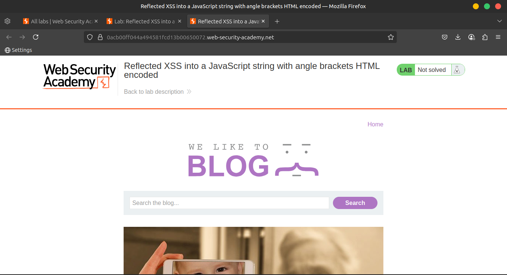
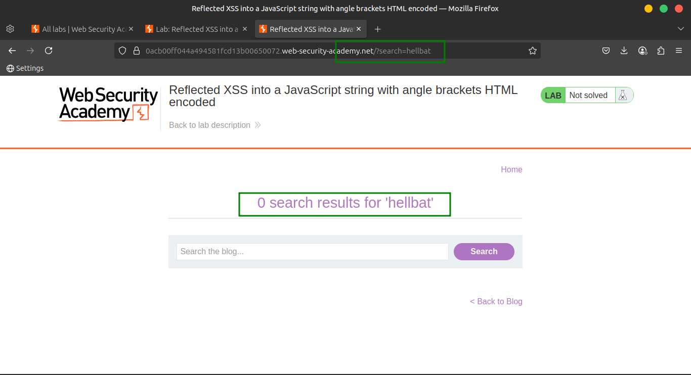
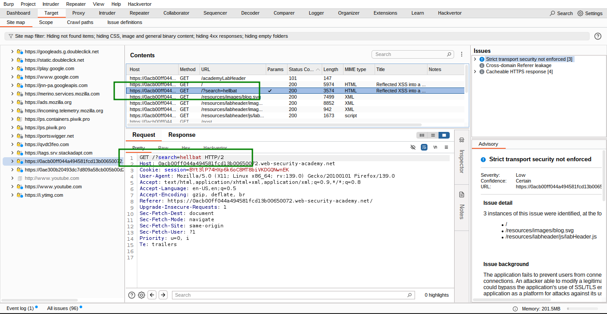
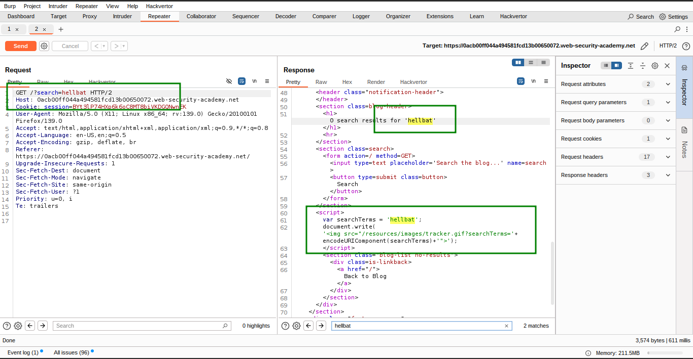
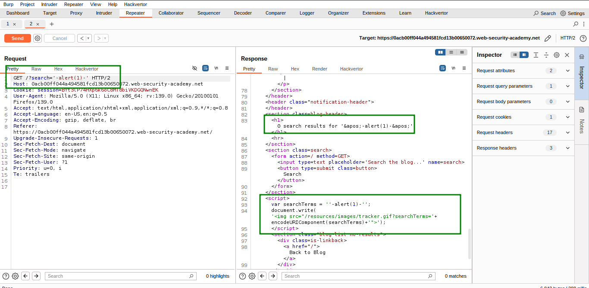
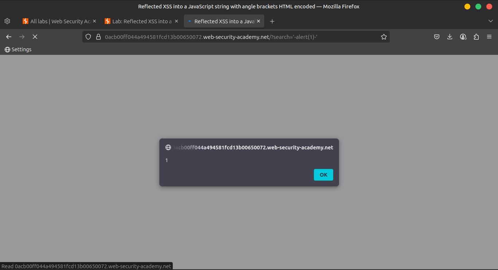
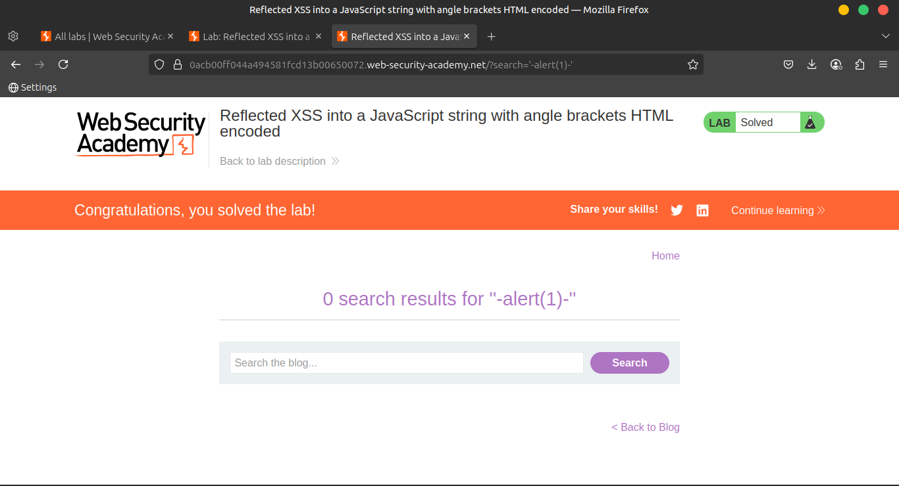

# Lab 3: Reflected XSS into a JavaScript string with angle brackets HTML encoded

This lab contains a **reflected cross-site scripting (XSS)** vulnerability in the **search query tracking** functionality, where **angle brackets are encoded**. The reflection occurs **inside a JavaScript string**.

> 🎯 Goal:
> 
> 
> Perform a cross-site scripting attack that **breaks out** of the JavaScript string and calls the `alert` function.
> 

---

### 💡 **Solution Steps**

1. 🔎 **Submit a random alphanumeric string** in the **search box**.
    
    
    
    
    
2. 🧰 Use **Burp Suite** to:
    - Intercept the search request.
    - Send it to **Burp Repeater**.
        
        
        
3. 👁️ **Inspect the response**:
    - The input appears **inside a JavaScript string**, such as:
        
        ```
        var q = 'yourInputHere';
        
        ```
        
        
        
4. 💥 Replace your input with this **payload** to break out of the string and inject JavaScript:
    
    ```
    '-alert(1)-'
    
    ```
    
    
    
    This closes the string, runs `alert(1)`, and adds extra characters to help keep the syntax valid.
    
5. ✅ **Verify the exploit**:
    - Right-click in Burp and choose **"Copy URL"**.
    - Paste the URL in your browser and load the page.
    - The `alert(1)` should execute, confirming successful XSS.
        
        
        
        
        

---

### 🌍 **Community Solutions**

> 📺 YouTube walkthrough:
[https://youtu.be/eIHGNgibcjA](https://youtu.be/eIHGNgibcjA)
>