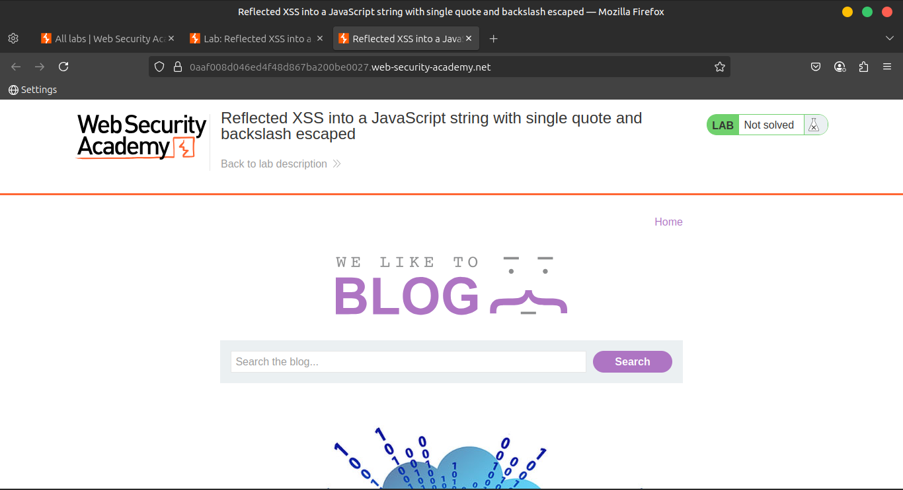
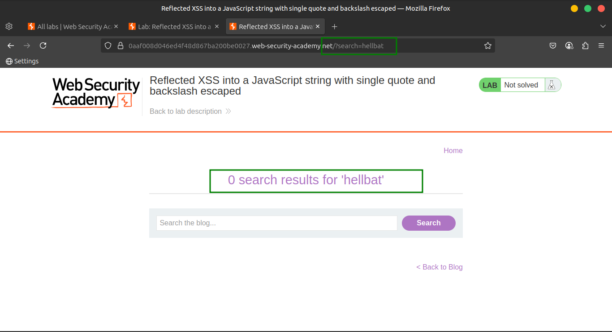
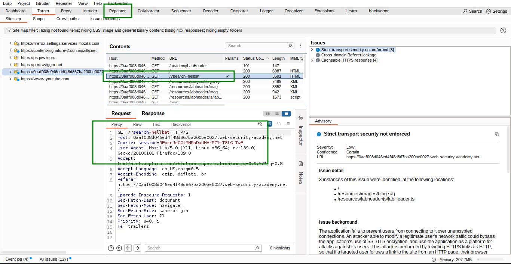
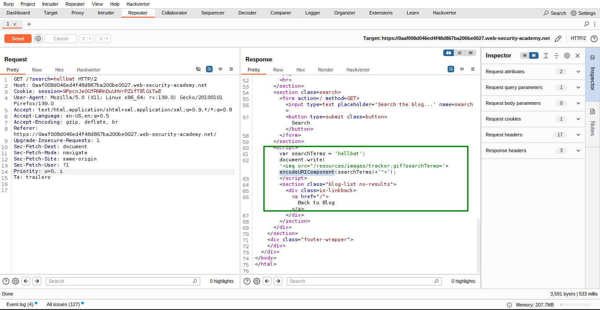
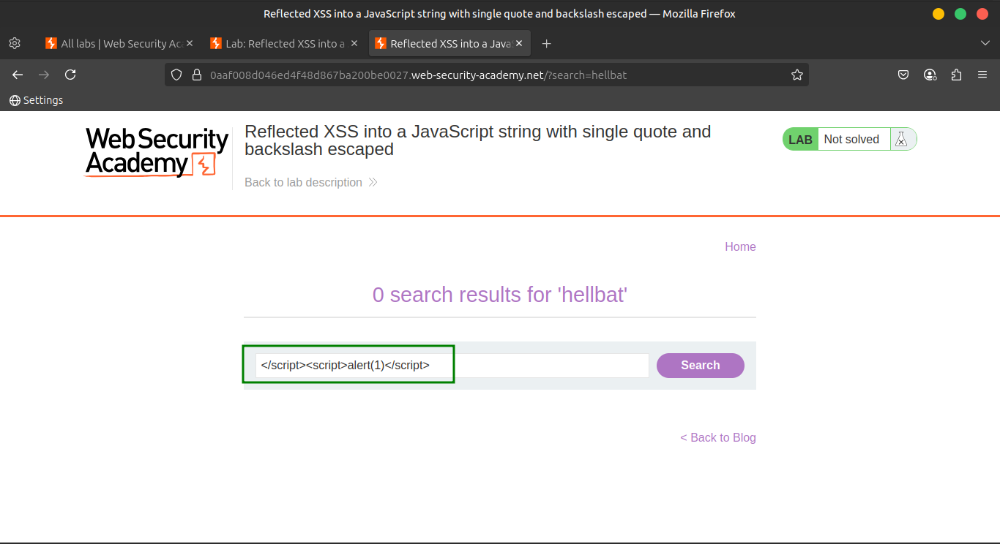
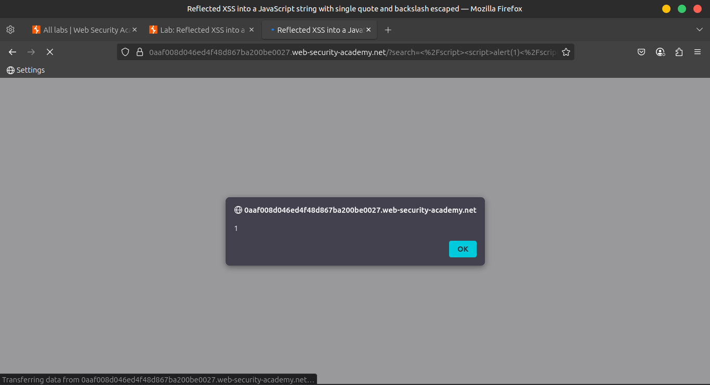
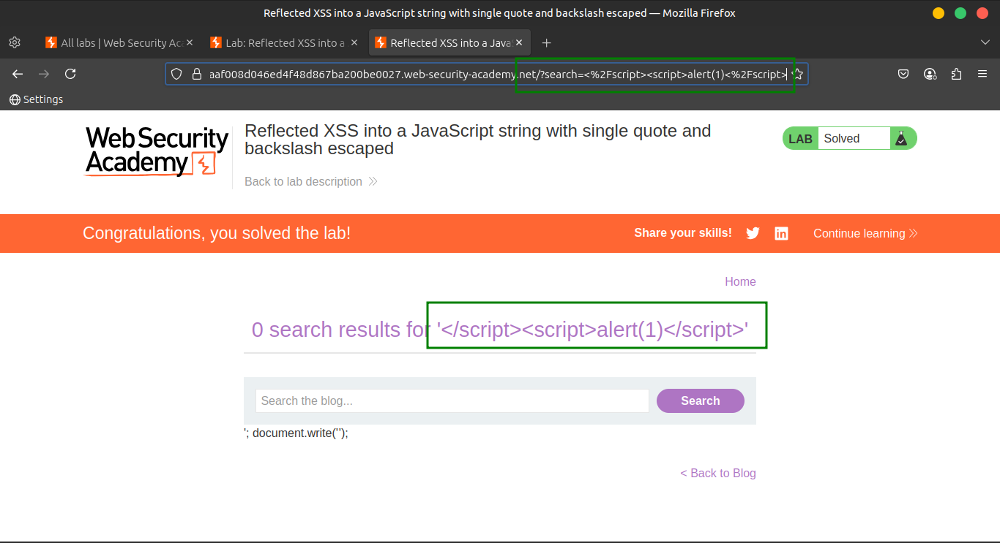

# Lab 4: Reflected XSS into a JavaScript string with single quote and backslash escaped

This lab contains a **reflected cross-site scripting (XSS)** vulnerability in the **search query tracking** functionality. The reflection occurs inside a **JavaScript string**, where **single quotes (`'`) and backslashes (`\`) are escaped**.

> 🎯 Objective:
> 
> 
> Perform a **cross-site scripting attack** that breaks out of the JavaScript string and calls the `alert` function.
> 

---

### 💡 **Solution Steps**

1. 🔍 **Submit a random alphanumeric string** in the search box.
    
    
    
    
    
2. 🛠️ **Use Burp Suite** to:
    - Intercept the request.
    - Send it to **Burp Repeater** for testing.
        
        
        
3. 👁️ **Observe the reflection**:
    - The input is reflected **inside a JavaScript string**, like:
        
        ```
        var q = 'yourInputHere';
        
        ```
        
        
        
4. 🧪 **Test escaping behavior**:
    - Try sending the payload:
        
        ```
        test'payload
        
        ```
        
    - Notice that the single quote gets **escaped** as `\'`, which prevents breaking out of the string.
5. 💥 **Bypass escaping** with a tag injection:
    - Use this payload:
        
        ```html
        </script><script>alert(1)</script>
        
        ```
        
        
        
    - This closes the current `<script>` block and starts a new one, bypassing the escaping mechanism.
6. ✅ **Verify the attack**:
    - Right-click the request and choose **"Copy URL"**.
    - Paste it into your browser and load the page.
    - You should see a JavaScript alert, confirming the XSS execution.
        
        
        
        
        

---

### 🌐 **Community Solutions**

> 📺 Watch on YouTube
[https://youtu.be/OwcT9ahQlSU](https://youtu.be/OwcT9ahQlSU)
>