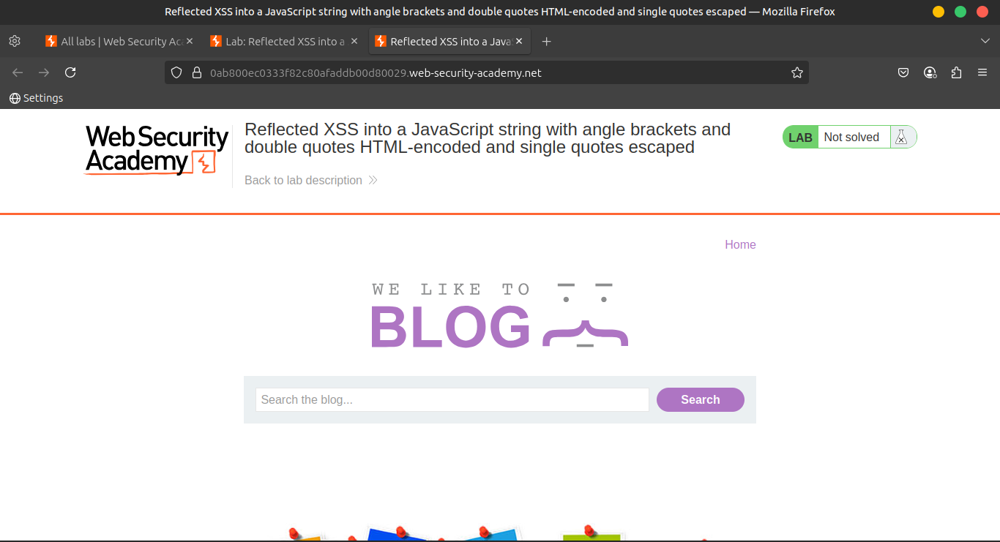
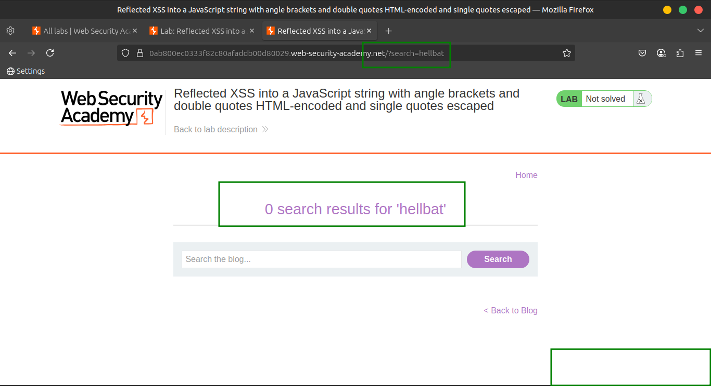
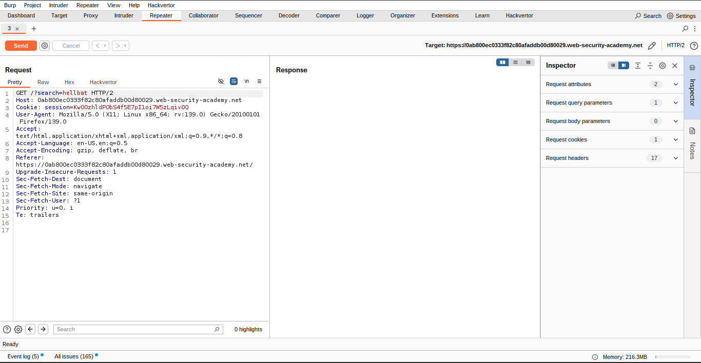
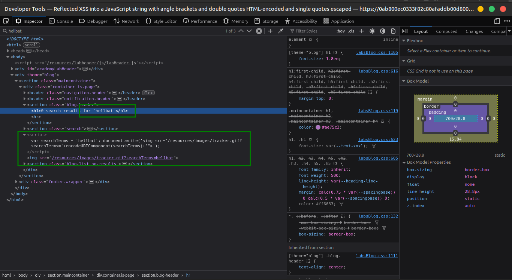
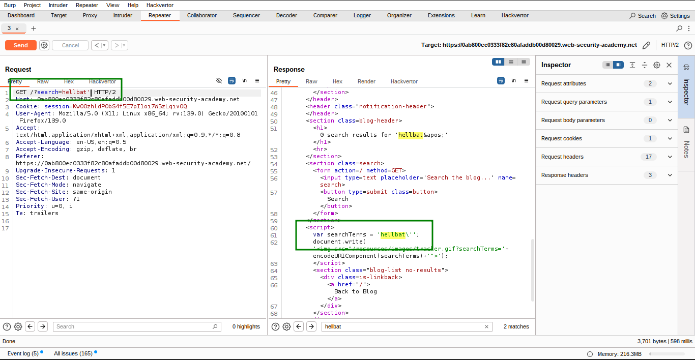
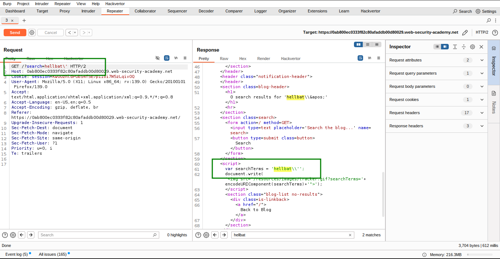
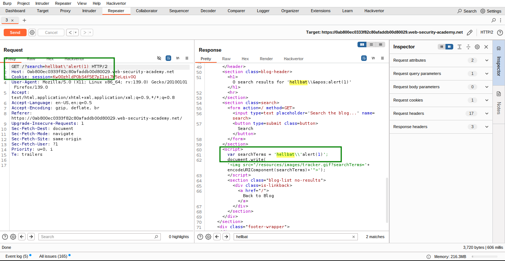
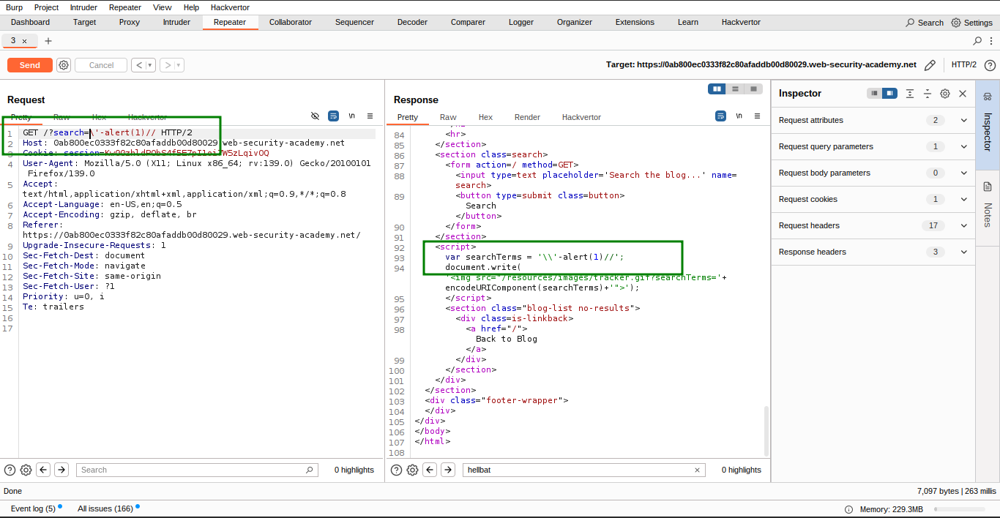
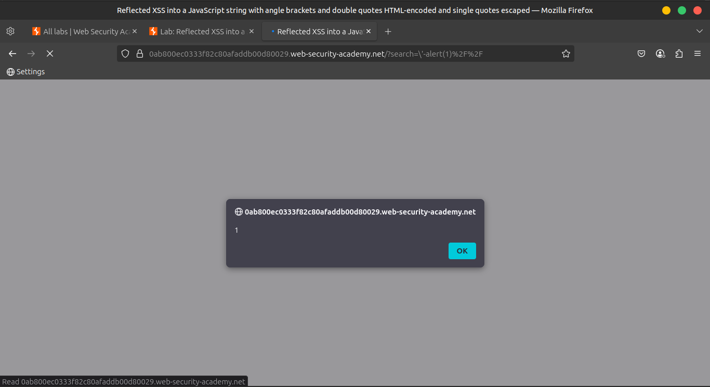
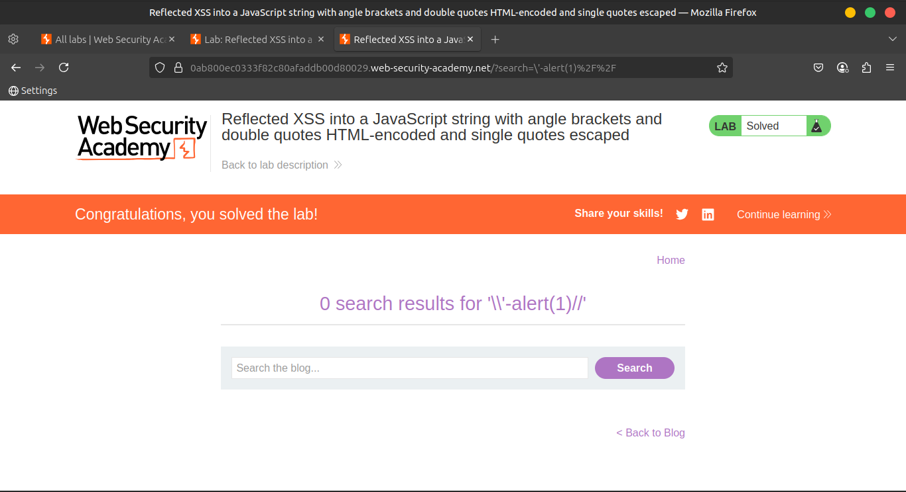

# Lab 5: Reflected XSS into a JavaScript string with angle brackets and double quotes HTML-encoded and single quotes escaped

This lab contains a **reflected cross-site scripting (XSS)** vulnerability in the **search query tracking** functionality.

Here, **angle brackets (`<`, `>`) and double quotes (`"`) are HTML-encoded**, while **single quotes (`'`) are escaped**, but **backslashes (`\`) are not**.

> 🎯 Objective:
> 
> 
> Perform a **reflected XSS attack** that breaks out of the JavaScript string and successfully calls the `alert` function.
> 

---

### 🛠️ **Solution Steps**

1. **Submit a random alphanumeric string** in the search box (e.g., `x7g9ks2a`).
    
    
    
    
    
2. **Use Burp Suite** to:
    - Intercept the request.
    - Send it to **Burp Repeater** for testing.
        
        
        
3. **Observe the reflection** in the response:
    - The input is reflected inside a **JavaScript string**, e.g.:
        
        ```
        var search = 'x7g9ks2a';
        ```
        
        
        
4. **Test escaping behavior**:
    - Payload:
        
        ```jsx
        test'payload
        
        ```
        
        
        
    - Result: Single quote gets escaped like:
        
        ```
        'test\'payload'
        
        ```
        
        
        
5. **Test backslash behavior**:
    - Payload:
        
        ```jsx
        test\payload
        
        ```
        
    - Result: Backslash appears as-is, **not escaped**.
6. **Bypass the escaping** with a crafted payload:
    - Payload:
        
        ```jsx
        \'-alert(1)//
        
        ```
        
        
        
    - Breakdown:
        - The initial `\` neutralizes the escaping mechanism.
        - The `'` then **breaks out** of the string.
        - `alert(1)` executes.
        - `//` comments out the remaining code to avoid syntax errors.
            
            
            
            
            
7. ✅ **Verify the attack**:
    - Right-click in Burp and choose **"Copy URL"**.
    - Paste it in a browser.
    - On loading the page, an **alert box** should appear, confirming the vulnerability.
        
        
        

---

### 📺 **Community Solution**

> ▶️ [Watch the video walkthrough](https://youtu.be/2qZMHqlJwKc)
>