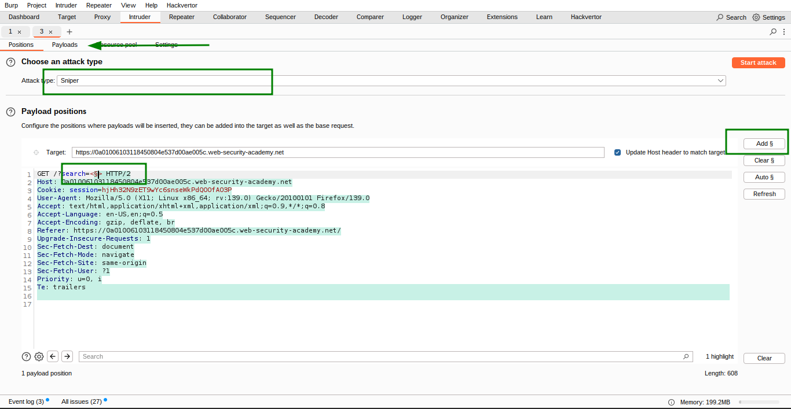
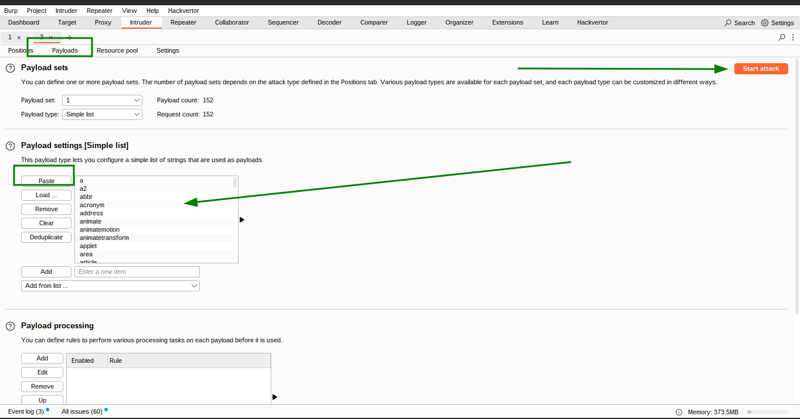
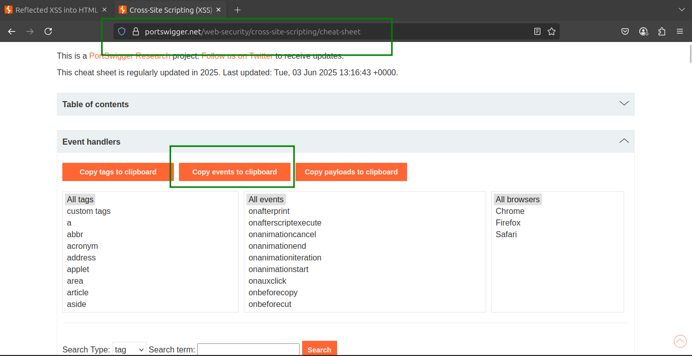

# Lab 7: Reflected XSS into HTML context with most tags and attributes blocked

This lab contains a **reflected XSS vulnerability** in the search functionality protected by a Web Application Firewall (WAF) blocking common XSS vectors.

Your task is to **bypass the WAF** and trigger the `print()` function **without any user interaction**.

> ⚠️ Note: Manually triggering print() in your browser will not solve the lab.
> 

---

### 🎯 **Solution Steps**

1. **Attempt a standard XSS payload:**
    
    ```html
    
    
    ```
    
    - Notice that this is blocked by the WAF.
        
        
        
        
        
        
        
2. **Use Burp Suite to discover allowed tags and attributes:**
    - Open **Burp Browser**, perform a search on the lab.
    - Send the search request to **Burp Intruder**.
        
        
        
        
        
3. **Test allowed tags:**
    - Set the search term to:
        
        ```
        <>
        ```
        
    - Place the cursor between the angle brackets and click **Add §** → becomes:
        
        ```
        <§§>
        ```
        
    - Visit the [XSS cheat sheet](https://portswigger.net/web-security/cross-site-scripting/cheat-sheet) and **copy the list of tags**.
    - Paste these tags as payloads in Burp Intruder and **start the attack**.
        
        
        
        
        
        
        
4. **Review results:**
    - Most payloads yield **400** errors.
    - The `<body>` tag returns **200**, indicating it is allowed.
        
        
        
5. **Test allowed attributes on `<body>`:**
    - Change the search term to:
        
        ```
        <body%20=1>
        ```
        
    - Place the cursor before `=` and add payload markers → becomes:
        
        ```
        <body%20§§=1>
        ```
        
    - From the [XSS cheat sheet](https://portswigger.net/web-security/cross-site-scripting/cheat-sheet), **copy event handler attributes** (e.g., `onresize`, `onclick`, etc.).
    - Clear previous payloads, paste the event attributes as payloads, and **start the attack**.
        
        
        
        
        
        
        
6. **Review results again:**
    - Most event handlers return **400** errors.
    - The `onresize` attribute returns **200**, indicating it’s allowed.
        
        
        
7. **Construct the final payload:**
    - Go to the **exploit server** and insert the following, replacing `YOUR-LAB-ID`:
    
    ```html
    <iframe src="https://YOUR-LAB-ID.web-security-academy.net/?search=%22%3E%3Cbody%20onresize=print()%3E" onload=this.style.width='100px'>
    ```
    
    
    
    
    
8. **Deploy the exploit:**
    - Click **Store** and then **Deliver exploit to victim**.
        
        
        

---

### 🛠️ **Explanation**

- The WAF blocks common HTML tags and event attributes.
- Burp Intruder helps identify which tags and attributes are allowed (`<body>` tag and `onresize` attribute).
- The payload injects a `<body>` tag with an `onresize` event calling `print()`.
- The `iframe`’s `onload` event triggers resizing (`this.style.width='100px'`), firing the `onresize` event and calling `print()` **without user interaction**.

---

### 🎥 **Community Solution Video**

▶️ [Watch on YouTube](https://youtu.be/NIUsJZhGvFs)