# Lab 9: Reflected XSS with some SVG markup allowed

This lab contains a simple reflected XSS vulnerability. The site blocks common HTML tags but **misses some SVG tags and events**.

To solve the lab, perform a cross-site scripting attack that calls the `alert()` function.

---

### 🔍 **Solution**

1️⃣ **Inject a standard XSS payload, such as:**

```jsx

```


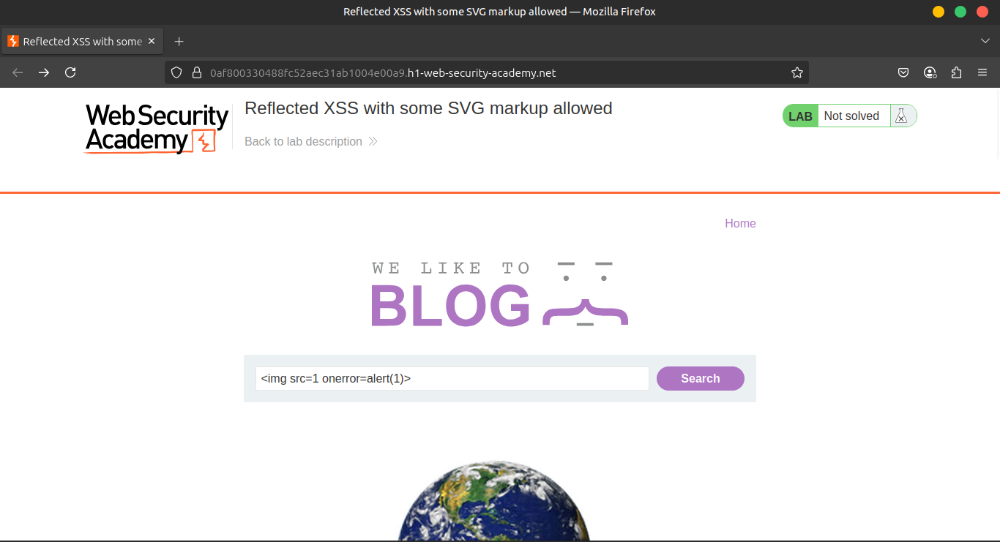

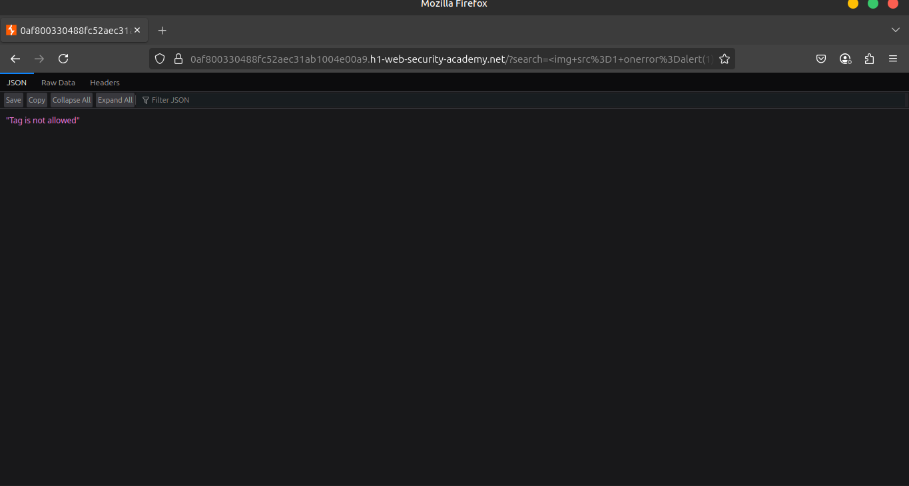

2️⃣ **Observe that this payload gets blocked.**

In the next steps, we'll use **Burp Intruder** to test which tags and attributes are blocked.

3️⃣ **Open Burp's browser** and use the search function in the lab.

Send the resulting request to **Burp Intruder**.

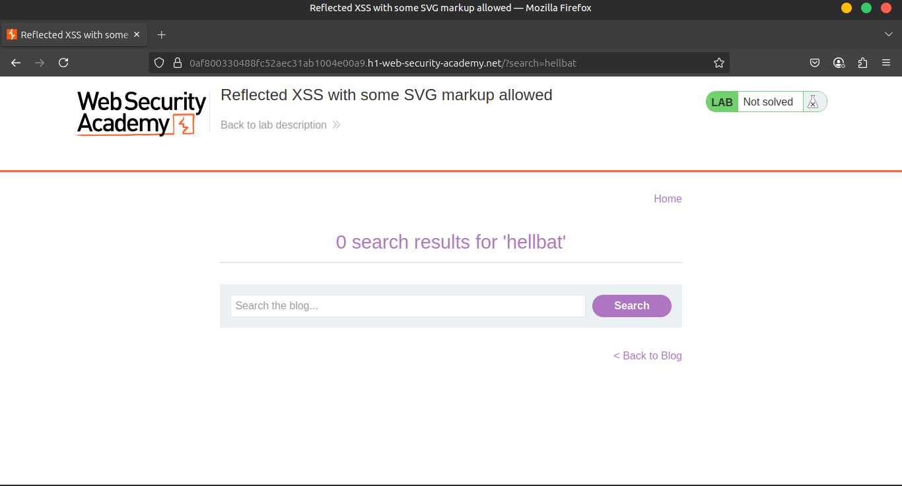

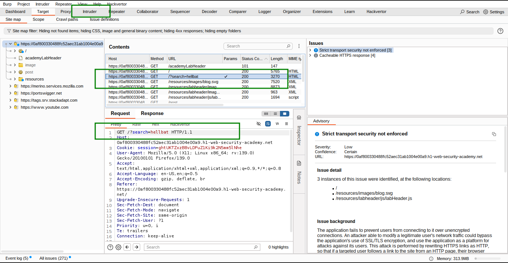

4️⃣ In the request template, **replace the value of the search term with:**

```
<>
```

5️⃣ **Place the cursor between the angle brackets and click** **Add §** to create a payload position.

The search term should now be:

```
<§§>
```

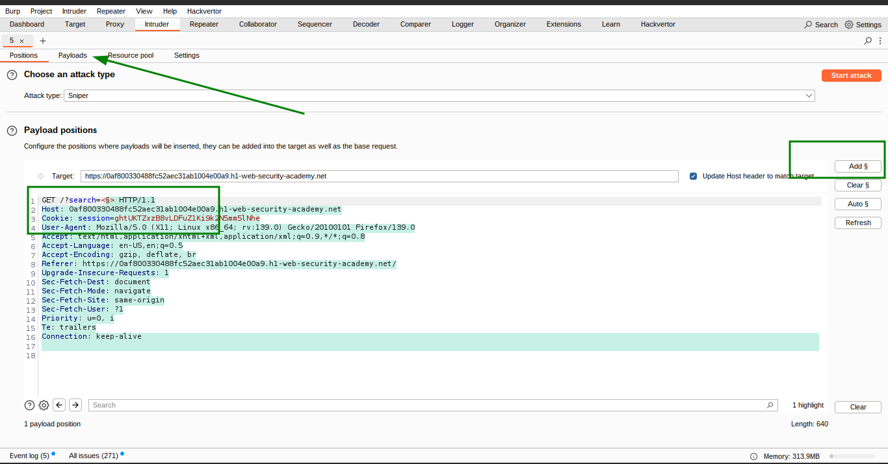

6️⃣ Visit the [XSS cheat sheet](https://portswigger.net/web-security/cross-site-scripting/cheat-sheet) and click **Copy tags to clipboard**.

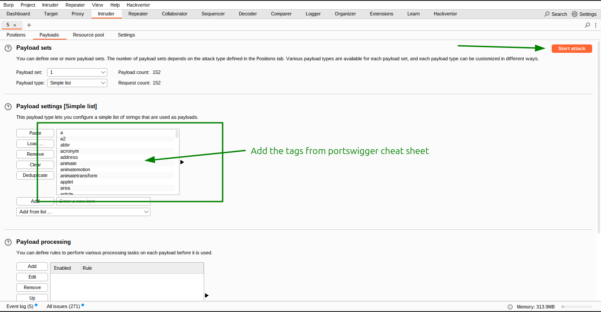

7️⃣ In Burp Intruder, under the **Payloads** side panel, click **Paste** to paste the list of tags into the payload list.

Click **Start attack**.

8️⃣ **When the attack finishes, review the results.**

Observe that all payloads caused a `400` response, except for `<svg>`, `<animatetransform>`, `<title>`, and `<image>` tags, which returned a `200` response.

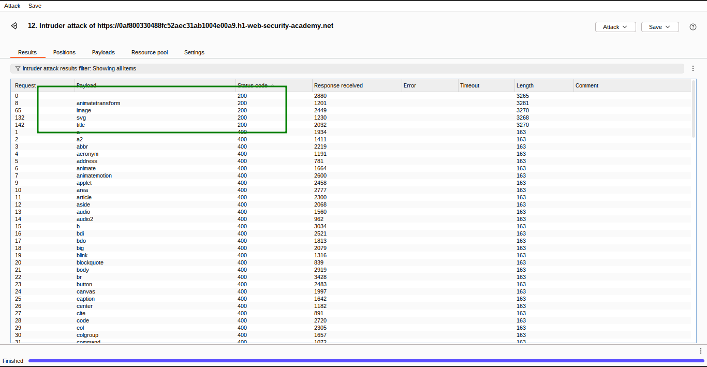

9️⃣ Go back to the **Intruder** tab and replace your search term with:

```jsx
<svg><animatetransform%20=1>
```

🔟 Place the cursor **before the `=` character** and click **Add §** to create a payload position.

The search term should now be:

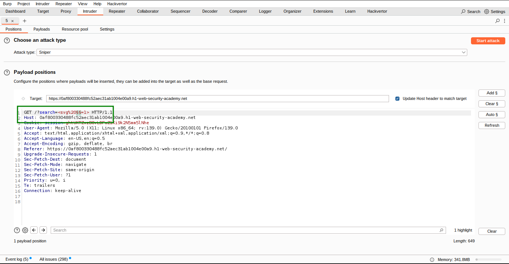

```jsx
<svg><animatetransform%20§§=1>
```

1️⃣1️⃣ Visit the [XSS cheat sheet](https://portswigger.net/web-security/cross-site-scripting/cheat-sheet) and click **Copy events to clipboard**.

1️⃣2️⃣ In Burp Intruder, under **Payloads**, click **Clear** to remove previous payloads. Then click **Paste** to paste the list of attributes.

Click **Start attack**.

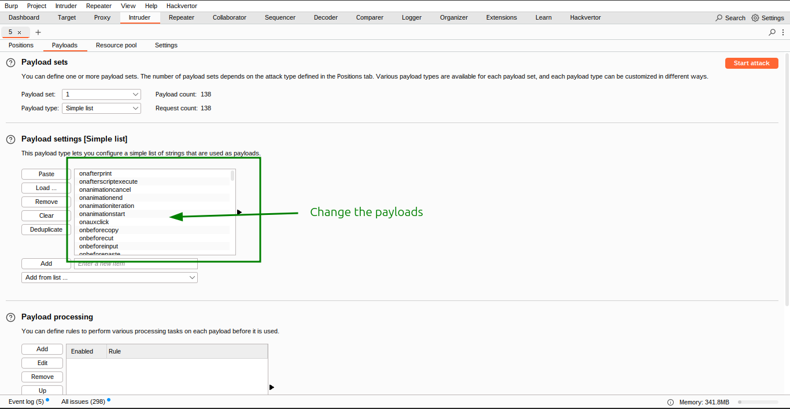

1️⃣3️⃣ **Review results after the attack completes.**

All payloads caused a `400` response except for the `onbegin` payload, which caused a `200` response.

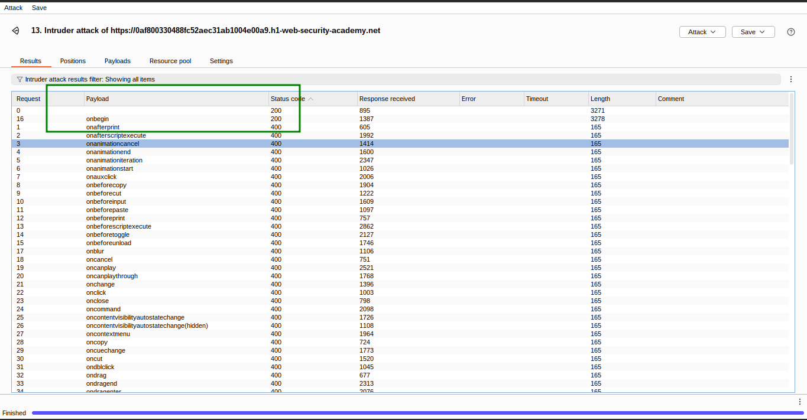

---

### ✅ **Final Step**

Visit the following URL in your browser to confirm that the `alert()` function is called and the lab is solved:

```jsx
<svg><animatetransform onbegin=alert(1)>
```

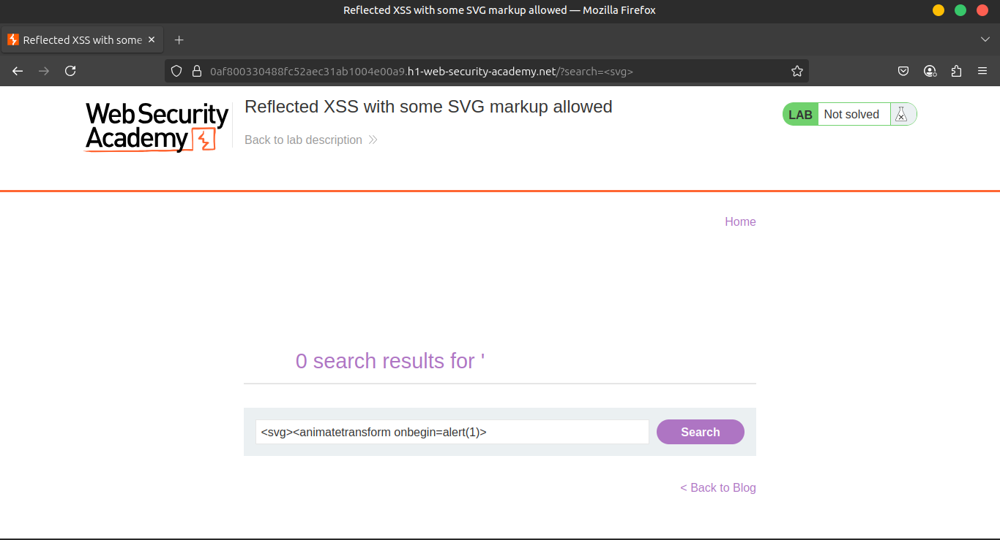

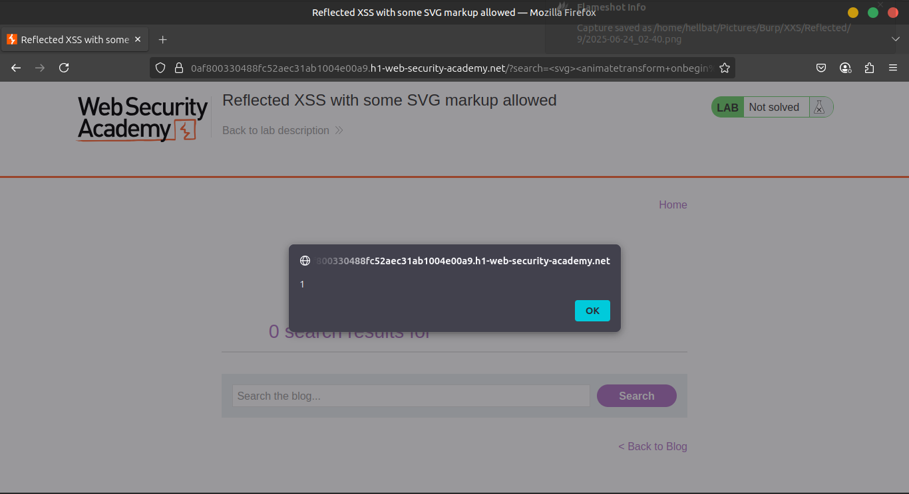

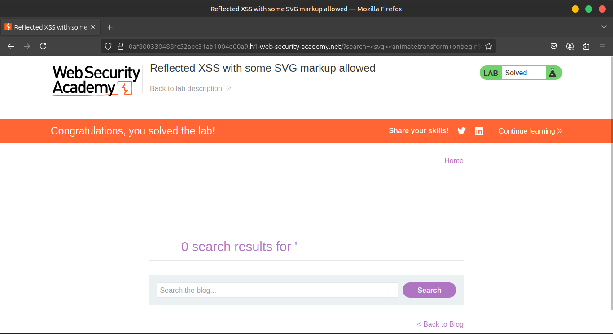

---

### 🎥 **Community solutions**

▶️ [Watch on YouTube](https://youtu.be/7dKk4A6viWo)