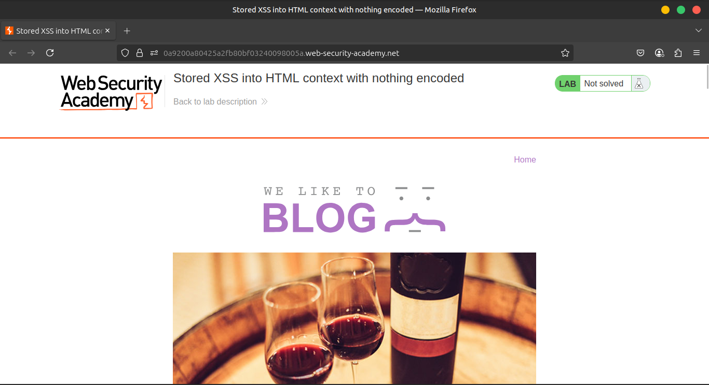
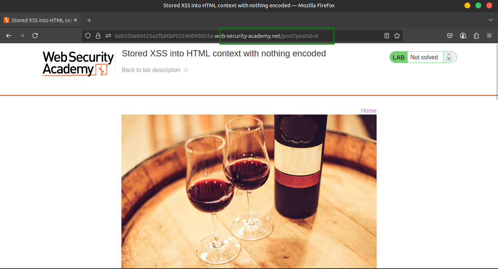
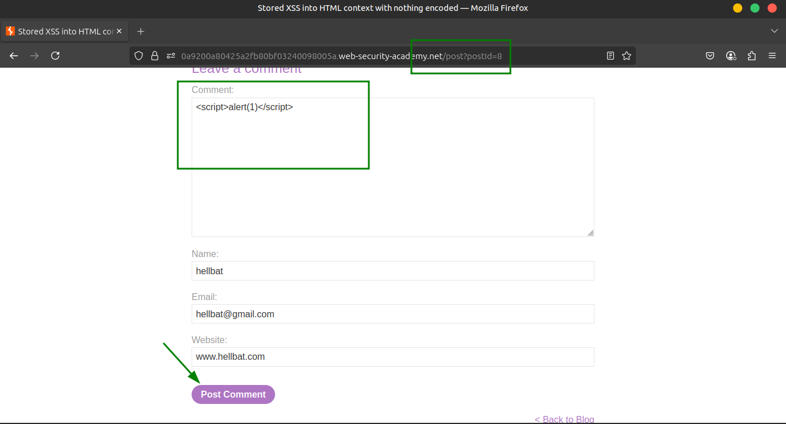
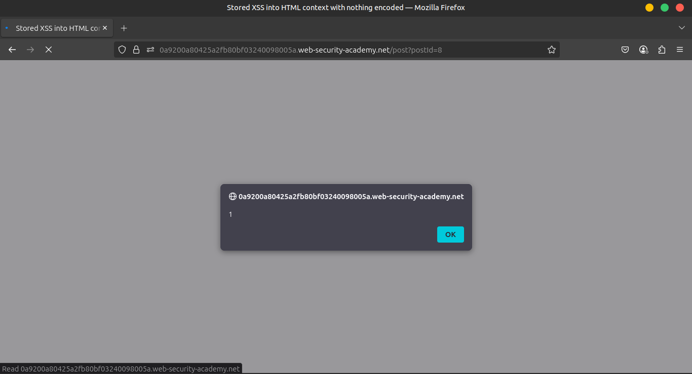
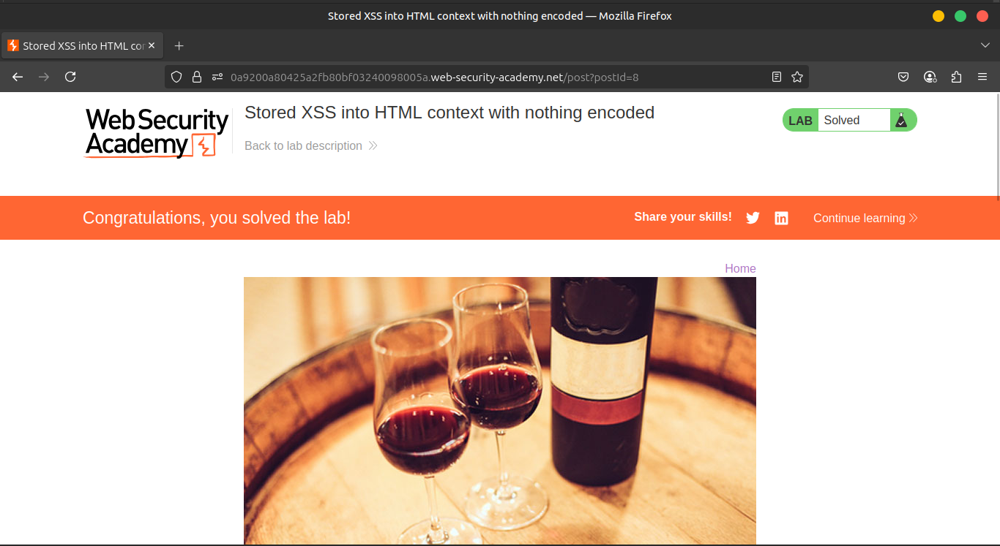

# Lab 1: Stored XSS into HTML context with nothing encoded

This lab contains a **stored cross-site scripting vulnerability** in the comment functionality.

---

### 🎯 **Goal**

Submit a comment that triggers the `alert` function when the blog post is viewed.

---

### 🛠️ **Solution**

1️⃣ Enter the following into the comment box:







```jsx
<script>alert(1)</script>
```

2️⃣ Enter a name, email, and website.

3️⃣ Click **Post comment**.

4️⃣ Go back to the blog and view the post to trigger the alert.





---

### 🎥 **Community solutions**

▶️ [Watch video walkthrough](https://youtu.be/dWQVRHGs6r4)