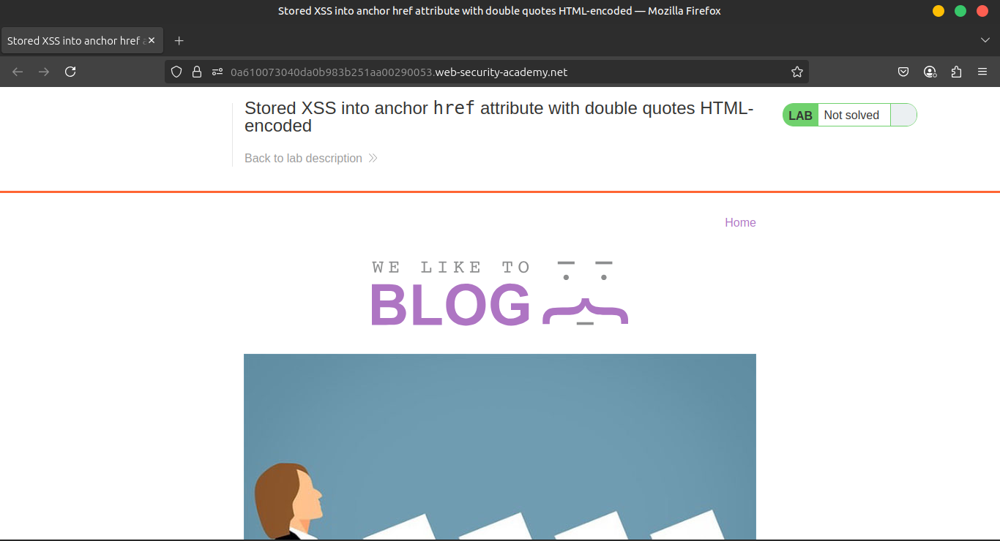
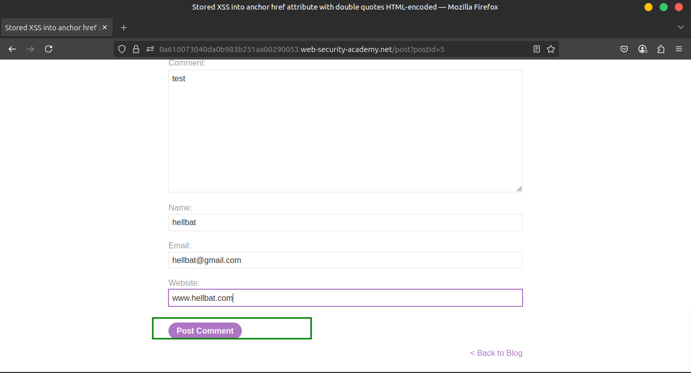
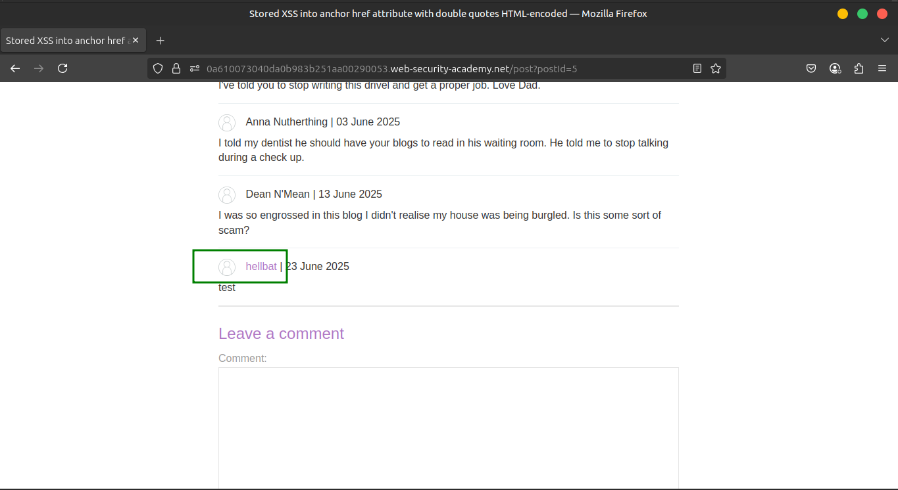
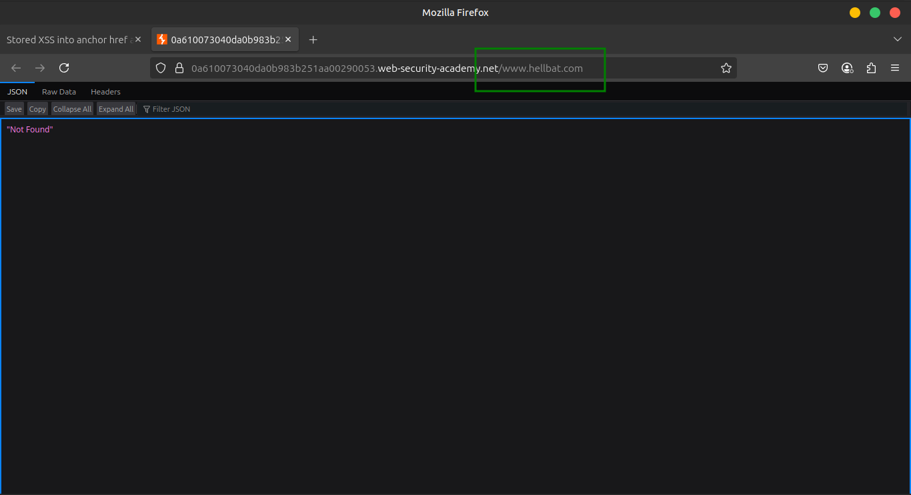
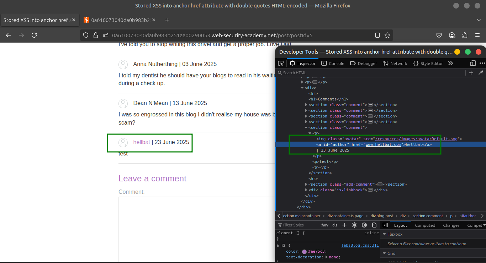
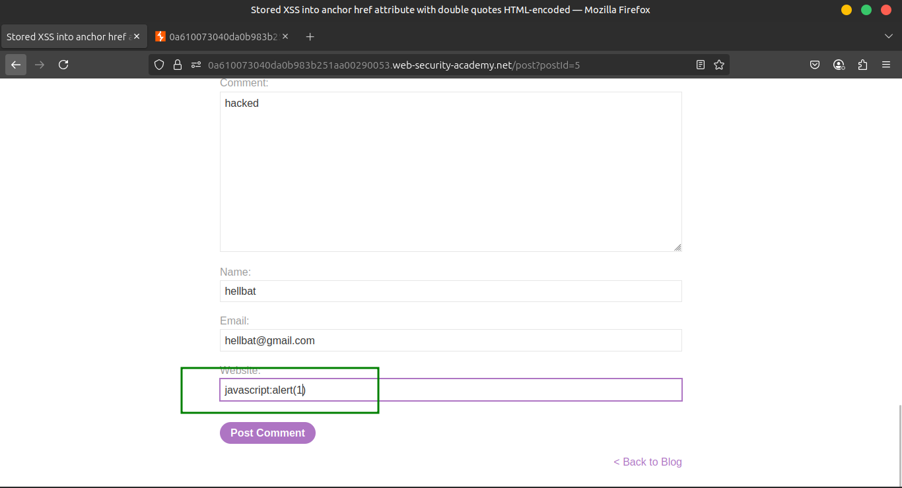
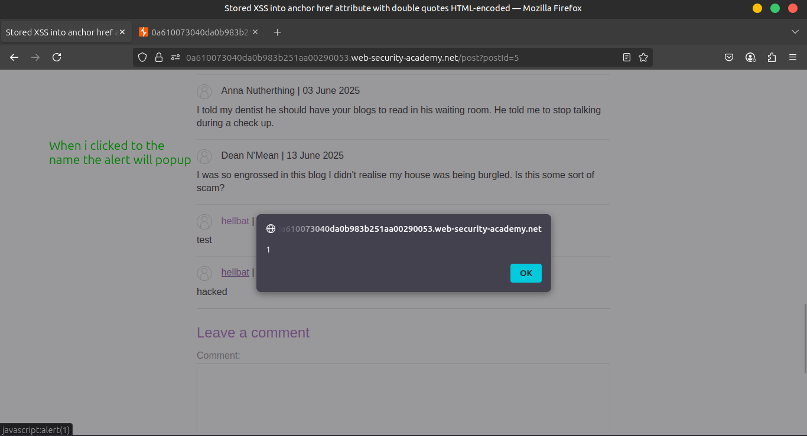
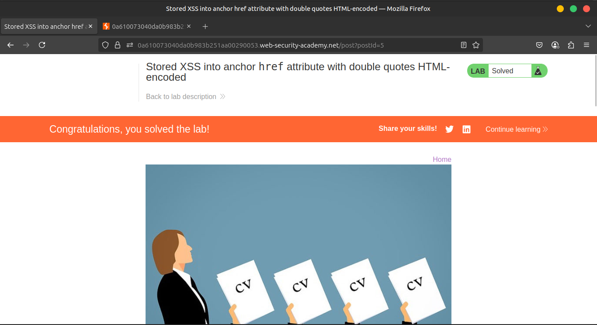

# Lab 2: Stored XSS into anchor href attribute with double quotes HTML-encoded

## 🎯 Goal

Submit a comment that injects JavaScript into the **Website field**, resulting in execution of `alert(1)` when the **comment author's name is clicked**.

---

## 🛠️ Solution Steps

### 1️⃣ Submit a Test Comment

- In the **Website** input field, enter a random **alphanumeric string** (e.g., `test123`)







---

### 2️⃣ Inspect Reflection

- Load the post in your browser to view the comment
- 🔍 **Observe:** Your test string is **reflected inside an `href` attribute** in an anchor (`<a>`) tag — this is your injection point.





---

### 3️⃣ Inject the Payload

Repeat the comment submission, but this time, use the following input in the **Website field**:

```jsx
javascript:alert(1)
```



This injects a **JavaScript URI**, which gets executed when the anchor is clicked.

---

### 4️⃣ Trigger the XSS

- After submitting the comment, right-click your name above the comment.
- Choose **"Copy Link Address"** or **"Copy URL"**
- Paste it into your browser’s address bar and hit enter.
- ✅ **Result:** An `alert(1)` popup should appear — you've triggered the XSS!





---

## 🎥 Community Solutions

📺 [Watch full walkthrough on YouTube](https://youtu.be/3jFVfS9BsDc)