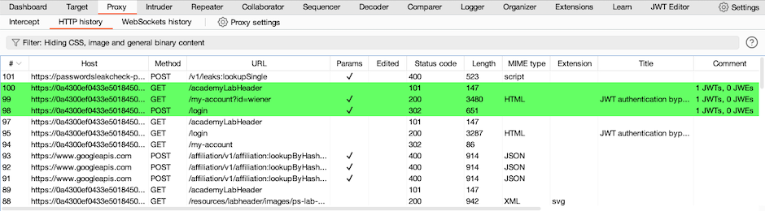

# 03. How to work with JWTs in Burp Suite

## 🔑 **JSON Web Tokens (JWTs)**

JSON web tokens (JWTs) are a **standard format** for sending **cryptographically signed JSON data** between systems.

They are **commonly used** in:

- Authentication
- Session management
- Access control mechanisms

⚠ **Security Note:** If an attacker can successfully **modify a JWT**, they may be able to **escalate privileges** or **impersonate other users**.

### 🛠 **Using Burp Suite to Work with JWTs**

You can use **Burp Inspector** to **view and decode** JWTs, then use the **JWT Editor extension** to:

1. Generate cryptographic signing keys
2. Edit the JWT
3. Resign the token with a valid signature matching the edited JWT

📋 **Before You Start**

- Install the **JWT Editor extension**.
    
    *(See: Installing extensions from the BApp Store)*
    

### 🔍 **Viewing JWTs**

1️⃣ Identify a request with a JWT that you want to investigate further.

- Look in **Proxy > HTTP history** for highlighted requests.
- These are automatically flagged by the JWT Editor extension.

📌 To view the JWT contents:

- Highlight sections of the token.
- The **Inspector panel** will automatically decode it.

2️⃣ Review the decoded JWT in the Inspector panel.

- Identify **interesting claims** or **possible modification targets**.

### ✏ **Editing JWTs**

To edit a JWT with the **JWT Editor extension**:

1. Right-click the request with the JWT → **Send to Repeater**
2. In the request panel, go to the **JSON Web Token** tab
3. Edit the **Header** and **Payload** fields as needed
4. Click **Sign** → Select the appropriate signing key → **OK**
5. The JWT is re-signed with your modifications

### 🔐 **Adding a JWT Signing Key**

To add a signing key in the **JWT Editor extension**:

1. Go to the **JWT Editor Keys** tab
2. Click the button for the key type (e.g., **New Symmetric Key**)
3. In the dialog:
    - Click **Generate** to create a new key
    - *OR* paste an existing key
4. Edit as required
5. Click **OK** to save the key

### 🎥 **Community Walkthrough:**

[Watch on YouTube](https://youtu.be/nKmvKZHwf4s)