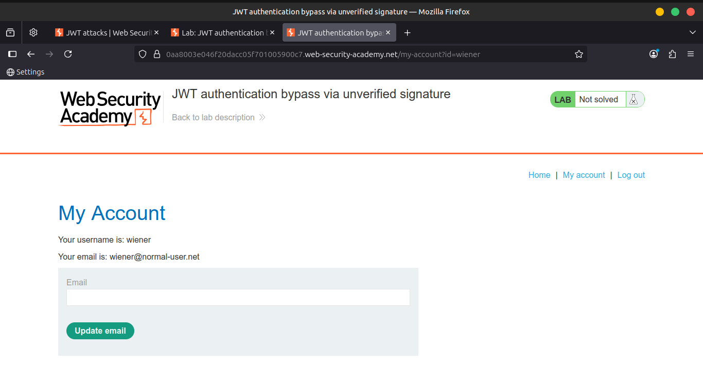
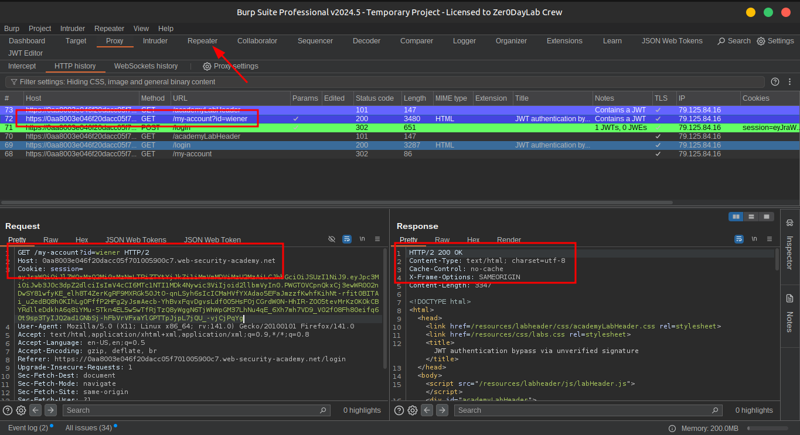
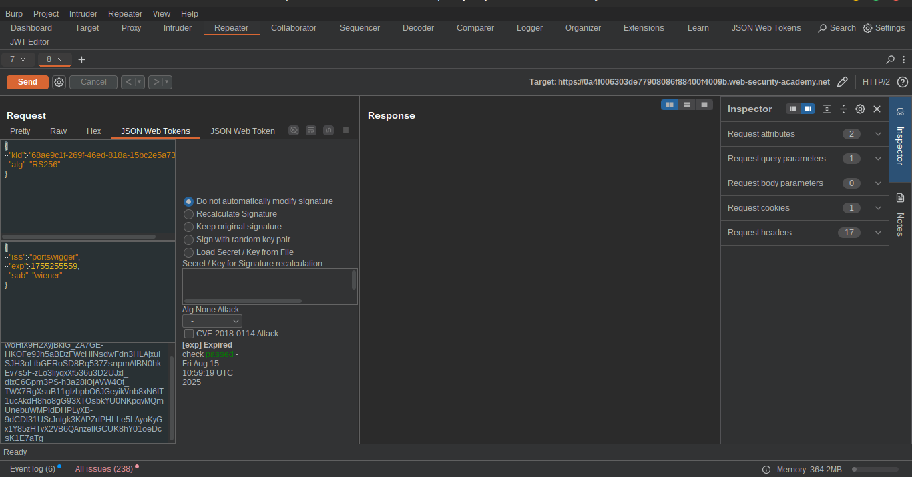
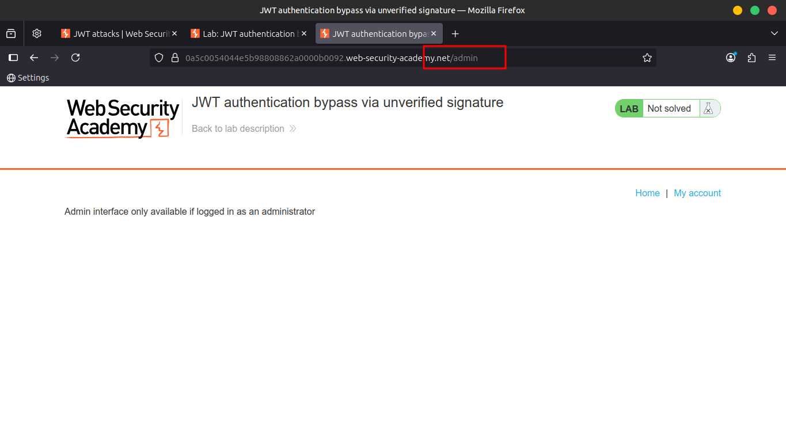
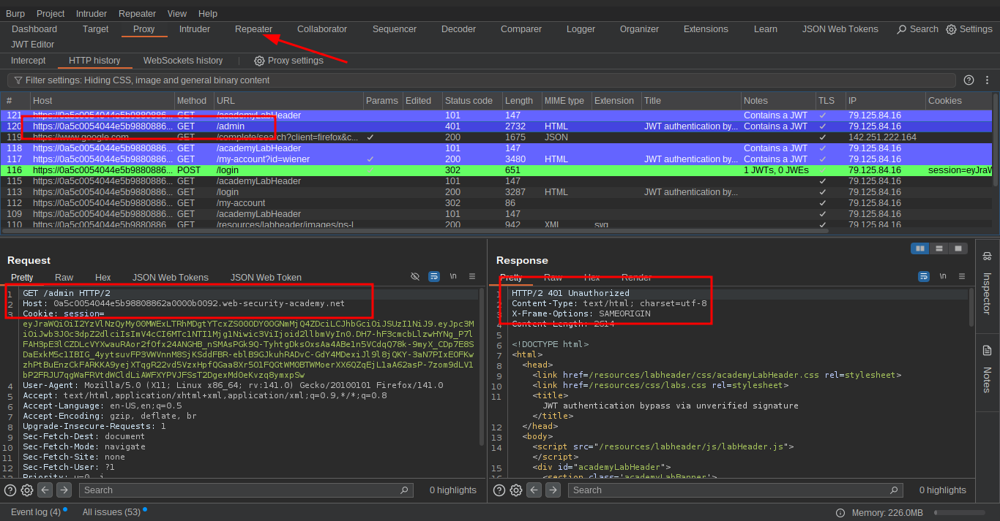
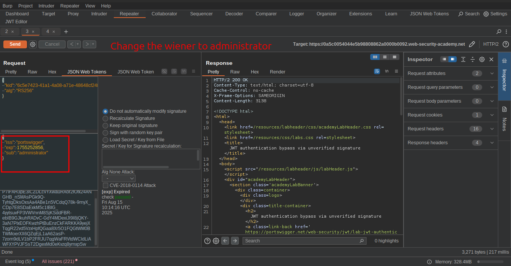
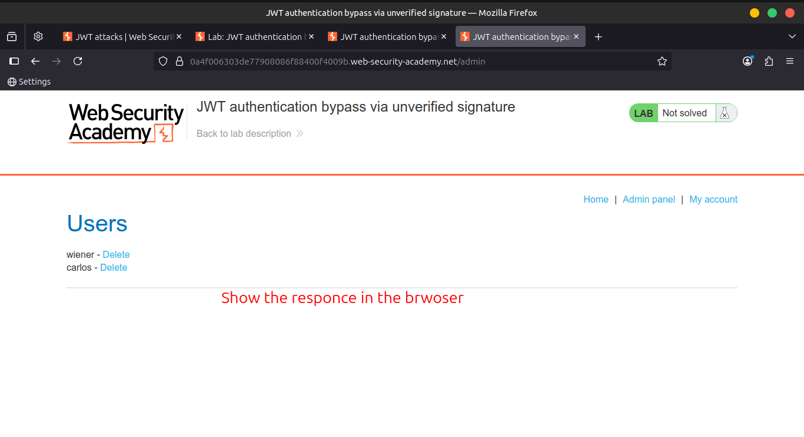
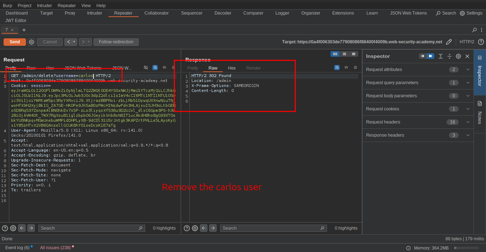
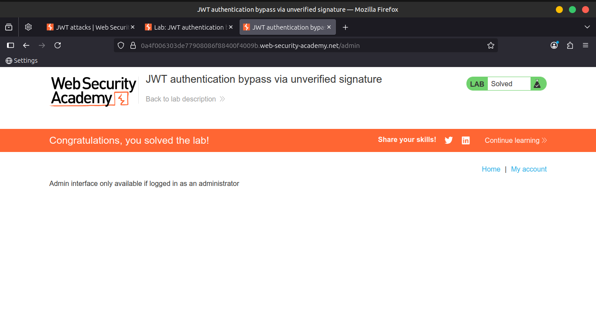
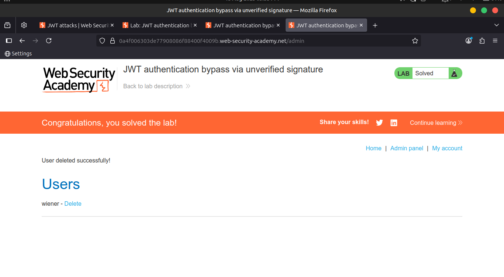

# Lab 01: JWT authentication bypass via unverified signature

This lab uses a **JWT-based mechanism** 🪪 for handling sessions.

Due to **implementation flaws** ⚠️, the server **doesn't verify the signature** of any JWTs that it receives.

🎯 **Goal:** Modify your session token to gain access to the **admin panel** at `/admin`, then delete the user **carlos**.

---

### 🔑 Credentials

```
Username: wiener
Password: peter
```

💡 **Tip:**

We recommend familiarizing yourself with **how to work with JWTs in Burp Suite** 🐞 before attempting this lab.

---

## 📝 Solution Steps

### 1️⃣ **Log in to your own account**

Sign in using the given credentials ✅.

---

### 2️⃣ **Inspect the JWT in Burp Suite**

- Open **Burp → Proxy → HTTP history** 📜
- Find the **post-login `GET /my-account`** request.
- Observe that your **session cookie is a JWT** 🔍.
    
    
    
    
    

---

### 3️⃣ **View the JWT payload**

- Double-click the **payload part** of the token.
- In the **Inspector panel**, view the **decoded JSON** 📄.
- Notice that the **`sub` claim** contains your username 👤.
- Send this request to **Burp Repeater** 📩.
    
    
    

---

### 4️⃣ **Test admin panel access**

- In Burp Repeater, change the path to:

```
/admin
```

- Send the request 🚀.
- Observe that **the admin panel is only accessible when logged in as the administrator user** 👑.
    
    
    
    
    

---

### 5️⃣ **Modify the JWT**

- Select the **payload** of the JWT again.
- In the Inspector panel, change:

```
sub: "wiener" → "administrator"

```

- Click **Apply changes** 🖱.
    
    
    

---

### 6️⃣ **Access the admin panel**

- Send the modified request again 📤.
- Observe that you **now have access to the admin panel** 🏆.
    
    
    

---

### 7️⃣ **Delete the user Carlos**

- In the **response**, find the delete URL:

```
/admin/delete?username=carlos
```

- Send the request to this endpoint 🗑.
- ✅ **Lab solved!**
    
    
    
    
    
    
    

---

## 📹 Community Solutions

🎥 Watch: [YouTube Solution](https://youtu.be/-JAf08oGrcc)