# Lab 04: JWT authentication bypass via jwk header injection

# 🧪 Lab: JWT Authentication Bypass via `jwk` Header Injection

This lab uses a **JWT-based session mechanism**.

The server supports the `jwk` parameter in the JWT header, which is sometimes used to embed the correct verification key directly inside the token.

⚠️ However, the server **fails to check** whether the provided key comes from a **trusted source**.

🎯 **Goal:**

Modify and sign a JWT to gain **admin access** at `/admin`, then **delete the user `carlos`**.

🔑 **Credentials:**

```
username: wiener
password: peter
```

💡 **Tip:**

Familiarize yourself with **JWTs in Burp Suite** before attempting this lab.

---

## 🛠️ Solution Steps

### 1️⃣ Load JWT Editor Extension

- In **Burp**, load the **JWT Editor** extension from the **BApp Store**.

### 2️⃣ Log In and Capture Request

- Log in using `wiener:peter`.
- Capture the **GET /my-account** request in **Burp Repeater**.
    
    
    

### 3️⃣ Test Admin Access

- In **Repeater**, change the path to `/admin`.
- Send the request → observe that **admin panel** is only accessible as `administrator`.
    
    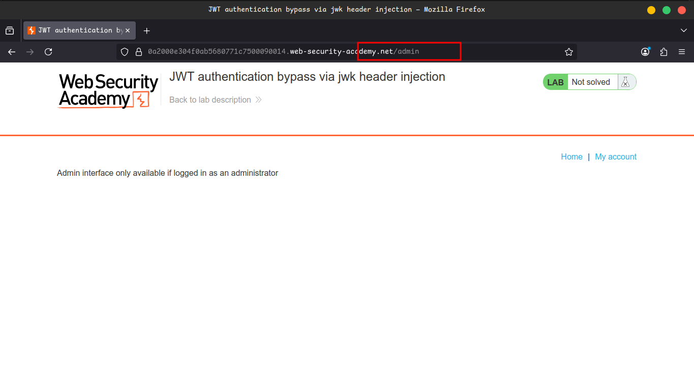
    
    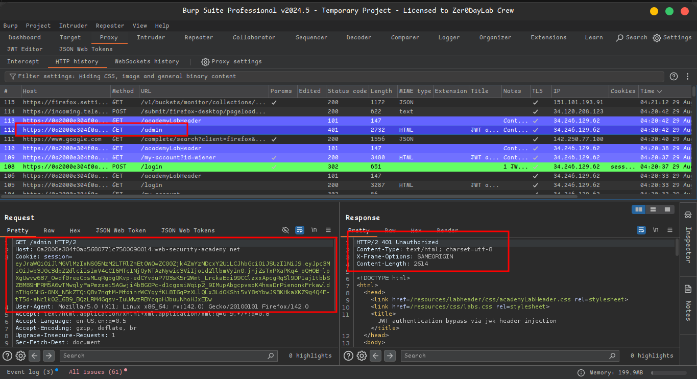
    

### 4️⃣ Generate a New RSA Key

- Go to **JWT Editor Keys tab** in Burp.
- Click **New RSA Key → Generate → OK**.
- (No need to choose key size – it will update automatically).
    
    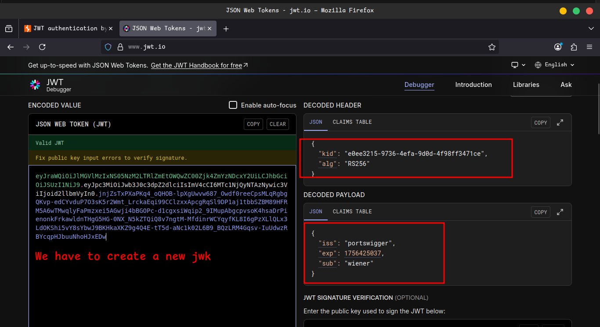
    
    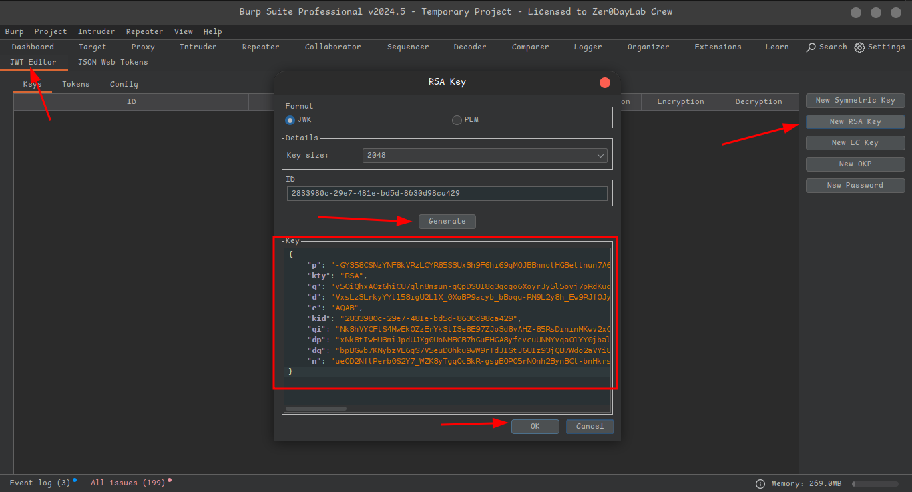
    
    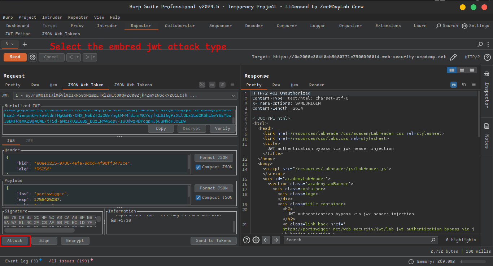
    
    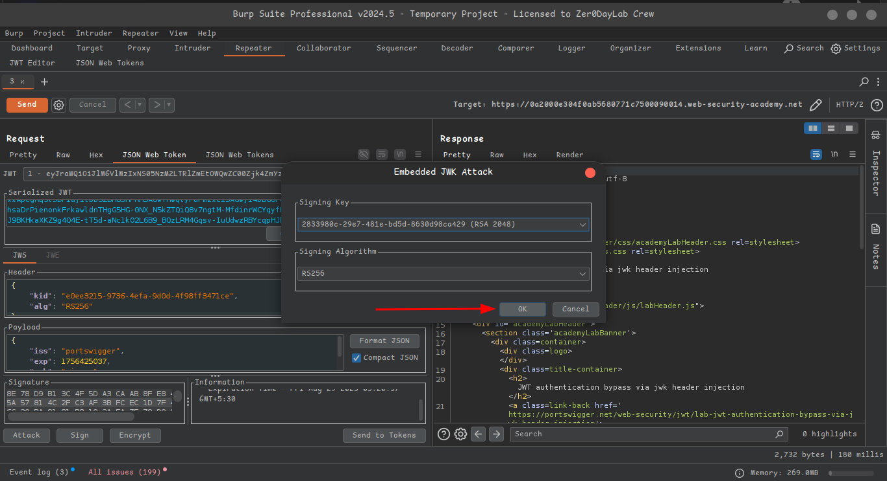
    

### 5️⃣ Modify JWT Payload

- In **GET /admin request**, switch to the **JSON Web Token tab**.
- Modify payload → set `sub` claim to:

```json
"sub": "administrator"
```

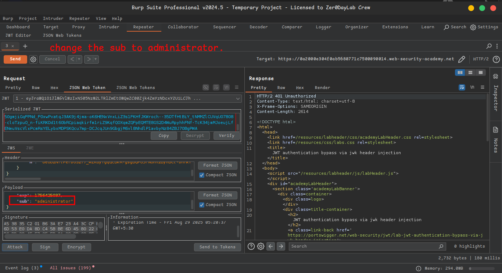

### 6️⃣ Embed Public Key via `jwk` Injection

- At the bottom of the JWT tab → click **Attack → Embedded JWK**.
- Select your **RSA key** → Click **OK**.
- ✅ A new `jwk` parameter is added to the JWT header (containing your public key).
    
    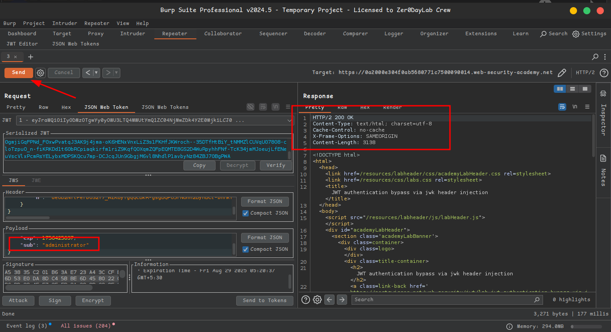
    

### 7️⃣ Access Admin Panel

- Send the modified request.
- 🎉 You now have **admin access**.
    
    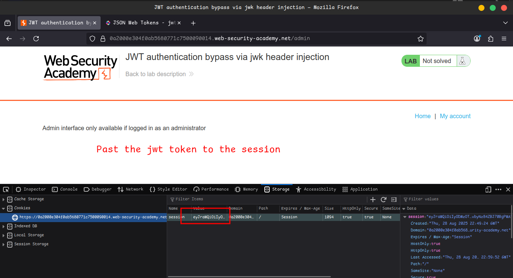
    
    
    

### 8️⃣ Delete User Carlos

- In the **admin panel response**, find:

```
/admin/delete?username=carlos
```

- Send request → ✅ Lab solved.
    
    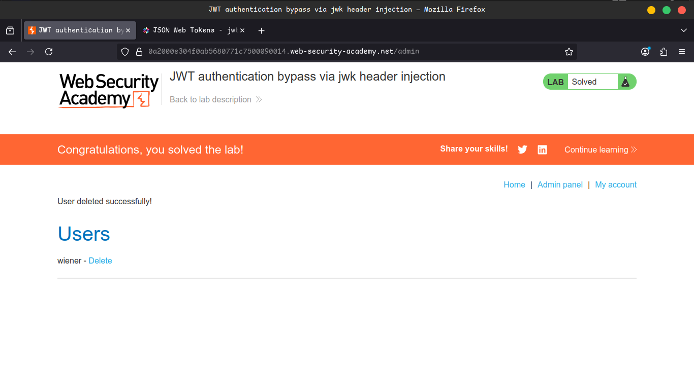
    

---

## 📌 Notes

- You can also do this **manually**:
    - Add a `jwk` parameter to the JWT header.
    - Update the `kid` header to match the embedded key.

---

## 🎥 Community Solutions

- 🎬 Intigriti Walkthrough → [Watch on YouTube](https://youtu.be/t-RfzyW0iqA)

---

## ⚡ Attack Flow Diagram

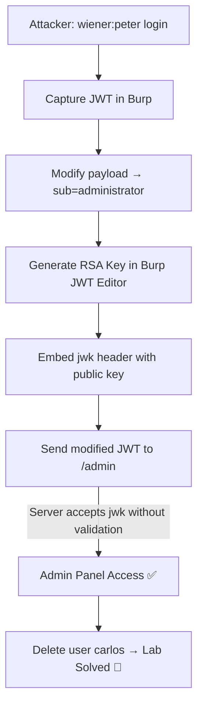