# Lab 05: JWT authentication bypass via jku header injection

This lab uses a **JWT-based session mechanism**.

The server supports the **`jku` parameter** in the JWT header.

⚠️ However, it **fails to check whether the provided URL belongs to a trusted domain** before fetching the key.

🎯 **Goal**: Forge a JWT that grants access to the **admin panel (`/admin`)** and then **delete the user `carlos`**.

👤 **Credentials to log in**:

```
wiener:peter
```

💡 **Tip**: Familiarize yourself with **JWTs in Burp Suite** before starting.

---

## ⚙️ Solution

### 🔹 Part 1 - Upload a Malicious JWK Set

1. In **Burp**, load the **JWT Editor extension** from the BApp store.
2. Log in to your own account in the lab and send the **post-login `GET /my-account`** request to **Burp Repeater**.
3. In Burp Repeater, change the path to `/admin` and send the request.
    - ✅ Observe: Admin panel is **only accessible as administrator**.
4. Go to the **JWT Editor Keys** tab in Burp’s main tab bar.
5. Click **New RSA Key** → **Generate** a new key pair → Save it.
6. Open the **Exploit Server** in your browser.
7. Replace the body with an **empty JWK Set**:
    
    ```json
    {
      "keys": [
    
      ]
    }
    ```
    
8. Back in Burp → **JWT Editor Keys tab** → Right-click your generated key → **Copy Public Key as JWK**.
9. Paste this into the `keys` array on the exploit server → Store the exploit.

✅ Example malicious JWK Set:

```json
{
  "keys": [
    {
      "kty": "RSA",
      "e": "AQAB",
      "kid": "893d8f0b-061f-42c2-a4aa-5056e12b8ae7",
      "n": "yy1wpYmffgXBxhAUJzHHocCuJolwDqql75ZWuCQ_cb33K2vh9mk6GPM9gNN4Y_qTVX67WhsN3JvaFYw"
    }
  ]
}
```

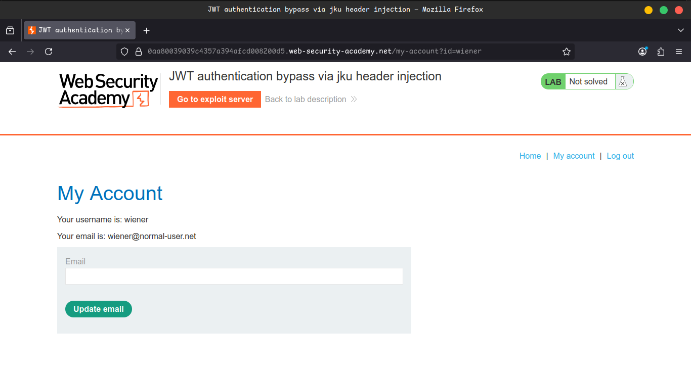

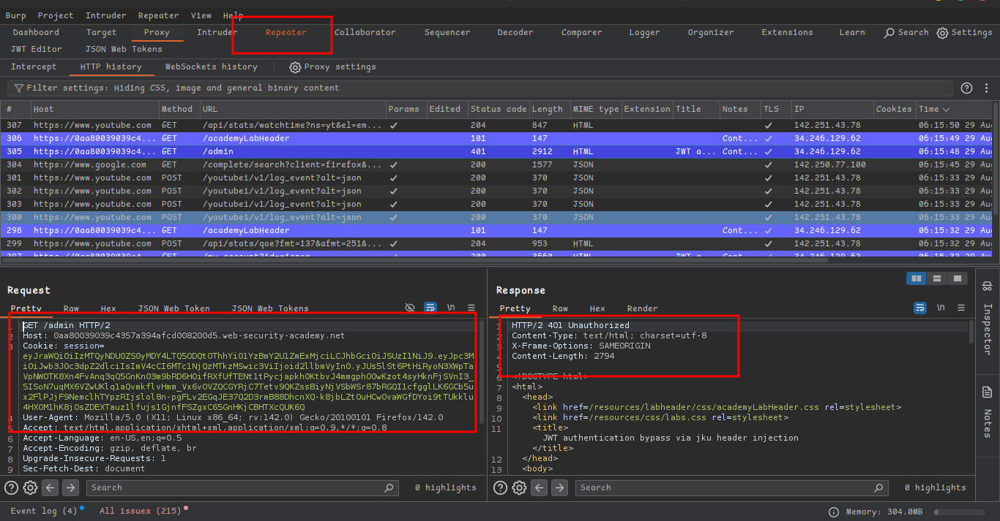

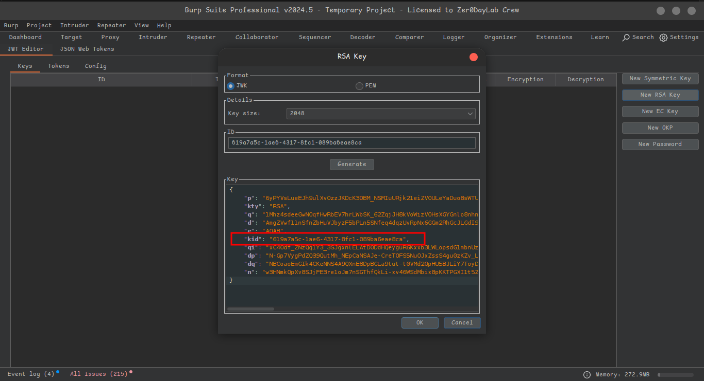

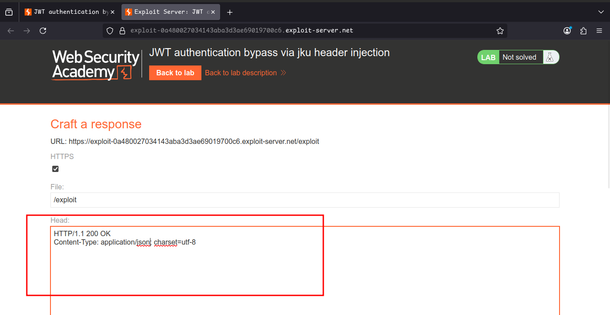

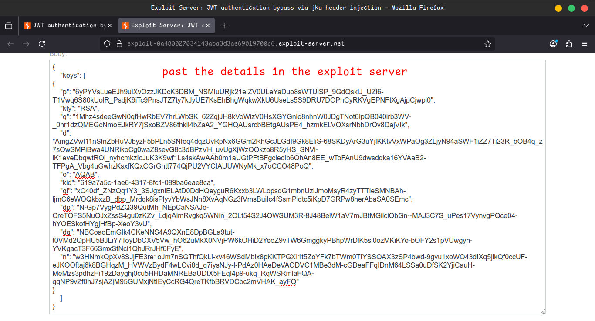

---

### 🔹 Part 2 - Modify and Sign the JWT

1. Go back to the **`GET /admin` request** in Burp Repeater → Switch to the **JSON Web Token editor tab**.
2. In the **header of the JWT**:
    - Replace the current **`kid`** value with the **`kid` of your uploaded JWK**.
    - Add a new **`jku` parameter** → Set its value to the **URL of your JWK Set** on the exploit server.
3. In the **payload**, change:
    
    ```json
    "sub": "administrator"
    ```
    
4. At the bottom → Click **Sign** → Select the **RSA key** generated earlier.
    - Make sure ✅ **Don’t modify header** is checked → Click **OK**.
5. Send the request → 🎉 You now have **admin panel access**.
6. In the response, find the delete URL:
    
    ```
    /admin/delete?username=carlos
    ```
    
    Send this request to **delete carlos** → 🏆 Lab solved!
    
    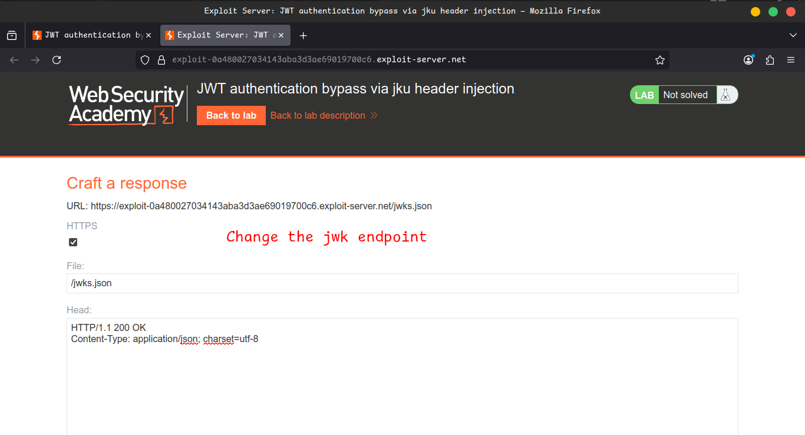
    
    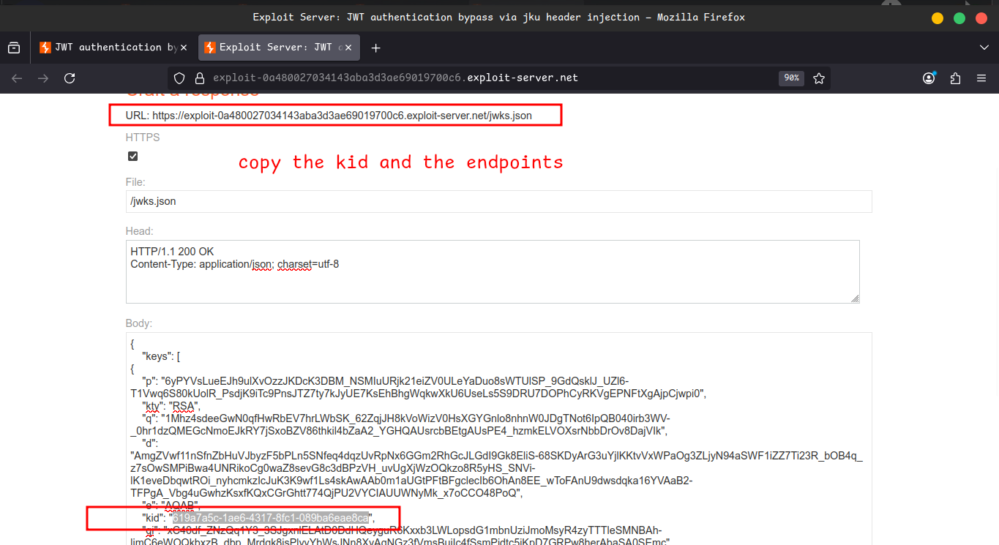
    
    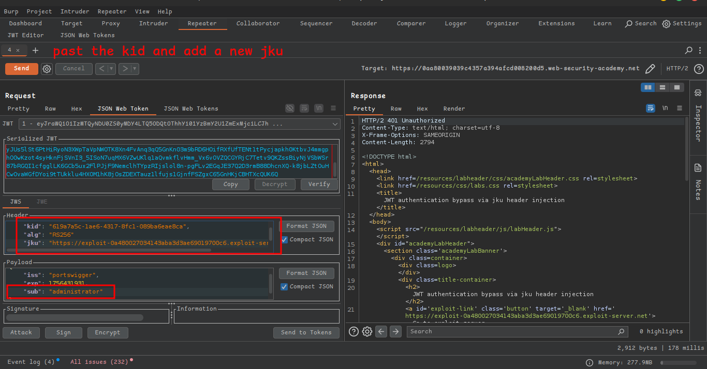
    
    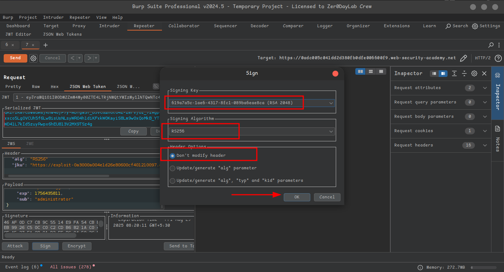
    
    
    
    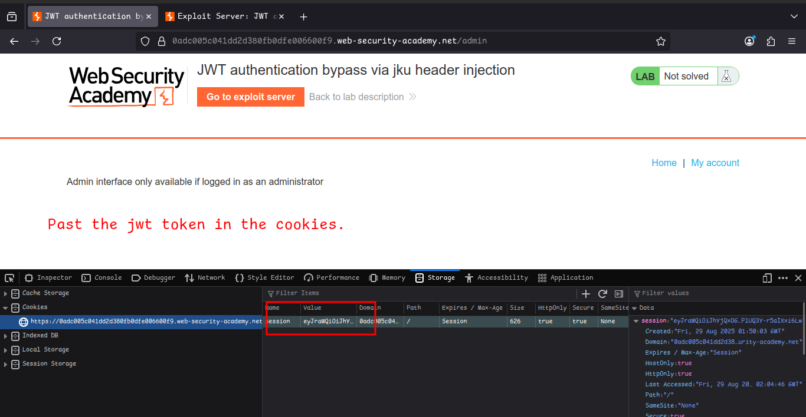
    
    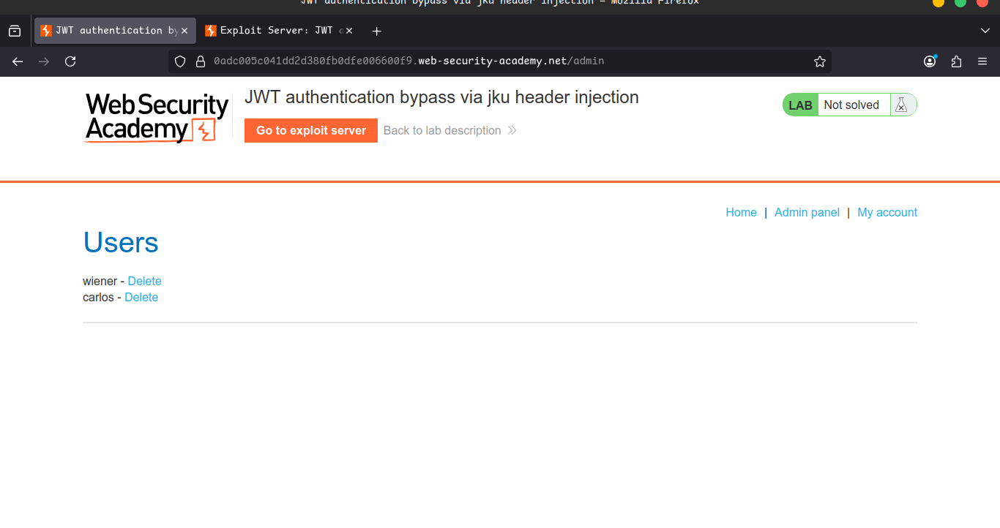
    
    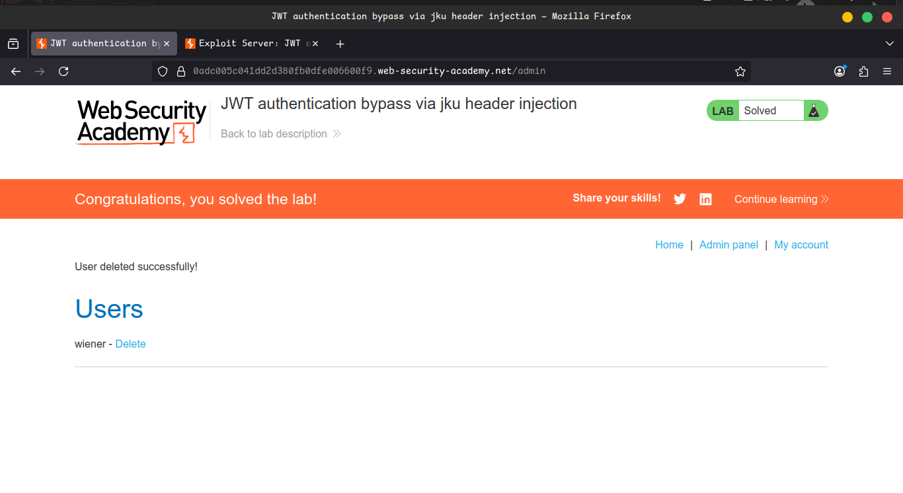
    

## **👉 Summary Table: Steps and Purpose**

| **Step** | **Description** | **Purpose** |
| --- | --- | --- |
| Generate RSA key in Burp | Create attacker's public/private key pair | Prepare for forging JWTs |
| Host JWK Set on exploit server | Store attacker's public key in JWK format on a controllable URL | Enable server-side key injection |
| Craft JWT with custom jku and kid | Set JWT header to use attacker's JWK Set | Trick server into using own key |
| Change payload to administrator | Edit JWT claims | Escalate privilege |
| Resign JWT | Sign JWT with attacker's private key | Ensure JWT passes verification |
| Access /admin and delete carlos | Use forged token to perform admin-only operations | Demonstrate full exploit |

---

## 🎥 Community Solutions

- 🔗 [Intigriti Walkthrough](https://youtu.be/hMRdMmll8Bk)